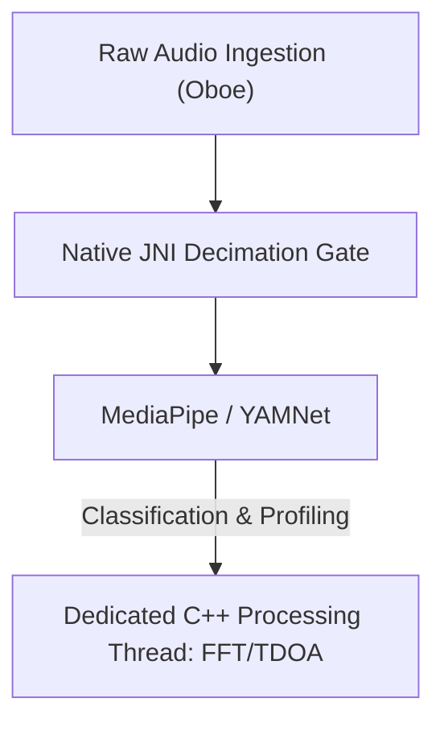

# VigilantEar 👂🛡️ (Android Edition)

**Effective Date:** June 6, 2026

**VigilantEar** is an advanced, ultra-high-performance Android acoustic research and accessibility tool engineered to provide real-time directional and spatial awareness for the deaf and hard-of-hearing (D/HH) community. Traditional sound recognition software only identifies *what* a sound is. **VigilantEar tells you where it is, who's making it, and what they're saying.** It acts as a comprehensive tactical radar, combining edge-computed machine learning with sophisticated acoustic physics to track exactly *where* a sound originates, its estimated distance, its absolute path trajectory, and the separated, translated words of individual speakers.

---

## 🌍 Global Reach & Localization

To support users worldwide, the platform features a complete native localization matrix supporting:

- **English**
- **Spanish (Español)**
- **Portuguese (Português)**
- **Chinese (简体中文)**
- **French (Français)**
- **German (Deutsch)**
- **Japanese (日本語)**
- **Arabic (العربية)**

All tactical overlays, HUD alerts, and preference menus adjust dynamically to system locales.

---

## 🚀 Key Features & Capabilities

- **Smart Power Gating & WakeLocks**: To maximize battery longevity and protect system resources, the system implements conditional background monitoring with strong WakeLocks and Foreground Services. If emergency alert categories are disabled, the microphone ingestion loops and processing engines efficiently enter hibernation.
- **Tactical Alert Simulation**: Includes a robust on-device simulation suite allowing users to test haptic signatures and visual responses for critical `.emergency` tracks—Sirens, Alarms, Doorbells, People Closeby, and Severe Weather (including NWS, MeteoGate Europe, and CMA/MEM China feeds)—without requiring real-world acoustic triggers.
- **Multi-Target Tracker (MTT)**: Simultaneously isolates and tracks independent environmental sound signatures using unique session markers paired with physical persistence mapping, utilizing advanced refinement thresholds for continuous tracking.
- **Shazam Integration**: Real-time environmental music identification mapped dynamically onto the spatial radar.
- **Acoustic Radar HUD**: A fully live tactical dashboard providing real-time telemetry on system power, network capability, processing latency, and FPS (analysis Hz), alongside a directional grid tracking environmental acoustic targets by bearing and energy.
- **Geographic Road Snapping**: Projects relative mathematical acoustic bearings onto global GPS coordinates, intelligently snapping real-time vehicle vectors to verified streets.
- **Speaker Mode (Live Directional Captions)**: Transcribes the people talking near you into caption rows, one per voice. On-device speaker diarization separates voices with distinct colors and scrolling lines, accompanied by directional arrows pointing to the speaker's location.
- **Live On-Device Translation**: Transcribes and translates foreign speech in real-time. The entire pipeline—hearing, separating speakers, transcribing, and translating—runs entirely on the device without cloud dependency.

---

## 🧬 Core Architecture & The Neural Math Engine

VigilantEar on Android utilizes a highly optimized **Native SoundML Architecture** built around C++ processing and the Oboe real-time audio engine to ensure lowest possible latency across diverse hardware.

## ⚡ Architectural Decoupling

To maintain a completely unblocked UI thread while continuously handling a high-frequency input tap, the platform uses strict separation between Kotlin and C++:

- **Kotlin UI / Foreground Service**: Manages foreground service lifecycles, permissions, device orientation state, and location metrics to drive the HUD smoothly.
- **AcousticEngine (Native C++)**: Manages low-level Oboe audio streams and hardware operations. Ingestion buffers are deeply copied directly on the high-priority tap thread, passing snapshots straight to a dedicated native processing queue without stalling the UI.

### 🧠 Advanced Acoustic Pipeline

- **Dual-Classifier Architecture**: Utilizes an NPU-delegated primary classifier for critical, high-frequency sound profiling, paired with a CPU-delegated neural ticker for continuous ambient sound awareness. ML buffer loads are actively monitored to dynamically throttle inference coroutines and prevent ingestion backlog.
- **Acute vs. Broadband Physics**: Differentiates tracking logic based on sound structure. Acute transient sounds (like claps and glass breaking) are natively triggered via strict Peak (+16dB) and RMS (+3.5dB) algorithms. Broadband sounds (like music and vehicles) use specific lower confidence thresholds (0.10f vs 0.25f) and are intelligently seeded to ensure continuous tracking persistence.
- **Constraints & Refinement**: The tracker groups identical sounds within a 25-degree spatial delta and ages them out precisely using `tailMemory` constraints from `AppGlobals`. Tracking broadcasts to the UI are carefully throttled to prevent resource drain.
- **Parallel Spatial Math**: High-performance mathematical pipelines (including `kiss_fft`, Time Difference of Arrival (TDOA) calculations, and Doppler tracking algorithms) execute entirely within dedicated native asynchronous threads.

### 📊 Performance Benchmarks

- **Active Mode**: Designed to deliver comprehensive live HUD tracking smoothly.
- **Hardware Recovery**: Robust Oboe implementation ensures automatic, sub-second recovery from audio route changes (Bluetooth, headphones, speaker switches) without dropping tracking sessions.

---

## 🛠️ Technical Stack (2026)

- **Language**: Kotlin (Coroutines, Channels), C++ (JNI, Native Audio)
- **Frameworks**: Android SDK, Jetpack Compose (UI), Oboe (Real-time Audio), MediaPipe / YAMNet
- **Hardware Baseline**: Android 10+ devices with supported stereo microphone alignment for TDOA bearing precision.

---

## 📊 Privacy & Security Guardrails

- **Local-First Isolation**: All audio classifications, spectral math, and bearing projections happen exclusively on-device. Raw audio streams are never recorded, cached, or transmitted under any condition.
- **No Remote Telemetry or Diagnostics**: VigilantEar is designed to operate entirely locally on your device. We do not collect, transmit, or store any remote telemetry, crash logs, diagnostic records, or usage analytics on our servers.

---

## ⚖️ Disclaimer

VigilantEar is an experimental acoustic research and spatial accessibility aid. It is not certified as a life-safety utility. Tracking resolution can fluctuate dynamically based on regional topology, prevailing weather, wind conditions, and microphone hardware calibration. Users must always maintain normal environmental awareness.

**Contact Email:** [vigilantear@wingdingssocial.com](mailto:vigilantear@wingdingssocial.com)

VigilantEar is an accessibility tool built with care. Please use it responsibly.

Made with ❤️ for the D/HH community and acoustic research.

© 2026 Wingdings, Inc.  
All rights reserved.
