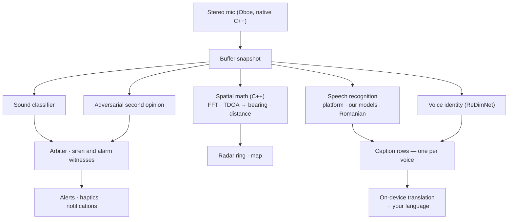

# Vigilant Ear 👂🛡️ (Android)

*Effective as of Android 1.1.8 · September 2026.*

## An acoustic radar for people who can't hear.

An app built specifically for the Deaf, hard-of-hearing, and CODA community. Most sound-recognition apps tell you *what* a sound is. **Vigilant Ear tells you where it is, who's making it, and what they're saying** — turning an Android phone into a real-time picture of the sound around you.

A siren's direction. A knock behind you. The people in a conversation, drawn as separate transcribed voices. If someone is speaking a language you don't read, their words can arrive **translated into yours, on the phone.**

Everything that matters runs on the device. Audio is not recorded or uploaded for recognition. Nothing depends on hearing a thing.

- 🧭 **Direction, not just detection.** *What, where,* and *what was said* — not merely “a sound happened.”
- 📣 **Name Called.** List your name, a kid, a partner — “order for Marie ready” taps the phone, with the direction when it could be measured.
- 🔒 **Private by design.** Classification, captioning, translation, and voice identity run on your phone. Named voices are encrypted on this device and there is no roster cloud path.
- 🌐 **Romanian Auto-Translate.** Captions in Romanian can be translated on this phone, on the device.
- 👁️ **Made for Deaf / HoH / CODA.** Distinct per-sound haptics, high-contrast visuals, color-independent cues, large tap targets.

---

## Who it's for

- **Deaf, hard-of-hearing, and CODA users** who want situational awareness of sound — the knock, the alarm, the siren, the person nearby — that you can leave running and trust.
- Anyone who needs **live captions with direction and speaker separation**, or **on-device translation** of people sitting nearby.
- Accessibility and acoustic-research users interested in on-device sound localization.

> Vigilant Ear is an accessibility **aid**, not a certified life-safety device.

---

## What it does

### 🧭 It sees sound — direction & distance
Using the phone's two microphones, Vigilant Ear measures the **angle a sound arrived from** and places it as a live marker on a heading-up radar ring and map. The math is coherence-weighted Time Difference of Arrival: favor the frequency bands both microphones agree on, then turn the tiny arrival lag into a bearing. Two microphones on one line cannot tell left from right on their own, so the reading carries that ambiguity honestly rather than inventing a side.

**How well this works depends on your exact phone, and we say which.** The bearing math needs the true distance between the two microphones. That spacing is **physically measured on three devices — Pixel 9, Pixel 9 Pro / Pro XL, and Pixel 10a.** Every other model runs on a spacing estimated from the body height, which is close but not measured, and direction is correspondingly less sharp. The list is in the app's own source and grows as devices are measured; we would rather name the three than imply fifteen.

Distance is an estimate from loudness, and shown as the estimate it is. The quiet-room reference it measures against is **measured per device** rather than assumed — the phone learns its own noise floor instead of borrowing a constant.

### 🚨 It recognizes important sounds — and warns you
An on-device classifier identifies hundreds of everyday sounds, and watches the critical ones — **sirens, alarms, doorbells and knocks, a baby crying, a person nearby, and severe weather.** Two classifiers run rather than one: a primary and an adversarial second opinion, with an arbiter between them, so a single model's bad frame is not an alert. Sirens and smoke alarms get dedicated confirmation on top of that — a smoke detector's T3 pattern is a specific rhythm, not just a loud beep.

When something fires you get an on-screen alert, a notification, and a **distinct vibration pattern per sound** — the pulse count comes from the sound's own profile, so an alarm does not feel like a doorbell through your pocket.

Severe-weather warnings come from official public feeds — U.S. **NWS**, Europe **MeteoGate**, **China CMA**, **Korea KMA**, **Japan JMA**, **Canada ECCC**, **Australia BOM**, **Brazil INMET**, and **India NDMA** — free for all users, and narrowed to the ones that cover where you are. **Earthquake alerts** come from the USGS worldwide feed: a confirmation that what you felt was a quake, not an early warning.

### 💬 Speaker Mode — live captions *(free)*
Turn on Speaker Mode and Vigilant Ear transcribes people talking near you into caption rows. On-device voice identity keeps speakers distinct and color-coded, from voiceprints that never leave the phone.

**Three recognizers, chosen for you.** The app uses your phone's own speech recognizer for the languages it already handles, falls back to its own models for the languages it doesn't, and carries a dedicated Romanian model for the one language neither can do. You pick a language, not an engine.

Per-voice separation is present and improving. Treat the rows as *what was said near you*, with a strong hint of who — not as a courtroom record of who said it.

**Strong language can be masked.** Turn it on and swearing is replaced with symbols, so the sentence still reads without the word. 🔴 **This one has a real limit and we will not paper over it:** the masking is your phone's own recognizer doing the work, so it applies only to the languages handled by that recognizer. Languages captioned by our own downloaded models arrive unmasked whatever the switch says.

**Captions get tidied, and on some phones more than tidied.** Every line goes through a deterministic clean-up. On recent Pixel and Galaxy hardware with Gemini Nano available, lines also get a proofreading pass. This is an enhancement and never a dependency — nothing about captions requires it, and most phones never see it.

### 🌐 Auto-Translate — your language, live *(Power Pack+)*
When a nearby person speaks another language, Vigilant Ear detects it and renders their captions **in your language**. Detection, transcription and translation all run on the device. You don't have to know or pick the other language first.

**Romanian is included.** Detection, captions, and Auto-Translate all handle it on this phone.

### 📣 Name Called
Watches those captions for names you list — your own, a child's, a partner's, the name a counter calls for an order. When one is spoken you get one alert, not a second caption bubble, and the direction the voice came from **when that direction was actually measured**. The list is held in the device keystore and never leaves it.

### 🫧 Standing Watch and deep rumble
**Standing Watch** is the room's own condition, always on with nothing to configure: a steady lamp while the room holds its pattern, a change when something shifts.

The phone's **barometer** watches for pressure waves — weather, a door, a heavy truck — and draws them as a soft ring expanding from where you are. 🔴 **Deliberately with no direction on it.** One pressure sensor cannot tell you which way a pressure wave came from, and a ring that claimed a bearing would be inventing one.

### 📓 Witness Ear — an optional 24-hour journal
Off by default. While it is on, what the app heard and where stays **on this phone** for up to a day, ready to export as a simple PDF. One button wipes the log instantly. It is the only thing in the app that retains anything, which is why it is off until you choose it.

### 🔗 Remote Link — reach someone who isn't with you *(Power Pack+)*
What a phone call would normally do, done with video and text. You send an invitation code; the other person joins from inside Vigilant Ear. There is no proximity requirement — the two of you can be anywhere. **No audio is used at any point,** so nothing about the link depends on hearing at either end, and it gives you a way to sign with someone through the app. The app carries the video; the two of you do the rest.

### 🎵 Music ID *(Power Pack+)*
Identifies music playing around you and tracks song changes. A chroma signature detector owns the "is music actually playing?" question first, because general classifiers famously call silent rooms and sirens "music."

### 🪄 Feature Playground and a guided tour
**Feature Playground** lets you practice alerts and see features fire without waiting for the real thing, always watermarked so practice never pretends to be a live event. A **guided tour** walks the map, the HUD, the gear panel, preferences and Power Pack+, replayable any time from the graduation cap.

### ♿ Accessibility first
Built for Deaf / hard-of-hearing / CODA and color-blind users: color-independent cues, large tap targets, multimodal alerts (haptic + visual + on-screen), per-sound vibration signatures, and a startup verification screen showing exactly which permissions are granted, missing, or refused.

---

## Free & Power Pack+

The safety core is **free, forever**:

- **Sound alerts** — sirens, alarms, knocks and doorbells, baby cry, person nearby, with haptics and notifications.
- **Live captions** — Speaker Mode, on-device, with voice separation and optional strong-language masking.
- **Name Called** — names you type, alerted with direction where it was measured.
- **Standing Watch** — the room's condition, always on.
- **Severe-weather alerts** — nine official national feeds for your region.
- **Earthquake alerts** — USGS, worldwide.
- **Witness Ear** — the optional 24-hour journal and its PDF export.
- **Feature Playground** and the guided tour.

**Power Pack+** is a one-time unlock — **not a subscription** — with a free trial. On Android it adds exactly four things:

- **Auto-Translate** — on-device translation of nearby speech into your language.
- **Music ID** — song recognition.
- **Remote Link** — hosting a two-device video and text link.
- **Named voices** — naming the people the app hears, so their captions carry their name.

Before you buy, the app **probes your actual phone** and tells you whether each of these will work on it, work slowly, or not work at all. We would rather lose the sale than take money for something this handset cannot run.

Free or Power Pack+, **your audio stays on the device for recognition** — the tier changes which features are unlocked, never where sound goes.

---

## How it works

Capture once on a high-priority audio thread, copy the buffer, and fan it out to specialists that never block each other or the screen:

```mermaid
graph TD
    A["Stereo mic (Oboe, native C++)"] --> B["Buffer snapshot"]
    B --> C["Sound classifier"]
    B --> Y["Adversarial second opinion"]
    C --> S["Arbiter · siren and alarm witnesses"]
    Y --> S
    S --> H["Alerts · haptics · notifications"]
    B --> D["Spatial math (C++)<br/>FFT · TDOA → bearing · distance"]
    D --> R["Radar ring · map"]
    B --> F["Speech recognition<br/>platform · our models · Romanian"]
    B --> E["Voice identity (ReDimNet)"]
    F --> G["Caption rows — one per voice"]
    E --> G
    G --> T["On-device translation<br/>→ your language"]
```

- **Kotlin and C++, strictly separated.** Kotlin owns the screen, the foreground service, permissions and location. A native engine owns the microphone and the math. Audio buffers are copied on the capture thread and handed to a native queue, so the picture never stutters while the phone is thinking.
- **Language identification is its own model, not a guess.** The app uses the same VoxLingua107 ECAPA model on every platform, so they all answer "what language is this?" the same way.
- **Weather and quakes take the opposite path from audio.** Nothing about your sound goes out; alert *data* comes in, through a small cache we operate, so one fetch of the public data serves every user and your phone never contacts a foreign government's server directly.

---

## What we have measured — and what we haven't

We have not published Android desk-test figures for bearing and distance. **This document will not invent them.**

Language identification was replaced once already: the previous detector, in a room, answered *Chinese* on Romanian speech. A confident wrong language means the wrong recognizer, which means captions that are quietly nonsense — worse for a reader who cannot hear the room than no captions at all.

**Not yet measured on Android:** bearing accuracy against a tape measure, distance accuracy against known ranges, and speaker-separation accuracy on a real recording. Until they are, treat direction as a good indication and distance as an estimate.

Speech and voice models download when you first need them, over Wi-Fi by preference. The app asks before pulling anything large. After that, recognition is offline.

---

## Privacy

- **On-device, always, for the core pipeline.** Classification, spatial math, transcription, voice identity and translation run on your phone. Raw audio is never recorded, cached, or transmitted.
- **Named voices stay here.** Voiceprints are encrypted with a key held in the Android Keystore that never leaves the device. **There is no roster cloud path.** If the phone is reset, the voiceprints are unreadable and you re-enroll — which is the correct behavior, not a limitation.
- **Captions are ephemeral** unless you deliberately turn Witness Ear on, and that journal is local, capped at 24 hours, and wiped with one button.
- **No advertising or behavioral analytics.** Network use is limited to maps, the public alert cache, optional song recognition, road context, and Play billing.

Full details: [PRIVACY.md](PRIVACY.md) · [TERMS.md](TERMS.md) · [SUPPORT.md](SUPPORT.md)

---

## Hardware

- **Android 13 or newer.**
- **Stereo microphones** are required for direction-finding; sharpest on the devices whose microphone spacing has been physically measured.

---

## Localization

Interface, alerts and captions are translated into **English, Spanish, Portuguese (Brazil), French, German, Italian, Turkish, Arabic, Japanese, Simplified Chinese, Korean, Russian and Hindi** — 13 languages, following your system language or a manual choice in the app. Romanian captions and Auto-Translate work on this build.

---

## Status & disclaimer

Vigilant Ear is an **experimental acoustic-accessibility aid**, not a certified life-safety utility. Direction and distance vary with surroundings, weather, wind and microphone hardware. **Always maintain your typical environmental awareness** — don't rely on it as your only source of safety information.

---

**Contact:** [vigilantear@wingdingssocial.com](mailto:vigilantear@wingdingssocial.com)

Made with ❤️ for the D/HH community and acoustic research.

    
  <strong>© 2026 Wingdings, Inc.</strong> 
  All rights reserved. 
  Patent Pending

