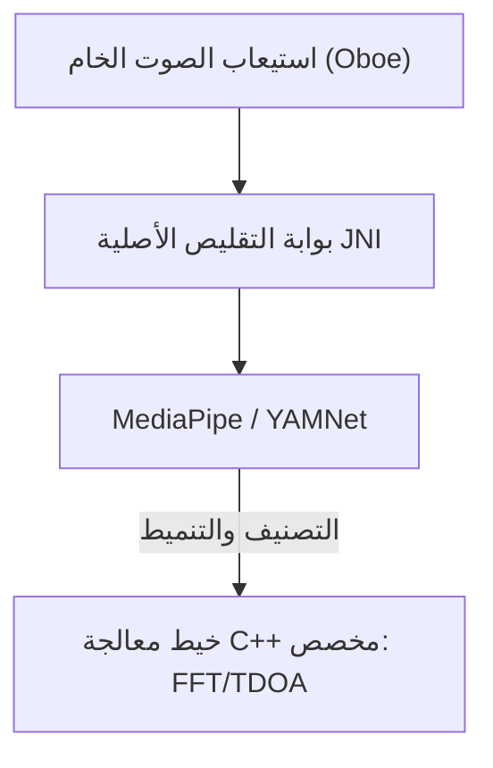

# VigilantEar 👂🛡️ (إصدار أندرويد)

**تاريخ السريان:** 6 يونيو 2026

**VigilantEar** هي أداة بحث صوتية وإمكانية وصول متقدمة وفائقة الأداء لنظام أندرويد، مصممة لتوفير وعي اتجاهي ومكاني في الوقت الفعلي لمجتمع الصم وضعاف السمع (D/HH). برامج التعرف على الصوت التقليدية تحدد فقط *ما هو* الصوت. **VigilantEar تخبرك بمكانه، ومَن يصدره، وماذا يقولون.** تعمل كرادار تكتيكي شامل، يجمع بين التعلم الآلي المحسوب على الحافة والفيزياء الصوتية المعقدة لتتبع *مكان* نشأة الصوت بالضبط، ومسافته التقديرية، ومسار حركته المطلق، والكلمات المترجمة والمفصولة للمتحدثين الفرديين.

---

## 🌍 الوصول العالمي والتوطين

لدعم المستخدمين في جميع أنحاء العالم، تتميز المنصة بمصفوفة توطين أصلية كاملة تدعم:

- **الإنجليزية (English)**
- **الإسبانية (Español)**
- **البرتغالية (Português)**
- **الصينية (简体中文)**
- **الفرنسية (Français)**
- **الألمانية (Deutsch)**
- **اليابانية (日本語)**
- **العربية (العربية)**

تتكيف جميع التراكبات التكتيكية، وتنبيهات HUD، وقوائم التفضيلات ديناميكيًا مع لغات النظام.

---

## 🚀 الميزات والقدرات الرئيسية

- **بوابات الطاقة الذكية وأقفال الاستيقاظ (Smart Power Gating & WakeLocks):** لزيادة عمر البطارية إلى أقصى حد وحماية موارد النظام، يطبق النظام مراقبة خلفية مشروطة مع أقفال استيقاظ قوية وخدمات الواجهة. إذا تم تعطيل فئات تنبيه الطوارئ، فإن حلقات استيعاب الميكروفون ومحركات المعالجة تدخل بكفاءة في وضع السبات.
- **محاكاة التنبيه التكتيكي:** يتضمن مجموعة محاكاة قوية على الجهاز تتيح للمستخدمين اختبار التوقيعات اللمسية والاستجابات المرئية للمسارات الحرجة الخاصة بـ `.emergency` — صفارات الإنذار، وأجهزة الإنذار، وأجراس الأبواب، والأشخاص القريبين، والطقس القاسي (بما في ذلك تغذيات NWS، وMeteoGate Europe، وCMA/MEM الصين) — دون الحاجة إلى محفزات صوتية في العالم الحقيقي.
- **متتبع الأهداف المتعددة (MTT):** يعزل ويتتبع في وقت واحد توقيعات الصوت البيئية المستقلة باستخدام علامات جلسة فريدة مقترنة برسم خرائط الاستمرارية المادية، مستفيدًا من عتبات التحسين المتقدمة للتتبع المستمر.
- **تكامل Shazam:** تحديد الموسيقى البيئية في الوقت الفعلي ورسمها ديناميكيًا على الرادار المكاني.
- **شاشة عرض الرادار الصوتي (Acoustic Radar HUD):** لوحة قيادة تكتيكية حية بالكامل توفر قياسًا عن بعد في الوقت الفعلي حول طاقة النظام، وقدرة الشبكة، وزمن انتقال المعالجة، وFPS (تحليل هرتز)، جنبًا إلى جنب مع شبكة اتجاهية تتتبع الأهداف الصوتية البيئية حسب الاتجاه والطاقة.
- **الانطباق الجغرافي على الطرق:** يعرض الاتجاهات الصوتية الرياضية النسبية على إحداثيات GPS العالمية، ويطابق بذكاء نواقل حركة المركبات في الوقت الفعلي مع الشوارع الموثقة.
- **وضع المتحدث (تسميات توضيحية اتجاهية حية):** ينسخ كلام الأشخاص الذين يتحدثون بالقرب منك إلى صفوف من التسميات التوضيحية، صف واحد لكل صوت. تقوم ميزة فصل أصوات المتحدثين على الجهاز بفصل الأصوات باستخدام ألوان مميزة وخطوط تمرير، مصحوبة بأسهم اتجاهية تشير إلى موقع المتحدث.
- **ترجمة حية على الجهاز:** ينسخ ويترجم الكلام الأجنبي في الوقت الفعلي. تعمل العملية بأكملها — السمع، وفصل المتحدثين، والنسخ، والترجمة — بالكامل على الجهاز دون الاعتماد على السحابة.

---

## 🧬 البنية الأساسية والمحرك الرياضي العصبي

يستخدم VigilantEar على نظام أندرويد **بنية SoundML أصلية** محسّنة للغاية مبنية حول معالجة C++ ومحرك الصوت في الوقت الفعلي Oboe لضمان أقل زمن انتقال ممكن عبر الأجهزة المختلفة.

## ⚡ فك الارتباط المعماري

للحفاظ على مؤشر ترابط واجهة المستخدم غير محظور تمامًا أثناء التعامل المستمر مع نقرات إدخال عالية التردد، تستخدم المنصة فصلاً صارمًا بين Kotlin و C++:

- **واجهة مستخدم Kotlin / خدمة الواجهة (Foreground Service):** تدير دورات حياة خدمة الواجهة، والأذونات، وحالة اتجاه الجهاز، ومقاييس الموقع لتشغيل شاشة العرض بسلاسة.
- **المحرك الصوتي (AcousticEngine - Native C++):** يدير تدفقات صوت Oboe منخفضة المستوى وعمليات الأجهزة. يتم نسخ مخازن الاستيعاب المؤقتة بعمق مباشرة على مؤشر ترابط النقر عالي الأولوية، وتمرير اللقطات مباشرة إلى قائمة انتظار معالجة أصلية مخصصة دون تعطيل واجهة المستخدم.

### 🧠 خط الأنابيب الصوتي المتقدم

- **بنية المصنف المزدوج:** تستخدم مصنفًا أساسيًا مفوضًا لوحدة المعالجة العصبية (NPU) للتنميط الصوتي الحرج عالي التردد، مقترنًا بمؤشر عصبي مفوض لوحدة المعالجة المركزية (CPU) للوعي المستمر بالصوت المحيطي. تتم مراقبة أحمال المخزن المؤقت للتعلم الآلي (ML) بنشاط لتقييد الإجراءات الروتينية للاستدلال ديناميكيًا ومنع تراكم الاستيعاب.
- **الفيزياء الحادة مقابل واسعة النطاق:** يميز منطق التتبع بناءً على بنية الصوت. يتم تشغيل الأصوات العابرة الحادة (مثل التصفيق وكسر الزجاج) محليًا عبر خوارزميات ذروة صارمة (+16 ديسيبل) وجذر متوسط المربع (+3.5 ديسيبل). تستخدم الأصوات واسعة النطاق (مثل الموسيقى والمركبات) عتبات ثقة محددة أقل (0.10f مقابل 0.25f) ويتم زرعها بذكاء لضمان استمرارية التتبع المستمر.
- **القيود والتحسين:** يجمع المتتبع الأصوات المتطابقة داخل دلتا مكانية تبلغ 25 درجة ويزيلها بدقة باستخدام قيود `tailMemory` من `AppGlobals`. يتم كبح بث التتبع إلى واجهة المستخدم بعناية لمنع استنزاف الموارد.
- **الرياضيات المكانية المتوازية:** تنفذ خطوط أنابيب رياضية عالية الأداء (بما في ذلك `kiss_fft`، وحسابات فرق وقت الوصول (TDOA)، وخوارزميات تتبع دوبلر) بالكامل داخل خيوط غير متزامنة أصلية مخصصة.

### 📊 مقاييس الأداء

- **الوضع النشط:** مصمم لتقديم تتبع شامل لشاشة العرض (HUD) الحية بسلاسة.
- **استرداد الأجهزة:** يضمن تنفيذ Oboe القوي تعافيًا تلقائيًا في أقل من ثانية من تغييرات مسار الصوت (البلوتوث، سماعات الرأس، مفاتيح مكبر الصوت) دون إسقاط جلسات التتبع.

---

## 🛠️ المكدس التقني (2026)

- **اللغة:** Kotlin (Coroutines, Channels)، C++ (JNI, Native Audio)
- **الأطر:** Android SDK، Jetpack Compose (UI)، Oboe (Real-time Audio)، MediaPipe / YAMNet
- **الأساس المادي:** أجهزة Android 10+ مع دعم محاذاة الميكروفون الاستريو لدقة تحديد اتجاه TDOA.

---

## 📊 حواجز الخصوصية والأمان

- **العزل المحلي أولاً:** تحدث جميع تصنيفات الصوت، والرياضيات الطيفية، وإسقاطات الاتجاه حصريًا على الجهاز. لا يتم أبدًا تسجيل تدفقات الصوت الخام، أو تخزينها مؤقتًا، أو نقلها تحت أي ظرف من الظروف.
- **لا يوجد قياس عن بعد أو تشخيصات عن بعد:** تم تصميم VigilantEar للعمل بشكل محلي بالكامل على جهازك. نحن لا نجمع، أو ننقل، أو نخزن أي بيانات قياس عن بعد، أو سجلات أعطال، أو سجلات تشخيصية، أو تحليلات استخدام على خوادمنا.

---

## ⚖️ إخلاء المسؤولية

VigilantEar هي أداة بحث صوتية تجريبية ومساعدة للوصول المكاني. غير معتمدة كأداة لسلامة الأرواح. يمكن أن تتقلب دقة التتبع ديناميكيًا بناءً على الطوبولوجيا الإقليمية، والطقس السائد، وظروف الرياح، ومعايرة أجهزة الميكروفون. يجب على المستخدمين الحفاظ دائمًا على الوعي البيئي الطبيعي.

**البريد الإلكتروني للتواصل:** [vigilantear@wingdingssocial.com](mailto:vigilantear@wingdingssocial.com)

VigilantEar هي أداة إمكانية وصول بُنيت بعناية. يرجى استخدامها بمسؤولية.

صُنعت بحب ❤️ لمجتمع D/HH والأبحاث الصوتية.

© 2026 Wingdings, Inc.  
جميع الحقوق محفوظة.
