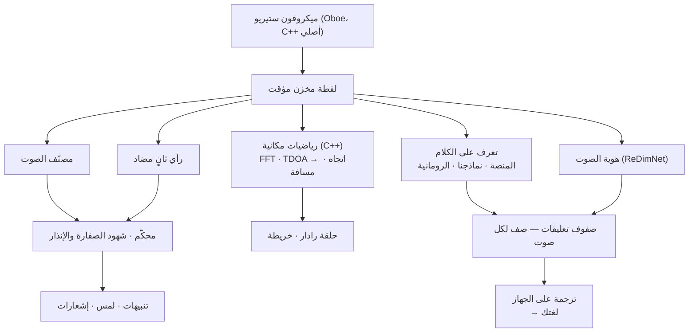

# Vigilant Ear 👂🛡️ (Android)

*يسري اعتبارًا من Android 1.1.8 · سبتمبر 2026.*

## رادار صوتي للأشخاص الذين لا يستطيعون السمع.

تطبيق صُمم خصيصًا لمجتمع الصم وضعاف السمع وCODA. معظم تطبيقات التعرف على الصوت تخبرك *ما هو* الصوت. **Vigilant Ear يخبرك بمكانه، ومن يصدره، وماذا يقولون** — محوّلًا هاتف Android إلى صورة حية للصوت من حولك.

اتجاه صفارة الإنذار. طرقة خلفك. الأشخاص في محادثة، مرسومون كأصوات منفصلة ومنسوخة. إذا كان شخص يتحدث بلغة لا تقرأها، يمكن أن تصل كلماته **مترجمة إلى لغتك، على الهاتف.**

كل ما يهم يعمل على الجهاز. لا يُسجَّل الصوت ولا يُرفَع للتعرف عليه. لا شيء يعتمد على سماع أي شيء.

- 🧭 **الاتجاه، وليس الاكتشاف فقط.** *ماذا، وأين،* و*ماذا قيل* — وليس مجرد «حدث صوت».
- 📣 **Name Called.** أدرج اسمك، واسم طفل، واسم شريك — «طلب Marie جاهز» ينقر الهاتف، مع الاتجاه عندما أمكن قياسه.
- 🔒 **الخصوصية حسب التصميم.** يعمل التصنيف والتعليق والترجمة وهوية الصوت على هاتفك. الأصوات المسمّاة مشفّرة على هذا الجهاز ولا يوجد مسار سحابي لقائمة الأسماء.
- 🌐 **Auto-Translate للرومانية.** يمكن ترجمة التعليقات بالرومانية على هذا الهاتف، على الجهاز.
- 👁️ **مصنوع للصم / ضعاف السمع / CODA.** استجابات لمسية مميزة لكل صوت، ومرئيات عالية التباين، وإشارات مستقلة عن اللون، وأهداف نقر كبيرة.

---

## لمن هذا

- **المستخدمون الصم وضعاف السمع وCODA** الذين يريدون وعيًا ظرفيًا بالصوت — الطرقة، والإنذار، وصفارة الإنذار، والشخص القريب — يمكنك تركه يعمل والوثوق به.
- أي شخص يحتاج إلى **تعليقات حية مع تحديد الاتجاه وتمييز المتحدثين**، أو **ترجمة على الجهاز** للأشخاص الجالسين بالجوار.
- مستخدمو تسهيلات الاستخدام والباحثون في الصوتيات المهتمون بتحديد موقع الصوت على الجهاز.

> Vigilant Ear هو **مساعد لتسهيلات الاستخدام**، وليس جهازًا معتمدًا للسلامة والحياة.

---

## ماذا يفعل

### 🧭 يرى الصوت — الاتجاه والمسافة
باستخدام ميكروفونَي الهاتف، يقيس Vigilant Ear **الزاوية التي وصل منها الصوت** ويضعها كعلامة حية على حلقة رادار متجهة لأعلى وعلى الخريطة. الرياضيات هي فرق زمن الوصول المرجَّح بالتماسك: تفضيل نطاقات التردد التي يتفق عليها الميكروفونان، ثم تحويل فجوة الوصول الضئيلة إلى اتجاه. ميكروفونان على خط واحد لا يستطيعان وحدهما التمييز بين اليسار واليمين، لذلك تحمل القراءة هذا الغموض بأمانة بدل اختراع جانب.

**مدى جودة العمل يعتمد على هاتفك بالضبط، ونحن نقول أيّها.** تحتاج رياضيات الاتجاه إلى المسافة الحقيقية بين الميكروفونين. ذلك التباعد **مقيس فعليًا على ثلاثة أجهزة — Pixel 9، وPixel 9 Pro / Pro XL، وPixel 10a.** كل طراز آخر يعمل على تباعد مقدَّر من ارتفاع الهيكل، وهو قريب لكنه غير مقيس، والاتجاه أقل حدّة بقدر ذلك. القائمة في مصدر التطبيق نفسه وتنمو مع قياس الأجهزة؛ نفضّل تسمية الثلاثة على الإيحاء بخمسة عشر.

المسافة تقدير من شدة الصوت، وتُعرض كما هي تقديرًا. مرجع الغرفة الهادئة الذي يقيس مقابله **مقيس لكل جهاز** لا مفترض — يتعلم الهاتف أرضية ضوضائه بدل استعارة ثابت.

### 🚨 يتعرف على الأصوات المهمة — ويحذّرك
يحدد مصنّف على الجهاز مئات الأصوات اليومية ويراقب الحرجة منها — **صفارات الإنذار، والإنذارات، وأجراس الأبواب والطرقات، وبكاء طفل، وشخص قريب، والطقس القاسي.** يعمل مصنّفان لا واحد: أساسي ورأي ثانٍ مضاد، وبينهما محكّم، حتى لا يصبح إطار سيئ لنموذج واحد تنبيهًا. صفارات الإنذار وأجهزة إنذار الدخان تحصل فوق ذلك على تأكيد مخصص — نمط T3 لكاشف الدخان إيقاع محدد، وليس مجرد صفير عالٍ.

عندما ينطلق شيء تحصل على تنبيه على الشاشة، وإشعار، و**نمط اهتزاز مميز لكل صوت** — عدد النبضات يأتي من ملف الصوت نفسه، فلا تشعر بإنذار كجرس باب عبر جيبك.

تأتي تحذيرات الطقس القاسي من الخلاصات العامة الرسمية — **NWS** في الولايات المتحدة، و**MeteoGate** في أوروبا، و**CMA** في الصين، و**KMA** في كوريا، و**JMA** في اليابان، و**ECCC** في كندا، و**BOM** في أستراليا، و**INMET** في البرازيل، و**NDMA** في الهند — مجانًا لجميع المستخدمين، ومضيَّقة إلى تلك التي تغطي مكانك. **تنبيهات الزلازل** تأتي من خلاصة USGS العالمية: تأكيد أن ما شعرت به كان زلزالًا، وليس إنذارًا مبكرًا.

### 💬 Speaker Mode — تعليقات حية *(مجاني)*
شغّل Speaker Mode فينسخ Vigilant Ear كلام الأشخاص القريبين إلى صفوف تعليقات. تُبقي هوية الصوت على الجهاز المتحدثين متمايزين ومُرمَّزين باللون، من بصمات صوت لا تغادر الهاتف.

**ثلاثة محركات تعرف، مختارة لك.** يستخدم التطبيق معرّف الكلام في هاتفك للغات التي يعالجها أصلًا، وينتقل إلى نماذجه للغات التي لا يعالجها، ويحمل نموذجًا رومانيًا مخصصًا للغة التي لا يستطيع أي منهما أداءها. تختار لغة، لا محركًا.

فصل الأصوات موجود ويتحسّن. عامل الصفوف على أنها *ما قيل بالقرب منك*، مع تلميح قوي عمّن — لا كسجل محكمة عمّن قاله.

**يمكن إخفاء الألفاظ النابية.** فعّله فتُستبدل الشتائم برموز، فتظل الجملة مقروءة من دون الكلمة. 🔴 **لهذا قيد حقيقي ولن نغطيه:** الإخفاء من عمل معرّف هاتفك نفسه، لذا ينطبق فقط على اللغات التي يعالجها ذلك المعرّف. اللغات التي تُعلَّق بنماذجنا المحمّلة تصل بلا إخفاء مهما قال المفتاح.

**تُرتَّب التعليقات، وعلى بعض الهواتف أكثر من الترتيب.** يمر كل سطر بتنظيف حتمي. وعلى عتاد Pixel وGalaxy الحديث الذي يتوفر فيه Gemini Nano، تحصل الأسطر أيضًا على تمريرة تدقيق. هذا تحسين وليس اعتمادًا أبدًا — لا شيء في التعليقات يتطلبه، ومعظم الهواتف لا تراه أبدًا.

### 🌐 Auto-Translate — لغتك، حية *(Power Pack+)*
عندما يتحدث شخص قريب بلغة أخرى، يكتشف Vigilant Ear ذلك ويعرض تعليقاته **بلغتك**. يعمل الاكتشاف والنسخ والترجمة كلها على الجهاز. ليس عليك أن تعرف أو تختار اللغة الأخرى أولًا.

**الرومانية مشمولة.** الاكتشاف والتعليقات وAuto-Translate تعالجها كلها على هذا الهاتف.

### 📣 Name Called
يراقب تلك التعليقات بحثًا عن الأسماء التي تدرجها — اسمك، واسم طفل، واسم شريك، والاسم الذي يناديه مكتب لاستلام طلب. عندما يُنطق أحدها تحصل على تنبيه واحد، لا فقاعة تعليق ثانية، واتجاه الصوت **عندما قيس ذلك الاتجاه فعلًا**. تُحفظ القائمة في مخزن مفاتيح الجهاز ولا تغادره.

### 🫧 Standing Watch والهدير العميق
**Standing Watch** هو حال الغرفة نفسها، يعمل دائمًا بلا إعداد: مصباح ثابت ما دامت الغرفة تحافظ على نمطها، وتغيّر عندما ينزاح شيء.

يراقب **بارومتر** الهاتف موجات الضغط — طقس، باب، شاحنة ثقيلة — ويرسمها كحلقة ناعمة تتسع من حيث أنت. 🔴 **عمدًا بلا اتجاه عليها.** مستشعر ضغط واحد لا يستطيع أن يخبرك من أي جهة جاءت موجة الضغط، وحلقة تدّعي اتجاهًا ستكون تختلق واحدًا.

### 📓 Witness Ear — سجل اختياري لأربع وعشرين ساعة
متوقف افتراضيًا. أثناء تشغيله، ما سمعه التطبيق وأين يبقى **على هذا الهاتف** لمدة تصل إلى يوم، جاهزًا للتصدير كملف PDF بسيط. زر واحد يمسح السجل فورًا. هو الشيء الوحيد في التطبيق الذي يحتفظ بأي شيء، ولذلك يبقى متوقفًا حتى تختاره.

### 🔗 Remote Link — الوصول إلى شخص ليس معك *(Power Pack+)*
ما تفعله المكالمة الهاتفية عادةً، يتم بالفيديو والنص. ترسل رمز دعوة؛ وينضم الشخص الآخر من داخل Vigilant Ear. لا شرط للقرب — يمكنكما أن تكونا في أي مكان. **لا يُستخدم صوت في أي نقطة،** فلا يعتمد شيء في الرابط على السمع عند أي طرف، ويعطيك طريقة للتحدث بالإشارة مع أحد عبر التطبيق. يحمل التطبيق الفيديو؛ وتقومان أنتما بالباقي.

### 🎵 Music ID *(Power Pack+)*
يحدد الموسيقى التي تُشغَّل من حولك ويتتبع تغييرات الأغاني. كاشف توقيع كروما يملك أولًا سؤال «هل تُشغَّل موسيقى فعلًا؟»، لأن المصنّفات العامة كثيرًا ما تسمّي الغرف الصامتة وصفارات الإنذار «موسيقى».

### 🪄 Feature Playground وجولة إرشادية
يتيح لك **Feature Playground** التدرّب على التنبيهات ورؤية الميزات وهي تنطلق دون انتظار الحدث الحقيقي، بعلامة مائية دائمًا حتى لا تتظاهر الممارسة بأنها حدث حي. تسير **جولة إرشادية** عبر الخريطة وHUD ولوحة الترس والتفضيلات وPower Pack+، قابلة للإعادة في أي وقت من أيقونة قبعة التخرج.

### ♿ تسهيلات الاستخدام أولًا
مبني للصم / ضعاف السمع / CODA ولمستخدمي عمى الألوان: إشارات مستقلة عن اللون، وأهداف نقر كبيرة، وتنبيهات متعددة الوسائط (لمسية + بصرية + على الشاشة)، وتوقيعات اهتزاز لكل صوت، وشاشة تحقق عند البدء تُظهر بالضبط أي الأذونات ممنوحة أو ناقصة أو مرفوضة.

---

## المجاني وPower Pack+

نواة السلامة **مجانية إلى الأبد**:

- **تنبيهات الصوت** — صفارات الإنذار، والإنذارات، والطرقات وأجراس الأبواب، وبكاء الطفل، وشخص قريب، مع استجابة لمسية وإشعارات.
- **تعليقات حية** — Speaker Mode، على الجهاز، مع فصل الأصوات وإخفاء اختياري للألفاظ النابية.
- **Name Called** — الأسماء التي تكتبها، يُنبَّه إليها مع الاتجاه حيث قيس.
- **Standing Watch** — حال الغرفة، يعمل دائمًا.
- **تنبيهات الطقس القاسي** — تسع خلاصات وطنية رسمية لمنطقتك.
- **تنبيهات الزلازل** — USGS، عالميًا.
- **Witness Ear** — السجل الاختياري لأربع وعشرين ساعة وتصدير PDF.
- **Feature Playground** والجولة الإرشادية.

**Power Pack+** فتح لمرة واحدة — **وليس اشتراكًا** — مع تجربة مجانية. على Android يضيف أربعة أشياء تمامًا:

- **Auto-Translate** — ترجمة على الجهاز لكلام الجوار إلى لغتك.
- **Music ID** — التعرف على الأغاني.
- **Remote Link** — استضافة رابط فيديو ونص بين جهازين.
- **أصوات مسمّاة** — تسمية الأشخاص الذين يسمعهم التطبيق، فتحمل تعليقاتهم أسماءهم.

قبل الشراء، **يسبر التطبيق هاتفك الفعلي** ويخبرك هل سيعمل كل من هذه عليه، أم ببطء، أم لن يعمل أصلًا. نفضّل خسارة البيع على أخذ مال مقابل شيء لا يستطيع هذا الجهاز تشغيله.

مجانيًا أو Power Pack+، **يبقى الصوت على الجهاز للتعرف** — تغيّر الطبقة الميزات المفتوحة، لا إلى أين يذهب الصوت.

---

## كيف يعمل

التقاط مرة واحدة على خيط صوت عالي الأولوية، ونسخ المخزن المؤقت، وتوزيعه على مختصين لا يحجب أحدهم الآخر ولا الشاشة:

```mermaid
graph TD
    A["ميكروفون ستيريو (Oboe، C++ أصلي)"] --> B["لقطة مخزن مؤقت"]
    B --> C["مصنّف الصوت"]
    B --> Y["رأي ثانٍ مضاد"]
    C --> S["محكّم · شهود الصفارة والإنذار"]
    Y --> S
    S --> H["تنبيهات · لمس · إشعارات"]
    B --> D["رياضيات مكانية (C++)<br/>FFT · TDOA → اتجاه · مسافة"]
    D --> R["حلقة رادار · خريطة"]
    B --> F["تعرف على الكلام<br/>المنصة · نماذجنا · الرومانية"]
    B --> E["هوية الصوت (ReDimNet)"]
    F --> G["صفوف تعليقات — صف لكل صوت"]
    E --> G
    G --> T["ترجمة على الجهاز<br/>→ لغتك"]
```

- **Kotlin وC++، مفصولان بدقة.** Kotlin يملك الشاشة وخدمة المقدمة والأذونات والموقع. محرك أصلي يملك الميكروفون والرياضيات. تُنسَخ مخازن الصوت على خيط الالتقاط وتُسلَّم إلى طابور أصلي، فلا تتلعثم الصورة بينما يفكر الهاتف.
- **تحديد اللغة نموذجه الخاص، لا تخمين.** يستخدم التطبيق نموذج VoxLingua107 ECAPA نفسه على كل منصة، فتجيب كلها «ما هذه اللغة؟» بالطريقة نفسها.
- **الطقس والزلازل يسلكان المسار المعاكس للصوت.** لا يخرج شيء من صوتك؛ *بيانات* التنبيه تدخل، عبر ذاكرة تخزين مؤقت صغيرة نشغّلها، فجلب واحد للبيانات العامة يخدم كل مستخدم وهاتفك لا يتصل أبدًا بخادم حكومة أجنبية مباشرة.

---

## ما قسناه — وما لم نقسه

لم ننشر أرقام اختبار مكتبي على Android للاتجاه والمسافة. **هذه الوثيقة لن تختلقها.**

استُبدل تحديد اللغة مرة أصلًا: أجاب الكاشف السابق، في غرفة، *الصينية* على كلام روماني. لغة خاطئة بثقة تعني المعرّف الخطأ، وهذا يعني تعليقات هراء بهدوء — أسوأ لقارئ لا يستطيع سماع الغرفة من غياب التعليقات أصلًا.

**لم يُقَس بعد على Android:** دقة الاتجاه مقابل شريط قياس، ودقة المسافة مقابل مسافات معروفة، ودقة فصل المتحدثين على تسجيل حقيقي. حتى تُقاس، عامل الاتجاه كمؤشر جيد والمسافة كتقدير.

تُحمَّل نماذج الكلام والصوت عند حاجتك إليها أول مرة، عبر Wi-Fi تفضيلًا. يسأل التطبيق قبل سحب أي شيء كبير. بعد ذلك يكون التعرف دون اتصال.

---

## الخصوصية

- **على الجهاز، دائمًا، لخط الأنابيب الأساسي.** يعمل التصنيف والرياضيات المكانية والنسخ وهوية الصوت والترجمة على هاتفك. لا يُسجَّل الصوت الخام ولا يُخزَّن مؤقتًا ولا يُنقَل.
- **الأصوات المسمّاة تبقى هنا.** تُشفَّر بصمات الصوت بمفتاح محفوظ في Android Keystore لا يغادر الجهاز. **لا يوجد مسار سحابي لقائمة الأسماء.** إذا أُعيد ضبط الهاتف تصبح البصمات غير قابلة للقراءة وتعيد التسجيل — وهذا هو السلوك الصحيح، لا قيدًا.
- **التعليقات مؤقتة** ما لم تشغّل Witness Ear عمدًا، وذلك السجل محلي، ومحدود بـ24 ساعة، ويُمسح بزر واحد.
- **لا إعلانات ولا تحليلات سلوكية.** يقتصر استخدام الشبكة على الخرائط، وذاكرة التنبيهات العامة، والتعرف الاختياري على الأغاني، وسياق الطريق، وفوترة Play.

التفاصيل الكاملة: [PRIVACY.md](/ar/privacy/) · [TERMS.md](/ar/terms/) · [SUPPORT.md](/ar/support/)

---

## العتاد

- **Android 13 أو أحدث.**
- **ميكروفونات ستيريو** مطلوبة لتحديد الاتجاه؛ الأكثر حدّة على الأجهزة التي قيس تباعد ميكروفوناتها فعليًا.

---

## التوطين

تُترجَم الواجهة والتنبيهات والتعليقات إلى **الإنجليزية، والإسبانية، والبرتغالية (البرازيل)، والفرنسية، والألمانية، والإيطالية، والتركية، والعربية، واليابانية، والصينية المبسطة، والكورية، والروسية، والهندية** — 13 لغة، وفق لغة النظام أو اختيار يدوي في التطبيق. تعمل تعليقات الرومانية وAuto-Translate في هذا الإصدار.

---

## الحالة وإخلاء المسؤولية

Vigilant Ear هو **مساعد تجريبي لتسهيلات الاستخدام الصوتية**، وليس أداة معتمدة للسلامة والحياة. يختلف الاتجاه والمسافة مع المحيط والطقس والرياح وعتاد الميكروفون. **حافظ دائمًا على وعيك البيئي المعتاد** — لا تعتمد عليه كمصدر وحيد لمعلومات السلامة.

---

**للتواصل:** [vigilantear@wingdingssocial.com](mailto:vigilantear@wingdingssocial.com)

صُنع بـ ❤️ لمجتمع الصم/ضعاف السمع والبحث الصوتي.

    
  <strong>© 2026 Wingdings, Inc.</strong> 
  All rights reserved. 
  Patent Pending

