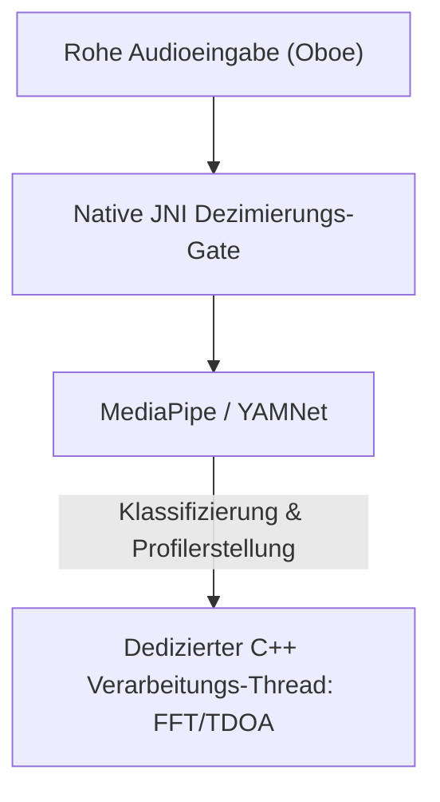

# VigilantEar 👂🛡️ (Android Edition)

**Gültigkeitsdatum:** 6. Juni 2026

**VigilantEar** ist ein fortschrittliches, extrem leistungsstarkes akustisches Forschungs- und Barrierefreiheits-Tool für Android, das entwickelt wurde, um der Gehörlosen- und Schwerhörigen-Community (D/HH) ein Echtzeit-Richtungs- und räumliches Bewusstsein zu bieten. Herkömmliche Tonerkennungssoftware identifiziert nur, *was* ein Geräusch ist; VigilantEar fungiert als umfassendes taktisches Radar, das maschinelles Lernen mit Edge-Computing und hochkomplexe akustische Physik kombiniert, um genau zu verfolgen, *wo* ein Geräusch entsteht, seine geschätzte Entfernung und seinen absoluten Pfadverlauf.

---

## 🌍 Globale Reichweite & Lokalisierung

Um Benutzer weltweit zu unterstützen, verfügt die Plattform über eine vollständige native Lokalisierungsmatrix, die Folgendes unterstützt:

- **Englisch**
- **Spanisch (Español)**
- **Portugiesisch (Português)**
- **Chinesisch (简体中文)**
- **Französisch (Français)**
- **Deutsch**
- **Japanisch (日本語)**

Alle taktischen Overlays, HUD-Warnungen und Einstellungsmenüs passen sich dynamisch an die Systemeinstellungen an.

---

## 🚀 Hauptfunktionen & Fähigkeiten

- **Intelligente Leistungssteuerung & WakeLocks**: Um die Batterielebensdauer zu maximieren und Systemressourcen zu schützen, implementiert das System eine bedingte Hintergrundüberwachung mit starken WakeLocks und Vordergrunddiensten (Foreground Services). Wenn Kategorien für Notfallwarnungen deaktiviert sind, gehen die Mikrofoneingabeschleifen und Verarbeitungs-Engines effizient in den Ruhezustand über.
- **Taktische Warnsimulation**: Beinhaltet eine robuste On-Device-Simulationssuite, die es Benutzern ermöglicht, haptische Signaturen und visuelle Reaktionen für kritische `.emergency`-Spuren – Sirenen, Alarme, Türklingeln, Personen in der Nähe und Unwetter (einschließlich NWS, MeteoGate Europe und CMA/MEM China-Feeds) – zu testen, ohne dass reale akustische Auslöser erforderlich sind.
- **Multi-Ziel-Tracker (MTT)**: Isoliert und verfolgt gleichzeitig unabhängige akustische Umgebungssignaturen mithilfe eindeutiger Sitzungsmarkierungen gepaart mit physikalischer Persistenzabbildung, wobei fortschrittliche Verfeinerungsschwellenwerte für eine kontinuierliche Verfolgung verwendet werden.
- **Shazam-Integration**: Echtzeit-Identifikation von Umgebungsmusik, die dynamisch auf dem räumlichen Radar abgebildet wird.
- **Geografische Straßenausrichtung**: Projiziert relative mathematische akustische Peilungen auf globale GPS-Koordinaten und richtet Echtzeit-Fahrzeugvektoren intelligent an verifizierten Straßen aus.

---

## 🧬 Kernarchitektur & Die Neuronale Mathematik-Engine

VigilantEar auf Android nutzt eine hochoptimierte **Native SoundML Architektur**, die um C++-Verarbeitung und die Echtzeit-Audio-Engine Oboe herum aufgebaut ist, um die geringstmögliche Latenz auf unterschiedlicher Hardware sicherzustellen.

## ⚡ Architektonische Entkopplung

Um einen vollständig unblockierten UI-Thread aufrechtzuerhalten und gleichzeitig einen hochfrequenten Eingabeabgriff kontinuierlich zu handhaben, verwendet die Plattform eine strikte Trennung zwischen Kotlin und C++:

- **Kotlin UI / Vordergrunddienst**: Verwaltet den Lebenszyklus von Vordergrunddiensten, Berechtigungen, den Gerätestatus der Ausrichtung und Standortmetriken, um das HUD reibungslos zu steuern.
- **AcousticEngine (Native C++)**: Verwaltet Oboe-Audiostreams auf niedriger Ebene und Hardwareoperationen. Eingabepuffer werden direkt im Thread des hochpriorisierten Abgriffs tief kopiert, wobei Snapshots direkt in eine dedizierte native Verarbeitungswarteschlange weitergegeben werden, ohne die UI aufzuhalten.

### 🧠 Fortschrittliche Akustik-Pipeline

- **Duale Klassifikator-Architektur**: Nutzt einen an die NPU delegierten primären Klassifikator für die kritische, hochfrequente Klangprofilierung, gepaart mit einem an die CPU delegierten neuronalen Ticker für kontinuierliches Umgebungsgeräuschbewusstsein. ML-Pufferlasten werden aktiv überwacht, um Inferenz-Koroutinen dynamisch zu drosseln und einen Rückstau bei der Eingabe zu verhindern.
- **Akute vs. Breitband-Physik**: Differenziert die Verfolgungslogik basierend auf der Klangstruktur. Akute, flüchtige Geräusche (wie Klatschen und brechendes Glas) werden nativ über strikte Spitzen- (+16dB) und RMS- (+3,5dB) Algorithmen ausgelöst. Breitbandgeräusche (wie Musik und Fahrzeuge) verwenden spezifische niedrigere Konfidenzschwellen (0,10f vs 0,25f) und werden intelligent gesät (seeded), um eine kontinuierliche Verfolgungspersistenz zu gewährleisten.
- **Einschränkungen & Verfeinerung**: Der Tracker gruppiert identische Geräusche innerhalb eines räumlichen Deltas von 25 Grad und lässt sie mithilfe von `tailMemory`-Beschränkungen aus den `AppGlobals` präzise altern. Verfolgungs-Broadcasts an die UI werden sorgfältig gedrosselt, um Ressourcenverschwendung zu verhindern.
- **Parallele räumliche Mathematik**: Hochleistungsfähige mathematische Pipelines (einschließlich `kiss_fft`, Berechnungen der Zeitdifferenz der Ankunft (TDOA) und Doppler-Verfolgungsalgorithmen) werden vollständig in dedizierten asynchronen nativen Threads ausgeführt.

### 📊 Leistungsbenchmarks

- **Aktiver Modus**: Entwickelt, um umfassendes Live-HUD-Tracking reibungslos bereitzustellen.
- **Hardware-Wiederherstellung**: Eine robuste Oboe-Implementierung gewährleistet eine automatische Wiederherstellung im Sub-Sekunden-Bereich bei Änderungen der Audioroute (Bluetooth, Kopfhörer, Lautsprecherwechsel), ohne dass Verfolgungssitzungen abgebrochen werden.

---

## 🛠️ Technologie-Stack (2026)

- **Sprache**: Kotlin (Coroutines, Channels), C++ (JNI, Native Audio)
- **Frameworks**: Android SDK, Jetpack Compose (UI), Oboe (Echtzeit-Audio), MediaPipe / YAMNet
- **Hardware-Grundlinie**: Android 10+ Geräte mit unterstützter Stereomikrofon-Ausrichtung für TDOA-Peilungspräzision.

---

## 📊 Datenschutz & Sicherheitsrichtlinien

- **Local-First Isolation**: Alle Audioklassifizierungen, Spektralmathematik und Peilungsprojektionen erfolgen ausschließlich auf dem Gerät. Rohe Audiostreams werden unter keinen Umständen jemals aufgezeichnet, zwischengespeichert oder übertragen.
- **Keine Remote-Telemetrie oder Diagnose**: VigilantEar ist so konzipiert, dass es vollständig lokal auf Ihrem Gerät läuft. Wir erfassen, übertragen oder speichern keine Remote-Telemetrie, Absturzberichte, Diagnoseprotokolle oder Nutzungsanalysen auf unseren Servern.

---

## ⚖️ Haftungsausschluss

VigilantEar ist eine experimentelle akustische Forschungs- und räumliche Barrierefreiheitshilfe. Es ist nicht als lebensrettendes Werkzeug zertifiziert. Die Auflösung der Verfolgung kann basierend auf der regionalen Topologie, den vorherrschenden Wetter- und Windbedingungen sowie der Mikrofon-Hardwarekalibrierung dynamisch schwanken. Benutzer müssen stets ein normales Umgebungsbewusstsein aufrechterhalten.

**Kontakt-E-Mail:** [vigilantear@wingdingssocial.com](mailto:vigilantear@wingdingssocial.com)

VigilantEar ist ein Barrierefreiheits-Tool, das mit Sorgfalt entwickelt wurde. Bitte verwenden Sie es verantwortungsbewusst.

Mit ❤️ für die D/HH-Community und die akustische Forschung gemacht.

© 2026 Wingdings, Inc.  
Alle Rechte vorbehalten.
