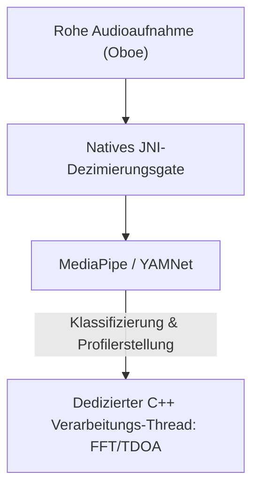

# Vigilant Ear 👂🛡️ (Android Edition)

**Inkrafttreten:** 6. Juni 2026

**Vigilant Ear** ist ein fortschrittliches, ultra-leistungsstarkes Akustikforschungs- und Barrierefreiheits-Tool für Android, das entwickelt wurde, um der Gehörlosen- und Schwerhörigen-Community (D/HH) in Echtzeit direktionales und räumliches Bewusstsein zu bieten. Herkömmliche Geräuscherkennungssoftware identifiziert nur, *was* ein Geräusch ist. **Vigilant Ear sagt Ihnen, wo es ist, wer es macht und was sie sagen.** Es fungiert als umfassendes taktisches Radar, das Edge-Computed Machine Learning mit ausgefeilter akustischer Physik kombiniert, um genau zu verfolgen, *woher* ein Geräusch stammt, seine geschätzte Entfernung, seinen absoluten Pfadverlauf und die getrennten, übersetzten Wörter einzelner Sprecher.

---

## 🌍 Globale Reichweite & Lokalisierung

Um Benutzer weltweit zu unterstützen, verfügt die Plattform über eine vollständige native Lokalisierungsmatrix, die Folgendes unterstützt:

- **Englisch**
- **Spanisch (Español)**
- **Portugiesisch (Português)**
- **Chinesisch (简体中文)**
- **Französisch (Français)**
- **Deutsch (Deutsch)**
- **Japanisch (日本語)**
- **Arabisch (العربية)**

Alle taktischen Overlays, HUD-Warnungen und Einstellungsmenüs passen sich dynamisch an die System-Gebietsschemas an.

---

## 🚀 Hauptfunktionen & Fähigkeiten

- **Intelligentes Power Gating & WakeLocks**: Um die Langlebigkeit der Batterie zu maximieren und die Systemressourcen zu schützen, implementiert das System eine bedingte Hintergrundüberwachung mit starken WakeLocks und Vordergrunddiensten. Wenn Notfallalarmkategorien deaktiviert sind, wechseln die Mikrofoneingabeschleifen und Verarbeitungs-Engines effizient in den Ruhezustand.
- **Taktische Alarm-Simulation**: Enthält eine robuste geräteinterne Simulationssuite, die es Benutzern ermöglicht, haptische Signaturen und visuelle Reaktionen für kritische `.emergency`-Spuren – Sirenen, Alarme, Türklingeln, Personen in der Nähe und schweres Wetter (einschließlich NWS, MeteoGate Europe und CMA/MEM China Feeds) – zu testen, ohne dass reale akustische Auslöser erforderlich sind.
- **Multi-Target Tracker (MTT)**: Isoliert und verfolgt gleichzeitig unabhängige umgebungsbedingte Geräuschsignaturen mithilfe eindeutiger Sitzungsmarkierungen gepaart mit physischer Persistenzzuordnung und nutzt fortschrittliche Verfeinerungsschwellenwerte für eine kontinuierliche Verfolgung.
- **Shazam-Integration**: Echtzeit-Identifikation von Umgebungsmusik, die dynamisch auf das räumliche Radar abgebildet wird.
- **Akustisches Radar-HUD**: Ein vollständig live geschaltetes taktisches Dashboard, das Echtzeit-Telemetrie zu Systemleistung, Netzwerkfähigkeit, Verarbeitungslatenz und FPS (Analyse-Hz) bietet, zusammen mit einem direktionalen Raster, das akustische Umweltziele nach Peilung und Energie verfolgt.
- **Geografisches Road Snapping**: Projiziert relative mathematische akustische Peilungen auf globale GPS-Koordinaten und rastet Echtzeit-Fahrzeugvektoren intelligent auf verifizierten Straßen ein.
- **Lautsprechermodus (Live Direktionale Untertitel)**: Transkribiert die in Ihrer Nähe sprechenden Personen in Untertitelzeilen, eine pro Stimme. Die geräteinterne Sprecherdiarisierung trennt Stimmen mit unterschiedlichen Farben und scrollenden Linien, begleitet von Richtungspfeilen, die auf den Standort des Sprechers zeigen.
- **Live On-Device Übersetzung**: Transkribiert und übersetzt fremde Sprache in Echtzeit. Die gesamte Pipeline – Hören, Trennen der Sprecher, Transkribieren und Übersetzen – läuft vollständig auf dem Gerät ohne Cloud-Abhängigkeit.

---

## 🧬 Kernarchitektur & Die Neurale Mathematik-Engine

Vigilant Ear auf Android nutzt eine hochoptimierte **Native SoundML-Architektur**, die um C++-Verarbeitung und die Oboe-Echtzeit-Audio-Engine herum aufgebaut ist, um die geringstmögliche Latenz auf unterschiedlicher Hardware zu gewährleisten.

## ⚡ Architektonische Entkopplung

Um einen vollständig unblockierten UI-Thread aufrechtzuerhalten und gleichzeitig einen hochfrequenten Eingangsabgriff kontinuierlich zu verarbeiten, verwendet die Plattform eine strikte Trennung zwischen Kotlin und C++:

- **Kotlin UI / Vordergrunddienst**: Verwaltet die Lebenszyklen von Vordergrunddiensten, Berechtigungen, den Geräteorientierungsstatus und Standortmetriken, um das HUD reibungslos zu steuern.
- **AcousticEngine (Natives C++)**: Verwaltet Oboe-Audiostreams auf niedriger Ebene und Hardwarevorgänge. Aufnahmepuffer werden tief direkt im hochpriorisierten Abgriffs-Thread kopiert und Snapshots direkt an eine dedizierte native Verarbeitungswarteschlange übergeben, ohne die Benutzeroberfläche zu blockieren.

### 🧠 Fortschrittliche Akustik-Pipeline

- **Dual-Classifier-Architektur**: Nutzt einen primären Klassifikator mit NPU-Delegation für kritische, hochfrequente Geräuschprofile, gepaart mit einem CPU-delegierten neuralen Ticker für kontinuierliches Umgebungsgeräuschbewusstsein. ML-Pufferlasten werden aktiv überwacht, um Inferenz-Coroutinen dynamisch zu drosseln und einen Aufnahmerückstand zu verhindern.
- **Akute vs. Breitband-Physik**: Unterscheidet die Verfolgungslogik basierend auf der Klangstruktur. Akute transiente Geräusche (wie Klatschen und Glasbruch) werden nativ über strenge Peak- (+16 dB) und RMS- (+3,5 dB) Algorithmen ausgelöst. Breitbandgeräusche (wie Musik und Fahrzeuge) verwenden spezifische niedrigere Konfidenzschwellen (0,10f vs. 0,25f) und werden intelligent gesät, um eine kontinuierliche Verfolgungspersistenz zu gewährleisten.
- **Einschränkungen & Verfeinerung**: Der Tracker gruppiert identische Geräusche innerhalb eines räumlichen Deltas von 25 Grad und altert sie mithilfe von `tailMemory`-Einschränkungen aus `AppGlobals` präzise aus. Tracking-Broadcasts an die Benutzeroberfläche werden sorgfältig gedrosselt, um einen Ressourcenverbrauch zu verhindern.
- **Parallele Räumliche Mathematik**: Hochleistungsfähige mathematische Pipelines (einschließlich `kiss_fft`, Time Difference of Arrival (TDOA) Berechnungen und Doppler-Tracking-Algorithmen) werden vollständig innerhalb dedizierter nativer asynchroner Threads ausgeführt.

### 📊 Leistungs-Benchmarks

- **Aktiver Modus**: Entwickelt, um umfassendes Live-HUD-Tracking reibungslos bereitzustellen.
- **Hardware-Wiederherstellung**: Die robuste Oboe-Implementierung gewährleistet eine automatische Wiederherstellung im Subsekundenbereich bei Änderungen der Audioroute (Bluetooth, Kopfhörer, Lautsprecherwechsel), ohne dass Tracking-Sitzungen abgebrochen werden.

---

## 🛠️ Technologie-Stack (2026)

- **Sprache**: Kotlin (Coroutinen, Channels), C++ (JNI, Natives Audio)
- **Frameworks**: Android SDK, Jetpack Compose (UI), Oboe (Echtzeit-Audio), MediaPipe / YAMNet
- **Hardware-Basis**: Android 10+ Geräte mit unterstützter Stereo-Mikrofonausrichtung für TDOA-Peilungspräzision.

---

## 📊 Datenschutz & Sicherheitsleitplanken

- **Local-First Isolation**: Alle Audioklassifizierungen, Spektralmathematik und Peilungsprojektionen erfolgen ausschließlich auf dem Gerät. Rohe Audiostreams werden unter keinen Umständen jemals aufgezeichnet, zwischengespeichert oder übertragen.
- **Keine Remote-Telemetrie oder Diagnose**: Vigilant Ear ist so konzipiert, dass es vollständig lokal auf Ihrem Gerät funktioniert. Wir sammeln, übertragen oder speichern keine Remote-Telemetrie, Absturzprotokolle, Diagnoseaufzeichnungen oder Nutzungsanalysen auf unseren Servern.

---

## ⚖️ Haftungsausschluss

Vigilant Ear ist eine experimentelle Akustikforschungs- und räumliche Barrierefreiheits-Hilfe. Es ist nicht als lebensrettendes Hilfsmittel zertifiziert. Die Auflösung der Verfolgung kann basierend auf der regionalen Topologie, dem vorherrschenden Wetter, den Windbedingungen und der Kalibrierung der Mikrofonhardware dynamisch schwanken. Benutzer müssen stets ein normales Umgebungsbewusstsein aufrechterhalten.

**Kontakt-E-Mail:** [vigilantear@wingdingssocial.com](mailto:vigilantear@wingdingssocial.com)

Vigilant Ear ist ein mit Sorgfalt entwickeltes Tool für die Barrierefreiheit. Bitte verwenden Sie es verantwortungsbewusst.

Gemacht mit ❤️ für die D/HH-Community und die Akustikforschung.

© 2026 Wingdings, Inc.  
Alle Rechte vorbehalten.
