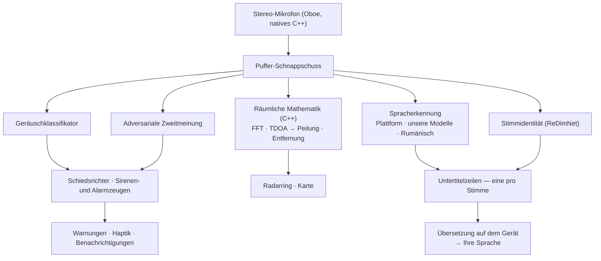

# Vigilant Ear 👂🛡️ (Android)

*Gültig ab Android 1.1.8 · September 2026.*

## Ein akustisches Radar für Menschen, die nicht hören können.

Eine App, die speziell für die Gemeinschaft der Gehörlosen, Schwerhörigen und CODAs entwickelt wurde. Die meisten Geräuscherkennungs-Apps sagen Ihnen, *was* ein Geräusch ist. **Vigilant Ear sagt Ihnen, wo es ist, wer es macht und was gesprochen wird** — und verwandelt ein Android-Telefon in ein Echtzeitbild der Geräusche um Sie herum.

Die Richtung einer Sirene. Ein Klopfen hinter Ihnen. Die Personen in einem Gespräch, als getrennte transkribierte Stimmen gezeichnet. Wenn jemand eine Sprache spricht, die Sie nicht lesen, können die Worte **in Ihre Sprache übersetzt, auf dem Telefon** ankommen.

Alles Wichtige läuft auf dem Gerät. Audio wird zur Erkennung weder aufgezeichnet noch hochgeladen. Nichts hängt davon ab, etwas zu hören.

- 🧭 **Richtung, nicht nur Erkennung.** *Was, wo* und *was gesagt wurde* — nicht bloß „es gab ein Geräusch.“
- 📣 **Name Called.** Tragen Sie Ihren Namen ein, ein Kind, eine Partnerin oder einen Partner — „Bestellung für Marie fertig“ tippt das Telefon an, mit der Richtung, wenn sie gemessen werden konnte.
- 🔒 **Von Grund auf privat.** Klassifizierung, Untertitelung, Übersetzung und Stimmidentität laufen auf Ihrem Telefon. Benannte Stimmen sind auf diesem Gerät verschlüsselt, und es gibt keinen Cloud-Pfad für ein Stimmenverzeichnis.
- 🌐 **Auto-Translate für Rumänisch.** Untertitel auf Rumänisch können auf diesem Telefon übersetzt werden, auf dem Gerät.
- 👁️ **Für Gehörlose / Schwerhörige / CODAs.** Eigene Haptik pro Geräusch, kontrastreiche Darstellung, farbunabhängige Hinweise, große Tippflächen.

---

## Für wen es ist

- **Gehörlose, schwerhörige und CODA-Nutzerinnen und -Nutzer**, die akustische Situationswahrnehmung wollen — das Klopfen, der Alarm, die Sirene, die Person in der Nähe —, die Sie eingeschaltet lassen und der Sie vertrauen können.
- Alle, die **Live-Untertitel mit Richtung und Sprechertrennung** oder **Übersetzung auf dem Gerät** von Menschen in der Nähe brauchen.
- Nutzerinnen und Nutzer aus Barrierefreiheit und Akustikforschung, die sich für Schalllokalisierung auf dem Gerät interessieren.

> Vigilant Ear ist ein **Hilfsmittel** zur Barrierefreiheit, kein zertifiziertes Lebensrettungsgerät.

---

## Was es tut

### 🧭 Es sieht Geräusche — Richtung & Entfernung
Über die beiden Mikrofone des Telefons misst Vigilant Ear den **Winkel, aus dem ein Geräusch gekommen ist**, und setzt es als Live-Markierung auf einen vorausgerichteten Radarring und eine Karte. Die Mathematik ist kohärenzgewichtete Time Difference of Arrival: die Frequenzbänder bevorzugen, in denen beide Mikrofone übereinstimmen, dann die winzige Ankunftsverzögerung in eine Peilung verwandeln. Zwei Mikrofone auf einer Linie können links und rechts allein nicht unterscheiden, deshalb trägt die Anzeige diese Mehrdeutigkeit ehrlich, statt eine Seite zu erfinden.

**Wie gut das funktioniert, hängt von Ihrem konkreten Telefon ab, und wir sagen welches.** Die Peilungsmathematik braucht den echten Abstand zwischen den beiden Mikrofonen. Dieser Abstand ist **an drei Geräten physisch gemessen — Pixel 9, Pixel 9 Pro / Pro XL und Pixel 10a.** Jedes andere Modell läuft mit einem Abstand, der aus der Gehäusehöhe geschätzt wird — nah dran, aber nicht gemessen, und die Richtung ist entsprechend weniger scharf. Die Liste steht im Quellcode der App und wächst, sobald Geräte gemessen werden; wir nennen lieber die drei, als fünfzehn anzudeuten.

Die Entfernung ist eine Schätzung aus der Lautstärke und wird als die Schätzung gezeigt, die sie ist. Die Referenz des stillen Raums, gegen die gemessen wird, ist **pro Gerät gemessen**, nicht angenommen — das Telefon lernt seinen eigenen Rauschboden, statt eine Konstante zu übernehmen.

### 🚨 Es erkennt wichtige Geräusche — und warnt Sie
Ein Klassifikator auf dem Gerät erkennt Hunderte alltäglicher Geräusche und überwacht die kritischen — **Sirenen, Alarme, Türklingeln und Klopfen, Babygeschrei, eine Person in der Nähe und Unwetter.** Es laufen zwei Klassifikatoren statt einem: ein primärer und eine adversariale Zweitmeinung, mit einem Schiedsrichter dazwischen, damit ein schlechter Frame eines einzelnen Modells keine Warnung ist. Sirenen und Rauchmelder bekommen darüber hinaus eine eigene Bestätigung — das T3-Muster eines Rauchmelders ist ein bestimmter Rhythmus, nicht nur ein lauter Piepton.

Wenn etwas auslöst, erhalten Sie eine Warnung auf dem Bildschirm, eine Benachrichtigung und ein **eigenes Vibrationsmuster pro Geräusch** — die Pulsanzahl kommt aus dem Profil des Geräuschs, sodass sich ein Alarm in der Tasche nicht wie eine Türklingel anfühlt.

Unwetterwarnungen kommen aus offiziellen öffentlichen Feeds — **NWS** (USA), **MeteoGate** (Europa), **CMA** (China), **KMA** (Korea), **JMA** (Japan), **ECCC** (Kanada), **BOM** (Australien), **INMET** (Brasilien) und **NDMA** (Indien) — kostenlos für alle, und eingegrenzt auf die, die Ihren Ort abdecken. **Erdbebenwarnungen** kommen aus dem weltweiten USGS-Feed: eine Bestätigung, dass das, was Sie gespürt haben, ein Beben war, keine Frühwarnung.

### 💬 Speaker Mode — Live-Untertitel *(kostenlos)*
Schalten Sie Speaker Mode ein, und Vigilant Ear transkribiert sprechende Personen in Ihrer Nähe in Untertitelzeilen. Stimmidentität auf dem Gerät hält Sprecherinnen und Sprecher getrennt und farbcodiert, aus Stimmabdrücken, die das Telefon nie verlassen.

**Drei Erkenner, für Sie gewählt.** Die App nutzt die eigene Spracherkennung Ihres Telefons für die Sprachen, die sie bereits beherrscht, fällt auf eigene Modelle für die Sprachen zurück, die sie nicht hat, und führt ein eigenes rumänisches Modell für die eine Sprache, die keines von beiden kann. Sie wählen eine Sprache, keine Engine.

Die Trennung nach Stimme ist vorhanden und wird besser. Behandeln Sie die Zeilen als *was in Ihrer Nähe gesagt wurde*, mit einem starken Hinweis darauf, wer — nicht als Gerichtsprotokoll darüber, wer es gesagt hat.

**Derbe Sprache lässt sich maskieren.** Schalten Sie es ein, und Schimpfwörter werden durch Symbole ersetzt, sodass der Satz ohne das Wort lesbar bleibt. 🔴 **Das hat eine echte Grenze, und wir beschönigen sie nicht:** die Maskierung erledigt die eigene Spracherkennung Ihres Telefons, gilt also nur für die Sprachen, die diese Erkennung verarbeitet. Sprachen, die von unseren heruntergeladenen Modellen untertitelt werden, kommen unmaskiert an, egal was der Schalter sagt.

**Untertitel werden aufgeräumt, und auf manchen Telefonen mehr als aufgeräumt.** Jede Zeile geht durch eine deterministische Bereinigung. Auf aktueller Pixel- und Galaxy-Hardware mit verfügbarem Gemini Nano bekommen die Zeilen zusätzlich einen Korrekturlese-Durchgang. Das ist eine Verbesserung und nie eine Abhängigkeit — Untertitel brauchen das nicht, und die meisten Telefone sehen es nie.

### 🌐 Auto-Translate — Ihre Sprache, live *(Power Pack+)*
Wenn eine Person in der Nähe eine andere Sprache spricht, erkennt Vigilant Ear das und zeigt die Untertitel **in Ihrer Sprache**. Erkennung, Transkription und Übersetzung laufen alle auf dem Gerät. Die andere Sprache müssen Sie vorher weder kennen noch wählen.

**Rumänisch ist enthalten.** Erkennung, Untertitel und Auto-Translate verarbeiten es auf diesem Telefon.

### 📣 Name Called
Überwacht diese Untertitel auf Namen, die Sie eintragen — Ihren eigenen, den eines Kindes, einer Partnerin oder eines Partners, den Namen, den eine Theke für eine Bestellung aufruft. Wenn einer gesprochen wird, erhalten Sie eine Warnung, keine zweite Untertitelblase, und die Richtung, aus der die Stimme kam, **wenn diese Richtung tatsächlich gemessen wurde**. Die Liste liegt im Keystore des Geräts und verlässt ihn nie.

### 🫧 Standing Watch und tiefes Grollen
**Standing Watch** ist der Zustand des Raums selbst, immer an, ohne etwas einzustellen: eine ruhige Lampe, solange der Raum sein Muster hält, eine Änderung, wenn sich etwas verschiebt.

Das **Barometer** des Telefons beobachtet Druckwellen — Wetter, eine Tür, ein schwerer Lkw — und zeichnet sie als weichen Ring, der sich von Ihrem Standort aus ausdehnt. 🔴 **Absichtlich ohne Richtung darauf.** Ein Drucksensor kann nicht sagen, aus welcher Richtung eine Druckwelle kam, und ein Ring, der eine Peilung behaupten würde, würde eine erfinden.

### 📓 Witness Ear — ein optionales 24-Stunden-Journal
Standardmäßig aus. Solange es an ist, bleibt, was die App gehört hat und wo, **auf diesem Telefon** bis zu einem Tag, bereit zum Export als einfaches PDF. Ein Knopf löscht das Protokoll sofort. Es ist das Einzige in der App, das etwas behält, deshalb ist es aus, bis Sie es wählen.

### 🔗 Remote Link — jemanden erreichen, der nicht bei Ihnen ist *(Power Pack+)*
Was ein Anruf sonst täte, hier mit Video und Text. Sie senden einen Einladungscode; die andere Person tritt aus Vigilant Ear bei. Es gibt keine Nähepflicht — Sie können überall sein. **An keinem Punkt wird Audio genutzt,** sodass an der Verbindung an keinem Ende etwas vom Hören abhängt, und Sie haben einen Weg, über die App zu gebärden. Die App trägt das Video; den Rest machen Sie beide.

### 🎵 Music ID *(Power Pack+)*
Erkennt Musik um Sie herum und verfolgt Songwechsel. Ein Chroma-Signaturdetektor klärt zuerst die Frage „läuft tatsächlich Musik?“, weil allgemeine Klassifikatoren stille Räume und Sirenen bekanntermaßen „Musik“ nennen.

### 🪄 Feature Playground und eine geführte Tour
**Feature Playground** lässt Sie Warnungen üben und Funktionen auslösen, ohne auf das Echte zu warten, immer mit Wasserzeichen, damit Übung nie als Live-Ereignis gilt. Eine **geführte Tour** geht durch Karte, HUD, Zahnrad-Panel, Einstellungen und Power Pack+, jederzeit vom Absolventenhut aus wiederholbar.

### ♿ Barrierefreiheit zuerst
Gebaut für gehörlose / schwerhörige / CODA- und farbenblinde Nutzerinnen und Nutzer: farbunabhängige Hinweise, große Tippflächen, multimodale Warnungen (haptisch + visuell + auf dem Bildschirm), Vibrationssignaturen pro Geräusch und ein Startprüfbildschirm, der genau zeigt, welche Berechtigungen erteilt, fehlend oder verweigert sind.

---

## Kostenlos & Power Pack+

Der Sicherheitskern ist **kostenlos, für immer**:

- **Geräuschwarnungen** — Sirenen, Alarme, Klopfen und Türklingeln, Babygeschrei, Person in der Nähe, mit Haptik und Benachrichtigungen.
- **Live-Untertitel** — Speaker Mode, auf dem Gerät, mit Stimmtrennung und optionaler Maskierung derber Sprache.
- **Name Called** — Namen, die Sie eingeben, mit Richtung gewarnt, wo sie gemessen wurde.
- **Standing Watch** — der Zustand des Raums, immer an.
- **Unwetterwarnungen** — neun offizielle nationale Feeds für Ihre Region.
- **Erdbebenwarnungen** — USGS, weltweit.
- **Witness Ear** — das optionale 24-Stunden-Journal und sein PDF-Export.
- **Feature Playground** und die geführte Tour.

**Power Pack+** ist eine einmalige Freischaltung — **kein Abonnement** — mit einer kostenlosen Testversion. Auf Android fügt es genau vier Dinge hinzu:

- **Auto-Translate** — Übersetzung von Sprache in der Nähe in Ihre Sprache, auf dem Gerät.
- **Music ID** — Songerkennung.
- **Remote Link** — eine Video- und Textverbindung zwischen zwei Geräten hosten.
- **Benannte Stimmen** — die Menschen benennen, die die App hört, sodass ihre Untertitel ihren Namen tragen.

Bevor Sie kaufen, **prüft die App Ihr tatsächliches Telefon** und sagt Ihnen, ob jedes davon darauf funktionieren wird, langsam funktionieren wird oder gar nicht. Wir verlieren lieber den Verkauf, als Geld für etwas zu nehmen, das dieses Gerät nicht ausführen kann.

Kostenlos oder Power Pack+: **Ihr Audio bleibt zur Erkennung auf dem Gerät** — die Stufe ändert, welche Funktionen freigeschaltet sind, niemals, wohin der Klang geht.

---

## Wie es funktioniert

Einmal auf einem Audio-Thread mit hoher Priorität aufnehmen, den Puffer kopieren und an Spezialisten verteilen, die einander und den Bildschirm nie blockieren:

```mermaid
graph TD
    A["Stereo-Mikrofon (Oboe, natives C++)"] --> B["Puffer-Schnappschuss"]
    B --> C["Geräuschklassifikator"]
    B --> Y["Adversariale Zweitmeinung"]
    C --> S["Schiedsrichter · Sirenen- und Alarmzeugen"]
    Y --> S
    S --> H["Warnungen · Haptik · Benachrichtigungen"]
    B --> D["Räumliche Mathematik (C++)<br/>FFT · TDOA → Peilung · Entfernung"]
    D --> R["Radarring · Karte"]
    B --> F["Spracherkennung<br/>Plattform · unsere Modelle · Rumänisch"]
    B --> E["Stimmidentität (ReDimNet)"]
    F --> G["Untertitelzeilen — eine pro Stimme"]
    E --> G
    G --> T["Übersetzung auf dem Gerät<br/>→ Ihre Sprache"]
```

- **Kotlin und C++, strikt getrennt.** Kotlin besitzt den Bildschirm, den Vordergrunddienst, Berechtigungen und Standort. Eine native Engine besitzt das Mikrofon und die Mathematik. Audio-Puffer werden auf dem Aufnahme-Thread kopiert und an eine native Warteschlange übergeben, sodass das Bild nicht stockt, während das Telefon nachdenkt.
- **Sprachidentifikation ist ein eigenes Modell, kein Raten.** Die App verwendet dasselbe VoxLingua107-ECAPA-Modell auf jeder Plattform, sodass alle gleich auf „Welche Sprache ist das?“ antworten.
- **Wetter und Beben gehen den umgekehrten Weg zum Audio.** Nichts von Ihrem Klang geht hinaus; Warn-*daten* kommen herein, über einen kleinen Cache, den wir betreiben, sodass ein Abruf der öffentlichen Daten jeder Nutzerin und jedem Nutzer dient und Ihr Telefon nie den Server einer ausländischen Regierung direkt kontaktiert.

---

## Was wir gemessen haben — und was nicht

Wir haben keine Android-Schreibtischtestzahlen für Peilung und Entfernung veröffentlicht. **Dieses Dokument erfindet sie nicht.**

Die Sprachidentifikation wurde schon einmal ersetzt: der vorherige Detektor antwortete in einem Raum *Chinesisch* auf rumänische Sprache. Eine selbstsichere falsche Sprache bedeutet den falschen Erkenner, und das bedeutet Untertitel, die stiller Unsinn sind — für eine lesende Person, die den Raum nicht hören kann, schlimmer als gar keine Untertitel.

**Auf Android noch nicht gemessen:** Peilungsgenauigkeit gegen ein Maßband, Entfernungsgenauigkeit gegen bekannte Distanzen und Sprechertrennungsgenauigkeit an einer echten Aufnahme. Bis das vorliegt, behandeln Sie Richtung als guten Hinweis und Entfernung als Schätzung.

Sprach- und Stimmmodelle werden heruntergeladen, wenn Sie sie zum ersten Mal brauchen, bevorzugt über Wi-Fi. Die App fragt, bevor sie etwas Großes holt. Danach ist die Erkennung offline.

---

## Datenschutz

- **Auf dem Gerät, immer, für die Kernpipeline.** Klassifizierung, räumliche Mathematik, Transkription, Stimmidentität und Übersetzung laufen auf Ihrem Telefon. Rohes Audio wird nie aufgezeichnet, zwischengespeichert oder übertragen.
- **Benannte Stimmen bleiben hier.** Stimmabdrücke sind mit einem Schlüssel im Android Keystore verschlüsselt, der das Gerät nie verlässt. **Es gibt keinen Cloud-Pfad für ein Stimmenverzeichnis.** Wird das Telefon zurückgesetzt, sind die Stimmabdrücke unlesbar und Sie hinterlegen sie neu — das ist das richtige Verhalten, keine Einschränkung.
- **Untertitel sind flüchtig**, es sei denn, Sie schalten Witness Ear bewusst ein, und dieses Journal ist lokal, auf 24 Stunden begrenzt und mit einem Knopf gelöscht.
- **Keine Werbung und keine Verhaltensanalyse.** Netzwerknutzung beschränkt sich auf Karten, den öffentlichen Warn-Cache, optionale Songerkennung, Straßenkontext und Play-Abrechnung.

Vollständige Angaben: [PRIVACY.md](/de/privacy/) · [TERMS.md](/de/terms/) · [SUPPORT.md](/de/support/)

---

## Hardware

- **Android 13 oder neuer.**
- **Stereo-Mikrofone** sind für die Richtungsfindung nötig; am schärfsten auf den Geräten, deren Mikrofonabstand physisch gemessen wurde.

---

## Lokalisierung

Oberfläche, Warnungen und Untertitel sind übersetzt in **Englisch, Spanisch, Portugiesisch (Brasilien), Französisch, Deutsch, Italienisch, Türkisch, Arabisch, Japanisch, vereinfachtes Chinesisch, Koreanisch, Russisch und Hindi** — 13 Sprachen, nach Ihrer Systemsprache oder einer manuellen Wahl in der App. Rumänische Untertitel und Auto-Translate funktionieren in diesem Build.

---

## Status und Haftungsausschluss

Vigilant Ear ist ein **experimentelles Hilfsmittel zur akustischen Barrierefreiheit**, kein zertifiziertes Lebensrettungs-Dienstprogramm. Richtung und Entfernung variieren mit Umgebung, Wetter, Wind und Mikrofonhardware. **Behalten Sie stets Ihre übliche Umgebungswahrnehmung** — verlassen Sie sich nicht darauf als einzige Quelle für Sicherheitsinformationen.

---

**Kontakt:** [vigilantear@wingdingssocial.com](mailto:vigilantear@wingdingssocial.com)

Mit ❤️ gemacht für die D/HH-Gemeinschaft und die Akustikforschung.

    
  <strong>© 2026 Wingdings, Inc.</strong> 
  All rights reserved. 
  Patent Pending

