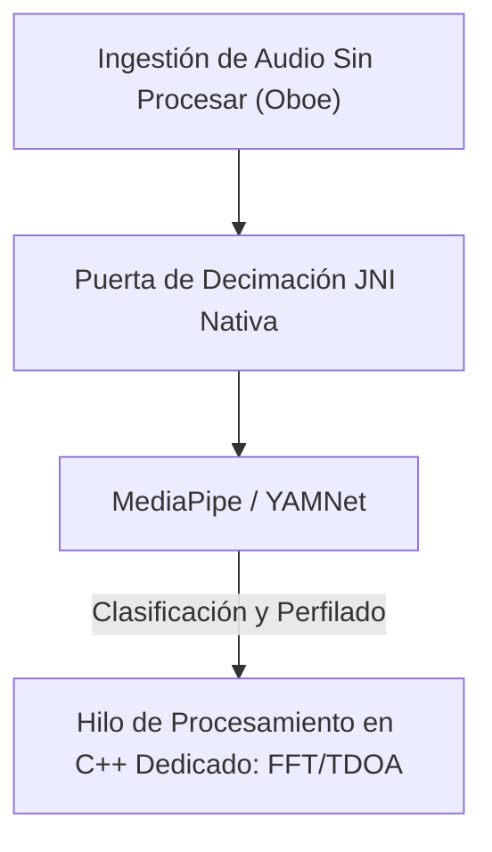

# VigilantEar 👂🛡️ (Edición Android)

**Fecha de vigencia:** 6 de junio de 2026

**VigilantEar** es una herramienta avanzada y de ultra alto rendimiento de investigación acústica y accesibilidad para Android, diseñada para proporcionar conciencia direccional y espacial en tiempo real para la comunidad sorda y con problemas de audición (D/HH). El software tradicional de reconocimiento de sonido solo identifica *qué* es un sonido; VigilantEar actúa como un radar táctico integral, combinando aprendizaje automático computado en el borde con física acústica sofisticada para rastrear exactamente *de dónde* proviene un sonido, su distancia estimada y su trayectoria absoluta.

---

## 🌍 Alcance Global y Localización

Para apoyar a los usuarios de todo el mundo, la plataforma cuenta con una matriz de localización nativa completa que admite:

- **Inglés (English)**
- **Español**
- **Portugués (Português)**
- **Chino (简体中文)**
- **Francés (Français)**
- **Alemán (Deutsch)**
- **Japonés (日本語)**

Todas las superposiciones tácticas, las alertas HUD y los menús de preferencias se ajustan dinámicamente a las configuraciones locales del sistema.

---

## 🚀 Características y Capacidades Clave

- **Control Inteligente de Energía y WakeLocks**: Para maximizar la longevidad de la batería y proteger los recursos del sistema, el sistema implementa un monitoreo condicional en segundo plano con fuertes WakeLocks y Servicios en Primer Plano. Si las categorías de alertas de emergencia se desactivan, los bucles de ingestión del micrófono y los motores de procesamiento entran eficientemente en hibernación.
- **Simulación de Alerta Táctica**: Incluye un robusto conjunto de simulación en el dispositivo que permite a los usuarios probar firmas hápticas y respuestas visuales para pistas críticas `.emergency` —Sirenas, Alarmas, Timbres, Personas Cercanas y Clima Severo (incluidos los feeds del NWS, MeteoGate Europe y CMA/MEM de China)— sin requerir activadores acústicos del mundo real.
- **Rastreador de Múltiples Objetivos (MTT)**: Aísla y rastrea simultáneamente firmas de sonido ambiental independientes utilizando marcadores de sesión únicos combinados con mapeo de persistencia física, utilizando umbrales de refinamiento avanzados para un seguimiento continuo.
- **Integración con Shazam**: Identificación de música ambiental en tiempo real mapeada dinámicamente en el radar espacial.
- **Ajuste Geográfico de Carreteras**: Proyecta rumbos acústicos matemáticos relativos en coordenadas GPS globales, ajustando inteligentemente los vectores de vehículos en tiempo real a calles verificadas.

---

## 🧬 Arquitectura Central y El Motor Matemático Neuronal

VigilantEar en Android utiliza una **Arquitectura Native SoundML** altamente optimizada, construida en torno al procesamiento en C++ y el motor de audio en tiempo real Oboe para garantizar la latencia más baja posible en hardware diverso.

## ⚡ Desacoplamiento Arquitectónico

Para mantener el hilo de la interfaz de usuario completamente desbloqueado mientras se maneja continuamente una entrada de alta frecuencia, la plataforma utiliza una estricta separación entre Kotlin y C++:

- **IU de Kotlin / Servicio en Primer Plano**: Gestiona los ciclos de vida del servicio en primer plano, los permisos, el estado de orientación del dispositivo y las métricas de ubicación para impulsar el HUD sin problemas.
- **AcousticEngine (C++ Nativo)**: Gestiona flujos de audio de Oboe de bajo nivel y operaciones de hardware. Los búferes de ingestión se copian profundamente de manera directa en el hilo de toma de alta prioridad, pasando instantáneas directamente a una cola de procesamiento nativa dedicada sin detener la interfaz de usuario.

### 🧠 Tubería Acústica Avanzada

- **Arquitectura de Clasificador Dual**: Utiliza un clasificador primario delegado por NPU para el perfilado crítico y de alta frecuencia del sonido, emparejado con un teletipo neuronal delegado por CPU para la conciencia continua del sonido ambiental. Las cargas del búfer de ML se monitorean activamente para acelerar dinámicamente las corrutinas de inferencia y evitar el retraso en la ingestión.
- **Física Aguda vs. Banda Ancha**: Diferencia la lógica de seguimiento en función de la estructura del sonido. Los sonidos transitorios agudos (como aplausos y rotura de cristales) se activan de forma nativa a través de estrictos algoritmos de Pico (+16dB) y RMS (+3.5dB). Los sonidos de banda ancha (como música y vehículos) utilizan umbrales de confianza inferiores específicos (0.10f frente a 0.25f) y se siembran inteligentemente para garantizar la persistencia del seguimiento continuo.
- **Restricciones y Refinamiento**: El rastreador agrupa sonidos idénticos dentro de un delta espacial de 25 grados y los descarta con precisión utilizando restricciones `tailMemory` de `AppGlobals`. Las transmisiones de seguimiento a la interfaz de usuario se controlan cuidadosamente para evitar el drenaje de recursos.
- **Matemática Espacial Paralela**: Tuberías matemáticas de alto rendimiento (incluyendo `kiss_fft`, cálculos de Diferencia de Tiempo de Llegada (TDOA) y algoritmos de seguimiento Doppler) se ejecutan completamente dentro de hilos asíncronos nativos dedicados.

### 📊 Puntos de Referencia de Rendimiento

- **Modo Activo**: Diseñado para ofrecer un seguimiento HUD en vivo y completo sin problemas.
- **Recuperación de Hardware**: La robusta implementación de Oboe asegura una recuperación automática y en menos de un segundo de los cambios de ruta de audio (Bluetooth, auriculares, interruptores de altavoces) sin interrumpir las sesiones de seguimiento.

---

## 🛠️ Pila Técnica (2026)

- **Lenguaje**: Kotlin (Corrutinas, Canales), C++ (JNI, Audio Nativo)
- **Marcos de Trabajo**: Android SDK, Jetpack Compose (IU), Oboe (Audio en tiempo real), MediaPipe / YAMNet
- **Línea Base de Hardware**: Dispositivos Android 10+ con alineación de micrófono estéreo compatible para la precisión del rumbo TDOA.

---

## 📊 Barandillas de Privacidad y Seguridad

- **Aislamiento Local Primero**: Todas las clasificaciones de audio, las matemáticas espectrales y las proyecciones de rumbos ocurren exclusivamente en el dispositivo. Las transmisiones de audio sin procesar nunca se graban, almacenan en caché ni transmiten bajo ninguna condición.
- **Sin telemetría ni diagnósticos remotos**: VigilantEar está diseñado para funcionar de manera completamente local en su dispositivo. No recopilamos, transmitimos ni almacenamos ninguna telemetría remota, registros de fallos, registros de diagnóstico ni análisis de uso en nuestros servidores.

---

## ⚖️ Descargo de Responsabilidad

VigilantEar es una investigación acústica experimental y una ayuda de accesibilidad espacial. No está certificada como una utilidad de seguridad de vida. La resolución del seguimiento puede fluctuar dinámicamente según la topología regional, las condiciones climáticas predominantes, las condiciones del viento y la calibración del hardware del micrófono. Los usuarios deben mantener siempre la conciencia ambiental normal.

**Correo electrónico de contacto:** [vigilantear@wingdingssocial.com](mailto:vigilantear@wingdingssocial.com)

VigilantEar es una herramienta de accesibilidad construida con cuidado. Úsela de manera responsable.

Hecho con ❤️ para la comunidad D/HH y la investigación acústica.

© 2026 Wingdings, Inc.  
Todos los derechos reservados.
