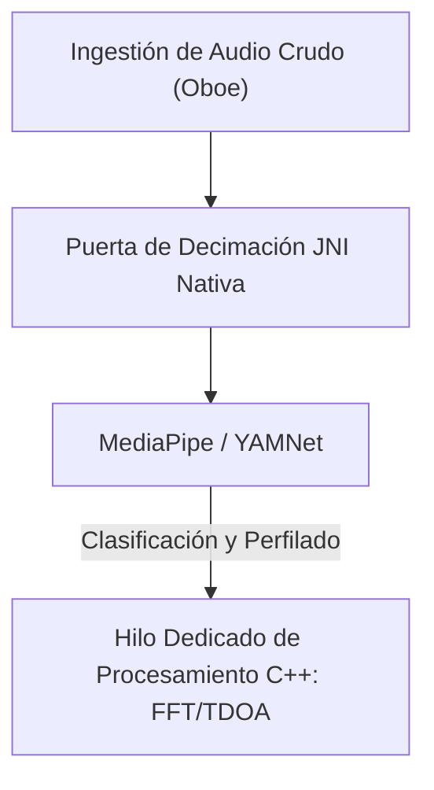

# VigilantEar 👂🛡️ (Edición para Android)

**Fecha de vigencia:** 6 de junio de 2026

**VigilantEar** es una herramienta de accesibilidad e investigación acústica avanzada de ultra alto rendimiento para Android, diseñada para proporcionar conciencia espacial y direccional en tiempo real a la comunidad de personas sordas y con problemas de audición (D/HH). El software tradicional de reconocimiento de sonido solo identifica *qué* es un sonido. **VigilantEar te dice dónde está, quién lo está haciendo y qué están diciendo.** Actúa como un radar táctico integral, combinando el aprendizaje automático computado en el borde con física acústica sofisticada para rastrear exactamente *dónde* se origina un sonido, su distancia estimada, la trayectoria absoluta de su ruta y las palabras traducidas y separadas de los hablantes individuales.

---

## 🌍 Alcance Global y Localización

Para apoyar a los usuarios de todo el mundo, la plataforma cuenta con una matriz de localización nativa completa que soporta:

- **Inglés (English)**
- **Español (Español)**
- **Portugués (Português)**
- **Chino (简体中文)**
- **Francés (Français)**
- **Alemán (Deutsch)**
- **Japonés (日本語)**
- **Árabe (العربية)**

Todas las superposiciones tácticas, las alertas HUD y los menús de preferencias se ajustan dinámicamente a las configuraciones regionales del sistema.

---

## 🚀 Características y Capacidades Clave

- **Control de Energía Inteligente y WakeLocks**: Para maximizar la duración de la batería y proteger los recursos del sistema, el sistema implementa un monitoreo en segundo plano condicional con WakeLocks fuertes y Servicios en Primer Plano. Si las categorías de alertas de emergencia están deshabilitadas, los bucles de ingestión del micrófono y los motores de procesamiento entran eficientemente en hibernación.
- **Simulación de Alerta Táctica**: Incluye una robusta suite de simulación en el dispositivo que permite a los usuarios probar firmas hápticas y respuestas visuales para pistas críticas de `.emergency` —Sirenas, Alarmas, Timbres, Personas Cercanas y Clima Severo (incluyendo fuentes de NWS, MeteoGate Europe y CMA/MEM China)— sin requerir disparadores acústicos del mundo real.
- **Rastreador de Múltiples Objetivos (MTT)**: Aísla y rastrea simultáneamente firmas de sonido ambiental independientes utilizando marcadores de sesión únicos combinados con mapeo de persistencia física, utilizando umbrales de refinamiento avanzados para un seguimiento continuo.
- **Integración con Shazam**: Identificación de música ambiental en tiempo real mapeada dinámicamente en el radar espacial.
- **HUD de Radar Acústico**: Un tablero táctico completamente en vivo que proporciona telemetría en tiempo real sobre la energía del sistema, la capacidad de la red, la latencia de procesamiento y FPS (Hz de análisis), junto con una cuadrícula direccional que rastrea objetivos acústicos ambientales por rumbo y energía.
- **Ajuste a Carreteras Geográficas**: Proyecta rumbos acústicos matemáticos relativos en coordenadas GPS globales, ajustando de forma inteligente los vectores de vehículos en tiempo real a calles verificadas.
- **Modo Orador (Subtítulos Direccionales en Vivo)**: Transcribe a las personas que hablan cerca de ti en filas de subtítulos, uno por voz. La diarización de hablantes en el dispositivo separa las voces con colores distintos y líneas de desplazamiento, acompañadas de flechas direccionales que apuntan a la ubicación del hablante.
- **Traducción en Vivo en el Dispositivo**: Transcribe y traduce el habla extranjera en tiempo real. Todo el proceso —escuchar, separar hablantes, transcribir y traducir— se ejecuta completamente en el dispositivo sin depender de la nube.

---

## 🧬 Arquitectura Principal y el Motor Matemático Neuronal

VigilantEar en Android utiliza una **Arquitectura SoundML Nativa** altamente optimizada, construida alrededor de procesamiento C++ y el motor de audio en tiempo real Oboe para asegurar la menor latencia posible en diverso hardware.

## ⚡ Desacoplamiento Arquitectónico

Para mantener un hilo de interfaz de usuario (UI) completamente desbloqueado mientras maneja continuamente una toma de entrada de alta frecuencia, la plataforma utiliza una separación estricta entre Kotlin y C++:

- **UI Kotlin / Servicio en Primer Plano**: Administra los ciclos de vida del servicio en primer plano, los permisos, el estado de orientación del dispositivo y las métricas de ubicación para controlar el HUD sin problemas.
- **AcousticEngine (C++ Nativo)**: Administra flujos de audio Oboe de bajo nivel y operaciones de hardware. Los búferes de ingestión se copian profundamente de forma directa en el hilo de la toma de alta prioridad, pasando instantáneas directamente a una cola de procesamiento nativa dedicada sin estancar la interfaz de usuario.

### 🧠 Tubería Acústica Avanzada

- **Arquitectura de Clasificador Dual**: Utiliza un clasificador principal delegado a NPU para perfiles de sonido críticos y de alta frecuencia, combinado con un ticker neuronal delegado a CPU para conciencia de sonido ambiental continuo. Las cargas de búfer de ML se monitorean activamente para acelerar dinámicamente las corrutinas de inferencia y evitar el retraso en la ingestión.
- **Física Aguda vs. de Banda Ancha**: Diferencia la lógica de seguimiento basada en la estructura del sonido. Los sonidos transitorios agudos (como aplausos y cristales rotos) se activan de forma nativa a través de estrictos algoritmos Pico (+16dB) y RMS (+3.5dB). Los sonidos de banda ancha (como música y vehículos) usan umbrales de confianza inferiores específicos (0.10f vs 0.25f) y se siembran de forma inteligente para garantizar la persistencia continua del seguimiento.
- **Restricciones y Refinamiento**: El rastreador agrupa sonidos idénticos dentro de un delta espacial de 25 grados y los descarta con precisión usando restricciones de `tailMemory` de `AppGlobals`. Las transmisiones de seguimiento a la UI se regulan cuidadosamente para evitar el drenaje de recursos.
- **Matemáticas Espaciales Paralelas**: Tuberías matemáticas de alto rendimiento (incluyendo cálculos de Diferencia de Tiempo de Llegada (TDOA), `kiss_fft` y algoritmos de seguimiento Doppler) se ejecutan completamente dentro de hilos asíncronos nativos dedicados.

### 📊 Puntos de Referencia de Rendimiento

- **Modo Activo**: Diseñado para ofrecer un seguimiento HUD en vivo completo de forma suave.
- **Recuperación de Hardware**: La sólida implementación de Oboe garantiza una recuperación automática en menos de un segundo de los cambios de ruta de audio (Bluetooth, auriculares, cambios de altavoz) sin descartar las sesiones de seguimiento.

---

## 🛠️ Pila Técnica (2026)

- **Lenguaje**: Kotlin (Corrutinas, Canales), C++ (JNI, Audio Nativo)
- **Marcos**: Android SDK, Jetpack Compose (UI), Oboe (Audio en Tiempo Real), MediaPipe / YAMNet
- **Línea Base de Hardware**: Dispositivos Android 10+ con alineación de micrófono estéreo compatible para precisión de rumbo TDOA.

---

## 📊 Barandillas de Privacidad y Seguridad

- **Aislamiento Local Primero**: Todas las clasificaciones de audio, matemáticas espectrales y proyecciones de rumbo ocurren exclusivamente en el dispositivo. Los flujos de audio crudo nunca se graban, almacenan en caché ni transmiten bajo ninguna condición.
- **Sin Telemetría o Diagnósticos Remotos**: VigilantEar está diseñado para operar completamente de forma local en tu dispositivo. No recopilamos, transmitimos ni almacenamos telemetría remota, registros de fallos, registros de diagnóstico o análisis de uso en nuestros servidores.

---

## ⚖️ Descargo de Responsabilidad

VigilantEar es una ayuda experimental de accesibilidad espacial e investigación acústica. No está certificado como una utilidad de seguridad de vida. La resolución del seguimiento puede fluctuar dinámicamente según la topología regional, el clima predominante, las condiciones del viento y la calibración del hardware del micrófono. Los usuarios siempre deben mantener una conciencia ambiental normal.

**Correo Electrónico de Contacto:** [vigilantear@wingdingssocial.com](mailto:vigilantear@wingdingssocial.com)

VigilantEar es una herramienta de accesibilidad construida con cuidado. Por favor, úsala con responsabilidad.

Hecho con ❤️ para la comunidad D/HH y la investigación acústica.

© 2026 Wingdings, Inc.  
Todos los derechos reservados.
