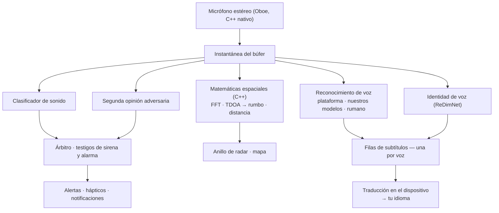

# Vigilant Ear 👂🛡️ (Android)

*Vigente desde Android 1.1.8 · septiembre de 2026.*

## Un radar acústico para quienes no pueden oír.

Una app hecha específicamente para la comunidad Sorda, con dificultad auditiva y CODA. La mayoría de las apps de reconocimiento de sonido te dicen *qué* es un sonido. **Vigilant Ear te dice dónde está, quién lo produce y qué están diciendo** — convierte un teléfono Android en una imagen en tiempo real del sonido a tu alrededor.

La dirección de una sirena. Un golpe detrás de ti. Las personas en una conversación, dibujadas como voces transcritas por separado. Si alguien habla un idioma que no lees, sus palabras pueden llegar **traducidas al tuyo, en el teléfono.**

Todo lo que importa corre en el dispositivo. El audio no se graba ni se sube para el reconocimiento. Nada depende de oír nada.

- 🧭 **Dirección, no solo detección.** *Qué, dónde* y *qué se dijo* — no simplemente “ocurrió un sonido.”
- 📣 **Name Called.** Lista tu nombre, el de un niño, el de tu pareja — “pedido para Marie listo” toca el teléfono, con la dirección cuando se pudo medir.
- 🔒 **Privado por diseño.** La clasificación, los subtítulos, la traducción y la identidad de voz corren en tu teléfono. Las voces nombradas están cifradas en este dispositivo y no hay ninguna vía de roster en la nube.
- 🌐 **Auto-Translate rumano.** Los subtítulos en rumano se pueden traducir en este teléfono, en el dispositivo.
- 👁️ **Hecho para Deaf / HoH / CODA.** Hápticos distintos por sonido, visuales de alto contraste, señales independientes del color, grandes zonas táctiles.

---

## Para quién es

- **Usuarios Sordos, con dificultad auditiva y CODA** que quieren conciencia situacional del sonido — el golpe, la alarma, la sirena, la persona cercana — que puedes dejar corriendo y en las que puedes confiar.
- Quien necesite **subtítulos en vivo con dirección y separación de hablantes**, o **traducción en el dispositivo** de las personas sentadas cerca.
- Usuarios de accesibilidad e investigación acústica interesados en la localización de sonido en el dispositivo.

> Vigilant Ear es una **ayuda** de accesibilidad, no un dispositivo certificado de seguridad vital.

---

## Lo que hace

### 🧭 Ve el sonido — dirección y distancia
Con los dos micrófonos del teléfono, Vigilant Ear mide el **ángulo desde el que llegó un sonido** y lo coloca como marcador en vivo en un anillo de radar orientado al rumbo y en un mapa. Las matemáticas son diferencia de tiempo de llegada (Time Difference of Arrival) ponderada por coherencia: favorece las bandas de frecuencia en las que ambos micrófonos coinciden y luego convierte el mínimo desfase de llegada en un rumbo. Dos micrófonos en una sola línea no pueden distinguir izquierda de derecha por sí solos, así que la lectura lleva esa ambigüedad con honestidad en lugar de inventar un lado.

**Qué tan bien funciona depende de tu teléfono exacto, y lo decimos.** Las matemáticas de rumbo necesitan la distancia real entre los dos micrófonos. Esa separación está **medida físicamente en tres dispositivos — Pixel 9, Pixel 9 Pro / Pro XL y Pixel 10a.** Cualquier otro modelo corre con una separación estimada a partir de la altura del cuerpo, que está cerca pero no medida, y la dirección es correspondientemente menos nítida. La lista está en el propio código fuente de la app y crece a medida que se miden dispositivos; preferimos nombrar los tres antes que insinuar quince.

La distancia es una estimación a partir del volumen, y se muestra como la estimación que es. La referencia de habitación silenciosa contra la que mide está **medida por dispositivo** en lugar de asumida — el teléfono aprende su propio suelo de ruido en vez de tomar prestada una constante.

### 🚨 Reconoce sonidos importantes — y te avisa
Un clasificador en el dispositivo identifica cientos de sonidos cotidianos y vigila los críticos — **sirenas, alarmas, timbres y golpes, un bebé llorando, una persona cercana y clima severo.** Corren dos clasificadores, no uno: uno principal y una segunda opinión adversaria, con un árbitro entre ellos, para que un fotograma malo de un solo modelo no sea una alerta. Las sirenas y las alarmas de humo reciben además una confirmación dedicada — el patrón T3 de un detector de humo es un ritmo concreto, no solo un pitido fuerte.

Cuando algo se dispara recibes una alerta en pantalla, una notificación y un **patrón de vibración distinto por sonido** — el recuento de pulsos sale del propio perfil del sonido, así que una alarma no se siente como un timbre a través del bolsillo.

Las advertencias de clima severo vienen de fuentes públicas oficiales — **NWS** de EE. UU., **MeteoGate** de Europa, **CMA** de China, **KMA** de Corea, **JMA** de Japón, **ECCC** de Canadá, **BOM** de Australia, **INMET** de Brasil e **NDMA** de India — gratuitas para todos los usuarios, y restringidas a las que cubren dónde estás. Las **alertas de terremoto** vienen del feed mundial de USGS: una confirmación de que lo que sentiste fue un temblor, no un aviso temprano.

### 💬 Speaker Mode — subtítulos en vivo *(gratis)*
Activa Speaker Mode y Vigilant Ear transcribe a las personas que hablan cerca de ti en filas de subtítulos. La identidad de voz en el dispositivo mantiene a los hablantes distintos y con código de color, a partir de huellas de voz que nunca salen del teléfono.

**Tres reconocedores, elegidos para ti.** La app usa el reconocedor de voz del propio teléfono para los idiomas que ya maneja, pasa a sus propios modelos para los que no, y lleva un modelo rumano dedicado para el idioma que ninguno de los dos puede. Eliges un idioma, no un motor.

La separación por voz está presente y mejorando. Trata las filas como *lo que se dijo cerca de ti*, con una pista fuerte de quién — no como un acta de quién lo dijo.

**Se puede enmascarar el lenguaje malsonante.** Actívalo y las palabrotas se sustituyen por símbolos, de modo que la frase se sigue leyendo sin la palabra. 🔴 **Esto tiene un límite real y no lo vamos a tapar:** el enmascarado lo hace el propio reconocedor de tu teléfono, así que solo se aplica a los idiomas que maneja ese reconocedor. Los idiomas subtitulados por nuestros modelos descargados llegan sin enmascarar, diga lo que diga el interruptor.

**Los subtítulos se ordenan, y en algunos teléfonos más que ordenarse.** Cada línea pasa por una limpieza determinista. En hardware reciente Pixel y Galaxy con Gemini Nano disponible, las líneas también reciben una pasada de corrección. Es una mejora y nunca una dependencia — nada de los subtítulos la exige, y la mayoría de los teléfonos no la ven.

### 🌐 Auto-Translate — tu idioma, en vivo *(Power Pack+)*
Cuando una persona cercana habla otro idioma, Vigilant Ear lo detecta y muestra sus subtítulos **en tu idioma**. La detección, la transcripción y la traducción corren todas en el dispositivo. No tienes que conocer ni elegir primero el otro idioma.

**El rumano está incluido.** La detección, los subtítulos y Auto-Translate lo manejan todos en este teléfono.

### 📣 Name Called
Vigila esos subtítulos en busca de los nombres que listas — el tuyo, el de un niño, el de tu pareja, el nombre que un mostrador llama para un pedido. Cuando se dice uno recibes una alerta, no un segundo globo de subtítulo, y la dirección de la que vino la voz **cuando esa dirección se midió de verdad**. La lista se guarda en el almacén de claves del dispositivo y nunca lo abandona.

### 🫧 Standing Watch y el retumbo profundo
**Standing Watch** es la condición propia de la habitación, siempre activo y sin nada que configurar: una lámpara constante mientras la habitación mantiene su patrón, un cambio cuando algo se mueve.

El **barómetro** del teléfono vigila las ondas de presión — clima, una puerta, un camión pesado — y las dibuja como un anillo suave que se expande desde donde estás. 🔴 **A propósito, sin dirección.** Un solo sensor de presión no puede decirte de qué lado vino una onda de presión, y un anillo que reclamara un rumbo estaría inventándolo.

### 📓 Witness Ear — un diario opcional de 24 horas
Desactivado por defecto. Mientras está encendido, lo que la app oyó y dónde permanece **en este teléfono** hasta un día, listo para exportar como un PDF simple. Un botón borra el registro al instante. Es lo único de la app que retiene algo, por eso está apagado hasta que lo eliges.

### 🔗 Remote Link — llega a alguien que no está contigo *(Power Pack+)*
Lo que normalmente haría una llamada de teléfono, hecho con vídeo y texto. Envías un código de invitación; la otra persona se une desde dentro de Vigilant Ear. No hay requisito de proximidad — los dos pueden estar en cualquier lugar. **No se usa audio en ningún momento,** así que nada del enlace depende de oír en ninguno de los extremos, y te da una forma de hablar en señas con alguien a través de la app. La app lleva el vídeo; los dos hacen el resto.

### 🎵 Music ID *(Power Pack+)*
Identifica la música que suena a tu alrededor y sigue los cambios de canción. Un detector de firma de croma se queda primero con la pregunta «¿hay música de verdad?», porque los clasificadores generales famosamente llaman «música» a habitaciones en silencio y a sirenas.

### 🪄 Feature Playground y un tour guiado
**Feature Playground** te deja practicar alertas y ver cómo se disparan las funciones sin esperar a lo real, siempre con marca de agua para que la práctica nunca finja ser un evento en vivo. Un **tour guiado** recorre el mapa, el HUD, el panel del engranaje, las preferencias y Power Pack+, y se puede repetir en cualquier momento desde el birrete.

### ♿ Accesibilidad primero
Hecho para usuarios Sordos / con dificultad auditiva / CODA y daltónicos: señales independientes del color, grandes zonas táctiles, alertas multimodales (háptico + visual + en pantalla), firmas de vibración por sonido y una pantalla de verificación al inicio que muestra exactamente qué permisos están concedidos, faltan o están rechazados.

---

## Gratis y Power Pack+

El núcleo de seguridad es **gratis, para siempre**:

- **Alertas de sonido** — sirenas, alarmas, golpes y timbres, llanto de bebé, persona cercana, con hápticos y notificaciones.
- **Subtítulos en vivo** — Speaker Mode, en el dispositivo, con separación de voces y enmascarado opcional del lenguaje malsonante.
- **Name Called** — nombres que escribes, alertados con dirección donde se midió.
- **Standing Watch** — la condición de la habitación, siempre activo.
- **Alertas de clima severo** — nueve fuentes nacionales oficiales para tu región.
- **Alertas de terremoto** — USGS, mundial.
- **Witness Ear** — el diario opcional de 24 horas y su exportación a PDF.
- **Feature Playground** y el tour guiado.

**Power Pack+** es un desbloqueo único — **no una suscripción** — con una prueba gratuita. En Android añade exactamente cuatro cosas:

- **Auto-Translate** — traducción en el dispositivo del habla cercana a tu idioma.
- **Music ID** — reconocimiento de canciones.
- **Remote Link** — alojar un enlace de vídeo y texto entre dos dispositivos.
- **Voces nombradas** — nombrar a las personas que la app oye, para que sus subtítulos lleven su nombre.

Antes de comprar, la app **sondea tu teléfono real** y te dice si cada una de estas cosas funcionará en él, funcionará despacio o no funcionará en absoluto. Preferimos perder la venta a cobrar por algo que este aparato no puede ejecutar.

Gratis o Power Pack+, **tu audio se queda en el dispositivo para el reconocimiento** — el nivel cambia qué funciones están desbloqueadas, nunca a dónde va el sonido.

---

## Cómo funciona

Captura una vez en un hilo de audio de alta prioridad, copia el búfer y lo reparte a especialistas que nunca se bloquean entre sí ni a la pantalla:

```mermaid
graph TD
    A["Micrófono estéreo (Oboe, C++ nativo)"] --> B["Instantánea del búfer"]
    B --> C["Clasificador de sonido"]
    B --> Y["Segunda opinión adversaria"]
    C --> S["Árbitro · testigos de sirena y alarma"]
    Y --> S
    S --> H["Alertas · hápticos · notificaciones"]
    B --> D["Matemáticas espaciales (C++)<br/>FFT · TDOA → rumbo · distancia"]
    D --> R["Anillo de radar · mapa"]
    B --> F["Reconocimiento de voz<br/>plataforma · nuestros modelos · rumano"]
    B --> E["Identidad de voz (ReDimNet)"]
    F --> G["Filas de subtítulos — una por voz"]
    E --> G
    G --> T["Traducción en el dispositivo<br/>→ tu idioma"]
```

- **Kotlin y C++, estrictamente separados.** Kotlin posee la pantalla, el servicio en primer plano, los permisos y la ubicación. Un motor nativo posee el micrófono y las matemáticas. Los búferes de audio se copian en el hilo de captura y se entregan a una cola nativa, así que la imagen nunca se entrecorta mientras el teléfono piensa.
- **La identificación de idioma es un modelo propio, no una conjetura.** La app usa el mismo modelo VoxLingua107 ECAPA en cada plataforma, así que todas responden “¿qué idioma es este?” del mismo modo.
- **El clima y los temblores toman el camino opuesto al audio.** Nada de tu sonido sale; los *datos* de alerta entran, a través de una pequeña caché que operamos, de modo que una sola descarga de los datos públicos sirve a cada usuario y tu teléfono nunca contacta el servidor de un gobierno extranjero de forma directa.

---

## Lo que hemos medido — y lo que no

No hemos publicado cifras de pruebas de escritorio en Android para rumbo y distancia. **Este documento no las va a inventar.**

La identificación de idioma ya se sustituyó una vez: el detector anterior, en una habitación, respondió *chino* ante habla rumana. Un idioma equivocado dicho con confianza significa el reconocedor equivocado, que significa subtítulos que son un sinsentido en silencio — peor para quien lee y no puede oír la habitación que no tener subtítulos.

**Aún no medido en Android:** la exactitud de rumbo frente a una cinta métrica, la exactitud de distancia frente a rangos conocidos, y la exactitud de separación de hablantes en una grabación real. Hasta que lo estén, trata la dirección como una buena indicación y la distancia como una estimación.

Los modelos de voz y de habla se descargan cuando los necesitas por primera vez, por Wi-Fi de preferencia. La app pregunta antes de bajar nada grande. Después de eso, el reconocimiento es sin conexión.

---

## Privacidad

- **En el dispositivo, siempre, para el pipeline principal.** La clasificación, las matemáticas espaciales, la transcripción, la identidad de voz y la traducción corren en tu teléfono. El audio en bruto nunca se graba, se pone en caché ni se transmite.
- **Las voces nombradas se quedan aquí.** Las huellas de voz se cifran con una clave guardada en Android Keystore que nunca sale del dispositivo. **No hay ninguna vía de roster en la nube.** Si se restablece el teléfono, las huellas son ilegibles y vuelves a inscribirte — que es el comportamiento correcto, no una limitación.
- **Los subtítulos son efímeros** salvo que actives Witness Ear a propósito, y ese diario es local, limitado a 24 horas y se borra con un botón.
- **Sin publicidad ni analítica de comportamiento.** El uso de red se limita a mapas, la caché pública de alertas, el reconocimiento opcional de canciones, el contexto vial y la facturación de Play.

Detalles completos: [PRIVACY.md](/es/privacy/) · [TERMS.md](/es/terms/) · [SUPPORT.md](/es/support/)

---

## Hardware

- **Android 13 o más reciente.**
- **Micrófonos estéreo** son necesarios para hallar la dirección; lo más nítido en los dispositivos cuya separación de micrófonos se ha medido físicamente.

---

## Localización

La interfaz, las alertas y los subtítulos están traducidos al **inglés, español, portugués (Brasil), francés, alemán, italiano, turco, árabe, japonés, chino simplificado, coreano, ruso e hindi** — 13 idiomas, según el idioma del sistema o una elección manual en la app. Los subtítulos en rumano y Auto-Translate funcionan en este build.

---

## Estado y advertencia

Vigilant Ear es una **ayuda experimental de accesibilidad acústica**, no una utilidad certificada de seguridad vital. La dirección y la distancia varían con el entorno, el clima, el viento y el hardware de los micrófonos. **Mantén siempre tu conciencia ambiental habitual** — no te bases en él como única fuente de información de seguridad.

---

**Contacto:** [vigilantear@wingdingssocial.com](mailto:vigilantear@wingdingssocial.com)

Hecho con ❤️ para la comunidad D/HH y la investigación acústica.

    
  <strong>© 2026 Wingdings, Inc.</strong> 
  All rights reserved. 
  Patent Pending

