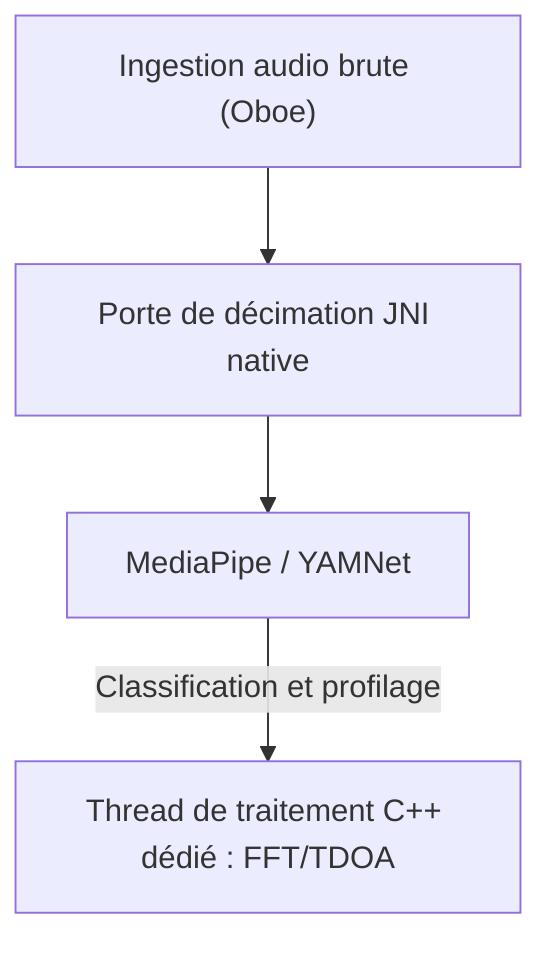

# VigilantEar 👂🛡️ (Édition Android)

**Date d'entrée en vigueur :** 6 Juin 2026

**VigilantEar** est un outil de recherche acoustique et d'accessibilité Android avancé et ultra-performant, conçu pour fournir une conscience directionnelle et spatiale en temps réel à la communauté sourde et malentendante (D/HH). Les logiciels de reconnaissance sonore traditionnels identifient uniquement *ce qu'est* un son ; VigilantEar agit comme un radar tactique complet, combinant l'apprentissage automatique calculé en périphérie (edge-computed machine learning) avec une physique acoustique sophistiquée pour suivre exactement *d'où* provient un son, sa distance estimée et sa trajectoire absolue.

---

## 🌍 Portée mondiale et localisation

Pour soutenir les utilisateurs du monde entier, la plateforme dispose d'une matrice de localisation native complète prenant en charge :

- **Anglais**
- **Espagnol (Español)**
- **Portugais (Português)**
- **Chinois (简体中文)**
- **Français**
- **Allemand (Deutsch)**
- **Japonais (日本語)**

Toutes les superpositions tactiques, les alertes HUD et les menus de préférences s'adaptent dynamiquement aux paramètres régionaux du système.

---

## 🚀 Fonctionnalités clés et capacités

- **Gestion intelligente de l'alimentation et WakeLocks** : Pour maximiser la longévité de la batterie et protéger les ressources du système, le système met en œuvre une surveillance d'arrière-plan conditionnelle avec des WakeLocks forts et des Services de premier plan (Foreground Services). Si les catégories d'alerte d'urgence sont désactivées, les boucles d'ingestion de microphone et les moteurs de traitement entrent efficacement en hibernation.
- **Simulation d'alerte tactique** : Comprend une suite de simulation robuste sur l'appareil permettant aux utilisateurs de tester les signatures haptiques et les réponses visuelles pour les pistes critiques `.emergency`—Sirènes, Alarmes, Sonnettes, Personnes à proximité, et Conditions météorologiques extrêmes (y compris les flux NWS, MeteoGate Europe et CMA/MEM Chine)—sans nécessiter de déclencheurs acoustiques réels.
- **Suivi multi-cibles (MTT)** : Isole et suit simultanément des signatures sonores environnementales indépendantes à l'aide de marqueurs de session uniques associés à une cartographie de persistance physique, en utilisant des seuils de raffinement avancés pour un suivi continu.
- **Intégration Shazam** : Identification musicale environnementale en temps réel cartographiée dynamiquement sur le radar spatial.
- **Accrochage géographique aux routes** : Projette des relèvements acoustiques mathématiques relatifs sur des coordonnées GPS mondiales, accrochant intelligemment les vecteurs de véhicules en temps réel aux rues vérifiées.

---

## 🧬 Architecture de base et moteur mathématique neuronal

VigilantEar sur Android utilise une **architecture Native SoundML** hautement optimisée, construite autour du traitement C++ et du moteur audio en temps réel Oboe pour garantir la latence la plus faible possible sur divers matériels.

## ⚡ Découplage architectural

Pour maintenir un thread d'interface utilisateur complètement non bloqué tout en gérant de manière continue une prise d'entrée à haute fréquence, la plateforme utilise une séparation stricte entre Kotlin et C++ :

- **Interface utilisateur Kotlin / Service de premier plan** : Gère les cycles de vie du service de premier plan, les permissions, l'état d'orientation de l'appareil et les métriques de localisation pour piloter le HUD en douceur.
- **AcousticEngine (C++ Natif)** : Gère les flux audio Oboe de bas niveau et les opérations matérielles. Les tampons d'ingestion sont copiés en profondeur directement sur le thread de prise (tap) à haute priorité, passant les instantanés directement à une file d'attente de traitement native dédiée sans bloquer l'interface utilisateur.

### 🧠 Pipeline acoustique avancé

- **Architecture à double classificateur** : Utilise un classificateur primaire délégué au NPU pour le profilage de sons critiques à haute fréquence, associé à un téléscripteur neuronal délégué au CPU pour une conscience continue des sons ambiants. Les charges de tampons ML sont activement surveillées pour modérer dynamiquement les coroutines d'inférence et éviter l'accumulation d'ingestion.
- **Physique aiguë vs large bande** : Différencie la logique de suivi en fonction de la structure sonore. Les sons transitoires aigus (comme les applaudissements et les bris de verre) sont déclenchés nativement via des algorithmes stricts de pic (+16dB) et RMS (+3,5dB). Les sons à large bande (comme la musique et les véhicules) utilisent des seuils de confiance spécifiques plus faibles (0,10f contre 0,25f) et sont intelligemment ensemencés pour garantir la persistance continue du suivi.
- **Contraintes et raffinement** : Le traqueur regroupe des sons identiques dans un delta spatial de 25 degrés et les fait vieillir précisément en utilisant les contraintes `tailMemory` d'`AppGlobals`. Les diffusions de suivi vers l'interface utilisateur sont soigneusement modérées pour éviter la consommation des ressources.
- **Mathématiques spatiales parallèles** : Des pipelines mathématiques haute performance (comprenant `kiss_fft`, les calculs de différence de temps d'arrivée (TDOA) et les algorithmes de suivi Doppler) s'exécutent entièrement au sein de threads asynchrones natifs dédiés.

### 📊 Références de performance (Benchmarks)

- **Mode Actif** : Conçu pour offrir en douceur un suivi HUD en direct complet.
- **Récupération matérielle** : L'implémentation robuste d'Oboe garantit une récupération automatique en moins d'une seconde après des changements d'itinéraire audio (Bluetooth, écouteurs, changements de haut-parleur) sans abandonner les sessions de suivi.

---

## 🛠️ Pile technique (2026)

- **Langage** : Kotlin (Coroutines, Channels), C++ (JNI, Audio natif)
- **Frameworks** : Android SDK, Jetpack Compose (UI), Oboe (Audio en temps réel), MediaPipe / YAMNet
- **Base matérielle** : Appareils Android 10+ avec alignement de microphone stéréo pris en charge pour la précision du relèvement TDOA.

---

## 📊 Garde-fous de confidentialité et de sécurité

- **Isolation "Local-First"** : Toutes les classifications audio, les mathématiques spectrales et les projections de relèvement se produisent exclusivement sur l'appareil. Les flux audio bruts ne sont jamais enregistrés, mis en cache ou transmis sous aucune condition.
- **Pas de télémétrie ni de diagnostics à distance** : VigilantEar est conçu pour fonctionner de manière entièrement locale sur votre appareil. Nous ne collectons, ne transmettons ni ne stockons aucune télémétrie à distance, journal de plantage, journal de diagnostic ou analyse d'utilisation sur nos serveurs.

---

## ⚖️ Avis de non-responsabilité

VigilantEar est une aide expérimentale à la recherche acoustique et à l'accessibilité spatiale. Ce n'est pas certifié comme un utilitaire de sécurité des personnes. La résolution du suivi peut fluctuer dynamiquement en fonction de la topologie régionale, de la météo dominante, des conditions de vent et de l'étalonnage du matériel de microphone. Les utilisateurs doivent toujours maintenir une conscience environnementale normale.

**Email de contact :** [vigilantear@wingdingssocial.com](mailto:vigilantear@wingdingssocial.com)

VigilantEar est un outil d'accessibilité construit avec soin. Veuillez l'utiliser de manière responsable.

Fait avec ❤️ pour la communauté D/HH et la recherche acoustique.

© 2026 Wingdings, Inc.  
Tous droits réservés.
