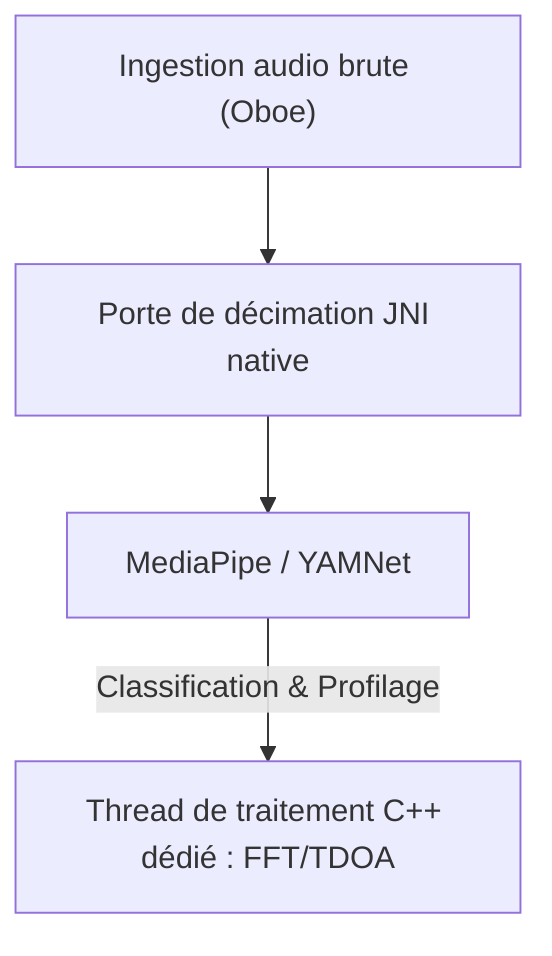

# VigilantEar 👂🛡️ (Édition Android)

**Date d'entrée en vigueur :** 6 juin 2026

**VigilantEar** est un outil de recherche acoustique et d'accessibilité Android avancé et à ultra-haute performance, conçu pour fournir une conscience directionnelle et spatiale en temps réel à la communauté sourde et malentendante. Les logiciels de reconnaissance sonore traditionnels identifient uniquement *ce* qu'est un son. **VigilantEar vous dit où il se trouve, qui le produit et ce qu'ils disent.** Il agit comme un radar tactique complet, combinant l'apprentissage automatique calculé en périphérie (edge-computing) avec une physique acoustique sophistiquée pour suivre exactement *d'où* provient un son, sa distance estimée, sa trajectoire absolue et les mots séparés et traduits des locuteurs individuels.

---

## 🌍 Portée mondiale et localisation

Pour soutenir les utilisateurs du monde entier, la plateforme dispose d'une matrice de localisation native complète prenant en charge :

- **Anglais**
- **Espagnol (Español)**
- **Portugais (Português)**
- **Chinois (简体中文)**
- **Français (Français)**
- **Allemand (Deutsch)**
- **Japonais (日本語)**
- **Arabe (العربية)**

Toutes les superpositions tactiques, les alertes HUD et les menus de préférences s'ajustent dynamiquement aux paramètres régionaux du système.

---

## 🚀 Fonctionnalités et capacités clés

- **Gestion intelligente de l'alimentation et WakeLocks :** Pour maximiser la longévité de la batterie et protéger les ressources du système, le système met en œuvre une surveillance conditionnelle en arrière-plan avec des WakeLocks et des services de premier plan (Foreground Services) robustes. Si les catégories d'alertes d'urgence sont désactivées, les boucles d'ingestion de microphone et les moteurs de traitement entrent efficacement en hibernation.
- **Simulation d'alerte tactique :** Comprend une suite de simulation robuste sur l'appareil permettant aux utilisateurs de tester les signatures haptiques et les réponses visuelles pour les pistes `.emergency` critiques — Sirènes, Alarmes, Sonnettes, Personnes à proximité et Météo violente (y compris les flux NWS, MeteoGate Europe et CMA/MEM Chine) — sans nécessiter de déclencheurs acoustiques réels.
- **Suivi multi-cibles (MTT) :** Isole et suit simultanément des signatures sonores environnementales indépendantes à l'aide de marqueurs de session uniques associés à une cartographie de persistance physique, en utilisant des seuils de raffinement avancés pour un suivi continu.
- **Intégration Shazam :** Identification de la musique environnementale en temps réel mappée dynamiquement sur le radar spatial.
- **HUD radar acoustique :** Un tableau de bord tactique entièrement en direct fournissant une télémétrie en temps réel sur la puissance du système, la capacité du réseau, la latence de traitement et les FPS (Hz d'analyse), aux côtés d'une grille directionnelle suivant les cibles acoustiques environnementales par gisement et énergie.
- **Accrochage routier géographique (Geographic Road Snapping) :** Projette des relèvements acoustiques mathématiques relatifs sur des coordonnées GPS mondiales, accrochant intelligemment les vecteurs de véhicules en temps réel aux rues vérifiées.
- **Mode haut-parleur (Sous-titres directionnels en direct) :** Transcrit les personnes qui parlent près de vous en lignes de sous-titres, une par voix. La diarisation des locuteurs sur l'appareil sépare les voix avec des couleurs distinctes et des lignes défilantes, accompagnées de flèches directionnelles pointant vers l'emplacement du locuteur.
- **Traduction en direct sur l'appareil :** Transcrit et traduit les discours étrangers en temps réel. L'ensemble du pipeline — audition, séparation des locuteurs, transcription et traduction — s'exécute entièrement sur l'appareil sans dépendance au cloud.

---

## 🧬 Architecture principale et le moteur mathématique neuronal (Neural Math Engine)

VigilantEar sur Android utilise une **architecture Native SoundML** hautement optimisée, construite autour du traitement C++ et du moteur audio en temps réel Oboe pour garantir la latence la plus faible possible sur divers matériels.

## ⚡ Découplage architectural

Pour maintenir un thread d'interface utilisateur (UI) complètement débloqué tout en gérant en continu une entrée haute fréquence, la plateforme utilise une séparation stricte entre Kotlin et C++ :

- **UI Kotlin / Service de premier plan :** Gère les cycles de vie des services de premier plan, les autorisations, l'état d'orientation de l'appareil et les métriques de localisation pour piloter le HUD en douceur.
- **AcousticEngine (C++ natif) :** Gère les flux audio Oboe de bas niveau et les opérations matérielles. Les tampons d'ingestion sont copiés en profondeur directement sur le thread d'entrée haute priorité, passant les instantanés directement à une file d'attente de traitement natif dédiée sans bloquer l'UI.

### 🧠 Pipeline acoustique avancé

- **Architecture à double classificateur :** Utilise un classificateur principal délégué au NPU pour le profilage critique des sons à haute fréquence, associé à un ticker neuronal délégué au CPU pour une conscience sonore ambiante continue. Les charges des tampons ML sont activement surveillées pour réguler dynamiquement les coroutines d'inférence et empêcher l'arriéré d'ingestion.
- **Physique aiguë vs large bande :** Différencie la logique de suivi en fonction de la structure du son. Les sons transitoires aigus (comme les applaudissements et les bris de verre) sont déclenchés nativement via des algorithmes stricts de crête (+16 dB) et RMS (+3,5 dB). Les sons à large bande (comme la musique et les véhicules) utilisent des seuils de confiance inférieurs spécifiques (0,10f vs 0,25f) et sont intelligemment ensemencés pour assurer une persistance de suivi continue.
- **Contraintes et raffinement :** Le tracker regroupe des sons identiques dans un delta spatial de 25 degrés et les fait vieillir précisément en utilisant les contraintes `tailMemory` d'`AppGlobals`. Les diffusions de suivi vers l'UI sont soigneusement régulées pour éviter l'épuisement des ressources.
- **Mathématiques spatiales parallèles :** Les pipelines mathématiques à haute performance (y compris `kiss_fft`, les calculs de différence de temps d'arrivée (TDOA) et les algorithmes de suivi Doppler) s'exécutent entièrement dans des threads asynchrones natifs dédiés.

### 📊 Références de performance

- **Mode actif :** Conçu pour offrir un suivi complet du HUD en direct en toute fluidité.
- **Récupération matérielle :** L'implémentation robuste d'Oboe garantit une récupération automatique en moins d'une seconde après des changements de routage audio (Bluetooth, écouteurs, changements de haut-parleur) sans interrompre les sessions de suivi.

---

## 🛠️ Pile technique (2026)

- **Langage :** Kotlin (Coroutines, Channels), C++ (JNI, Audio natif)
- **Frameworks :** SDK Android, Jetpack Compose (UI), Oboe (Audio en temps réel), MediaPipe / YAMNet
- **Base matérielle :** Appareils Android 10+ avec alignement de microphone stéréo pris en charge pour la précision du gisement TDOA.

---

## 📊 Garde-fous en matière de confidentialité et de sécurité

- **Isolement d'abord local (Local-First) :** Toutes les classifications audio, les mathématiques spectrales et les projections de relèvement se produisent exclusivement sur l'appareil. Les flux audio bruts ne sont jamais enregistrés, mis en cache ou transmis sous aucune condition.
- **Pas de télémétrie ou de diagnostic à distance :** VigilantEar est conçu pour fonctionner entièrement localement sur votre appareil. Nous ne collectons, ne transmettons ni ne stockons de télémétrie à distance, de journaux de plantage, d'enregistrements de diagnostic ou d'analyses d'utilisation sur nos serveurs.

---

## ⚖️ Avis de non-responsabilité

VigilantEar est une aide expérimentale à la recherche acoustique et à l'accessibilité spatiale. Il n'est pas certifié comme une utilité de sécurité vitale. La résolution de suivi peut fluctuer dynamiquement en fonction de la topologie régionale, de la météo dominante, des conditions de vent et de l'étalonnage du matériel de microphone. Les utilisateurs doivent toujours maintenir une conscience environnementale normale.

**E-mail de contact :** [vigilantear@wingdingssocial.com](mailto:vigilantear@wingdingssocial.com)

VigilantEar est un outil d'accessibilité conçu avec soin. Veuillez l'utiliser de manière responsable.

Fait avec ❤️ pour la communauté des sourds et malentendants et la recherche acoustique.

© 2026 Wingdings, Inc.  
Tous droits réservés.
