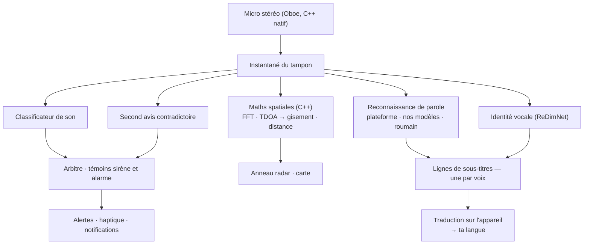

# Vigilant Ear 👂🛡️ (Android)

*En vigueur à compter d'Android 1.1.8 · septembre 2026.*

## Un radar acoustique pour les personnes qui n'entendent pas.

Une app faite spécifiquement pour la communauté sourde, malentendante et CODA. La plupart des apps de reconnaissance sonore te disent *ce qu'est* un son. **Vigilant Ear te dit où il est, qui le produit et ce qu'ils disent** — il transforme un téléphone Android en une image en temps réel du son autour de toi.

La direction d'une sirène. Un coup derrière toi. Les personnes d'une conversation, dessinées comme des voix transcrites séparées. Si quelqu'un parle une langue que tu ne lis pas, ses mots peuvent arriver **traduits dans la tienne, sur le téléphone.**

Tout ce qui compte s'exécute sur l'appareil. L'audio n'est ni enregistré ni envoyé pour la reconnaissance. Rien ne dépend d'entendre quoi que ce soit.

- 🧭 **La direction, pas seulement la détection.** *Quoi, où,* et *ce qui a été dit* — pas simplement « un son s'est produit ».
- 📣 **Name Called.** Inscris ton nom, celui d'un enfant, d'un partenaire — « commande pour Marie prête » fait vibrer le téléphone, avec la direction quand elle a pu être mesurée.
- 🔒 **Privé par conception.** Classification, sous-titrage, traduction et identité vocale s'exécutent sur ton téléphone. Les voix nommées sont chiffrées sur cet appareil et il n'y a aucun chemin de roster dans le cloud.
- 🌐 **Auto-Translate roumain.** Les sous-titres en roumain peuvent être traduits sur ce téléphone, sur l'appareil.
- 👁️ **Fait pour Deaf / HoH / CODA.** Retours haptiques distincts par son, visuels à fort contraste, indices indépendants de la couleur, grandes cibles d'appui.

---

## Pour qui

- **Les utilisateurs sourds, malentendants et CODA** qui veulent une conscience situationnelle du son — le coup, l'alarme, la sirène, la personne à proximité — que tu peux laisser tourner et auxquels tu peux faire confiance.
- Quiconque a besoin de **sous-titres en direct avec direction et séparation des locuteurs**, ou d'une **traduction sur l'appareil** des personnes assises à proximité.
- Les utilisateurs d'accessibilité et de recherche acoustique intéressés par la localisation sonore sur l'appareil.

> Vigilant Ear est une **aide** à l'accessibilité, pas un dispositif certifié de sécurité des personnes.

---

## Ce qu'elle fait

### 🧭 Elle voit le son — direction et distance
Avec les deux microphones du téléphone, Vigilant Ear mesure **l'angle d'où un son est arrivé** et le place comme marqueur en direct sur un anneau radar orienté selon le cap et sur une carte. Le calcul est une différence de temps d'arrivée (Time Difference of Arrival) pondérée par la cohérence : favoriser les bandes de fréquences sur lesquelles les deux microphones sont d'accord, puis transformer le minuscule décalage d'arrivée en un gisement. Deux microphones sur une même ligne ne peuvent pas, à eux seuls, distinguer la gauche de la droite, donc la lecture porte cette ambiguïté honnêtement plutôt que d'inventer un côté.

**La qualité dépend de ton téléphone exact, et on le dit.** Le calcul de gisement a besoin de la vraie distance entre les deux microphones. Cet écartement est **mesuré physiquement sur trois appareils — Pixel 9, Pixel 9 Pro / Pro XL et Pixel 10a.** Tout autre modèle tourne sur un écartement estimé d'après la hauteur du boîtier, proche mais non mesuré, et la direction est d'autant moins nette. La liste est dans le code source de l'app et s'allonge à mesure que des appareils sont mesurés ; on préfère nommer les trois plutôt que d'en laisser entendre quinze.

La distance est une estimation à partir du volume, et elle s'affiche comme l'estimation qu'elle est. La référence de pièce silencieuse contre laquelle elle mesure est **mesurée par appareil** plutôt que supposée — le téléphone apprend son propre plancher de bruit au lieu d'emprunter une constante.

### 🚨 Elle reconnaît les sons importants — et t'avertit
Un classificateur sur l'appareil identifie des centaines de sons du quotidien et surveille les sons critiques — **sirènes, alarmes, sonnettes et coups, un bébé qui pleure, une personne à proximité et la météo extrême.** Deux classificateurs tournent plutôt qu'un : un principal et un second avis contradictoire, avec un arbitre entre eux, pour qu'une mauvaise trame d'un seul modèle ne soit pas une alerte. Les sirènes et les alarmes incendie reçoivent en plus une confirmation dédiée — le motif T3 d'un détecteur de fumée est un rythme précis, pas seulement un bip fort.

Quand quelque chose se déclenche, tu reçois une alerte à l'écran, une notification et un **motif de vibration distinct par son** — le nombre d'impulsions vient du profil du son lui-même, donc une alarme ne se sent pas comme une sonnette à travers ta poche.

Les alertes météo extrême viennent de flux publics officiels — **NWS** des États-Unis, **MeteoGate** pour l'Europe, **CMA** de Chine, **KMA** de Corée, **JMA** du Japon, **ECCC** du Canada, **BOM** d'Australie, **INMET** du Brésil et **NDMA** de l'Inde — gratuits pour tous les utilisateurs, et restreints à ceux qui couvrent l'endroit où tu es. Les **alertes sismiques** viennent du flux mondial USGS : une confirmation que ce que tu as senti était un séisme, pas une alerte précoce.

### 💬 Speaker Mode — sous-titres en direct *(gratuit)*
Active Speaker Mode et Vigilant Ear transcrit les personnes qui parlent près de toi en lignes de sous-titres. L'identité vocale sur l'appareil garde les locuteurs distincts et colorés, à partir d'empreintes vocales qui ne quittent jamais le téléphone.

**Trois reconnaisseurs, choisis pour toi.** L'app utilise le reconnaisseur de parole de ton propre téléphone pour les langues qu'il gère déjà, bascule sur ses propres modèles pour celles qu'il ne gère pas, et emporte un modèle roumain dédié pour la langue qu'aucun des deux ne peut faire. Tu choisis une langue, pas un moteur.

La séparation par voix est présente et s'améliore. Traite les lignes comme *ce qui a été dit près de toi*, avec un indice fort de qui — pas comme un procès-verbal de qui l'a dit.

**Le langage cru peut être masqué.** Active-le et les jurons sont remplacés par des symboles, si bien que la phrase se lit encore sans le mot. 🔴 **Celui-ci a une vraie limite et on ne la maquillera pas :** le masquage, c'est le reconnaisseur de ton propre téléphone qui fait le travail, donc il ne s'applique qu'aux langues gérées par ce reconnaisseur. Les langues sous-titrées par nos propres modèles téléchargés arrivent non masquées, quoi que dise l'interrupteur.

**Les sous-titres sont nettoyés, et sur certains téléphones plus que nettoyés.** Chaque ligne passe par un nettoyage déterministe. Sur le matériel Pixel et Galaxy récent avec Gemini Nano disponible, les lignes reçoivent aussi une passe de relecture. C'est une amélioration et jamais une dépendance — rien des sous-titres ne l'exige, et la plupart des téléphones ne la voient jamais.

### 🌐 Auto-Translate — ta langue, en direct *(Power Pack+)*
Quand une personne à proximité parle une autre langue, Vigilant Ear la détecte et affiche ses sous-titres **dans ta langue**. Détection, transcription et traduction s'exécutent toutes sur l'appareil. Tu n'as pas à connaître ni à choisir l'autre langue d'abord.

**Le roumain est inclus.** Détection, sous-titres et Auto-Translate le gèrent tous sur ce téléphone.

### 📣 Name Called
Surveille ces sous-titres pour les noms que tu inscris — le tien, celui d'un enfant, d'un partenaire, le nom qu'un comptoir appelle pour une commande. Quand l'un est prononcé tu reçois une alerte, pas une deuxième bulle de sous-titre, et la direction d'où venait la voix **quand cette direction a vraiment été mesurée**. La liste est tenue dans le magasin de clés de l'appareil et ne le quitte jamais.

### 🫧 Standing Watch et le grondement profond
**Standing Watch** est l'état propre de la pièce, toujours allumé et sans rien à configurer : une lampe stable tant que la pièce tient son schéma, un changement quand quelque chose bouge.

Le **baromètre** du téléphone surveille les ondes de pression — météo, une porte, un camion lourd — et les dessine comme un anneau doux qui s'élargit depuis là où tu es. 🔴 **Délibérément sans direction dessus.** Un seul capteur de pression ne peut pas te dire de quel côté une onde de pression est venue, et un anneau qui prétendrait un gisement en inventerait un.

### 📓 Witness Ear — un journal optionnel de 24 heures
Désactivé par défaut. Tant qu'il est allumé, ce que l'app a entendu et où reste **sur ce téléphone** jusqu'à un jour, prêt à exporter en PDF simple. Un bouton efface le journal instantanément. C'est la seule chose dans l'app qui retient quoi que ce soit, c'est pourquoi c'est éteint jusqu'à ce que tu le choisisses.

### 🔗 Remote Link — joindre quelqu'un qui n'est pas avec toi *(Power Pack+)*
Ce qu'un appel téléphonique ferait normalement, fait avec de la vidéo et du texte. Tu envoies un code d'invitation ; l'autre personne rejoint depuis l'intérieur de Vigilant Ear. Il n'y a pas d'exigence de proximité — vous deux pouvez être n'importe où. **Aucun audio n'est utilisé à aucun moment,** donc rien de la liaison ne dépend de l'audition d'un bout ou de l'autre, et ça te donne un moyen de signer avec quelqu'un à travers l'app. L'app transporte la vidéo ; vous deux faites le reste.

### 🎵 Music ID *(Power Pack+)*
Identifie la musique qui joue autour de toi et suit les changements de chanson. Un détecteur de signature chroma possède d'abord la question « est-ce que de la musique joue vraiment ? », parce que les classificateurs généraux appellent célèbrement « musique » les pièces silencieuses et les sirènes.

### 🪄 Feature Playground et une visite guidée
**Feature Playground** te laisse t'entraîner aux alertes et voir les fonctions se déclencher sans attendre le vrai, toujours en filigrane pour que l'entraînement ne se fasse jamais passer pour un événement en direct. Une **visite guidée** parcourt la carte, le HUD, le panneau d'engrenage, les préférences et Power Pack+, rejouable à tout moment depuis la toque de diplôme.

### ♿ L'accessibilité d'abord
Fait pour les utilisateurs sourds / malentendants / CODA et daltoniens : indices indépendants de la couleur, grandes cibles d'appui, alertes multimodales (haptique + visuel + à l'écran), signatures de vibration par son, et un écran de vérification au démarrage qui montre exactement quelles permissions sont accordées, manquantes ou refusées.

---

## Gratuit et Power Pack+

Le cœur de la sécurité est **gratuit, pour toujours** :

- **Alertes sonores** — sirènes, alarmes, coups et sonnettes, pleurs de bébé, personne à proximité, avec haptique et notifications.
- **Sous-titres en direct** — Speaker Mode, sur l'appareil, avec séparation des voix et masquage optionnel du langage cru.
- **Name Called** — les noms que tu tapes, alertés avec la direction là où elle a été mesurée.
- **Standing Watch** — l'état de la pièce, toujours allumé.
- **Alertes météo extrême** — neuf flux nationaux officiels pour ta région.
- **Alertes sismiques** — USGS, monde entier.
- **Witness Ear** — le journal optionnel de 24 heures et son export PDF.
- **Feature Playground** et la visite guidée.

**Power Pack+** est un déblocage unique — **pas un abonnement** — avec un essai gratuit. Sur Android il ajoute exactement quatre choses :

- **Auto-Translate** — traduction sur l'appareil de la parole à proximité dans ta langue.
- **Music ID** — reconnaissance de chansons.
- **Remote Link** — héberger une liaison vidéo et texte entre deux appareils.
- **Voix nommées** — nommer les personnes que l'app entend, pour que leurs sous-titres portent leur nom.

Avant d'acheter, l'app **sonde ton téléphone réel** et te dit si chacune de ces choses fonctionnera dessus, fonctionnera lentement, ou ne fonctionnera pas du tout. On préfère perdre la vente plutôt que d'encaisser pour quelque chose que cet appareil ne peut pas faire tourner.

Gratuit ou Power Pack+, **ton audio reste sur l'appareil pour la reconnaissance** — le palier change quelles fonctions sont débloquées, jamais où va le son.

---

## Comment ça marche

Capturer une fois sur un thread audio haute priorité, copier le tampon, et le répartir vers des spécialistes qui ne se bloquent jamais entre eux ni l'écran :

```mermaid
graph TD
    A["Micro stéréo (Oboe, C++ natif)"] --> B["Instantané du tampon"]
    B --> C["Classificateur de son"]
    B --> Y["Second avis contradictoire"]
    C --> S["Arbitre · témoins sirène et alarme"]
    Y --> S
    S --> H["Alertes · haptique · notifications"]
    B --> D["Maths spatiales (C++)<br/>FFT · TDOA → gisement · distance"]
    D --> R["Anneau radar · carte"]
    B --> F["Reconnaissance de parole<br/>plateforme · nos modèles · roumain"]
    B --> E["Identité vocale (ReDimNet)"]
    F --> G["Lignes de sous-titres — une par voix"]
    E --> G
    G --> T["Traduction sur l'appareil<br/>→ ta langue"]
```

- **Kotlin et C++, strictement séparés.** Kotlin possède l'écran, le service de premier plan, les permissions et la localisation. Un moteur natif possède le microphone et les maths. Les tampons audio sont copiés sur le fil de capture et remis à une file native, donc l'image ne saccade jamais pendant que le téléphone réfléchit.
- **L'identification de langue est son propre modèle, pas une supposition.** L'app utilise le même modèle VoxLingua107 ECAPA sur chaque plateforme, donc elles répondent toutes « quelle langue est-ce ? » de la même façon.
- **La météo et les séismes prennent le chemin inverse de l'audio.** Rien de ton son ne sort ; les *données* d'alerte entrent, via un petit cache que nous opérons, donc une seule récupération des données publiques sert chaque utilisateur et ton téléphone ne contacte jamais directement le serveur d'un gouvernement étranger.

---

## Ce que nous avons mesuré — et ce que nous n'avons pas

Nous n'avons pas publié de chiffres de tests de bureau Android pour le gisement et la distance. **Ce document ne les inventera pas.**

L'identification de langue a déjà été remplacée une fois : le détecteur précédent, dans une pièce, a répondu *chinois* sur de la parole roumaine. Une langue fausse dite avec confiance, c'est le mauvais reconnaisseur, donc des sous-titres qui sont silencieusement du non-sens — pire pour un lecteur qui n'entend pas la pièce que pas de sous-titres du tout.

**Pas encore mesuré sur Android :** la précision de gisement contre un mètre ruban, la précision de distance contre des portées connues, et la précision de séparation des locuteurs sur un enregistrement réel. En attendant, traite la direction comme une bonne indication et la distance comme une estimation.

Les modèles de parole et de voix se téléchargent quand tu en as besoin pour la première fois, de préférence en Wi-Fi. L'app demande avant de tirer quoi que ce soit de lourd. Après ça, la reconnaissance est hors ligne.

---

## Confidentialité

- **Sur l'appareil, toujours, pour le pipeline principal.** Classification, maths spatiales, transcription, identité vocale et traduction s'exécutent sur ton téléphone. L'audio brut n'est jamais enregistré, mis en cache ni transmis.
- **Les voix nommées restent ici.** Les empreintes vocales sont chiffrées avec une clé tenue dans Android Keystore qui ne quitte jamais l'appareil. **Il n'y a aucun chemin de roster dans le cloud.** Si le téléphone est réinitialisé, les empreintes sont illisibles et tu t'enrôles à nouveau — c'est le comportement correct, pas une limitation.
- **Les sous-titres sont éphémères** sauf si tu allumes Witness Ear exprès, et ce journal est local, plafonné à 24 heures, et effacé d'un bouton.
- **Pas de publicité ni d'analytique comportementale.** L'usage réseau se limite aux cartes, au cache public d'alertes, à la reconnaissance optionnelle de chansons, au contexte routier et à la facturation Play.

Détails complets : [PRIVACY.md](PRIVACY.md) · [TERMS.md](TERMS.md) · [SUPPORT.md](SUPPORT.md)

---

## Matériel

- **Android 13 ou plus récent.**
- **Des microphones stéréo** sont nécessaires pour trouver la direction ; le plus net sur les appareils dont l'écartement des microphones a été mesuré physiquement.

---

## Localisation

L'interface, les alertes et les sous-titres sont traduits en **anglais, espagnol, portugais (Brésil), français, allemand, italien, turc, arabe, japonais, chinois simplifié, coréen, russe et hindi** — 13 langues, selon la langue du système ou un choix manuel dans l'app. Les sous-titres en roumain et Auto-Translate fonctionnent sur ce build.

---

## Statut et avertissement

Vigilant Ear est une **aide expérimentale d'accessibilité acoustique**, pas un utilitaire certifié de sécurité des personnes. La direction et la distance varient avec l'environnement, la météo, le vent et le matériel des microphones. **Garde toujours ta conscience environnementale habituelle** — ne t'y fie pas comme seule source d'information de sécurité.

---

**Contact :** [vigilantear@wingdingssocial.com](mailto:vigilantear@wingdingssocial.com)

Fait avec ❤️ pour la communauté D/HH et la recherche acoustique.

    
  <strong>© 2026 Wingdings, Inc.</strong> 
  All rights reserved. 
  Patent Pending

