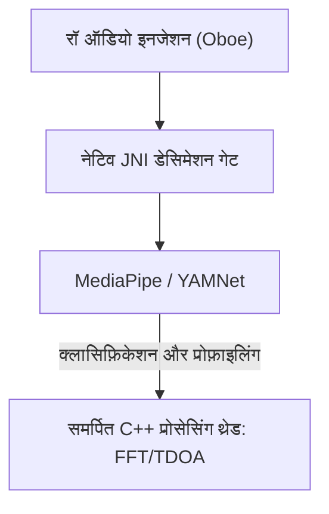

# Vigilant Ear 👂🛡️ (Android Edition)

**प्रभावी तिथि:** 6 जून, 2026

**Vigilant Ear** एक उन्नत, अल्ट्रा-हाई-परफ़ॉर्मेंस Android एकॉस्टिक रिसर्च और एक्सेसिबिलिटी टूल है, जो बधिर और कम सुनने वाले (Deaf/HoH/CODA) समुदाय के लिए रियल-टाइम दिशा और स्थानिक जागरूकता देने के लिए बनाया गया है। पारंपरिक साउंड रिकग्निशन सॉफ़्टवेयर सिर्फ़ बताता है कि साउंड *क्या* है। **Vigilant Ear बताता है कि वह कहाँ है, कौन बना रहा है, और वे क्या कह रहे हैं।** यह एक व्यापक टैक्टिकल रडार की तरह काम करता है — एज-कंप्यूटेड मशीन लर्निंग को परिष्कृत एकॉस्टिक फ़िज़िक्स के साथ जोड़कर ठीक बताता है कि साउंड *कहाँ* से आ रहा है, अनुमानित दूरी क्या है, उसका निरपेक्ष पथ प्रक्षेपवक्र क्या है, और अलग-अलग बोलने वालों के अलग किए गए, अनुवादित शब्द क्या हैं।

---

## 🌍 वैश्विक पहुँच और लोकलाइज़ेशन

दुनिया भर के उपयोगकर्ताओं के समर्थन के लिए प्लेटफ़ॉर्म में पूरा नेटिव लोकलाइज़ेशन मैट्रिक्स है, जो सपोर्ट करता है:

- **English**
- **Spanish (Español)**
- **Portuguese (Português)**
- **Chinese (简体中文)**
- **French (Français)**
- **German (Deutsch)**
- **Japanese (日本語)**
- **Arabic (العربية)**
- **Korean (한국어)**

सभी टैक्टिकल ओवरले, HUD अलर्ट और प्रेफ़रेंस मेनू सिस्टम लोकैल के अनुसार डायनामिक रूप से एडजस्ट होते हैं।

---

## 🚀 मुख्य फ़ीचर और क्षमताएँ

- **Smart Power Gating और WakeLocks**: बैटरी लंबी चलाने और सिस्टम संसाधन बचाने के लिए सिस्टम सशक्त WakeLocks और Foreground Services के साथ कंडीशनल बैकग्राउंड मॉनिटरिंग लागू करता है। अगर इमरजेंसी अलर्ट कैटेगरी बंद हों, तो माइक्रोफ़ोन इनजेशन लूप और प्रोसेसिंग इंजन कुशलता से हाइबरनेशन में चले जाते हैं।
- **Tactical Alert Simulation**: ऑन-डिवाइस सिम्यूलेशन सूट शामिल है जिससे उपयोगकर्ता महत्वपूर्ण `.emergency` ट्रैक्स — सायरन, अलार्म, डोरबेल, पास के लोग, और गंभीर मौसम (NWS, MeteoGate Europe, CMA/MEM China, KMA Korea, JMA Japan, और ECCC Canada फ़ीड सहित) — के हैप्टिक सिग्नेचर और विज़ुअल रिस्पॉन्स असली दुनिया के एकॉस्टिक ट्रिगर के बिना टेस्ट कर सकते हैं।
- **Multi-Target Tracker (MTT)**: यूनिक सेशन मार्कर और फ़िज़िकल पर्सिस्टेंस मैपिंग के साथ एक साथ कई स्वतंत्र पर्यावरणीय साउंड सिग्नेचर अलग करता और ट्रैक करता है; निरंतर ट्रैकिंग के लिए उन्नत रिफ़ाइनमेंट थ्रेशहोल्ड इस्तेमाल करता है।
- **Shazam Integration**: रियल-टाइम पर्यावरणीय संगीत पहचान, स्पेसियल रडार पर डायनामिक रूप से मैप।
- **Acoustic Radar HUD**: पूरी तरह लाइव टैक्टिकल डैशबोर्ड — सिस्टम पावर, नेटवर्क क्षमता, प्रोसेसिंग लेटेंसी और FPS (analysis Hz) का रियल-टाइम टेलीमेट्री, साथ ही बेयरिंग और एनर्जी से पर्यावरणीय एकॉस्टिक टारगेट ट्रैक करने वाला डायरेक्शनल ग्रिड।
- **Geographic Road Snapping**: सापेक्ष गणितीय एकॉस्टिक बेयरिंग को ग्लोबल GPS निर्देशांकों पर प्रोजेक्ट करता है, और रियल-टाइम वाहन वेक्टर को सत्यापित सड़कों पर समझदारी से स्नैप करता है।
- **Speaker Mode (Live Directional Captions)**: आपके पास बात कर रहे लोगों को कैप्शन पंक्तियों में ट्रांसक्राइब करता है — प्रति आवाज़ एक। ऑन-डिवाइस स्पीकर डायराइज़ेशन आवाज़ों को अलग रंग और स्क्रॉलिंग लाइनों से अलग करता है, साथ में स्पीकर की लोकेशन की तरफ़ डायरेक्शनल ऐरो।
- **Live On-Device Translation**: विदेशी भाषण को रियल-टाइम में ट्रांसक्राइब और अनुवाद करता है। पूरी पाइपलाइन — सुनना, स्पीकर अलग करना, ट्रांसक्राइब करना और अनुवाद — क्लाउड निर्भरता के बिना पूरी तरह डिवाइस पर चलती है।

---

## 🧬 कोर आर्किटेक्चर और Neural Math Engine

Android पर Vigilant Ear एक अच्छी तरह अनुकूलित **Native SoundML Architecture** इस्तेमाल करता है — C++ प्रोसेसिंग और Oboe रियल-टाइम ऑडियो इंजन के इर्द-गिर्द — ताकि विविध हार्डवेयर पर जितनी कम लेटेंसी हो सके उतनी मिले।

## ⚡ आर्किटेक्चरल डीकपलिंग

UI थ्रेड को पूरी तरह अनब्लॉक्ड रखते हुए हाई-फ़्रीक्वेंसी इनपुट टैप संभालने के लिए प्लेटफ़ॉर्म Kotlin और C++ के बीच सख़्त अलगाव रखता है:

- **Kotlin UI / Foreground Service**: फ़ोरग्राउंड सर्विस लाइफ़साइकल, अनुमतियाँ, डिवाइस ओरिएंटेशन स्टेट और लोकेशन मेट्रिक्स मैनेज करता है ताकि HUD स्मूथ चले।
- **AcousticEngine (Native C++)**: लो-लेवल Oboe ऑडियो स्ट्रीम और हार्डवेयर ऑपरेशन मैनेज करता है। इनजेशन बफ़र हाई-प्रायॉरिटी टैप थ्रेड पर सीधे डीप-कॉपी होते हैं, और स्नैपशॉट बिना UI रोके समर्पित नेटिव प्रोसेसिंग क्यू में जाते हैं।

### 🧠 उन्नत एकॉस्टिक पाइपलाइन

- **Dual-Classifier Architecture**: क्रिटिकल, हाई-फ़्रीक्वेंसी साउंड प्रोफ़ाइलिंग के लिए NPU-डेलिगेटेड प्राइमरी क्लासिफ़ायर, और निरंतर अम्बिएंट साउंड जागरूकता के लिए CPU-डेलिगेटेड न्यूरल टिकर। ML बफ़र लोड सक्रिय रूप से मॉनिटर होते हैं ताकि इनफ़रेंस कोरूटीन डायनामिक रूप से थ्रॉटल हों और इनजेशन बैकलॉग न बने।
- **Acute बनाम Broadband फ़िज़िक्स**: साउंड संरचना के आधार पर ट्रैकिंग लॉजिक अलग करता है। तीव्र ट्रांज़िएंट साउंड (जैसे ताली और काँच टूटना) सख़्त Peak (+16dB) और RMS (+3.5dB) एल्गोरिदम से नेटिवली ट्रिगर होते हैं। ब्रॉडबैंड साउंड (जैसे संगीत और वाहन) खास निचले कॉन्फ़िडेंस थ्रेशहोल्ड (0.10f बनाम 0.25f) इस्तेमाल करते हैं और निरंतर ट्रैकिंग पर्सिस्टेंस के लिए समझदारी से सीड होते हैं।
- **Constraints और Refinement**: ट्रैकर समान साउंड को 25-डिग्री स्पेसियल डेल्टा के भीतर ग्रुप करता है और `AppGlobals` के `tailMemory` कंस्ट्रेंट से ठीक उम्र बढ़ाकर हटाता है। UI को ट्रैकिंग ब्रॉडकास्ट संसाधन बचाने के लिए सावधानी से थ्रॉटल होते हैं।
- **Parallel Spatial Math**: हाई-परफ़ॉर्मेंस गणितीय पाइपलाइन (`kiss_fft`, Time Difference of Arrival (TDOA) गणना, और Doppler ट्रैकिंग एल्गोरिदम सहित) पूरी तरह समर्पित नेटिव असिंक्रोनस थ्रेड्स में चलती हैं।

### 📊 परफ़ॉर्मेंस बेंचमार्क

- **Active Mode**: व्यापक लाइव HUD ट्रैकिंग स्मूथ देने के लिए डिज़ाइन।
- **Hardware Recovery**: मज़बूत Oboe इम्प्लीमेंटेशन ऑडियो रूट बदलाव (Bluetooth, हेडफ़ोन, स्पीकर स्विच) से सब-सेकंड ऑटोमैटिक रिकवरी सुनिश्चित करता है — ट्रैकिंग सेशन गिराए बिना।

---

## 🛠️ टेक्निकल स्टैक (2026)

- **Language**: Kotlin (Coroutines, Channels), C++ (JNI, Native Audio)
- **Frameworks**: Android SDK, Jetpack Compose (UI), Oboe (Real-time Audio), MediaPipe / YAMNet
- **Hardware Baseline**: Android 10+ डिवाइस, TDOA बेयरिंग प्रिसिजन के लिए सपोर्टेड स्टीरियो माइक्रोफ़ोन अलाइनमेंट के साथ।

---

## 📊 प्राइवेसी और सुरक्षा गार्डरेल

- **Local-First Isolation**: सभी ऑडियो क्लासिफ़िकेशन, स्पेक्ट्रल मैथ और बेयरिंग प्रोजेक्शन सिर्फ़ ऑन-डिवाइस होते हैं। रॉ ऑडियो स्ट्रीम किसी भी हालत में रिकॉर्ड, कैश या ट्रांसमिट नहीं होतीं।
- **No Remote Telemetry or Diagnostics**: Vigilant Ear पूरी तरह आपके डिवाइस पर लोकल चलने के लिए डिज़ाइन है। हम अपने सर्वर पर कोई रिमोट टेलीमेट्री, क्रैश लॉग, डायग्नोस्टिक रिकॉर्ड या यूसेज एनालिटिक्स इकट्ठा, भेज या स्टोर नहीं करते।

---

## ⚖️ अस्वीकरण

Vigilant Ear एक प्रयोगात्मक एकॉस्टिक रिसर्च और स्पेसियल एक्सेसिबिलिटी सहायता है। यह लाइफ़-सेफ़्टी यूटिलिटी के रूप में प्रमाणित नहीं है। ट्रैकिंग रिज़ॉल्यूशन क्षेत्रीय टोपोलॉजी, मौसम, हवा और माइक्रोफ़ोन हार्डवेयर कैलिब्रेशन के अनुसार डायनामिक रूप से बदल सकता है। उपयोगकर्ताओं को हमेशा सामान्य पर्यावरणीय जागरूकता बनाए रखनी चाहिए।

**संपर्क ईमेल:** [vigilantear@wingdingssocial.com](mailto:vigilantear@wingdingssocial.com)

Vigilant Ear देखभाल से बनाया गया एक्सेसिबिलिटी टूल है। कृपया ज़िम्मेदारी से इस्तेमाल करें।

D/HH समुदाय और एकॉस्टिक रिसर्च के लिए ❤️ के साथ बनाया गया।

© 2026 Wingdings, Inc.  
All rights reserved.
