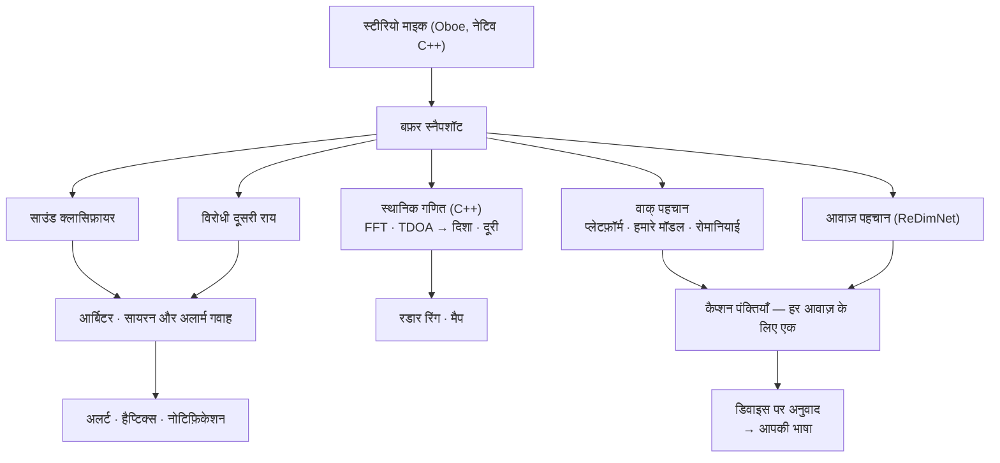

# Vigilant Ear 👂🛡️ (Android)

*Android 1.1.8 · सितंबर 2026 से प्रभावी।*

## जो सुन नहीं सकते, उनके लिए एक ध्वनिक रडार।

यह ऐप खास तौर पर बधिर, कम-सुनने वाले, और CODA समुदाय के लिए बना है। ज़्यादातर साउंड-रिकग्निशन ऐप सिर्फ़ बताते हैं कि *आवाज़ क्या है*। **Vigilant Ear बताता है कि वह कहाँ है, कौन कर रहा है, और क्या कह रहा है** — यानी एक Android फ़ोन को आपके आसपास की आवाज़ की रियल-टाइम तस्वीर बना देता है।

सायरन की दिशा। आपके पीछे की दस्तक। बातचीत में लोग अलग-अलग ट्रांसक्राइब्ड आवाज़ों के रूप में। अगर कोई ऐसी भाषा बोल रहा है जिसे आप नहीं पढ़ते, तो उनके शब्द **आपकी भाषा में अनुवादित, फ़ोन पर** आ सकते हैं।

जो चीज़ें मायने रखती हैं, वे सब डिवाइस पर ही चलती हैं। पहचान के लिए ऑडियो रिकॉर्ड या अपलोड नहीं होता। कुछ भी सुनने पर निर्भर नहीं करता।

- 🧭 **सिर्फ़ डिटेक्शन नहीं — दिशा।** *क्या, कहाँ* और *क्या कहा गया* — सिर्फ़ “कोई आवाज़ हुई” नहीं।
- 📣 **Name Called.** अपना नाम लिखें, एक बच्चे का, साथी का — “Marie का ऑर्डर तैयार” फ़ोन को टैप करता है, दिशा के साथ जब वह मापी जा सकी।
- 🔒 **डिजाइन से ही निजी।** क्लासिफ़िकेशन, कैप्शन, अनुवाद, और आवाज़ पहचान आपके फ़ोन पर चलते हैं। नाम दी गई आवाज़ें इस डिवाइस पर एन्क्रिप्ट हैं, और रोस्टर का कोई क्लाउड पथ नहीं है।
- 🌐 **रोमानियाई Auto-Translate.** रोमानियाई कैप्शन इस फ़ोन पर अनुवादित हो सकते हैं, डिवाइस पर।
- 👁️ **बधिर / कम-सुनने वाले / CODA के लिए बना।** हर आवाज़ के अलग हैप्टिक्स, हाई-कॉन्ट्रास्ट विज़ुअल्स, रंग-स्वतंत्र संकेत, बड़े टैप टारगेट।

---

## यह किसके लिए है

- **बधिर, कम-सुनने वाले, और CODA उपयोगकर्ता** जो आवाज़ की स्थितिगत जागरूकता चाहते हैं — दस्तक, अलार्म, सायरन, पास का व्यक्ति — जिसे चालू छोड़कर भरोसा किया जा सके।
- कोई भी जिसे **दिशा और स्पीकर सेपरेशन के साथ लाइव कैप्शन** चाहिए, या पास बैठे लोगों का **ऑन-डिवाइस अनुवाद**।
- एक्सेसिबिलिटी और ध्वनिक-शोध उपयोगकर्ता जो ऑन-डिवाइस साउंड लोकलाइज़ेशन में रुचि रखते हैं।

> Vigilant Ear एक एक्सेसिबिलिटी **सहायता** है, प्रमाणित जीवन-सुरक्षा डिवाइस नहीं।

---

## यह क्या करता है

### 🧭 यह आवाज़ देखता है — दिशा और दूरी
फ़ोन के दो माइक्रोफ़ोन से Vigilant Ear **उस कोण को मापता है जहाँ से आवाज़ आई**, और उसे हेडिंग-अप रडार रिंग और मैप पर लाइव मार्कर के रूप में रखता है। गणित कोहेरेंस-भारित Time Difference of Arrival है: जिन फ़्रीक्वेंसी बैंड पर दोनों माइक्रोफ़ोन सहमत हों उन्हें तरजीह देना, फिर उस छोटी आगमन-देरी को दिशा में बदलना। एक लाइन पर दो माइक्रोफ़ोन अपने आप बाएँ-दाएँ नहीं बता सकते, इसलिए रीडिंग यह अस्पष्टता ईमानदारी से रखती है, कोई तरफ़ गढ़ती नहीं।

**यह कितना अच्छा काम करता है, आपके ठीक-ठीक फ़ोन पर निर्भर करता है, और हम बताते हैं कौन सा।** दिशा के गणित को दोनों माइक्रोफ़ोन के बीच की असली दूरी चाहिए। वह अंतराल **तीन डिवाइस पर भौतिक रूप से मापा गया है — Pixel 9, Pixel 9 Pro / Pro XL, और Pixel 10a।** बाकी हर मॉडल बॉडी की ऊँचाई से अनुमानित अंतराल पर चलता है — क़रीब, पर मापा नहीं, और दिशा उसी हिसाब से कम तीखी। सूची ऐप के अपने स्रोत में है और डिवाइस मापे जाने पर बढ़ती है; पंद्रह का इशारा करने से बेहतर है तीन का नाम लेना।

दूरी लाउडनेस से अनुमान है, और उसी रूप में दिखाई जाती है जैसे वह है — एक अनुमान। शांत कमरे का संदर्भ जिसके ख़िलाफ़ माप होती है **हर डिवाइस पर मापा जाता है**, माना नहीं जाता — फ़ोन अपना शोर-फ़्लोर सीखता है, कोई नियतांक उधार नहीं लेता।

### 🚨 यह महत्वपूर्ण आवाज़ें पहचानता है — और आपको चेताता है
एक ऑन-डिवाइस क्लासिफ़ायर सैकड़ों रोज़मर्रा की आवाज़ें पहचानता है और महत्वपूर्ण वाली देखता है — **सायरन, अलार्म, डोरबेल और दस्तक, बच्चे का रोना, पास कोई व्यक्ति, और गंभीर मौसम।** एक नहीं, दो क्लासिफ़ायर चलते हैं: एक प्राथमिक और एक विरोधी दूसरी राय, बीच में एक आर्बिटर, ताकि एक मॉडल का खराब फ़्रेम अलर्ट न बन जाए। सायरन और स्मोक अलार्म इसके ऊपर अलग पुष्टि पाते हैं — स्मोक डिटेक्टर का T3 पैटर्न एक खास लय है, सिर्फ़ तेज़ बीप नहीं।

जब कोई अलर्ट चलता है, आपको ऑन-स्क्रीन अलर्ट, नोटिफ़िकेशन, और **हर आवाज़ का अलग कंपन पैटर्न** मिलता है — पल्स की गिनती आवाज़ की अपनी प्रोफ़ाइल से आती है, ताकि जेब में अलार्म डोरबेल जैसा न लगे।

गंभीर-मौसम चेतावनियाँ आधिकारिक सार्वजनिक फ़ीड से आती हैं — अमेरिका **NWS**, यूरोप **MeteoGate**, **चीन CMA**, **कोरिया KMA**, **जापान JMA**, **कनाडा ECCC**, **ऑस्ट्रेलिया BOM**, **ब्राज़ील INMET**, और **भारत NDMA** — सभी उपयोगकर्ताओं के लिए मुफ़्त, और आपके स्थान को कवर करने वाली तक सीमित। **भूकंप अलर्ट** USGS की दुनिया-भर फ़ीड से आते हैं: पुष्टि कि जो आपने महसूस किया वह भूकंप था, अर्ली वार्निंग नहीं।

### 💬 Speaker Mode — लाइव कैप्शन *(मुफ़्त)*
Speaker Mode चालू करें और Vigilant Ear पास बात कर रहे लोगों को कैप्शन पंक्तियों में ट्रांसक्राइब करता है। ऑन-डिवाइस आवाज़ पहचान स्पीकरों को अलग और रंग-कोडेड रखती है, उन वॉइसप्रिंट से जो फ़ोन नहीं छोड़ते।

**तीन रिकग्नाइज़र, आपके लिए चुने गए।** ऐप आपके फ़ोन के अपने वाक्-पहचान का इस्तेमाल उन भाषाओं के लिए करता है जिन्हें वह पहले से संभालता है, जिन भाषाओं को नहीं संभालता उनके लिए अपने मॉडल पर जाता है, और उस एक भाषा के लिए समर्पित रोमानियाई मॉडल रखता है जिसे दोनों नहीं कर सकते। आप भाषा चुनते हैं, इंजन नहीं।

आवाज़ के हिसाब से अलगाव मौजूद है और सुधर रहा है। पंक्तियों को *आपके पास क्या कहा गया* मानें, इस मज़बूत संकेत के साथ कि कौन — अदालती रिकॉर्ड नहीं कि किसने कहा।

**अपशब्द छिपाए जा सकते हैं।** चालू करें तो गाली प्रतीकों से बदल जाती है, ताकि वाक्य उस शब्द के बिना भी पढ़ा जा सके। 🔴 **इसकी एक असली सीमा है और हम उसे ढकेंगे नहीं:** मास्किंग आपके फ़ोन का अपना रिकग्नाइज़र करता है, इसलिए यह सिर्फ़ उन्हीं भाषाओं पर लागू होता है जिन्हें वह रिकग्नाइज़र संभालता है। हमारे डाउनलोड किए मॉडल से कैप्शन हुई भाषाएँ अनमास्क्ड आती हैं, स्विच कुछ भी कहे।

**कैप्शन साफ़ होते हैं, और कुछ फ़ोन पर साफ़ से ज़्यादा।** हर पंक्ति एक नियतात्मक सफ़ाई से गुज़रती है। हाल के Pixel और Galaxy हार्डवेयर पर जहाँ Gemini Nano उपलब्ध हो, पंक्तियों को प्रूफ़रीडिंग पास भी मिलता है। यह सुधार है, निर्भरता कभी नहीं — कैप्शन को इसकी ज़रूरत नहीं, और ज़्यादातर फ़ोन इसे देखते ही नहीं।

### 🌐 Auto-Translate — आपकी भाषा, लाइव *(Power Pack+)*
जब पास कोई व्यक्ति दूसरी भाषा बोलता है, Vigilant Ear उसे पहचानता है और उनके कैप्शन **आपकी भाषा में** दिखाता है। पहचान, ट्रांसक्रिप्शन और अनुवाद सब डिवाइस पर चलते हैं। आपको पहले दूसरी भाषा जानने या चुनने की ज़रूरत नहीं।

**रोमानियाई शामिल है।** पहचान, कैप्शन, और Auto-Translate सब इसे इस फ़ोन पर संभालते हैं।

### 📣 Name Called
उन कैप्शन में वे नाम देखता है जो आप लिखते हैं — अपना, बच्चे का, साथी का, वह नाम जो काउंटर ऑर्डर के लिए पुकारता है। जब कोई बोला जाता है, आपको एक अलर्ट मिलता है, दूसरा कैप्शन बुलबुला नहीं, और आवाज़ जिस दिशा से आई **जब वह दिशा वाकई मापी गई**। सूची डिवाइस के keystore में रहती है और उसे कभी नहीं छोड़ती।

### 🫧 Standing Watch और गहरी गड़गड़ाहट
**Standing Watch** कमरे की अपनी स्थिति है, हमेशा ऑन, कॉन्फ़िगर करने को कुछ नहीं: कमरा अपना पैटर्न रखे तो स्थिर लैंप, कुछ खिसके तो बदलाव।

फ़ोन का **बैरोमीटर** दबाव तरंगें देखता है — मौसम, एक दरवाज़ा, भारी ट्रक — और उन्हें एक नरम रिंग के रूप में खींचता है जो वहाँ से फैलती है जहाँ आप हैं। 🔴 **जान-बूझकर उस पर कोई दिशा नहीं।** एक दबाव सेंसर नहीं बता सकता कि दबाव तरंग किस तरफ़ से आई, और जो रिंग दिशा दावा करे वह गढ़ रही होती।

### 📓 Witness Ear — वैकल्पिक 24-घंटे जर्नल
डिफ़ॉल्ट रूप से बंद। जब चालू हो, ऐप ने जो सुना और कहाँ, वह **इस फ़ोन पर** एक दिन तक रहता है, सादे PDF के रूप में एक्सपोर्ट के लिए तैयार। एक बटन लॉग तुरंत मिटा देता है। ऐप में यही एक चीज़ कुछ रखती है, इसलिए यह बंद है जब तक आप इसे चुनें।

### 🔗 Remote Link — जो आपके साथ नहीं है, उस तक पहुँचें *(Power Pack+)*
जो काम आम तौर पर एक फ़ोन कॉल करती है, वही वीडियो और टेक्स्ट से। आप आमंत्रण कोड भेजते हैं; दूसरा व्यक्ति Vigilant Ear के भीतर से जुड़ता है। पास होने की कोई शर्त नहीं — आप दोनों कहीं भी हो सकते हैं। **किसी भी बिंदु पर ऑडियो का उपयोग नहीं होता,** इसलिए लिंक किसी भी छोर पर सुनने पर निर्भर नहीं करता, और इससे आप ऐप के ज़रिए किसी के साथ साइन लैंग्वेज में बात कर सकते हैं। ऐप वीडियो पहुँचाता है; बाक़ी आप दोनों करते हैं।

### 🎵 Music ID *(Power Pack+)*
आपके आसपास बजता म्यूज़िक पहचानता है और गाने के बदलाव ट्रैक करता है। एक क्रोमा सिग्नेचर डिटेक्टर पहले “क्या सच में म्यूज़िक बज रहा है?” का मालिक होता है, क्योंकि सामान्य क्लासिफ़ायर चुप कमरों और सायरन को मशहूर तौर पर “म्यूज़िक” कहते हैं।

### 🪄 Feature Playground और एक गाइडेड टूर
**Feature Playground** आपको अलर्ट का अभ्यास करने और फ़ीचर चलते देखने देता है बिना असली घटना का इंतज़ार किए, हमेशा वॉटरमार्क के साथ ताकि अभ्यास कभी लाइव इवेंट का नाटक न करे। एक **गाइडेड टूर** मैप, HUD, गियर पैनल, प्राथमिकताएँ और Power Pack+ घुमाता है, ग्रेजुएशन कैप से कभी भी दोहराया जा सकता है।

### ♿ एक्सेसिबिलिटी पहले
बधिर / कम-सुनने वाले / CODA और कलर-ब्लाइंड उपयोगकर्ताओं के लिए बना: रंग-स्वतंत्र संकेत, बड़े टैप टारगेट, मल्टीमॉडल अलर्ट (हैप्टिक + विज़ुअल + ऑन-स्क्रीन), हर आवाज़ के कंपन सिग्नेचर, और स्टार्टअप वेरिफ़िकेशन स्क्रीन जो ठीक बताती है कौन-सी अनुमतियाँ दी गई हैं, गायब हैं, या मना हैं।

---

## मुफ़्त और Power Pack+

सुरक्षा कोर **हमेशा के लिए मुफ़्त** है:

- **साउंड अलर्ट** — सायरन, अलार्म, दस्तक और डोरबेल, बच्चे का रोना, पास व्यक्ति, हैप्टिक्स और नोटिफ़िकेशन के साथ।
- **लाइव कैप्शन** — Speaker Mode, ऑन-डिवाइस, आवाज़ अलगाव और वैकल्पिक अपशब्द मास्किंग के साथ।
- **Name Called** — जो नाम आप टाइप करें, जहाँ दिशा मापी गई वहाँ दिशा के साथ अलर्ट।
- **Standing Watch** — कमरे की स्थिति, हमेशा ऑन।
- **गंभीर-मौसम अलर्ट** — आपके क्षेत्र के लिए नौ आधिकारिक राष्ट्रीय फ़ीड।
- **भूकंप अलर्ट** — USGS, दुनिया भर।
- **Witness Ear** — वैकल्पिक 24-घंटे जर्नल और उसका PDF एक्सपोर्ट।
- **Feature Playground** और गाइडेड टूर।

**Power Pack+** एक बार का अनलॉक है — **सब्सक्रिप्शन नहीं** — मुफ़्त ट्रायल के साथ। Android पर यह ठीक चार चीज़ें जोड़ता है:

- **Auto-Translate** — पास की बात का ऑन-डिवाइस अनुवाद आपकी भाषा में।
- **Music ID** — गाना पहचान।
- **Remote Link** — दो डिवाइस का वीडियो और टेक्स्ट लिंक होस्ट करना।
- **नाम दी गई आवाज़ें** — ऐप जिन लोगों को सुनता है उन्हें नाम देना, ताकि उनके कैप्शन उनका नाम ले जाएँ।

खरीदने से पहले ऐप **आपके असली फ़ोन की जाँच करता है** और बताता है कि इनमें से हर एक उस पर चलेगा, धीरे चलेगा, या बिलकुल नहीं चलेगा। हम बिक्री खोना बेहतर समझते हैं बजाय उस चीज़ के पैसे लेने के जो यह फ़ोन चला ही नहीं सकता।

मुफ़्त हो या Power Pack+, **पहचान के लिए आपका ऑडियो डिवाइस पर ही रहता है** — टियर सिर्फ़ बदलता है कि कौन से फ़ीचर अनलॉक हैं, कभी नहीं कि आवाज़ कहाँ जाती है।

---

## यह कैसे काम करता है

एक बार हाई-प्रायॉरिटी ऑडियो थ्रेड पर कैप्चर करें, बफ़र कॉपी करें, और विशेषज्ञों को बाँटें जो एक-दूसरे या स्क्रीन को कभी ब्लॉक न करें:

- **Kotlin और C++, सख़्त अलग।** Kotlin स्क्रीन, फ़ोरग्राउंड सर्विस, अनुमतियाँ और लोकेशन का मालिक है। एक नेटिव इंजन माइक्रोफ़ोन और गणित का मालिक है। ऑडियो बफ़र कैप्चर थ्रेड पर कॉपी होते हैं और नेटिव क्यू को दिए जाते हैं, ताकि फ़ोन सोचते समय तस्वीर न हिचके।
- **भाषा पहचान अपना मॉडल है, अंदाज़ा नहीं।** ऐप हर प्लेटफ़ॉर्म पर वही VoxLingua107 ECAPA मॉडल इस्तेमाल करता है, ताकि सब “यह कौन-सी भाषा है?” का जवाब एक जैसा दें।
- **मौसम और भूकंप ऑडियो के उल्टे रास्ते चलते हैं।** आपकी आवाज़ से कुछ बाहर नहीं जाता; अलर्ट *डेटा* अंदर आता है, एक छोटे कैश से जिसे हम चलाते हैं, ताकि सार्वजनिक डेटा की एक फ़ेच हर उपयोगकर्ता को मिले और आपका फ़ोन किसी विदेशी सरकार के सर्वर से सीधे कभी न जुड़े।

---

## हमने क्या मापा है — और क्या नहीं

हमने दिशा और दूरी के Android डेस्क-टेस्ट आँकड़े प्रकाशित नहीं किए। **यह दस्तावेज़ उन्हें गढ़ेगा नहीं।**

भाषा पहचान एक बार पहले ही बदली जा चुकी है: पिछला डिटेक्टर, एक कमरे में, रोमानियाई बोली पर *चीनी* बता बैठा। आत्मविश्वासी ग़लत भाषा मतलब ग़लत रिकग्नाइज़र, मतलब कैप्शन जो चुपचाप बेतुके हैं — कमरा न सुन पाने वाले पाठक के लिए कोई कैप्शन न होने से भी बुरा।

**Android पर अभी मापा नहीं:** टेप माप के ख़िलाफ़ दिशा की सटीकता, ज्ञात दूरियों के ख़िलाफ़ दूरी की सटीकता, और असली रिकॉर्डिंग पर स्पीकर-सेपरेशन की सटीकता। जब तक मापा न जाए, दिशा को अच्छा संकेत मानें और दूरी को अनुमान।

वाक् और आवाज़ मॉडल तब डाउनलोड होते हैं जब आपको पहली बार चाहिए, पसंद से Wi-Fi पर। ऐप कुछ बड़ा खींचने से पहले पूछता है। उसके बाद पहचान ऑफ़लाइन है।

---

## गोपनीयता

- **ऑन-डिवाइस, हमेशा, कोर पाइपलाइन के लिए।** क्लासिफ़िकेशन, स्थानिक गणित, ट्रांसक्रिप्शन, आवाज़ पहचान और अनुवाद आपके फ़ोन पर चलते हैं। रॉ ऑडियो कभी रिकॉर्ड, कैश, या भेजा नहीं जाता।
- **नाम दी गई आवाज़ें यहीं रहती हैं।** वॉइसप्रिंट एक कुंजी से एन्क्रिप्ट हैं जो Android Keystore में है और डिवाइस नहीं छोड़ती। **रोस्टर का कोई क्लाउड पथ नहीं है।** फ़ोन रीसेट हो तो वॉइसप्रिंट पढ़े नहीं जा सकते और आप फिर से नामांकन करते हैं — यही सही व्यवहार है, सीमा नहीं।
- **कैप्शन क्षणिक हैं** जब तक आप जान-बूझकर Witness Ear चालू न करें, और वह जर्नल लोकल है, 24 घंटे तक सीमित, और एक बटन से मिटता है।
- **कोई विज्ञापन या व्यवहार एनालिटिक्स नहीं।** नेटवर्क इस्तेमाल मैप, सार्वजनिक अलर्ट कैश, वैकल्पिक गाना पहचान, सड़क संदर्भ, और Play बिलिंग तक सीमित है।

पूरी जानकारी: [PRIVACY.md](PRIVACY.md) · [TERMS.md](TERMS.md) · [SUPPORT.md](SUPPORT.md)

---

## हार्डवेयर

- **Android 13 या नया।**
- **स्टीरियो माइक्रोफ़ोन** दिशा पता करने के लिए ज़रूरी हैं; सबसे तीखे उन डिवाइस पर जिनका माइक्रोफ़ोन अंतराल भौतिक रूप से मापा गया है।

---

## लोकलाइज़ेशन

इंटरफ़ेस, अलर्ट और कैप्शन **अंग्रेज़ी, स्पेनिश, पुर्तगाली (ब्राज़ील), फ़्रेंच, जर्मन, इतालवी, तुर्की, अरबी, जापानी, सरलीकृत चीनी, कोरियाई, रूसी और हिन्दी** में अनुवादित हैं — 13 भाषाएँ, आपकी सिस्टम भाषा या ऐप में मैन्युअल चुनाव के अनुसार। इस बिल्ड पर रोमानियाई कैप्शन और Auto-Translate काम करते हैं।

---

## स्थिति और अस्वीकरण

Vigilant Ear एक **प्रयोगात्मक ध्वनिक-एक्सेसिबिलिटी सहायता** है, प्रमाणित जीवन-सुरक्षा उपयोगिता नहीं। दिशा और दूरी आसपास, मौसम, हवा और माइक्रोफ़ोन हार्डवेयर के साथ बदलती हैं। **अपनी सामान्य पर्यावरण जागरूकता हमेशा बनाए रखें** — इसे सुरक्षा जानकारी का एकमात्र स्रोत न बनाएँ।

---

**संपर्क:** [vigilantear@wingdingssocial.com](mailto:vigilantear@wingdingssocial.com)

D/HH समुदाय और ध्वनिक शोध के लिए ❤️ से बनाया।

    
  <strong>© 2026 Wingdings, Inc.</strong> 
  All rights reserved. 
  Patent Pending

