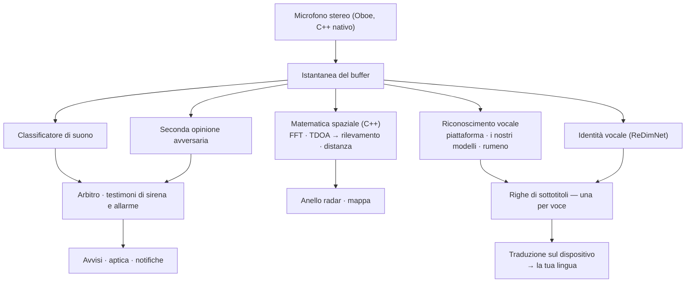

# Vigilant Ear 👂🛡️ (Android)

*In vigore da Android 1.1.8 · settembre 2026.*

## Un radar acustico per chi non può sentire.

Un'app fatta apposta per la comunità delle persone sorde, ipoudenti e CODA. La maggior parte delle app di riconoscimento dei suoni ti dice *che cos'è* un suono. **Vigilant Ear ti dice dov'è, chi lo sta producendo e che cosa sta dicendo** — trasformando un telefono Android in un'immagine in tempo reale del suono intorno a te.

La direzione di una sirena. Un colpo alle tue spalle. Le persone di una conversazione, disegnate come voci trascritte separate. Se qualcuno parla una lingua che non leggi, le sue parole possono arrivare **tradotte nella tua, sul telefono.**

Tutto ciò che conta viene eseguito sul dispositivo. L'audio non viene registrato né caricato per il riconoscimento. Nulla dipende dal sentire.

- 🧭 **Direzione, non solo rilevamento.** *Cosa, dove* e *che cosa è stato detto* — non semplicemente «si è verificato un suono».
- 📣 **Name Called.** Elenca il tuo nome, quello di un bambino, di un partner — «ordine per Marie pronto» fa vibrare il telefono, con la direzione quando è stato possibile misurarla.
- 🔒 **Privato fin dalla progettazione.** Classificazione, sottotitoli, traduzione e identità vocale vengono eseguiti sul tuo telefono. Le voci nominate sono cifrate su questo dispositivo e non c'è alcun percorso di roster nel cloud.
- 🌐 **Auto-Translate rumeno.** I sottotitoli in rumeno possono essere tradotti su questo telefono, sul dispositivo.
- 👁️ **Fatta per Deaf / HoH / CODA.** Feedback aptici distinti per suono, grafica ad alto contrasto, segnali indipendenti dal colore, ampie aree di tocco.

---

## A chi è rivolta

- **Utenti sordi, ipoudenti e CODA** che vogliono una consapevolezza situazionale del suono — il colpo, l'allarme, la sirena, la persona nelle vicinanze — che puoi lasciare in esecuzione e di cui ti puoi fidare.
- Chiunque abbia bisogno di **sottotitoli in diretta con direzione e separazione dei parlanti**, o della **traduzione sul dispositivo** delle persone sedute lì vicino.
- Utenti dell'accessibilità e della ricerca acustica interessati alla localizzazione dei suoni sul dispositivo.

> Vigilant Ear è un **ausilio** per l'accessibilità, non un dispositivo certificato per la sicurezza delle persone.

---

## Che cosa fa

### 🧭 Vede il suono — direzione e distanza
Usando i due microfoni del telefono, Vigilant Ear misura **l'angolo da cui è arrivato un suono** e lo colloca come marcatore in tempo reale su un anello radar orientato secondo la direzione e su una mappa. Il calcolo è la differenza di tempo di arrivo (Time Difference of Arrival) pesata sulla coerenza: favorire le bande di frequenza su cui entrambi i microfoni sono d'accordo, poi trasformare il minuscolo ritardo di arrivo in un rilevamento. Due microfoni su una sola linea non possono da soli distinguere sinistra e destra, quindi la lettura porta quell'ambiguità con onestà invece di inventare un lato.

**Quanto bene funziona dipende dal tuo telefono esatto, e lo diciamo.** Il calcolo del rilevamento ha bisogno della vera distanza tra i due microfoni. Quella spaziatura è **misurata fisicamente su tre dispositivi — Pixel 9, Pixel 9 Pro / Pro XL e Pixel 10a.** Ogni altro modello gira su una spaziatura stimata dall'altezza del corpo, vicina ma non misurata, e la direzione è di conseguenza meno nitida. L'elenco è nel codice sorgente dell'app e cresce man mano che i dispositivi vengono misurati; preferiamo nominare i tre piuttosto che implicarne quindici.

La distanza è una stima dal volume, e viene mostrata come la stima che è. Il riferimento di stanza silenziosa rispetto al quale misura è **misurato per dispositivo** invece che assunto — il telefono impara il proprio pavimento di rumore invece di prendere in prestito una costante.

### 🚨 Riconosce i suoni importanti — e ti avvisa
Un classificatore sul dispositivo identifica centinaia di suoni quotidiani e sorveglia quelli critici — **sirene, allarmi, campanelli e bussate, un bambino che piange, una persona nelle vicinanze e maltempo estremo.** Girano due classificatori, non uno: uno primario e una seconda opinione avversaria, con un arbitro tra loro, così che un fotogramma cattivo di un solo modello non sia un avviso. Sirene e allarmi antincendio ricevono in più una conferma dedicata — il pattern T3 di un rivelatore di fumo è un ritmo specifico, non solo un beep forte.

Quando qualcosa scatta ricevi un avviso a schermo, una notifica e un **pattern di vibrazione distinto per suono** — il conteggio degli impulsi viene dal profilo del suono stesso, così un allarme non si sente come un campanello attraverso la tasca.

Gli avvisi di maltempo estremo arrivano da feed pubblici ufficiali — **NWS** degli Stati Uniti, **MeteoGate** per l'Europa, **CMA** della Cina, **KMA** della Corea, **JMA** del Giappone, **ECCC** del Canada, **BOM** dell'Australia, **INMET** del Brasile e **NDMA** dell'India — gratuiti per tutti gli utenti, e ristretti a quelli che coprono dove ti trovi. Gli **avvisi sismici** arrivano dal feed mondiale USGS: una conferma che ciò che hai sentito era un terremoto, non un allarme preventivo.

### 💬 Speaker Mode — sottotitoli in diretta *(gratis)*
Attiva Speaker Mode e Vigilant Ear trascrive le persone che parlano vicino a te in righe di sottotitoli. L'identità vocale sul dispositivo tiene i parlanti distinti e con codice colore, da impronte vocali che non lasciano mai il telefono.

**Tre riconoscitori, scelti per te.** L'app usa il riconoscitore vocale del tuo stesso telefono per le lingue che già gestisce, passa ai propri modelli per quelle che non gestisce, e porta un modello rumeno dedicato per la lingua che nessuno dei due può fare. Scegli una lingua, non un motore.

La separazione per voce è presente e in miglioramento. Tratta le righe come *ciò che è stato detto vicino a te*, con un indizio forte di chi — non come un verbale di chi l'ha detto.

**Il linguaggio volgare può essere mascherato.** Attivalo e le parolacce vengono sostituite da simboli, così la frase si legge comunque senza la parola. 🔴 **Questo ha un limite reale e non lo copriremo:** il mascheramento lo fa il riconoscitore del tuo stesso telefono, quindi si applica solo alle lingue gestite da quel riconoscitore. Le lingue sottotitolate dai nostri modelli scaricati arrivano non mascherate, qualunque cosa dica l'interruttore.

**I sottotitoli vengono ripuliti, e su alcuni telefoni più che ripuliti.** Ogni riga passa da una pulizia deterministica. Su hardware Pixel e Galaxy recente con Gemini Nano disponibile, le righe ricevono anche un passaggio di correzione. È un miglioramento e mai una dipendenza — nulla dei sottotitoli lo richiede, e la maggior parte dei telefoni non lo vede.

### 🌐 Auto-Translate — la tua lingua, in diretta *(Power Pack+)*
Quando una persona vicina parla un'altra lingua, Vigilant Ear la rileva e mostra i suoi sottotitoli **nella tua lingua**. Rilevamento, trascrizione e traduzione girano tutti sul dispositivo. Non devi conoscere né scegliere prima l'altra lingua.

**Il rumeno è incluso.** Rilevamento, sottotitoli e Auto-Translate lo gestiscono tutti su questo telefono.

### 📣 Name Called
Sorveglia quei sottotitoli per i nomi che elenchi — il tuo, quello di un bambino, di un partner, il nome che un bancone chiama per un ordine. Quando uno viene pronunciato ricevi un avviso, non un secondo fumetto di sottotitolo, e la direzione da cui veniva la voce **quando quella direzione è stata davvero misurata**. L'elenco è tenuto nel keystore del dispositivo e non lo lascia mai.

### 🫧 Standing Watch e il rombo profondo
**Standing Watch** è la condizione propria della stanza, sempre acceso e senza nulla da configurare: una lampada costante finché la stanza tiene il suo schema, un cambiamento quando qualcosa si sposta.

Il **barometro** del telefono sorveglia le onde di pressione — meteo, una porta, un camion pesante — e le disegna come un anello morbido che si espande da dove sei. 🔴 **Di proposito senza direzione sopra.** Un solo sensore di pressione non può dirti da che parte è venuta un'onda di pressione, e un anello che pretendesse un rilevamento ne inventerebbe uno.

### 📓 Witness Ear — un diario opzionale di 24 ore
Disattivato per impostazione predefinita. Mentre è acceso, ciò che l'app ha sentito e dove resta **su questo telefono** fino a un giorno, pronto da esportare come PDF semplice. Un pulsante cancella il registro all'istante. È l'unica cosa nell'app che trattiene qualcosa, ed è per questo che è spento finché non lo scegli.

### 🔗 Remote Link — raggiungi qualcuno che non è con te *(Power Pack+)*
Quello che di solito farebbe una telefonata, fatto con video e testo. Invii un codice di invito; l'altra persona entra da dentro Vigilant Ear. Non c'è requisito di prossimità — potete essere ovunque. **In nessun momento viene usato l'audio,** quindi nulla del collegamento dipende dall'udito a nessuna delle due estremità, e ti dà un modo per comunicare in lingua dei segni con qualcuno attraverso l'app. L'app trasporta il video; voi due fate il resto.

### 🎵 Music ID *(Power Pack+)*
Identifica la musica che suona intorno a te e segue i cambi di brano. Un rivelatore di firma chroma possiede per primo la domanda «sta suonando davvero della musica?», perché i classificatori generali chiamano famosamente «musica» le stanze silenziose e le sirene.

### 🪄 Feature Playground e un tour guidato
**Feature Playground** ti lascia esercitarti con gli avvisi e vedere le funzioni scattare senza aspettare la cosa vera, sempre con filigrana perché l'esercitazione non si spacci mai per un evento in diretta. Un **tour guidato** percorre la mappa, l'HUD, il pannello dell'ingranaggio, le preferenze e Power Pack+, ripetibile in qualsiasi momento dal tocco di laurea.

### ♿ Accessibilità prima di tutto
Fatta per utenti sordi / ipoudenti / CODA e daltonici: segnali indipendenti dal colore, ampie aree di tocco, avvisi multimodali (aptico + visivo + a schermo), firme di vibrazione per suono, e una schermata di verifica all'avvio che mostra esattamente quali permessi sono concessi, mancanti o rifiutati.

---

## Gratis e Power Pack+

Il nucleo di sicurezza è **gratuito, per sempre**:

- **Avvisi sonori** — sirene, allarmi, bussate e campanelli, pianto di bambino, persona nelle vicinanze, con aptica e notifiche.
- **Sottotitoli in diretta** — Speaker Mode, sul dispositivo, con separazione delle voci e mascheramento opzionale del linguaggio volgare.
- **Name Called** — i nomi che digiti, avvisati con la direzione dove è stata misurata.
- **Standing Watch** — la condizione della stanza, sempre acceso.
- **Avvisi di maltempo estremo** — nove feed nazionali ufficiali per la tua regione.
- **Avvisi sismici** — USGS, in tutto il mondo.
- **Witness Ear** — il diario opzionale di 24 ore e la sua esportazione PDF.
- **Feature Playground** e il tour guidato.

**Power Pack+** è uno sblocco una tantum — **non un abbonamento** — con una prova gratuita. Su Android aggiunge esattamente quattro cose:

- **Auto-Translate** — traduzione sul dispositivo del parlato vicino nella tua lingua.
- **Music ID** — riconoscimento dei brani.
- **Remote Link** — ospitare un collegamento video e testo tra due dispositivi.
- **Voci nominate** — dare un nome alle persone che l'app sente, così i loro sottotitoli portano il loro nome.

Prima di comprare, l'app **sonda il tuo telefono reale** e ti dice se ciascuna di queste cose funzionerà su di esso, funzionerà lentamente, o non funzionerà affatto. Preferiamo perdere la vendita piuttosto che prendere soldi per qualcosa che questo apparecchio non può eseguire.

Gratis o Power Pack+, **il tuo audio resta sul dispositivo per il riconoscimento** — il livello cambia quali funzioni sono sbloccate, mai dove va il suono.

---

## Come funziona

Cattura una volta su un thread audio ad alta priorità, copia il buffer e lo distribuisce a specialisti che non si bloccano mai l'un l'altro né lo schermo:

- **Kotlin e C++, strettamente separati.** Kotlin possiede lo schermo, il servizio in primo piano, i permessi e la posizione. Un motore nativo possiede il microfono e la matematica. I buffer audio vengono copiati sul thread di cattura e consegnati a una coda nativa, così l'immagine non va mai a scatti mentre il telefono pensa.
- **L'identificazione della lingua è un modello proprio, non un'ipotesi.** L'app usa lo stesso modello VoxLingua107 ECAPA su ogni piattaforma, così tutte rispondono «che lingua è questa?» allo stesso modo.
- **Meteo e terremoti prendono il percorso opposto rispetto all'audio.** Nulla del tuo suono esce; i *dati* di avviso entrano, attraverso una piccola cache che operiamo, così un solo prelievo dei dati pubblici serve ogni utente e il tuo telefono non contatta mai direttamente il server di un governo straniero.

---

## Ciò che abbiamo misurato — e ciò che no

Non abbiamo pubblicato cifre di test da scrivania Android per rilevamento e distanza. **Questo documento non le inventerà.**

L'identificazione della lingua è già stata sostituita una volta: il rivelatore precedente, in una stanza, ha risposto *cinese* su parlato rumeno. Una lingua sbagliata detta con sicurezza significa il riconoscitore sbagliato, che significa sottotitoli che sono silenziosamente un non senso — peggio per un lettore che non può sentire la stanza che nessun sottotitolo.

**Non ancora misurato su Android:** l'accuratezza del rilevamento rispetto a un metro a nastro, l'accuratezza della distanza rispetto a gittate note, e l'accuratezza della separazione dei parlanti su una registrazione reale. Finché non lo sono, tratta la direzione come una buona indicazione e la distanza come una stima.

I modelli di parlato e di voce si scaricano quando ti servono la prima volta, di preferenza su Wi-Fi. L'app chiede prima di scaricare qualsiasi cosa di grosso. Dopo di che, il riconoscimento è offline.

---

## Privacy

- **Sul dispositivo, sempre, per la pipeline principale.** Classificazione, matematica spaziale, trascrizione, identità vocale e traduzione vengono eseguiti sul tuo telefono. L'audio grezzo non viene mai registrato, messo in cache o trasmesso.
- **Le voci nominate restano qui.** Le impronte vocali sono cifrate con una chiave tenuta in Android Keystore che non lascia mai il dispositivo. **Non c'è alcun percorso di roster nel cloud.** Se il telefono viene reimpostato, le impronte sono illeggibili e ti reiscrivi — che è il comportamento corretto, non una limitazione.
- **I sottotitoli sono effimeri** a meno che tu non accenda di proposito Witness Ear, e quel diario è locale, limitato a 24 ore, e cancellato con un pulsante.
- **Niente pubblicità né analitica comportamentale.** L'uso della rete è limitato a mappe, alla cache pubblica degli avvisi, al riconoscimento opzionale dei brani, al contesto stradale e alla fatturazione Play.

Dettagli completi: [PRIVACY.md](PRIVACY.md) · [TERMS.md](TERMS.md) · [SUPPORT.md](SUPPORT.md)

---

## Hardware

- **Android 13 o più recente.**
- **I microfoni stereo** sono necessari per trovare la direzione; i più nitidi sui dispositivi la cui spaziatura dei microfoni è stata misurata fisicamente.

---

## Localizzazione

Interfaccia, avvisi e sottotitoli sono tradotti in **inglese, spagnolo, portoghese (Brasile), francese, tedesco, italiano, turco, arabo, giapponese, cinese semplificato, coreano, russo e hindi** — 13 lingue, secondo la lingua di sistema o una scelta manuale nell'app. I sottotitoli in rumeno e Auto-Translate funzionano su questo build.

---

## Stato e avvertenza

Vigilant Ear è un **ausilio sperimentale di accessibilità acustica**, non un'utilità certificata per la sicurezza delle persone. Direzione e distanza variano con l'ambiente, il meteo, il vento e l'hardware dei microfoni. **Mantieni sempre la tua consueta consapevolezza ambientale** — non fare affidamento su di esso come unica fonte di informazioni di sicurezza.

---

**Contatto:** [vigilantear@wingdingssocial.com](mailto:vigilantear@wingdingssocial.com)

Fatto con ❤️ per la comunità D/HH e la ricerca acustica.

    
  <strong>© 2026 Wingdings, Inc.</strong> 
  All rights reserved. 
  Patent Pending

