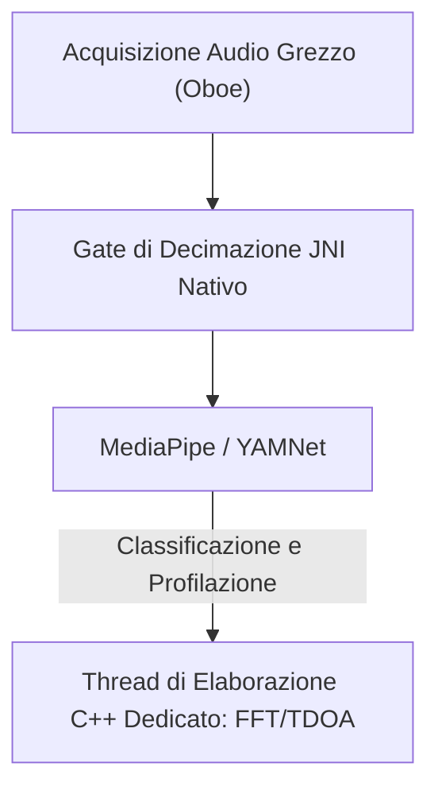

# Vigilant Ear 👂🛡️ (Edizione Android)

**Data di entrata in vigore:** 6 giugno 2026

**Vigilant Ear** è uno strumento avanzato di ricerca acustica e accessibilità per Android ad altissime prestazioni, progettato per fornire consapevolezza direzionale e spaziale in tempo reale alla comunità delle persone sorde e con problemi di udito (Deaf/HoH/CODA). I software tradizionali di riconoscimento dei suoni identificano soltanto *che cosa* è un suono. **Vigilant Ear ti dice dove si trova, chi lo sta producendo e che cosa sta dicendo.** Agisce come un radar tattico completo, combinando l'apprendimento automatico calcolato in locale (edge computing) con una sofisticata fisica acustica per tracciare esattamente *da dove* proviene un suono, la sua distanza stimata, la traiettoria assoluta del suo percorso e le parole separate e tradotte dei singoli parlanti.

---

## 🌍 Portata Globale e Localizzazione

Per supportare gli utenti di tutto il mondo, la piattaforma dispone di una matrice di localizzazione nativa completa che supporta:

- **Inglese (English)**
- **Spagnolo (Español)**
- **Portoghese (Português)**
- **Cinese (简体中文)**
- **Francese (Français)**
- **Tedesco (Deutsch)**
- **Giapponese (日本語)**
- **Arabo (العربية)**
- **Coreano (한국어)**

Tutte le sovrapposizioni tattiche, gli avvisi HUD e i menu delle preferenze si adattano dinamicamente alle impostazioni locali del sistema.

---

## 🚀 Funzionalità e Capacità Principali

- **Gestione Intelligente dell'Energia e WakeLocks**: Per massimizzare la durata della batteria e proteggere le risorse del sistema, il sistema implementa un monitoraggio condizionale in background con WakeLocks robusti e Servizi in Primo Piano (Foreground Services). Se le categorie di avvisi di emergenza sono disabilitate, i cicli di acquisizione del microfono e i motori di elaborazione entrano efficientemente in ibernazione.
- **Simulazione di Allerta Tattica**: Include una solida suite di simulazione sul dispositivo che consente agli utenti di testare le firme aptiche e le risposte visive per le tracce critiche `.emergency` — Sirene, Allarmi, Campanelli, Persone Nelle Vicinanze e Meteo Severo (inclusi i feed di NWS, MeteoGate Europe, CMA/MEM Cina, KMA Corea, JMA Giappone ed ECCC Canada) — senza richiedere trigger acustici del mondo reale.
- **Tracciatore Multi-Obiettivo (MTT)**: Isola e traccia simultaneamente firme sonore ambientali indipendenti utilizzando marcatori di sessione univoci abbinati a una mappatura di persistenza fisica, sfruttando soglie di raffinamento avanzate per un tracciamento continuo.
- **Integrazione con Shazam**: Identificazione della musica ambientale in tempo reale mappata dinamicamente sul radar spaziale.
- **HUD Radar Acustico**: Un cruscotto tattico completamente in tempo reale che fornisce telemetria in diretta su alimentazione del sistema, capacità di rete, latenza di elaborazione e FPS (Hz di analisi), insieme a una griglia direzionale che traccia i bersagli acustici ambientali per rilevamento ed energia.
- **Aggancio Geografico alle Strade (Geographic Road Snapping)**: Proietta i rilevamenti acustici matematici relativi su coordinate GPS globali, agganciando in modo intelligente i vettori dei veicoli in tempo reale a strade verificate.
- **Modalità parlante (Sottotitoli Direzionali in Tempo Reale)**: Trascrive le persone che parlano vicino a te in righe di sottotitoli, una per voce. La diarizzazione dei parlanti sul dispositivo separa le voci con colori distinti e righe scorrevoli, accompagnate da frecce direzionali che indicano la posizione del parlante.
- **Traduzione in Tempo Reale sul Dispositivo**: Trascrive e traduce il parlato in lingua straniera in tempo reale. L'intera pipeline — ascoltare, separare i parlanti, trascrivere e tradurre — viene eseguita interamente sul dispositivo senza dipendenza dal cloud.

---

## 🧬 Architettura Principale e il Motore Matematico Neurale

Vigilant Ear su Android utilizza un'**Architettura SoundML Nativa** altamente ottimizzata, costruita attorno all'elaborazione C++ e al motore audio in tempo reale Oboe per garantire la latenza più bassa possibile su hardware eterogeneo.

## ⚡ Disaccoppiamento Architetturale

Per mantenere un thread dell'interfaccia utente (UI) completamente sbloccato mentre gestisce in continuo un ingresso ad alta frequenza, la piattaforma utilizza una separazione rigorosa tra Kotlin e C++:

- **UI Kotlin / Servizio in Primo Piano**: Gestisce i cicli di vita del servizio in primo piano, i permessi, lo stato di orientamento del dispositivo e le metriche di posizione per pilotare l'HUD in modo fluido.
- **AcousticEngine (C++ Nativo)**: Gestisce i flussi audio Oboe di basso livello e le operazioni hardware. I buffer di acquisizione vengono copiati in profondità direttamente sul thread di ingresso ad alta priorità, passando gli snapshot direttamente a una coda di elaborazione nativa dedicata senza bloccare l'interfaccia utente.

### 🧠 Pipeline Acustica Avanzata

- **Architettura a Doppio Classificatore**: Utilizza un classificatore primario delegato alla NPU per la profilazione critica dei suoni ad alta frequenza, abbinato a un ticker neurale delegato alla CPU per una consapevolezza continua dei suoni ambientali. I carichi dei buffer ML vengono monitorati attivamente per regolare dinamicamente le coroutine di inferenza ed evitare accumuli in acquisizione.
- **Fisica Acuta vs. a Banda Larga**: Differenzia la logica di tracciamento in base alla struttura del suono. I suoni transitori acuti (come applausi e vetri infranti) vengono attivati nativamente tramite rigorosi algoritmi di Picco (+16dB) e RMS (+3,5dB). I suoni a banda larga (come musica e veicoli) utilizzano soglie di confidenza inferiori specifiche (0,10f vs 0,25f) e vengono seminati in modo intelligente per garantire la persistenza continua del tracciamento.
- **Vincoli e Raffinamento**: Il tracciatore raggruppa i suoni identici entro un delta spaziale di 25 gradi e li fa decadere con precisione utilizzando i vincoli `tailMemory` di `AppGlobals`. Le trasmissioni di tracciamento verso la UI vengono attentamente regolate per evitare il consumo di risorse.
- **Matematica Spaziale Parallela**: Le pipeline matematiche ad alte prestazioni (inclusi `kiss_fft`, i calcoli di Differenza del Tempo di Arrivo (TDOA) e gli algoritmi di tracciamento Doppler) vengono eseguite interamente all'interno di thread asincroni nativi dedicati.

### 📊 Benchmark di Prestazioni

- **Modalità Attiva**: Progettata per offrire un tracciamento HUD in tempo reale completo e fluido.
- **Ripristino Hardware**: La solida implementazione di Oboe garantisce un ripristino automatico in meno di un secondo dopo i cambi di percorso audio (Bluetooth, cuffie, passaggi all'altoparlante) senza interrompere le sessioni di tracciamento.

---

## 🛠️ Stack Tecnico (2026)

- **Linguaggio**: Kotlin (Coroutine, Channels), C++ (JNI, Audio Nativo)
- **Framework**: Android SDK, Jetpack Compose (UI), Oboe (Audio in Tempo Reale), MediaPipe / YAMNet
- **Base Hardware**: Dispositivi Android 10+ con allineamento del microfono stereo supportato per la precisione del rilevamento TDOA.

---

## 📊 Salvaguardie di Privacy e Sicurezza

- **Isolamento Locale Prima di Tutto (Local-First)**: Tutte le classificazioni audio, la matematica spettrale e le proiezioni di rilevamento avvengono esclusivamente sul dispositivo. I flussi audio grezzi non vengono mai registrati, memorizzati nella cache o trasmessi in nessuna condizione.
- **Nessuna Telemetria o Diagnostica Remota**: Vigilant Ear è progettato per operare interamente in locale sul tuo dispositivo. Non raccogliamo, trasmettiamo né archiviamo telemetria remota, log di arresti anomali, registri diagnostici o analisi di utilizzo sui nostri server.

---

## ⚖️ Esclusione di Responsabilità

Vigilant Ear è un ausilio sperimentale di ricerca acustica e accessibilità spaziale. Non è certificato come strumento di sicurezza salvavita. La risoluzione del tracciamento può fluttuare dinamicamente in base alla topologia regionale, al meteo prevalente, alle condizioni del vento e alla calibrazione dell'hardware del microfono. Gli utenti devono sempre mantenere una normale consapevolezza dell'ambiente circostante.

**E-mail di Contatto:** [vigilantear@wingdingssocial.com](mailto:vigilantear@wingdingssocial.com)

Vigilant Ear è uno strumento di accessibilità costruito con cura. Ti preghiamo di usarlo responsabilmente.

Fatto con ❤️ per la comunità D/HH e la ricerca acustica.

© 2026 Wingdings, Inc.  
Tutti i diritti riservati.
