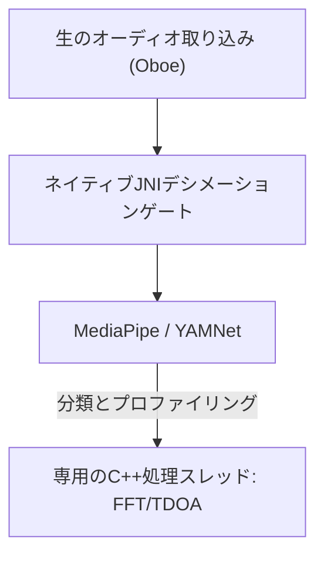

# VigilantEar 👂🛡️ (Android Edition)

**有効日:** 2026年6月6日

**VigilantEar** は、聴覚障害者（D/HH）コミュニティにリアルタイムの方向および空間認識を提供するために設計された、高度で超高性能なAndroid音響研究およびアクセシビリティツールです。従来の音声認識ソフトウェアは音が「何」であるかを特定するだけですが、VigilantEarは包括的な戦術レーダーとして機能し、エッジコンピューティングによる機械学習と高度な音響物理学を組み合わせて、音が「どこから」発生しているか、その推定距離、そして絶対的な経路の軌跡を正確に追跡します。

---

## 🌍 グローバル展開とローカリゼーション

世界中のユーザーをサポートするため、このプラットフォームは以下をサポートする完全なネイティブローカリゼーションマトリックスを備えています：

- **英語**
- **スペイン語 (Español)**
- **ポルトガル語 (Português)**
- **中国語 (简体中文)**
- **フランス語 (Français)**
- **ドイツ語 (Deutsch)**
- **日本語 (日本語)**

すべての戦術オーバーレイ、HUDアラート、および設定メニューは、システムのロケールに合わせて動的に調整されます。

---

## 🚀 主な機能と能力

- **スマートパワーゲーティングとWakeLock**: バッテリーの寿命を最大化し、システムリソースを保護するため、システムは強力なWakeLockとフォアグラウンドサービスを備えた条件付きバックグラウンド監視を実装しています。緊急アラートカテゴリが無効になっている場合、マイクの取り込みループと処理エンジンは効率的にハイバネーション（休止状態）に入ります。
- **戦術アラートシミュレーション**: 現実世界の音響トリガーを必要とせずに、サイレン、アラーム、ドアベル、近くの人、悪天候（NWS、MeteoGate Europe、CMA/MEM Chinaのフィードを含む）といった重要な `.emergency` トラックのハプティックシグネチャと視覚的応答をユーザーがテストできる、堅牢なオンデバイスシミュレーションスイートが含まれています。
- **マルチターゲットトラッカー (MTT)**: 継続的な追跡のための高度な精密化しきい値を利用して、物理的な永続性マッピングとペアになった一意のセッションマーカーを使用して、独立した環境音のシグネチャを同時に分離および追跡します。
- **Shazam統合**: 空間レーダー上に動的にマッピングされるリアルタイムの環境音楽識別。
- **地理的道路スナップ**: 相対的な数学的音響方位をグローバルGPS座標に投影し、リアルタイムの車両ベクトルを検証済みの道路にインテリジェントにスナップします。

---

## 🧬 コアアーキテクチャとニューラル演算エンジン

Android上のVigilantEarは、多様なハードウェア全体で可能な限り低いレイテンシを確保するために、C++処理とOboeリアルタイムオーディオエンジンを中心に構築された高度に最適化された **ネイティブSoundMLアーキテクチャ** を利用しています。

## ⚡ アーキテクチャの分離

高周波入力タップを継続的に処理しながら、完全にブロックされないUIスレッドを維持するために、プラットフォームはKotlinとC++の間の厳格な分離を使用しています：

- **Kotlin UI / フォアグラウンドサービス**: フォアグラウンドサービスのライフサイクル、権限、デバイスの向きの状態、および位置メトリクスを管理し、HUDをスムーズに駆動します。
- **AcousticEngine (ネイティブ C++)**: 低レベルのOboeオーディオストリームとハードウェア操作を管理します。取り込みバッファは高優先度のタップスレッドで直接ディープコピーされ、UIを停止させることなくスナップショットを専用のネイティブ処理キューに直接渡します。

### 🧠 高度な音響パイプライン

- **デュアル分類器アーキテクチャ**: 継続的な環境音の認識のためのCPU委譲ニューラルティッカーとペアになった、重要で高周波の音のプロファイリングのためのNPU委譲のプライマリ分類器を利用します。推論コルーチンを動的にスロットリングし、取り込みのバックログを防ぐために、MLバッファの負荷がアクティブに監視されます。
- **急性音 vs 広帯域音の物理学**: 音の構造に基づいてトラッキングロジックを区別します。急性の過渡音（拍手やガラスの割れる音など）は、厳密なピーク（+16dB）およびRMS（+3.5dB）アルゴリズムを介してネイティブにトリガーされます。広帯域音（音楽や車両など）は、特定の低い信頼度しきい値（0.10f vs 0.25f）を使用し、継続的な追跡の永続性を確保するためにインテリジェントにシードされます。
- **制約と精密化**: トラッカーは、25度の空間デルタ内の同一の音をグループ化し、`AppGlobals` の `tailMemory` 制約を使用して正確にエージアウトします。リソースの枯渇を防ぐために、UIへの追跡ブロードキャストは慎重にスロットリングされます。
- **並列空間演算**: 高性能な数学的パイプライン（`kiss_fft`、到着時間差 (TDOA) 計算、ドップラートラッキングアルゴリズムを含む）は、完全に専用のネイティブ非同期スレッド内で実行されます。

### 📊 パフォーマンスベンチマーク

- **アクティブモード**: 包括的なライブHUDトラッキングをスムーズに提供するように設計されています。
- **ハードウェアリカバリ**: 堅牢なOboe実装により、トラッキングセッションをドロップすることなく、オーディオルートの変更（Bluetooth、ヘッドフォン、スピーカースイッチ）から自動的かつサブ秒のリカバリが保証されます。

---

## 🛠️ 技術スタック (2026)

- **言語**: Kotlin (コルーチン、チャネル), C++ (JNI, ネイティブオーディオ)
- **フレームワーク**: Android SDK, Jetpack Compose (UI), Oboe (リアルタイムオーディオ), MediaPipe / YAMNet
- **ハードウェアベースライン**: TDOA方位精度に必要なステレオマイクアライメントをサポートするAndroid 10以上のデバイス。

---

## 📊 プライバシーとセキュリティのガードレール

- **ローカルファーストの分離**: すべてのオーディオ分類、スペクトル演算、および方位投影は、排他的にオンデバイスで行われます。生のオーディオストリームは、いかなる条件下でも録音、キャッシュ、または送信されることはありません。
- **リモートでのテレメトリおよび診断の非収集**: VigilantEarは、完全にお客様のデバイス上（ローカル）で動作するように設計されています。当社がリモートでテレメトリ、クラッシュログ、診断記録、または利用統計の収集、送信、または保存を行うことは一切ありません。

---

## ⚖️ 免責事項

VigilantEarは、実験的な音響研究および空間アクセシビリティ支援ツールです。生命安全ユーティリティとしての認定は受けていません。トラッキングの解像度は、地域のトポロジー、一般的な気象、風の状況、マイクのハードウェアキャリブレーションに基づいて動的に変動する可能性があります。ユーザーは常に通常の環境認識を維持する必要があります。

**連絡先メールアドレス:** [vigilantear@wingdingssocial.com](mailto:vigilantear@wingdingssocial.com)

VigilantEarは、注意を払って構築されたアクセシビリティツールです。責任を持って使用してください。

D/HHコミュニティと音響研究のために、愛（❤️）を込めて作られました。

© 2026 Wingdings, Inc.  
全著作権所有。
