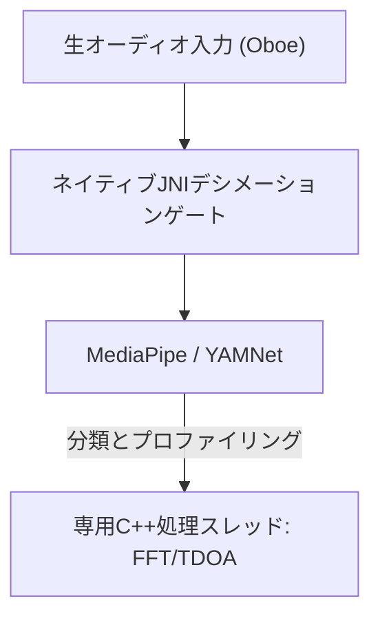

# VigilantEar 👂🛡️ (Android版)

**発効日:** 2026年6月6日

**VigilantEar**は、聴覚障害者（D/HH）コミュニティにリアルタイムの方向および空間認識を提供するために設計された、高度で超高性能なAndroid向け音響研究およびアクセシビリティツールです。従来の音声認識ソフトウェアは、音が*何か*を識別するだけです。**VigilantEarは、音がどこにあるか、誰が発しているか、何を言っているかを伝えます。**エッジコンピューティングによる機械学習と高度な音響物理学を組み合わせた包括的な戦術レーダーとして機能し、音の正確な発生*源*、推定距離、絶対的な経路軌道、個々の話者の分離・翻訳された言葉を追跡します。

---

## 🌍 グローバルリーチとローカリゼーション

世界中のユーザーをサポートするため、プラットフォームは以下の完全なネイティブローカリゼーションマトリックスを備えています：

- **英語 (English)**
- **スペイン語 (Español)**
- **ポルトガル語 (Português)**
- **中国語 (简体中文)**
- **フランス語 (Français)**
- **ドイツ語 (Deutsch)**
- **日本語**
- **アラビア語 (العربية)**

すべての戦術的オーバーレイ、HUDアラート、および設定メニューは、システムのロケールに合わせて動的に調整されます。

---

## 🚀 主な機能と能力

- **スマートパワーゲーティングとWakeLock**: バッテリー寿命を最大化し、システムリソースを保護するため、システムは強力なWakeLockとフォアグラウンドサービスによる条件付きバックグラウンド監視を実装しています。緊急アラートのカテゴリが無効になっている場合、マイク入力ループと処理エンジンは効率的に休止状態に入ります。
- **戦術的アラートシミュレーション**: ユーザーが現実の音響トリガーを必要とせずに、サイレン、アラーム、ドアベル、近くの人、悪天候（NWS、MeteoGate Europe、CMA/MEM Chinaのフィードを含む）など、重要な `.emergency` トラックの触覚シグネチャや視覚的応答をテストできる強力なオンデバイスシミュレーションスイートが含まれています。
- **マルチターゲットトラッカー (MTT)**: 物理的な永続性マッピングとペアになった一意のセッションマーカーを使用し、継続的トラッキングのための高度な精密化しきい値を活用して、独立した環境音響シグネチャを同時に分離し追跡します。
- **Shazam統合**: リアルタイムの環境音楽識別機能が空間レーダー上に動的にマッピングされます。
- **音響レーダーHUD**: 環境の音響ターゲットを方位とエネルギーで追跡する方向グリッドとともに、システムの電力、ネットワーク機能、処理レイテンシ、およびFPS（分析Hz）に関するリアルタイムのテレメトリを提供する完全にライブな戦術ダッシュボードです。
- **地理的道路スナッピング**: 相対的な数学的音響方位をグローバルGPS座標に投影し、リアルタイムの車両ベクトルを検証済みの道路にインテリジェントにスナップさせます。
- **スピーカーモード (ライブ方向キャプション)**: 近くで話している人々の声を文字起こしし、声ごとにキャプションの行に表示します。オンデバイスの話者ダイアライゼーションにより、異なる色とスクロールする線で声を分離し、話者の位置を指し示す方向矢印が付随します。
- **ライブオンデバイス翻訳**: 外国語の音声をリアルタイムで文字起こしし、翻訳します。音声の聞き取り、話者の分離、文字起こし、翻訳といったパイプライン全体が、クラウドに依存することなく完全にデバイス上で実行されます。

---

## 🧬 コアアーキテクチャとニューラル数学エンジン

Android版VigilantEarは、多様なハードウェア全体で可能な限り低いレイテンシを保証するために、C++処理とOboeリアルタイムオーディオエンジンを中心に構築された、高度に最適化された**ネイティブSoundMLアーキテクチャ**を利用しています。

## ⚡ アーキテクチャの分離

高周波数の入力タップを継続的に処理しながらUIスレッドを完全にブロック解除した状態に保つため、プラットフォームはKotlinとC++の厳格な分離を使用しています：

- **Kotlin UI / フォアグラウンドサービス**: フォアグラウンドサービスのライフサイクル、権限、デバイスの向きの状態、および位置指標を管理し、HUDをスムーズに駆動します。
- **AcousticEngine (ネイティブC++)**: 低レベルのOboeオーディオストリームとハードウェア操作を管理します。入力バッファは優先度の高いタップスレッドで直接ディープコピーされ、UIを停止させることなくスナップショットを専用のネイティブ処理キューに直接渡します。

### 🧠 高度な音響パイプライン

- **デュアル分類器アーキテクチャ**: 重要で高周波の音響プロファイリングのためのNPU委任プライマリ分類器と、継続的な環境音認識のためのCPU委任ニューラルティッカーを組み合わせて利用します。MLバッファの負荷は積極的に監視され、推論コルーチンを動的にスロットリングして入力のバックログを防ぎます。
- **急性音 vs. ブロードバンド音の物理学**: 音の構造に基づいてトラッキングロジックを区別します。急性の過渡的な音（拍手やガラスの割れる音など）は、厳密なピーク（+16dB）およびRMS（+3.5dB）アルゴリズムを介してネイティブにトリガーされます。ブロードバンド音（音楽や車両など）は、特定のより低い信頼度しきい値（0.10f vs 0.25f）を使用し、継続的な追跡の持続性を確保するためにインテリジェントにシードされます。
- **制約と精密化**: トラッカーは、25度の空間デルタ内の同一の音をグループ化し、`AppGlobals`の`tailMemory`制約を使用して正確に古くして削除します。UIへのトラッキングブロードキャストは、リソースの消耗を防ぐために慎重にスロットリングされます。
- **並列空間数学**: 高性能の数学的パイプライン（`kiss_fft`、到達時間差（TDOA）計算、およびドップラー追跡アルゴリズムを含む）は、完全に専用のネイティブ非同期スレッド内で実行されます。

### 📊 パフォーマンスベンチマーク

- **アクティブモード**: 包括的なライブHUDトラッキングをスムーズに提供するように設計されています。
- **ハードウェアリカバリ**: 堅牢なOboeの実装により、オーディオルートの変更（Bluetooth、ヘッドフォン、スピーカーの切り替え）から、追跡セッションをドロップすることなく、1秒未満で自動的に回復します。

---

## 🛠️ 技術スタック (2026年)

- **言語**: Kotlin (コルーチン、チャネル)、C++ (JNI、ネイティブオーディオ)
- **フレームワーク**: Android SDK、Jetpack Compose (UI)、Oboe (リアルタイムオーディオ)、MediaPipe / YAMNet
- **ハードウェアベースライン**: TDOA方位精度のためのステレオマイク配置をサポートするAndroid 10以上のデバイス。

---

## 📊 プライバシーとセキュリティのガードレール

- **ローカルファーストの分離**: すべてのオーディオ分類、スペクトル数学、および方位予測はデバイス上のみで行われます。生オーディオストリームが記録、キャッシュ、または送信されることは、いかなる条件下でもありません。
- **リモートテレメトリや診断なし**: VigilantEarはデバイス上で完全にローカルで動作するように設計されています。当社は、サーバー上でリモートテレメトリ、クラッシュログ、診断記録、または使用状況の分析データを収集、送信、保存しません。

---

## ⚖️ 免責事項

VigilantEarは、実験的な音響研究および空間アクセシビリティ支援ツールです。生命の安全のためのユーティリティとしての認定は受けていません。追跡の解像度は、地域のトポロジー、一般的な天候、風の状況、およびマイクハードウェアのキャリブレーションに基づいて動的に変動する可能性があります。ユーザーは常に通常の環境認識を維持する必要があります。

**連絡先メール:** [vigilantear@wingdingssocial.com](mailto:vigilantear@wingdingssocial.com)

VigilantEarは、慎重に構築されたアクセシビリティツールです。責任を持ってご使用ください。

D/HHコミュニティと音響研究のために❤️を込めて作成されました。

© 2026 Wingdings, Inc.  
無断転載を禁じます。
