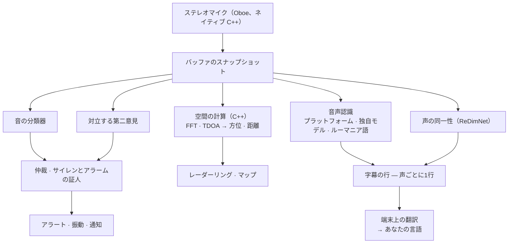

# Vigilant Ear 👂🛡️ (Android)

*Android 1.1.8 より有効 · 2026年9月。*

## 聞こえない人のための音響レーダー。

ろう者・難聴者・CODA のコミュニティ向けに作ったアプリです。多くの音認識アプリは、音が*何か*を教えます。**Vigilant Ear は、どこにあるか、誰が発しているか、何を言っているかを伝えます** — Android の電話を、まわりの音のリアルタイムな絵にします。

サイレンの向き。後ろのノック。会話の相手を、声ごとに分けた文字起こしとして描きます。読めない言語で話されていても、言葉は**あなたの言語に訳されて、この電話の上で**届きます。

大切な処理はすべてこの端末の中で動きます。認識のために音を録音したりアップロードしたりしません。聞こえることには依存しません。

- 🧭 **検出だけではない。方向まで。** *何が、どこで、* そして *何と言ったか* — 「音がした」だけではありません。
- 📣 **Name Called.** 自分の名前、子どもの名前、パートナーの名前を登録 — 「Marie 様、ご注文の品ができました」で電話が振動し、測れたときは向きも出ます。
- 🔒 **はじめからプライベート。** 分類、字幕、翻訳、声の同一性は、あなたの電話の上で動きます。名前を付けた声はこの端末で暗号化され、名簿をクラウドへ送る経路はありません。
- 🌐 **ルーマニア語の Auto-Translate。** ルーマニア語の字幕は、この電話の上で、端末内で翻訳できます。
- 👁️ **ろう者 / 難聴者 / CODA 向け。** 音ごとのはっきりした振動、高コントラストの表示、色だけに頼らない手がかり、大きなタップ領域。

---

## こんな方へ

- まわりの音の状況を把握したい**ろう者・難聴者・CODA の方** — ノック、アラーム、サイレン、近くにいる人 — オンにしたまま信頼して使えます。
- **方向と話者分離つきのライブ字幕**、または近くに座っている人の**端末上での翻訳**が必要な方。
- 端末上での音源定位に関心のある、アクセシビリティや音響研究の方。

> Vigilant Ear はアクセシビリティの**支援ツール**であり、認定された生命安全装置ではありません。

---

## できること

### 🧭 音を見る — 方向と距離
電話のふたつのマイクで、Vigilant Ear は音が**どの角度から届いたか**を測り、正面が上のレーダーリングとマップにライブのマーカーとして置きます。計算はコヒーレンスで重みを付けた到着時間差です。両方のマイクが一致する周波数帯を優先し、わずかな到着の遅れを方位に変えます。一直線上のふたつのマイクだけでは左右を自分では区別できません。そのため読み取りはその曖昧さを正直に持ち、勝手に片側を決めません。

**どれくらいよく働くかは、いま使っている機種そのものによります。私たちはそれを明示します。** 方位の計算には、ふたつのマイクのあいだの本当の距離が必要です。その間隔は **Pixel 9、Pixel 9 Pro / Pro XL、Pixel 10a の3機種で実測しています。** それ以外の機種は、本体の高さから推定した間隔で動きます。近い値ではありますが実測ではなく、方向はその分だけ鋭さが落ちます。一覧はアプリ自身のソースにあり、実測した機種が増えると伸びます。15機種あるように見せるより、3機種を名指しする方がよいと考えています。

距離は大きさからの推定であり、推定であることとして示します。比較に使う静かな部屋の基準は、決め打ちではなく **機種ごとに測ります** — 電話は定数を借りず、自分のノイズフロアを学びます。

### 🚨 大切な音を認識し、知らせる
端末上の分類器が日常の何百もの音を見分け、重要なものを見守ります — **サイレン、アラーム、ドアベルとノック、赤ちゃんの泣き声、近くにいる人、悪天候。** 分類器はひとつではなくふたつ動きます。主分類器と、対立する第二意見、そのあいだの仲裁役です。ひとつのモデルの悪いフレームが、そのままアラートにはなりません。サイレンと煙感知器には、その上に専用の確認があります。煙感知器の T3 パターンは特定のリズムであり、ただ大きいビープではありません。

発報すると、画面のアラート、通知、**音ごとのはっきりした振動パターン**が届きます。パルスの数はその音自身のプロファイルから来るので、ポケットの中でもアラームがドアベルと同じ感触にはなりません。

悪天候の警告は公式の公開フィードから届きます — 米国 **NWS**、欧州 **MeteoGate**、**中国 CMA**、**韓国 KMA**、**日本 JMA**、**カナダ ECCC**、**オーストラリア BOM**、**ブラジル INMET**、**インド NDMA** — すべてのユーザーに無料で、いまいる場所をカバーするものに絞られます。**地震アラート**は USGS の全世界フィードからです。感じたものが地震だったという確認であり、早期警報ではありません。

### 💬 Speaker Mode — ライブ字幕 *(無料)*
Speaker Mode をオンにすると、Vigilant Ear は近くで話している人を字幕の行に文字起こしします。端末上の声の同一性で話者を分け、色分けします。声紋はこの電話から出ません。

**認識エンジンは3つ。あなたのために選びます。** アプリは、電話自身の音声認識が扱える言語ではそれを使い、扱えない言語では独自モデルに切り替え、どちらもできない言語には専用のルーマニア語モデルを載せています。選ぶのは言語であり、エンジンではありません。

声ごとの分離はあり、改善中です。行は *近くで何が言われたか* として扱い、誰かの強い手がかりつき — 誰が言ったかの法廷記録としては扱わないでください。

**強い言葉は伏せ字にできます。** オンにすると罵り言葉が記号に置き換わり、文はその語なしでも読めます。🔴 **これには本当の限界があり、取り繕いません：** 伏せ字は電話自身の認識エンジンが行うので、その認識エンジンが扱う言語にだけ効きます。こちらがダウンロードする独自モデルで字幕化される言語は、スイッチが何と言おうと伏せ字になりません。

**字幕は整えます。機種によっては、整える以上のこともします。** すべての行は、決まりきった手順のクリーンアップを通ります。Gemini Nano が使える新しい Pixel と Galaxy では、校正のパスも入ります。これは補強であり、依存ではありません — 字幕にこれは必須ではなく、ほとんどの電話はこれを見ません。

### 🌐 Auto-Translate — あなたの言語で、ライブ *(Power Pack+)*
近くの人が別の言語を話すと、Vigilant Ear はその言語を見つけ、字幕を**あなたの言語**で出します。検出、文字起こし、翻訳はすべて端末上で動きます。相手の言語を先に知ったり選んだりする必要はありません。

**ルーマニア語は含まれています。** 検出、字幕、Auto-Translate は、すべてこの電話の上で扱います。

### 📣 Name Called
登録した名前を、その字幕の中から見守ります — 自分の名前、子どもの名前、パートナーの名前、カウンターが注文のために呼ぶ名前。話されるとアラートが1つ届きます。字幕の吹き出しがもうひとつ増えるのではありません。声が来た向きは、**その向きが実際に測れたとき**に出ます。リストは端末のキーストアに置かれ、そこから出ません。

### 🫧 Standing Watch と低い響き
**Standing Watch** は部屋そのものの状態です。設定するものはなく、常にオンです。部屋がいつものパターンを保っているあいだは安定したランプ、何かが変わると変化します。

電話の**気圧計**は圧力の波を見守ります — 天気、ドア、重いトラック — いまいる場所から広がるやわらかいリングとして描きます。🔴 **向きは、意図して付けていません。** 気圧センサーひとつでは、圧力の波がどちらから来たかは分かりません。方位を名乗ったリングは、方位を捏造することになります。

### 📓 Witness Ear — 任意の24時間ジャーナル
初期状態はオフです。オンのあいだ、アプリが拾ったものと場所は最大1日 **この電話の上** に残り、シンプルな PDF として書き出せます。ボタンひとつでログは即座に消えます。アプリの中で何かを保持するのはこれだけなので、選ぶまでオフです。

### 🔗 Remote Link — 一緒にいない人に届く *(Power Pack+)*
普通なら電話ですることを、映像とテキストで行います。招待コードを送り、相手は Vigilant Ear の中から参加します。近さの条件はありません — ふたりはどこにいても構いません。**音声はどの時点でも使いません。** リンクのどちら側も聞こえることには依存せず、アプリの中で手話ができます。アプリが映像を運び、あとはふたりで行います。

### 🎵 Music ID *(Power Pack+)*
まわりで流れている音楽を識別し、曲の切り替わりを追います。クロマのシグネチャ検出が、先に「本当に音楽が流れているか」を決めます。一般の分類器は静かな部屋やサイレンを「音楽」と呼びがちだからです。

### 🪄 Feature Playground とガイドツアー
**Feature Playground** では、本物を待たずにアラートを練習し、機能が発報する様子を見られます。常に透かしが入るので、練習がライブの出来事であるかのように見せることはありません。**ガイドツアー**はマップ、HUD、ギアパネル、設定、Power Pack+ を案内します。卒業帽のアイコンからいつでもやり直せます。

### ♿ アクセシビリティを先に
ろう者 / 難聴者 / CODA と色覚多様性のある方のために作りました。色だけに頼らない手がかり、大きなタップ領域、マルチモーダルなアラート（振動 + 視覚 + 画面）、音ごとの振動シグネチャ、どの権限が許可・不足・拒否されているかを正確に示す起動時の確認画面。

---

## 無料と Power Pack+

安全の中核は **無料、ずっと無料** です：

- **音のアラート** — サイレン、アラーム、ノックとドアベル、赤ちゃんの泣き声、近くにいる人。振動と通知つき。
- **ライブ字幕** — Speaker Mode。端末上。声の分離と、任意の強い言葉の伏せ字。
- **Name Called** — 入力した名前。測れたときは向きつきで知らせます。
- **Standing Watch** — 部屋の状態。常にオン。
- **悪天候アラート** — 地域向けの公式な国のフィード、9系統。
- **地震アラート** — USGS、全世界。
- **Witness Ear** — 任意の24時間ジャーナルと PDF 書き出し。
- **Feature Playground** とガイドツアー。

**Power Pack+** は一度きりの解除です — **サブスクリプションではありません** — 無料トライアルつき。Android では、追加されるのは次のちょうど4つです：

- **Auto-Translate** — 近くの話し言葉を、あなたの言語へ端末上で翻訳。
- **Music ID** — 曲の認識。
- **Remote Link** — 2台のあいだの映像とテキストのリンクをホスト。
- **名前つきの声** — アプリが拾った人に名前を付け、字幕にその名前を載せる。

買う前に、アプリは **いま使っている電話そのものを調べ**、それぞれが動くか、遅くなるか、まったく動かないかを知らせます。この端末では動かない機能の代金を取るくらいなら、売らない方を選びます。

無料でも Power Pack+ でも、**認識のための音はこの端末の上に留まります** — 段階が変えるのは解除される機能であり、音の行き先ではありません。

---

## しくみ

優先度の高い音声スレッドで一度取り込み、バッファをコピーし、互いも画面も止めない専門処理へ配ります：

```mermaid
graph TD
    A["ステレオマイク（Oboe、ネイティブ C++）"] --> B["バッファのスナップショット"]
    B --> C["音の分類器"]
    B --> Y["対立する第二意見"]
    C --> S["仲裁 · サイレンとアラームの証人"]
    Y --> S
    S --> H["アラート · 振動 · 通知"]
    B --> D["空間の計算（C++）<br/>FFT · TDOA → 方位 · 距離"]
    D --> R["レーダーリング · マップ"]
    B --> F["音声認識<br/>プラットフォーム · 独自モデル · ルーマニア語"]
    B --> E["声の同一性（ReDimNet）"]
    F --> G["字幕の行 — 声ごとに1行"]
    E --> G
    G --> T["端末上の翻訳<br/>→ あなたの言語"]
```

- **Kotlin と C++。厳密に分けています。** Kotlin が画面、フォアグラウンドサービス、権限、位置を持ちます。ネイティブエンジンがマイクと計算を持ちます。音声バッファは取り込みスレッドでコピーされ、ネイティブのキューに渡されるので、電話が考えているあいだも絵は途切れません。
- **言語の判定は推測ではなく、専用のモデルです。** アプリはどのプラットフォームでも同じ VoxLingua107 ECAPA モデルを使うので、「これは何語か」への答え方は同じです。
- **天気と地震は、音とは逆の道です。** あなたの音が外に出ることはありません。アラートの*データ*が入ってきます。当方が運用する小さなキャッシュを通るので、公開データを一度取れば全ユーザーに届き、この電話が外国政府のサーバーに直接つながることはありません。

---

## 測ったこと — まだ測っていないこと

方位と距離について、Android の机上テストの数字は公開していません。**この文書は、それを作りません。**

言語判定は、すでに一度入れ替えています。以前の検出器は、部屋の中でルーマニア語の発話に *中国語* と答えました。自信ありげな誤った言語は、誤った認識エンジンを意味し、静かに意味をなさない字幕になります — 部屋が聞こえない読み手にとっては、字幕がないことより悪いです。

**Android ではまだ測っていません：** メジャーに対する方位の精度、既知の距離に対する距離の精度、実際の録音での話者分離の精度。測るまでは、方向はよい手がかり、距離は推定として扱ってください。

音声と声のモデルは、最初に必要になったときにダウンロードします。できれば Wi-Fi です。大きいものを取る前に、アプリは確認します。そのあと、認識はオフラインです。

---

## プライバシー

- **コアの流れは常に端末上。** 分類、空間の計算、文字起こし、声の同一性、翻訳はあなたの電話の上で動きます。生の音は録音もキャッシュも送信もしません。
- **名前つきの声はここに留まります。** 声紋は Android Keystore に置かれた鍵で暗号化され、その鍵は端末から出ません。**名簿をクラウドへ送る経路はありません。** 電話をリセットすると声紋は読めなくなり、再登録します — 正しい動きであり、制限ではありません。
- **字幕は一時的です。** Witness Ear を意図してオンにしない限りそうで、そのジャーナルは端末内、上限24時間、ボタンひとつで消えます。
- **広告や行動分析はありません。** ネット利用は、マップ、公開アラートのキャッシュ、任意の曲認識、道路の文脈、Play の課金に限られます。

詳細: [PRIVACY.md](/ja/privacy/) · [TERMS.md](/ja/terms/) · [SUPPORT.md](/ja/support/)

---

## ハードウェア

- **Android 13 以降。**
- **ステレオマイク** が方向探知に必要です。マイク間隔を実測した機種がいちばん鋭いです。

---

## ローカライズ

インターフェース、アラート、字幕は **英語、スペイン語、ポルトガル語（ブラジル）、フランス語、ドイツ語、イタリア語、トルコ語、アラビア語、日本語、簡体字中国語、韓国語、ロシア語、ヒンディー語** — 13言語に翻訳されています。システムの言語、またはアプリ内の手動選択に従います。ルーマニア語の字幕と Auto-Translate は、このビルドで動きます。

---

## ステータスと免責事項

Vigilant Ear は**実験的な音響アクセシビリティ支援ツール**であり、認定された生命安全ユーティリティではありません。方向と距離は周囲、天候、風、マイクのハードウェアによって変わります。**いつもの環境への注意はそのまま続けてください** — 安全情報の唯一の源としてこれに頼らないでください。

---

**連絡先:** [vigilantear@wingdingssocial.com](mailto:vigilantear@wingdingssocial.com)

D/HH コミュニティと音響研究のために ❤️ を込めて作りました。

    
  <strong>© 2026 Wingdings, Inc.</strong> 
  All rights reserved. 
  Patent Pending

