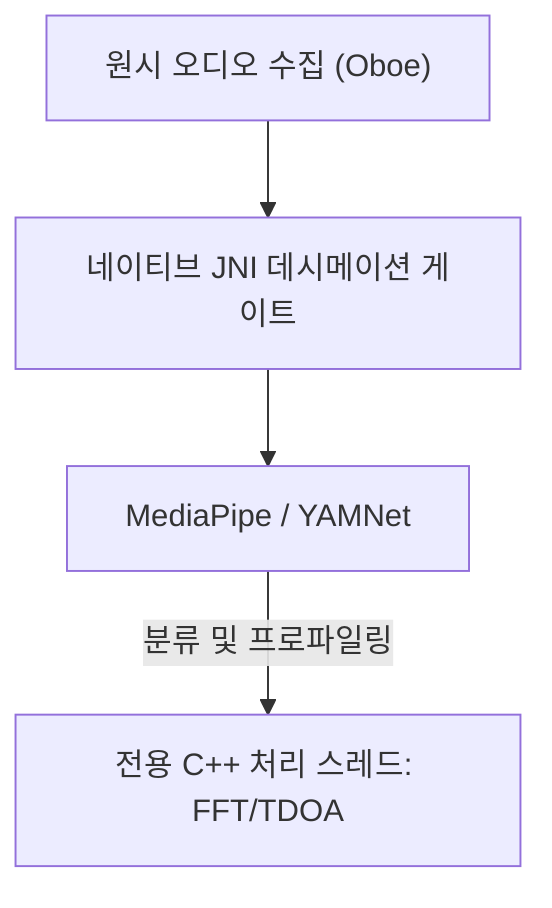

# Vigilant Ear 👂🛡️ (Android 에디션)

**발효일:** 2026년 6월 6일

**Vigilant Ear**는 농인 및 난청(D/HH) 커뮤니티에 실시간 방향 및 공간 인식을 제공하기 위해 설계된 고성능 Android 음향 연구 및 접근성 도구입니다. 기존의 소리 인식 소프트웨어는 소리가 *무엇*인지만 식별합니다. **Vigilant Ear는 소리가 어디에 있는지, 누가 내고 있는지, 그리고 무슨 말을 하고 있는지 알려줍니다.** 엣지 컴퓨팅 기반 머신러닝과 정교한 음향 물리학을 결합한 포괄적인 전술 레이더로 작동하여, 소리가 발생한 정확한 *위치*, 추정 거리, 절대 경로 궤적, 그리고 개별 화자의 분리·번역된 말을 추적합니다.

---

## 🌍 글로벌 지원 및 현지화

전 세계 사용자를 지원하기 위해, 플랫폼은 다음 언어에 대한 완전한 네이티브 현지화 매트릭스를 갖추고 있습니다:

- **영어 (English)**
- **스페인어 (Español)**
- **포르투갈어 (Português)**
- **중국어 (简体中文)**
- **프랑스어 (Français)**
- **독일어 (Deutsch)**
- **일본어 (日本語)**
- **아랍어 (العربية)**
- **한국어**

모든 전술 오버레이, HUD 알림 및 환경설정 메뉴는 시스템 로케일에 맞춰 동적으로 조정됩니다.

---

## 🚀 주요 기능 및 성능

- **스마트 전력 게이팅 및 WakeLock**: 배터리 수명을 극대화하고 시스템 리소스를 보호하기 위해, 시스템은 강력한 WakeLock과 포그라운드 서비스를 통한 조건부 백그라운드 모니터링을 구현합니다. 긴급 알림 카테고리가 비활성화되면 마이크 수집 루프와 처리 엔진이 효율적으로 최대 절전 모드에 들어갑니다.
- **전술 알림 시뮬레이션**: 실제 음향 트리거 없이도 사이렌, 알람, 초인종, 근처의 사람, 악천후(NWS, MeteoGate Europe, CMA/MEM China 피드 포함) 등 중요 `.emergency` 트랙의 햅틱 시그니처와 시각적 반응을 테스트할 수 있는 강력한 기기 내 시뮬레이션 도구 모음이 포함되어 있습니다.
- **다중 표적 추적기 (MTT)**: 물리적 지속성 매핑과 결합된 고유 세션 마커를 사용하여 독립적인 환경 소리 시그니처를 동시에 분리하고 추적하며, 지속적인 추적을 위해 정교한 정제 임계값을 활용합니다.
- **Shazam 통합**: 실시간 환경 음악 인식이 공간 레이더 위에 동적으로 매핑됩니다.
- **음향 레이더 HUD**: 시스템 전력, 네트워크 성능, 처리 지연 시간, FPS(분석 Hz)에 대한 실시간 원격 측정과 함께, 방위와 에너지로 환경 음향 표적을 추적하는 방향 그리드를 제공하는 완전한 라이브 전술 대시보드입니다.
- **지리적 도로 스내핑**: 상대적인 수학적 음향 방위를 글로벌 GPS 좌표에 투영하여, 실시간 차량 벡터를 검증된 도로에 지능적으로 스냅합니다.
- **Speaker Mode (실시간 방향성 자막)**: 근처에서 말하는 사람들을 음성당 하나의 자막 행으로 전사합니다. 기기 내 화자 분할(diarization)이 서로 다른 색상과 스크롤 라인으로 음성을 구분하며, 화자의 위치를 가리키는 방향 화살표가 함께 표시됩니다.
- **실시간 기기 내 번역**: 외국어 음성을 실시간으로 전사하고 번역합니다. 듣기, 화자 분리, 전사, 번역에 이르는 전체 파이프라인이 클라우드 의존 없이 온전히 기기 내에서 실행됩니다.

---

## 🧬 코어 아키텍처와 뉴럴 수학 엔진

Android용 Vigilant Ear는 다양한 하드웨어 전반에서 가능한 가장 낮은 지연 시간을 보장하기 위해, C++ 처리와 Oboe 실시간 오디오 엔진을 중심으로 구축된 고도로 최적화된 **네이티브 SoundML 아키텍처**를 활용합니다.

## ⚡ 아키텍처 분리

고주파 입력 탭을 지속적으로 처리하면서도 UI 스레드를 완전히 막힘 없는 상태로 유지하기 위해, 플랫폼은 Kotlin과 C++의 엄격한 분리를 사용합니다:

- **Kotlin UI / 포그라운드 서비스**: 포그라운드 서비스 수명 주기, 권한, 기기 방향 상태, 위치 지표를 관리하여 HUD를 부드럽게 구동합니다.
- **AcousticEngine (네이티브 C++)**: 저수준 Oboe 오디오 스트림과 하드웨어 작업을 관리합니다. 수집 버퍼는 우선순위가 높은 탭 스레드에서 직접 딥 카피되어, UI를 지연시키지 않고 스냅샷을 전용 네이티브 처리 큐로 곧바로 전달합니다.

### 🧠 고급 음향 파이프라인

- **듀얼 분류기 아키텍처**: 중요한 고빈도 소리 프로파일링을 위한 NPU 위임 기본 분류기와, 지속적인 주변 소리 인식을 위한 CPU 위임 뉴럴 티커를 결합해 활용합니다. ML 버퍼 부하를 능동적으로 모니터링하여 추론 코루틴을 동적으로 조절하고 수집 백로그를 방지합니다.
- **순간음 대 광대역음 물리학**: 소리 구조에 따라 추적 로직을 구분합니다. 순간적인 과도음(박수, 유리 깨지는 소리 등)은 엄격한 피크(+16dB) 및 RMS(+3.5dB) 알고리즘을 통해 네이티브로 트리거됩니다. 광대역음(음악, 차량 등)은 별도의 더 낮은 신뢰도 임계값(0.10f 대 0.25f)을 사용하며, 지속적인 추적 유지를 위해 지능적으로 시드됩니다.
- **제약 및 정제**: 추적기는 25도 공간 델타 내의 동일한 소리를 그룹화하고 `AppGlobals`의 `tailMemory` 제약을 사용해 정확하게 소멸시킵니다. UI로의 추적 브로드캐스트는 리소스 소모를 방지하기 위해 신중하게 조절됩니다.
- **병렬 공간 수학**: 고성능 수학 파이프라인(`kiss_fft`, 도달 시간차(TDOA) 계산, 도플러 추적 알고리즘 포함)이 전용 네이티브 비동기 스레드 내에서 온전히 실행됩니다.

### 📊 성능 벤치마크

- **활성 모드**: 포괄적인 라이브 HUD 추적을 부드럽게 제공하도록 설계되었습니다.
- **하드웨어 복구**: 견고한 Oboe 구현으로 오디오 경로 변경(블루투스, 헤드폰, 스피커 전환) 시 추적 세션을 잃지 않고 1초 미만의 자동 복구를 보장합니다.

---

## 🛠️ 기술 스택 (2026)

- **언어**: Kotlin (코루틴, 채널), C++ (JNI, 네이티브 오디오)
- **프레임워크**: Android SDK, Jetpack Compose (UI), Oboe (실시간 오디오), MediaPipe / YAMNet
- **하드웨어 기준**: TDOA 방위 정밀도를 위한 스테레오 마이크 배치를 지원하는 Android 10 이상 기기.

---

## 📊 개인정보 보호 및 보안 가드레일

- **로컬 우선 격리**: 모든 오디오 분류, 스펙트럼 수학, 방위 투영은 오로지 기기 내에서만 이루어집니다. 원시 오디오 스트림은 어떤 조건에서도 녹음, 캐시 또는 전송되지 않습니다.
- **원격 텔레메트리 및 진단 없음**: Vigilant Ear는 사용자의 기기에서 완전히 로컬로 작동하도록 설계되었습니다. 당사는 원격 측정, 충돌 로그, 진단 기록, 사용 분석 데이터를 당사 서버에 수집, 전송 또는 저장하지 않습니다.

---

## ⚖️ 면책 조항

Vigilant Ear는 실험적인 음향 연구 및 공간 접근성 보조 도구입니다. 인명 안전 장치로 인증되지 않았습니다. 추적 해상도는 지역 지형, 기상 상황, 바람 조건, 마이크 하드웨어 보정에 따라 동적으로 변동할 수 있습니다. 사용자는 항상 평소의 주변 환경 인식을 유지해야 합니다.

**문의 이메일:** [vigilantear@wingdingssocial.com](mailto:vigilantear@wingdingssocial.com)

Vigilant Ear는 정성을 담아 만든 접근성 도구입니다. 책임감 있게 사용해 주시기 바랍니다.

농인 및 난청 커뮤니티와 음향 연구를 위해 ❤️로 제작되었습니다.

© 2026 Wingdings, Inc.  
모든 권리 보유.
