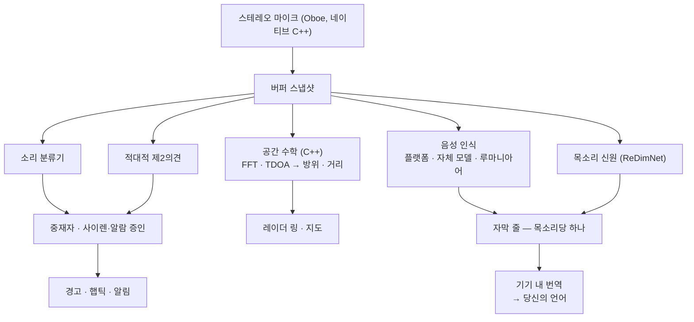

# Vigilant Ear 👂🛡️ (Android)

*Android 1.1.8부터 적용 · 2026년 9월.*

## 듣지 못하는 사람을 위한 음향 레이더.

농인·난청·CODA 커뮤니티를 위해 특별히 만든 앱이에요. 대부분의 소리 인식 앱은 소리가 *무엇인지*만 알려 줘요. **Vigilant Ear는 어디에 있는지, 누가 내고 있는지, 무슨 말을 하고 있는지까지 알려 줘요** — Android 폰을 주변 소리의 실시간 그림으로 바꿔요.

사이렌의 방향. 등 뒤의 노크. 대화 속 사람들을 목소리마다 나눠 받아 적은 모습. 읽지 못하는 언어로 누군가 말하고 있다면, 그 말은 **당신의 언어로 번역되어, 이 폰 위에서** 도착할 수 있어요.

중요한 처리는 전부 기기 안에서 돌아가요. 인식용으로 오디오를 녹음하거나 업로드하지 않아요. 무엇도 ‘듣는 것’에 의존하지 않아요.

- 🧭 **감지만이 아니라 방향.** *무엇을, 어디서,* 그리고 *무슨 말을 했는지* — 단순히 “소리가 났다”가 아니에요.
- 📣 **Name Called.** 내 이름, 아이, 파트너를 등록하세요 — “Marie 주문 나왔습니다”에 폰이 톡 울리고, 잴 수 있었을 때는 방향도 나와요.
- 🔒 **설계부터 사생활 보호.** 분류, 자막, 번역, 목소리 신원은 당신의 폰에서 돌아가요. 이름을 붙인 목소리는 이 기기에 암호화되고, 명부를 클라우드로 보내는 경로는 없어요.
- 🌐 **루마니아어 Auto-Translate.** 루마니아어 자막은 이 폰에서, 기기 안에서 번역할 수 있어요.
- 👁️ **농인 / 난청 / CODA를 위해.** 소리마다 다른 햅틱, 고대비 시각, 색에 의존하지 않는 신호, 큰 탭 영역.

---

## 대상

- 소리에 대한 상황 인식이 필요한 **농인·난청·CODA 사용자** — 노크, 알람, 사이렌, 근처의 사람 — 켜 두고 믿을 수 있어요.
- **방향과 화자 분리가 있는 실시간 자막**, 또는 옆에 앉은 사람의 **기기 내 번역**이 필요한 모든 분.
- 기기 내 소리 위치 추정에 관심 있는 접근성·음향 연구 사용자.

> Vigilant Ear는 접근성 **보조 도구**이지, 인증된 생명 안전 기기가 아니에요.

---

## 하는 일

### 🧭 소리를 봐요 — 방향과 거리
폰의 마이크 두 개로 Vigilant Ear는 소리가 **어느 각도에서 도착했는지**를 재고, 진행 방향이 위인 레이더 링과 지도에 실시간 마커로 올려요. 계산은 코히어런스로 가중된 도착 시간차예요. 두 마이크가 합의하는 주파수 밴드를 우선하고, 아주 작은 도착 지연을 방위로 바꿔요. 한 줄에 놓인 마이크 두 개만으로는 왼쪽·오른쪽을 스스로 구분할 수 없어요. 그래서 측정값은 그 모호함을 정직하게 지니고, 한쪽을 지어내지 않아요.

**얼마나 잘 되는지는 지금 쓰는 바로 그 기기에 달렸고, 우리는 그걸 밝혀요.** 방위 계산에는 마이크 두 개 사이의 실제 거리가 필요해요. 그 간격은 **Pixel 9, Pixel 9 Pro / Pro XL, Pixel 10a 세 기기에서 물리적으로 측정했어요.** 다른 모든 모델은 본체 높이에서 추정한 간격으로 돌아가요. 가깝지만 실측은 아니고, 방향은 그만큼 덜 예리해요. 목록은 앱 자체 소스에 있고, 기기를 측정할수록 늘어나요. 열다섯 대가 있는 것처럼 보이게 하기보다 세 대를 이름 밝히는 쪽을 택해요.

거리는 크기에서 나온 추정이고, 추정임을 그대로 보여 줘요. 비교에 쓰는 조용한 방 기준은 가정하지 않고 **기기마다 측정해요** — 폰은 상수를 빌려 쓰지 않고 자기 소음 바닥을 배워요.

### 🚨 중요한 소리를 알아채고 — 경고해요
기기 안 분류기가 수백 가지 일상 소리를 식별하고, 중요한 것을 지켜봐요 — **사이렌, 알람, 초인종과 노크, 아기 울음, 근처의 사람, 악천후.** 분류기는 하나가 아니라 둘이 돌아가요. 주 분류기와 적대적 제2의견, 그 사이의 중재자. 한 모델의 나쁜 프레임이 곧 알림이 되지 않아요. 사이렌과 연기 경보기는 그 위에 전용 확인을 받아요. 연기 감지기의 T3 패턴은 특정한 리듬이지, 그저 큰 삐 소리가 아니에요.

무언가 울리면 화면 경고, 알림, **소리마다 다른 진동 패턴**이 와요. 펄스 수는 그 소리 자체의 프로필에서 나오므로, 주머니 속에서도 알람이 초인종처럼 느껴지지 않아요.

악천후 경보는 공식 공공 피드에서 와요 — 미국 **NWS**, 유럽 **MeteoGate**, **중국 CMA**, **한국 KMA**, **일본 JMA**, **캐나다 ECCC**, **호주 BOM**, **브라질 INMET**, **인도 NDMA** — 모든 사용자에게 무료이고, 지금 있는 곳을 덮는 것만으로 좁혀져요. **지진 알림**은 USGS 전 세계 피드에서 와요. 느낀 것이 지진이었다는 확인이지, 조기 경보가 아니에요.

### 💬 Speaker Mode — 실시간 자막 *(무료)*
Speaker Mode를 켜면 Vigilant Ear가 근처에서 말하는 사람을 자막 줄로 받아 적어요. 기기 안 목소리 신원이 화자를 구분하고 색으로 나눠요. 성문은 이 폰을 떠나지 않아요.

**인식기는 세 개, 당신을 위해 골라 줘요.** 앱은 폰 자체 음성 인식이 이미 다루는 언어에는 그것을 쓰고, 다루지 않는 언어에는 자체 모델로 넘어가며, 둘 다 못 하는 언어를 위해 전용 루마니아어 모델을 실어요. 고르는 것은 언어이지, 엔진이 아니에요.

목소리별 분리는 있고 나아지는 중이에요. 줄은 *근처에서 무슨 말이 오갔는지*로 다루고, 누구인지에 대한 강한 힌트와 함께 — 누가 말했는지의 법정 기록으로 보지 마세요.

**거친 말은 가릴 수 있어요.** 켜면 욕이 기호로 바뀌어, 문장은 그 단어 없이도 읽혀요. 🔴 **여기엔 진짜 한계가 있고, 덮어 말하지 않아요:** 가리기는 폰 자체 인식기가 하는 일이라, 그 인식기가 다루는 언어에만 적용돼요. 우리가 내려받는 자체 모델로 자막이 달리는 언어는, 스위치가 뭐라고 하든 가려지지 않은 채로 와요.

**자막은 다듬어지고, 어떤 폰에서는 다듬는 것 이상이에요.** 모든 줄이 정해진 정리 절차를 거쳐요. Gemini Nano를 쓸 수 있는 최근 Pixel과 Galaxy에서는 교정 패스도 붙어요. 보강이지, 의존은 아니에요 — 자막에 이것이 필수는 아니고, 대부분의 폰은 이것을 보지 않아요.

### 🌐 Auto-Translate — 내 언어로, 실시간 *(Power Pack+)*
근처 사람이 다른 언어로 말하면, Vigilant Ear가 이를 감지하고 자막을 **당신의 언어로** 보여 줘요. 감지, 전사, 번역은 모두 기기 안에서 돌아가요. 상대 언어를 먼저 알거나 고를 필요가 없어요.

**루마니아어가 포함돼 있어요.** 감지, 자막, Auto-Translate가 모두 이 폰에서 다뤄요.

### 📣 Name Called
등록한 이름을 그 자막 안에서 지켜봐요 — 내 이름, 아이 이름, 파트너 이름, 카운터가 주문을 부르며 외치는 이름. 하나가 말해지면 알림이 하나 와요. 자막 말풍선이 하나 더 생기는 게 아니에요. 목소리가 온 방향은 **그 방향이 실제로 측정됐을 때** 나와요. 목록은 기기 키스토어에 들어 있고 떠나지 않아요.

### 🫧 Standing Watch와 깊은 울림
**Standing Watch**는 방 자체의 상태예요. 설정할 것은 없고 항상 켜져 있어요. 방이 제 패턴을 유지하는 동안은 일정한 램프, 무언가 달라지면 변화가 나타나요.

폰의 **기압계**가 압력 파동을 지켜봐요 — 날씨, 문, 무거운 트럭 — 지금 있는 곳에서 퍼져 나가는 부드러운 고리로 그려요. 🔴 **방향은 일부러 넣지 않아요.** 압력 센서 하나로는 압력 파동이 어느 쪽에서 왔는지 알 수 없고, 방위를 주장하는 고리는 방위를 지어내는 셈이에요.

### 📓 Witness Ear — 선택적 24시간 일지
기본은 꺼짐이에요. 켜져 있는 동안, 앱이 들은 것과 위치는 하루까지 **이 폰 위에** 남고, 간단한 PDF로 내보낼 수 있어요. 버튼 하나로 로그가 즉시 지워져요. 앱에서 무언가를 남기는 유일한 기능이라, 당신이 고를 때까지 꺼져 있어요.

### 🔗 Remote Link — 함께 있지 않은 사람에게 닿기 *(Power Pack+)*
보통 전화 통화가 할 일을, 영상과 텍스트로 해요. 초대 코드를 보내면, 상대는 Vigilant Ear 안에서 참여해요. 거리 조건은 없어요 — 둘은 어디에 있어도 돼요. **오디오는 어느 시점에도 쓰지 않아요.** 링크의 어느 쪽도 듣는 것에 의존하지 않고, 앱 안에서 수어로 대화할 길이 생겨요. 앱이 영상을 나르고, 나머지는 둘이 해요.

### 🎵 Music ID *(Power Pack+)*
주변에서 흐르는 음악을 식별하고 곡 변경을 따라가요. 크로마 시그니처 감지기가 먼저 “정말 음악이 나고 있나?”를 맡아요. 일반 분류기는 조용한 방과 사이렌을 “음악”이라고 부르는 걸로 유명하니까요.

### 🪄 Feature Playground와 안내 투어
**Feature Playground**에서는 실제를 기다리지 않고 알림을 연습하고, 기능이 울리는 모습을 볼 수 있어요. 항상 워터마크가 있어서, 연습이 실제 사건인 척하지 않아요. **안내 투어**는 지도, HUD, 톱니 패널, 환경설정, Power Pack+를 안내하고, 학사모 아이콘에서 언제든 다시 볼 수 있어요.

### ♿ 접근성을 먼저
농인 / 난청 / CODA와 색각 이상 사용자를 위해 만들었어요. 색에 의존하지 않는 신호, 큰 탭 영역, 다중 감각 알림(햅틱 + 시각 + 화면), 소리별 진동 서명, 어떤 권한이 허용·누락·거부됐는지를 정확히 보여 주는 시작 확인 화면.

---

## 무료와 Power Pack+

안전의 핵심은 **무료, 영원히 무료**예요:

- **소리 알림** — 사이렌, 알람, 노크와 초인종, 아기 울음, 근처의 사람. 햅틱과 알림 포함.
- **실시간 자막** — Speaker Mode. 기기 안. 목소리 분리와 선택적 거친 말 가리기.
- **Name Called** — 직접 입력한 이름. 측정된 곳에서는 방향과 함께 알려 줘요.
- **Standing Watch** — 방의 상태. 항상 켜짐.
- **악천후 알림** — 해당 지역의 공식 국가 피드 아홉 계통.
- **지진 알림** — USGS, 전 세계.
- **Witness Ear** — 선택적 24시간 일지와 PDF 내보내기.
- **Feature Playground**와 안내 투어.

**Power Pack+**는 한 번의 잠금 해제예요 — **구독이 아니에요** — 무료 체험이 있어요. Android에서는 정확히 네 가지가 더해져요:

- **Auto-Translate** — 근처 말을 당신의 언어로 기기 안에서 번역.
- **Music ID** — 곡 인식.
- **Remote Link** — 두 기기 사이 영상·텍스트 링크를 호스트.
- **이름 붙인 목소리** — 앱이 듣는 사람에게 이름을 붙여, 자막에 그 이름이 실리게.

사기 전에 앱이 **실제 쓰는 폰을 검사하고**, 각각이 이 기기에서 도는지, 느리게 도는지, 아예 안 되는지를 알려 줘요. 이 기기가 돌리지 못하는 것에 돈을 받기보다, 판매를 놓치는 쪽을 택해요.

무료든 Power Pack+든, **인식용 오디오는 기기에 머물러요** — 등급이 바꾸는 것은 잠금 해제되는 기능이지, 소리가 가는 곳이 아니에요.

---

## 작동 방식

높은 우선순위 오디오 스레드에서 한 번 잡고, 버퍼를 복사한 뒤, 서로도 화면도 막지 않는 전문 처리로 나눠 보내요:

- **Kotlin과 C++, 엄격히 분리.** Kotlin이 화면, 포그라운드 서비스, 권한, 위치를 맡아요. 네이티브 엔진이 마이크와 수학을 맡아요. 오디오 버퍼는 캡처 스레드에서 복사되어 네이티브 큐로 넘어가므로, 폰이 생각하는 동안에도 그림이 끊기지 않아요.
- **언어 식별은 추측이 아니라 자체 모델이에요.** 앱은 모든 플랫폼에서 같은 VoxLingua107 ECAPA 모델을 쓰므로, “이게 무슨 언어인가?”에 같은 방식으로 답해요.
- **날씨와 지진은 오디오와 반대 길을 타요.** 당신의 소리에 관한 것은 나가지 않아요. 알림 *데이터*가 들어와요. 저희가 운영하는 작은 캐시를 거치므로, 공공 데이터를 한 번 가져오면 모든 사용자에게 쓰이고, 폰이 외국 정부 서버에 직접 닿지 않아요.

---

## 측정한 것 — 아직 측정하지 않은 것

방위와 거리에 대한 Android 책상 테스트 수치는 공개하지 않았어요. **이 문서는 그것을 지어내지 않아요.**

언어 식별은 이미 한 번 교체했어요. 이전 감지기는 방에서 루마니아어 말에 *중국어*라고 답했어요. 자신 있는 잘못된 언어는 잘못된 인식기를 뜻하고, 그건 조용히 말이 안 되는 자막을 뜻해요 — 방을 들을 수 없는 읽는 이에게는 자막이 없는 것보다 더 나빠요.

**Android에서 아직 측정하지 않은 것:** 줄자에 대한 방위 정확도, 알려진 거리에 대한 거리 정확도, 실제 녹음에서의 화자 분리 정확도. 그때까지는 방향을 좋은 단서로, 거리를 추정으로 보세요.

말과 목소리 모델은 처음 필요할 때 받아요. 가능하면 Wi-Fi로. 큰 것을 받기 전에 앱이 물어요. 그다음 인식은 오프라인이에요.

---

## 개인 정보 보호

- **핵심 파이프라인은 항상 기기 안.** 분류, 공간 수학, 전사, 목소리 신원, 번역은 당신의 폰에서 돌아가요. 원본 오디오는 녹음·캐시·전송되지 않아요.
- **이름 붙인 목소리는 여기에 머물러요.** 성문은 기기를 떠나지 않는 Android Keystore의 키로 암호화돼요. **명부를 클라우드로 보내는 경로는 없어요.** 폰을 초기화하면 성문은 읽을 수 없고 다시 등록해요 — 올바른 동작이지, 제한이 아니에요.
- **자막은 일회성이에요.** Witness Ear를 일부러 켜지 않는 한 그렇고, 그 일지는 로컬이며, 24시간이 상한이고, 버튼 하나로 지워져요.
- **광고나 행동 분석은 없어요.** 네트워크 사용은 지도, 공공 알림 캐시, 선택적 곡 인식, 도로 맥락, Play 결제에 한정돼요.

전체 세부 정보: [PRIVACY.md](PRIVACY.md) · [TERMS.md](TERMS.md) · [SUPPORT.md](SUPPORT.md)

---

## 하드웨어

- **Android 13 이상.**
- **스테레오 마이크**가 방향 찾기에 필요해요. 마이크 간격을 물리적으로 측정한 기기에서 가장 예리해요.

---

## 지역화

인터페이스, 알림, 자막은 **영어, 스페인어, 포르투갈어(브라질), 프랑스어, 독일어, 이탈리아어, 튀르키예어, 아랍어, 일본어, 중국어 간체, 한국어, 러시아어, 힌디어** — 13개 언어로 번역돼요. 시스템 언어 또는 앱 안 수동 선택을 따라요. 루마니아어 자막과 Auto-Translate는 이 빌드에서 동작해요.

---

## 상태와 면책

Vigilant Ear는 **실험적 음향 접근성 보조 도구**이지, 인증된 생명 안전 유틸리티가 아니에요. 방향과 거리는 주변, 날씨, 바람, 마이크 하드웨어에 따라 달라져요. **평소의 환경 인식을 언제나 유지하세요** — 유일한 안전 정보원으로 쓰지 마세요.

---

**연락처:** [vigilantear@wingdingssocial.com](mailto:vigilantear@wingdingssocial.com)

농인·난청(D/HH) 커뮤니티와 음향 연구를 위해 ❤️로 만들었어요.

    
  <strong>© 2026 Wingdings, Inc.</strong> 
  All rights reserved. 
  Patent Pending

