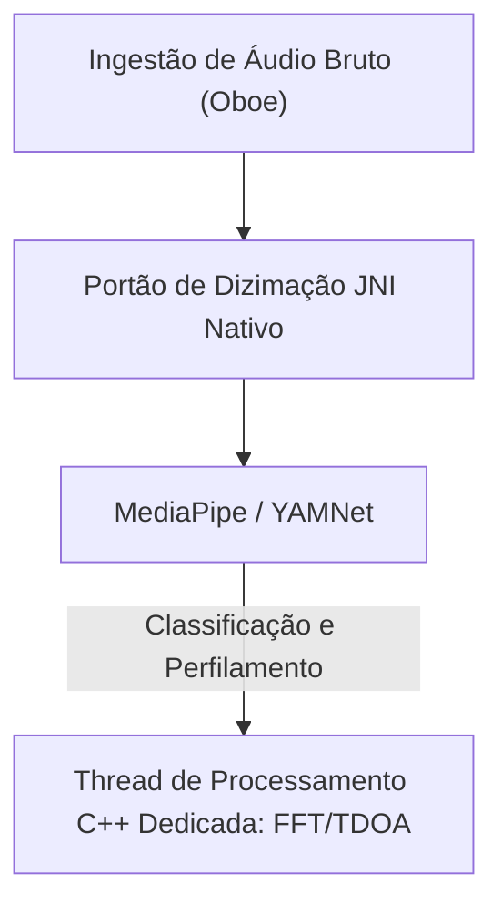

# VigilantEar 👂🛡️ (Edição Android)

**Data de Vigência:** 6 de junho de 2026

**VigilantEar** é uma ferramenta avançada de pesquisa acústica e acessibilidade para Android de altíssimo desempenho, projetada para fornecer consciência direcional e espacial em tempo real para a comunidade surda e com deficiência auditiva (D/HH). O software de reconhecimento de som tradicional identifica apenas *o que* é um som; VigilantEar atua como um radar tático abrangente, combinando aprendizado de máquina computado na borda com física acústica sofisticada para rastrear exatamente *de onde* um som se origina, sua distância estimada e sua trajetória absoluta.

---

## 🌍 Alcance Global e Localização

Para apoiar os usuários em todo o mundo, a plataforma apresenta uma matriz de localização nativa completa que suporta:

- **Inglês**
- **Espanhol (Español)**
- **Português (Português)**
- **Chinês (简体中文)**
- **Francês (Français)**
- **Alemão (Deutsch)**
- **Japonês (日本語)**

Todas as sobreposições táticas, alertas de HUD e menus de preferências se ajustam dinamicamente às localidades do sistema.

---

## 🚀 Principais Recursos e Capacidades

- **Gating de Energia Inteligente e WakeLocks (Smart Power Gating & WakeLocks)**: Para maximizar a longevidade da bateria e proteger os recursos do sistema, o sistema implementa monitoramento condicional em segundo plano com WakeLocks fortes e Serviços de Primeiro Plano (Foreground Services). Se as categorias de alertas de emergência forem desativadas, os loops de ingestão de microfone e os mecanismos de processamento entram eficientemente em hibernação.
- **Simulação de Alerta Tático**: Inclui um robusto conjunto de simulação no dispositivo que permite aos usuários testar assinaturas hápticas e respostas visuais para faixas críticas de `.emergency` (emergência) — Sirenes, Alarmes, Campainhas, Pessoas Próximas e Clima Severo (incluindo feeds NWS, MeteoGate Europe e CMA/MEM China) — sem exigir gatilhos acústicos no mundo real.
- **Rastreador de Múltiplos Alvos (Multi-Target Tracker - MTT)**: Isola e rastreia simultaneamente assinaturas de sons ambientais independentes usando marcadores de sessão exclusivos combinados com mapeamento de persistência física, utilizando limites de refinamento avançados para rastreamento contínuo.
- **Integração com Shazam**: Identificação de música ambiental em tempo real mapeada dinamicamente no radar espacial.
- **Ajuste Geográfico de Estradas**: Projeta direções matemáticas acústicas relativas em coordenadas GPS globais, ajustando inteligentemente vetores de veículos em tempo real a ruas verificadas.

---

## 🧬 Arquitetura Principal e o Mecanismo Matemático Neural

O VigilantEar no Android utiliza uma **Arquitetura SoundML Nativa** altamente otimizada, construída em torno do processamento C++ e do mecanismo de áudio em tempo real Oboe para garantir a menor latência possível em diversos hardwares.

## ⚡ Desacoplamento Arquitetônico

Para manter uma thread de interface de usuário (UI) completamente desbloqueada enquanto lida continuamente com uma entrada de alta frequência, a plataforma usa separação estrita entre Kotlin e C++:

- **UI Kotlin / Serviço de Primeiro Plano**: Gerencia ciclos de vida de serviço de primeiro plano, permissões, estado de orientação do dispositivo e métricas de localização para conduzir o HUD sem problemas.
- **AcousticEngine (C++ Nativo)**: Gerencia fluxos de áudio Oboe de baixo nível e operações de hardware. Os buffers de ingestão são profundamente copiados diretamente na thread de captura de alta prioridade, passando instantâneos diretamente para uma fila de processamento nativa dedicada sem travar a UI.

### 🧠 Pipeline Acústico Avançado

- **Arquitetura de Classificador Duplo**: Utiliza um classificador primário delegado por NPU para perfilamento crítico de som de alta frequência, emparelhado com um ticker neural delegado por CPU para consciência de som ambiente contínua. As cargas de buffer de ML são ativamente monitoradas para acelerar ou desacelerar dinamicamente as corrotinas de inferência e evitar acúmulo de ingestão.
- **Física Aguda vs. Banda Larga**: Diferencia a lógica de rastreamento com base na estrutura do som. Sons transitórios agudos (como palmas e quebra de vidro) são acionados nativamente por meio de algoritmos rigorosos de Pico (+16dB) e RMS (+3.5dB). Sons de banda larga (como música e veículos) usam limites de confiança mais baixos específicos (0.10f vs 0.25f) e são semeados inteligentemente para garantir a persistência de rastreamento contínuo.
- **Restrições e Refinamento**: O rastreador agrupa sons idênticos dentro de um delta espacial de 25 graus e os descarta com precisão usando restrições de `tailMemory` do `AppGlobals`. As transmissões de rastreamento para a UI são cuidadosamente controladas para evitar o consumo de recursos.
- **Matemática Espacial Paralela**: Pipelines matemáticos de alto desempenho (incluindo `kiss_fft`, cálculos de Diferença de Tempo de Chegada (TDOA) e algoritmos de rastreamento Doppler) são executados inteiramente dentro de threads assíncronas nativas dedicadas.

### 📊 Benchmarks de Desempenho

- **Modo Ativo**: Projetado para fornecer rastreamento de HUD ao vivo de forma suave.
- **Recuperação de Hardware**: A robusta implementação do Oboe garante recuperação automática de sub-segundo de mudanças de rota de áudio (Bluetooth, fones de ouvido, interruptores de alto-falante) sem interromper as sessões de rastreamento.

---

## 🛠️ Pilha Técnica (2026)

- **Linguagem**: Kotlin (Corrotinas, Canais), C++ (JNI, Áudio Nativo)
- **Frameworks**: SDK do Android, Jetpack Compose (UI), Oboe (Áudio em Tempo Real), MediaPipe / YAMNet
- **Linha de Base de Hardware**: Dispositivos Android 10+ com alinhamento de microfone estéreo suportado para precisão de direção TDOA.

---

## 📊 Proteções de Privacidade e Segurança

- **Isolamento Local-First**: Todas as classificações de áudio, matemática espectral e projeções de direção ocorrem exclusivamente no dispositivo. Fluxos de áudio brutos nunca são gravados, armazenados em cache ou transmitidos sob nenhuma condição.
- **Sem Telemetria ou Diagnósticos Remotos**: O VigilantEar foi projetado para funcionar de forma totalmente local no seu dispositivo. Não coletamos, transmitimos ou armazenamos nenhuma telemetria remota, logs de falhas, registros de diagnóstico ou estatísticas de uso em nossos servidores.

---

## ⚖️ Aviso Legal

O VigilantEar é um auxílio de acessibilidade espacial e pesquisa acústica experimental. Não é certificado como um utilitário de segurança de vida. A resolução de rastreamento pode flutuar dinamicamente com base na topologia regional, clima predominante, condições de vento e calibração de hardware do microfone. Os usuários devem sempre manter a consciência ambiental normal.

**E-mail de Contato:** [vigilantear@wingdingssocial.com](mailto:vigilantear@wingdingssocial.com)

O VigilantEar é uma ferramenta de acessibilidade construída com cuidado. Por favor, use-o com responsabilidade.

Feito com ❤️ para a comunidade D/HH e pesquisa acústica.

© 2026 Wingdings, Inc.  
Todos os direitos reservados.
