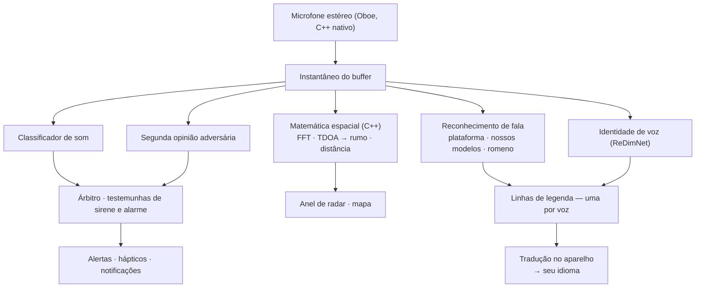

# Vigilant Ear 👂🛡️ (Android)

*Vigente a partir do Android 1.1.8 · setembro de 2026.*

## Um radar acústico para quem não ouve.

Um app feito especialmente para a comunidade surda, com deficiência auditiva e CODA. A maioria dos apps de reconhecimento de som diz *o que* é um som. **O Vigilant Ear diz onde ele está, quem o está fazendo e o que estão dizendo** — transformando um telefone Android numa imagem em tempo real do som ao seu redor.

A direção de uma sirene. Uma batida atrás de você. As pessoas numa conversa, desenhadas como vozes transcritas separadas. Se alguém fala um idioma que você não lê, as palavras podem chegar **traduzidas para o seu, no telefone.**

Tudo o que importa roda no aparelho. O áudio não é gravado nem enviado para reconhecimento. Nada depende de ouvir.

- 🧭 **Direção, não só detecção.** *O quê, onde* e *o que foi dito* — não apenas “aconteceu um som.”
- 📣 **Name Called.** Liste seu nome, o de uma criança, o de um parceiro — “pedido da Marie pronto” toca o telefone, com a direção quando ela pôde ser medida.
- 🔒 **Privado por design.** Classificação, legendas, tradução e identidade de voz rodam no seu telefone. As vozes nomeadas ficam criptografadas neste aparelho e não há nenhum caminho de roster na nuvem.
- 🌐 **Auto-Translate romeno.** Legendas em romeno podem ser traduzidas neste telefone, no aparelho.
- 👁️ **Feito para Deaf / HoH / CODA.** Hápticos distintos por som, visuais de alto contraste, sinais independentes de cor, alvos de toque grandes.

---

## Para quem é

- **Usuários surdos, com deficiência auditiva e CODA** que querem consciência situacional do som — a batida, o alarme, a sirene, a pessoa por perto — que você pode deixar rodando e em que pode confiar.
- Quem precisa de **legendas ao vivo com direção e separação de falantes**, ou de **tradução no aparelho** das pessoas sentadas perto.
- Usuários de acessibilidade e pesquisa acústica interessados em localização de som no dispositivo.

> O Vigilant Ear é um **auxílio** de acessibilidade, não um dispositivo certificado de segurança de vida.

---

## O que ele faz

### 🧭 Ele vê o som — direção e distância
Com os dois microfones do telefone, o Vigilant Ear mede o **ângulo de onde um som chegou** e o coloca como marcador ao vivo num anel de radar orientado para o rumo e num mapa. A matemática é diferença de tempo de chegada (Time Difference of Arrival) ponderada por coerência: favorecer as faixas de frequência em que os dois microfones concordam, depois transformar o atraso mínimo de chegada num rumo. Dois microfones numa linha não distinguem esquerda de direita sozinhos, então a leitura carrega essa ambiguidade com honestidade em vez de inventar um lado.

**O quão bem isso funciona depende do seu telefone exato, e a gente diz qual.** A matemática de rumo precisa da distância verdadeira entre os dois microfones. Esse espaçamento é **medido fisicamente em três aparelhos — Pixel 9, Pixel 9 Pro / Pro XL e Pixel 10a.** Qualquer outro modelo roda num espaçamento estimado a partir da altura do corpo, que fica perto mas não é medido, e a direção fica correspondentemente menos nítida. A lista está no próprio código do app e cresce conforme os aparelhos são medidos; preferimos nomear os três a insinuar quinze.

A distância é uma estimativa a partir do volume, e aparece como a estimativa que é. A referência de quarto silencioso contra a qual ela mede é **medida por aparelho** em vez de assumida — o telefone aprende o próprio piso de ruído em vez de emprestar uma constante.

### 🚨 Ele reconhece sons importantes — e avisa você
Um classificador no aparelho identifica centenas de sons do dia a dia e vigia os críticos — **sirenes, alarmes, campainhas e batidas, um bebê chorando, uma pessoa por perto e clima severo.** Dois classificadores rodam, não um: um principal e uma segunda opinião adversária, com um árbitro entre eles, para que um quadro ruim de um único modelo não vire alerta. Sirenes e alarmes de fumaça ganham ainda uma confirmação dedicada — o padrão T3 de um detector de fumaça é um ritmo específico, não só um bipe alto.

Quando algo dispara você recebe um alerta na tela, uma notificação e um **padrão de vibração distinto por som** — a contagem de pulsos vem do próprio perfil do som, então um alarme não parece uma campainha através do bolso.

Avisos de clima severo vêm de feeds públicos oficiais — **NWS** dos EUA, **MeteoGate** da Europa, **CMA** da China, **KMA** da Coreia, **JMA** do Japão, **ECCC** do Canadá, **BOM** da Austrália, **INMET** do Brasil e **NDMA** da Índia — grátis para todos os usuários, e restritos aos que cobrem onde você está. Os **alertas de terremoto** vêm do feed mundial do USGS: uma confirmação de que o que você sentiu foi um tremor, não um aviso precoce.

### 💬 Speaker Mode — legendas ao vivo *(grátis)*
Ligue o Speaker Mode e o Vigilant Ear transcreve as pessoas que falam perto de você em linhas de legenda. A identidade de voz no aparelho mantém os falantes distintos e com código de cor, a partir de impressões de voz que nunca saem do telefone.

**Três reconhecedores, escolhidos para você.** O app usa o reconhecedor de fala do próprio telefone para os idiomas que ele já cobre, cai nos próprios modelos para os que não cobre, e carrega um modelo romeno dedicado para o idioma que nenhum dos dois consegue. Você escolhe um idioma, não um motor.

A separação por voz está presente e melhorando. Trate as linhas como *o que foi dito perto de você*, com uma dica forte de quem — não como um registro de tribunal de quem disse.

**Linguagem pesada pode ser mascarada.** Ligue e os palavrões são substituídos por símbolos, de modo que a frase continua legível sem a palavra. 🔴 **Isto tem um limite real e a gente não vai disfarçar:** o mascaramento é o reconhecedor do próprio telefone fazendo o trabalho, então vale só para os idiomas cobertos por esse reconhecedor. Idiomas legendados pelos nossos modelos baixados chegam sem máscara, diga o interruptor o que disser.

**As legendas são arrumadas, e em alguns telefones mais do que arrumadas.** Cada linha passa por uma limpeza determinística. Em hardware Pixel e Galaxy recente com Gemini Nano disponível, as linhas também ganham uma passagem de revisão. É um aprimoramento e nunca uma dependência — nada nas legendas exige isso, e a maioria dos telefones nunca vê.

### 🌐 Auto-Translate — seu idioma, ao vivo *(Power Pack+)*
Quando uma pessoa por perto fala outro idioma, o Vigilant Ear detecta e mostra as legendas **no seu idioma**. Detecção, transcrição e tradução rodam todas no aparelho. Você não precisa saber nem escolher o outro idioma primeiro.

**O romeno está incluído.** Detecção, legendas e Auto-Translate cobrem todos neste telefone.

### 📣 Name Called
Vigia essas legendas em busca dos nomes que você lista — o seu, o de uma criança, o de um parceiro, o nome que um balcão chama para um pedido. Quando um é falado você recebe um alerta, não um segundo balão de legenda, e a direção de onde veio a voz **quando essa direção foi de fato medida**. A lista fica no cofre de chaves do aparelho e nunca sai dele.

### 🫧 Standing Watch e o estrondo profundo
**Standing Watch** é a condição da própria sala, sempre ligado e sem nada para configurar: uma lâmpada constante enquanto a sala mantém o padrão, uma mudança quando algo se desloca.

O **barômetro** do telefone vigia ondas de pressão — clima, uma porta, um caminhão pesado — e as desenha como um anel suave que se expande de onde você está. 🔴 **De propósito, sem direção nele.** Um único sensor de pressão não pode dizer de que lado veio uma onda de pressão, e um anel que reivindicasse um rumo estaria inventando um.

### 📓 Witness Ear — um diário opcional de 24 horas
Desligado por padrão. Enquanto está ligado, o que o app ouviu e onde fica **neste telefone** por até um dia, pronto para exportar como um PDF simples. Um botão apaga o registro na hora. É a única coisa no app que retém alguma coisa, por isso fica desligado até você escolher.

### 🔗 Remote Link — alcance quem não está com você *(Power Pack+)*
O que uma ligação faria, feito com vídeo e texto. Você envia um código de convite; a outra pessoa entra de dentro do Vigilant Ear. Não há exigência de proximidade — vocês dois podem estar em qualquer lugar. **Nenhum áudio é usado em momento algum,** então nada da ligação depende de ouvir em nenhuma ponta, e isso te dá um jeito de sinalizar com alguém pelo app. O app leva o vídeo; vocês dois fazem o resto.

### 🎵 Music ID *(Power Pack+)*
Identifica música tocando ao seu redor e acompanha as trocas de faixa. Um detector de assinatura de croma fica primeiro com a pergunta “está tocando música de verdade?”, porque classificadores gerais chamam famosamente de “música” salas silenciosas e sirenes.

### 🪄 Feature Playground e um tour guiado
**Feature Playground** deixa você praticar alertas e ver os recursos dispararem sem esperar a coisa real, sempre com marca d'água para a prática nunca se passar por um evento ao vivo. Um **tour guiado** percorre o mapa, o HUD, o painel da engrenagem, as preferências e o Power Pack+, repetível a qualquer momento a partir do capelo.

### ♿ Acessibilidade em primeiro lugar
Feito para usuários surdos / com deficiência auditiva / CODA e daltônicos: sinais independentes de cor, alvos de toque grandes, alertas multimodais (háptico + visual + na tela), assinaturas de vibração por som, e uma tela de verificação na abertura que mostra exatamente quais permissões estão concedidas, faltando ou recusadas.

---

## Grátis e Power Pack+

O núcleo de segurança é **grátis, para sempre**:

- **Alertas de som** — sirenes, alarmes, batidas e campainhas, choro de bebê, pessoa por perto, com hápticos e notificações.
- **Legendas ao vivo** — Speaker Mode, no aparelho, com separação de vozes e mascaramento opcional de linguagem pesada.
- **Name Called** — nomes que você digita, alertados com direção onde ela foi medida.
- **Standing Watch** — a condição da sala, sempre ligado.
- **Alertas de clima severo** — nove feeds nacionais oficiais para a sua região.
- **Alertas de terremoto** — USGS, mundial.
- **Witness Ear** — o diário opcional de 24 horas e a exportação em PDF.
- **Feature Playground** e o tour guiado.

O **Power Pack+** é um desbloqueio único — **não é assinatura** — com um teste grátis. No Android ele adiciona exatamente quatro coisas:

- **Auto-Translate** — tradução no aparelho da fala por perto para o seu idioma.
- **Music ID** — reconhecimento de faixas.
- **Remote Link** — hospedar uma ligação de vídeo e texto entre dois aparelhos.
- **Vozes nomeadas** — nomear as pessoas que o app ouve, para as legendas carregarem o nome delas.

Antes de comprar, o app **sonda o seu telefone de verdade** e diz se cada uma dessas coisas vai funcionar nele, funcionar devagar, ou não funcionar de jeito nenhum. Preferimos perder a venda a cobrar por algo que este aparelho não consegue rodar.

Grátis ou Power Pack+, **seu áudio fica no aparelho para reconhecimento** — o nível muda quais recursos estão liberados, nunca para onde o som vai.

---

## Como funciona

Captura uma vez numa thread de áudio de alta prioridade, copia o buffer e espalha para especialistas que nunca bloqueiam uns aos outros nem a tela:

```mermaid
graph TD
    A["Microfone estéreo (Oboe, C++ nativo)"] --> B["Instantâneo do buffer"]
    B --> C["Classificador de som"]
    B --> Y["Segunda opinião adversária"]
    C --> S["Árbitro · testemunhas de sirene e alarme"]
    Y --> S
    S --> H["Alertas · hápticos · notificações"]
    B --> D["Matemática espacial (C++)<br/>FFT · TDOA → rumo · distância"]
    D --> R["Anel de radar · mapa"]
    B --> F["Reconhecimento de fala<br/>plataforma · nossos modelos · romeno"]
    B --> E["Identidade de voz (ReDimNet)"]
    F --> G["Linhas de legenda — uma por voz"]
    E --> G
    G --> T["Tradução no aparelho<br/>→ seu idioma"]
```

- **Kotlin e C++, estritamente separados.** Kotlin fica com a tela, o serviço em primeiro plano, as permissões e a localização. Um motor nativo fica com o microfone e a matemática. Os buffers de áudio são copiados na thread de captura e entregues a uma fila nativa, então a imagem nunca engasga enquanto o telefone pensa.
- **A identificação de idioma é um modelo próprio, não um palpite.** O app usa o mesmo modelo VoxLingua107 ECAPA em cada plataforma, então todas respondem “que idioma é este?” do mesmo jeito.
- **Clima e terremotos tomam o caminho oposto ao do áudio.** Nada do seu som sai; os *dados* de alerta entram, por um cache pequeno que operamos, então uma só busca dos dados públicos serve cada usuário e o seu telefone nunca contata o servidor de um governo estrangeiro diretamente.

---

## O que medimos — e o que não

Não publicamos números de teste de mesa no Android para rumo e distância. **Este documento não vai inventá-los.**

A identificação de idioma já foi substituída uma vez: o detector anterior, numa sala, respondeu *chinês* em fala romena. Um idioma errado dito com confiança significa o reconhecedor errado, que significa legendas que são silenciosamente um sem-sentido — pior para quem lê e não ouve a sala do que nenhuma legenda.

**Ainda não medido no Android:** acurácia de rumo contra uma trena, acurácia de distância contra alcances conhecidos, e acurácia de separação de falantes numa gravação real. Até lá, trate a direção como uma boa indicação e a distância como uma estimativa.

Modelos de fala e de voz baixam quando você precisa deles pela primeira vez, de preferência no Wi-Fi. O app pergunta antes de puxar qualquer coisa grande. Depois disso, o reconhecimento é offline.

---

## Privacidade

- **No aparelho, sempre, para o pipeline principal.** Classificação, matemática espacial, transcrição, identidade de voz e tradução rodam no seu telefone. O áudio bruto nunca é gravado, colocado em cache nem transmitido.
- **As vozes nomeadas ficam aqui.** As impressões de voz são criptografadas com uma chave guardada no Android Keystore que nunca sai do aparelho. **Não há nenhum caminho de roster na nuvem.** Se o telefone for redefinido, as impressões ficam ilegíveis e você se recadastra — que é o comportamento correto, não uma limitação.
- **As legendas são efêmeras** a menos que você ligue o Witness Ear de propósito, e esse diário é local, limitado a 24 horas, e apagado com um botão.
- **Sem publicidade nem analítica comportamental.** O uso de rede se limita a mapas, ao cache público de alertas, ao reconhecimento opcional de faixas, ao contexto viário e ao faturamento Play.

Detalhes completos: [PRIVACY.md](/pt-BR/privacy/) · [TERMS.md](/pt-BR/terms/) · [SUPPORT.md](/pt-BR/support/)

---

## Hardware

- **Android 13 ou mais novo.**
- **Microfones estéreo** são necessários para achar a direção; o mais nítido nos aparelhos cujo espaçamento de microfones foi medido fisicamente.

---

## Localização

A interface, os alertas e as legendas estão traduzidos para **inglês, espanhol, português (Brasil), francês, alemão, italiano, turco, árabe, japonês, chinês simplificado, coreano, russo e hindi** — 13 idiomas, conforme o idioma do sistema ou uma escolha manual no app. Legendas em romeno e Auto-Translate funcionam neste build.

---

## Status e aviso

O Vigilant Ear é um **auxílio experimental de acessibilidade acústica**, não um utilitário certificado de segurança de vida. Direção e distância variam com o entorno, o clima, o vento e o hardware dos microfones. **Mantenha sempre a sua consciência ambiental habitual** — não dependa dele como única fonte de informação de segurança.

---

**Contato:** [vigilantear@wingdingssocial.com](mailto:vigilantear@wingdingssocial.com)

Feito com ❤️ para a comunidade D/HH e a pesquisa acústica.

    
  <strong>© 2026 Wingdings, Inc.</strong> 
  All rights reserved. 
  Patent Pending

