# Vigilant Ear 👂🛡️ (Android)

*În vigoare de la Android 1.1.8 · septembrie 2026.*

## Un radar acustic pentru cine nu aude.

O aplicație făcută anume pentru comunitatea surzilor, hipoacuzicilor și CODA. Majoritatea aplicațiilor de recunoaștere a sunetului îți spun *ce* e un sunet. **Vigilant Ear îți spune unde e, cine îl face și ce spune** — transformă un telefon Android într-o imagine în timp real a sunetului din jurul tău.

Direcția unei sirene. O bătaie în spatele tău. Oamenii dintr-o conversație, desenați ca voci transcrise separate. Dacă cineva vorbește o limbă pe care nu o citești, cuvintele pot ajunge **traduse în a ta, pe telefon.**

Tot ce contează rulează pe dispozitiv. Audio-ul nu e înregistrat și nu e urcat pentru recunoaștere. Nimic nu depinde de a auzi ceva.

- 🧭 **Direcție, nu doar detectare.** *Ce, unde* și *ce s-a spus* — nu doar „s-a întâmplat un sunet”.
- 📣 **Name Called.** Pune-ți numele, al unui copil, al partenerului — „comanda pentru Marie e gata” atinge telefonul, cu direcția când a putut fi măsurată.
- 🔒 **Privat din construcție.** Clasificarea, subtitrările, traducerea și identitatea vocală rulează pe telefonul tău. Vocile numite sunt criptate pe acest dispozitiv și nu există nicio cale de roster în cloud.
- 🌐 **Auto-Translate pentru română.** Subtitrările în română pot fi traduse pe acest telefon, pe dispozitiv.
- 👁️ **Făcut pentru Deaf / HoH / CODA.** Haptice distincte pe sunet, vizualuri cu contrast mare, indicii independente de culoare, ținte de atingere mari.

---

## Pentru cine e

- **Utilizatori surzi, hipoacuzici și CODA** care vor conștientizare situațională a sunetului — bătaia, alarma, sirena, persoana din apropiere — pe care o poți lăsa pornită și în care poți avea încredere.
- Oricine are nevoie de **subtitrări în direct cu direcție și separare pe vorbitor**, sau de **traducere pe dispozitiv** a oamenilor care stau lângă tine.
- Utilizatori de accesibilitate și cercetare acustică interesați de localizarea sunetului pe dispozitiv.

> Vigilant Ear e un **ajutor** de accesibilitate, nu un dispozitiv certificat de siguranță a vieții.

---

## Ce face

### 🧭 Vede sunetul — direcție și distanță
Cu cele două microfoane ale telefonului, Vigilant Ear măsoară **unghiul din care a sosit un sunet** și îl pune ca marker viu pe un inel radar orientat pe cap și pe hartă. Matematica e Time Difference of Arrival ponderată pe coerență: favorizează benzile de frecvență pe care ambele microfoane sunt de acord, apoi transformă micul decalaj de sosire într-un azimut. Două microfoane pe o linie nu pot distinge stânga de dreapta singure, deci citirea poartă ambiguitatea onest, nu inventează o parte.

**Cât de bine merge depinde de telefonul tău exact, și o spunem.** Matematica de azimut are nevoie de distanța reală dintre cele două microfoane. Acea distanță e **măsurată fizic pe trei dispozitive — Pixel 9, Pixel 9 Pro / Pro XL și Pixel 10a.** Orice alt model rulează pe o distanță estimată din înălțimea carcasei, care e aproape dar nu măsurată, și direcția e corespunzător mai puțin ascuțită. Lista e în sursa aplicației și crește pe măsură ce dispozitivele sunt măsurate; preferăm să numim cele trei decât să implicăm cincisprezece.

Distanța e o estimare din volum, și e arătată ca estimarea care e. Referința de cameră liniștită față de care măsoară e **măsurată pe fiecare dispozitiv**, nu presupusă — telefonul își învață propriul prag de zgomot în loc să împrumute o constantă.

### 🚨 Recunoaște sunete importante — și te avertizează
Un clasificator pe dispozitiv identifică sute de sunete de zi cu zi și urmărește pe cele critice — **sirene, alarme, sonerii și bătăi, un bebeluș care plânge, o persoană în apropiere și vreme severă.** Rulează doi clasificatori, nu unul: unul principal și o a doua opinie adversă, cu un arbitru între ei, ca un cadru prost al unui singur model să nu fie o alertă. Sirenele și alarmele de fum primesc confirmare dedicată pe deasupra — ritmul T3 al unui detector de fum e un ritm anume, nu doar un bip tare.

Când se declanșează primești o alertă pe ecran, o notificare și un **model distinct de vibrație pe sunet** — numărul de pulsuri vine din profilul sunetului, deci o alarmă nu se simte ca o sonerie prin buzunar.

Avertismentele de vreme severă vin din feeduri publice oficiale — **NWS** SUA, **MeteoGate** Europa, **CMA** China, **KMA** Coreea, **JMA** Japonia, **ECCC** Canada, **BOM** Australia, **INMET** Brazilia și **NDMA** India — gratuite pentru toți utilizatorii, și restrânse la cele care acoperă unde ești. **Alertele de cutremur** vin din feedul mondial USGS: o confirmare că ce-ai simțit a fost un cutremur, nu un avertisment timpuriu.

### 💬 Speaker Mode — subtitrări în direct *(gratuit)*
Pornește Speaker Mode și Vigilant Ear transcrie oamenii care vorbesc lângă tine în rânduri de subtitrare. Identitatea vocală pe dispozitiv ține vorbitorii distincți și colorați, din amprente vocale care nu părăsesc telefonul.

**Trei recunoașteri, alese pentru tine.** Aplicația folosește recunoașterea de vorbire a telefonului tău pentru limbile pe care le gestionează deja, trece la modelele ei pentru cele pe care nu le are, și poartă un model dedicat de română pentru limba pe care niciuna nu o poate. Alegi o limbă, nu un motor.

Separarea pe voce e prezentă și se îmbunătățește. Tratează rândurile ca *ce s-a spus lângă tine*, cu un indiciu puternic despre cine — nu ca un proces-verbal despre cine a spus.

**Limbajul dur poate fi mascat.** Pornește-l și înjurăturile sunt înlocuite cu simboluri, deci propoziția se citește tot fără cuvânt. 🔴 **Asta are o limită reală și nu o acoperim:** mascarea e recunoașterea de vorbire a telefonului care face treaba, deci se aplică doar limbilor pe care o gestionează. Limbile transcrise de modelele noastre descărcate ajung nemascate, orice ar spune comutatorul.

**Subtitrările se curăță, și pe unele telefoane mai mult decât se curăță.** Fiecare rând trece printr-o curățare deterministă. Pe hardware recent Pixel și Galaxy cu Gemini Nano disponibil, rândurile primesc și o corectură. E o îmbunătățire, niciodată o dependență — nimic la subtitrări nu o cere, și majoritatea telefoanelor n-o văd.

### 🌐 Auto-Translate — limba ta, în direct *(Power Pack+)*
Când o persoană din apropiere vorbește altă limbă, Vigilant Ear o detectează și randează subtitrările **în limba ta**. Detectarea, transcrierea și traducerea rulează toate pe dispozitiv. Nu trebuie să știi sau să alegi mai întâi cealaltă limbă.

**Româna e inclusă.** Detectarea, subtitrările și Auto-Translate o gestionează toate pe acest telefon.

### 📣 Name Called
Urmărește acele subtitrări după numele pe care le pui — al tău, al unui copil, al partenerului, numele pe care un ghișeu îl strigă pentru o comandă. Când unul e vorbit primești o alertă, nu un al doilea balon de subtitrare, și direcția din care a venit vocea **când acea direcție a fost măsurată cu adevărat**. Lista e ținută în keystore-ul dispozitivului și nu-l părăsește.

### 🫧 Standing Watch și vuietul profund
**Standing Watch** e starea camerei, mereu pornit, fără nimic de configurat: o lampă constantă cât camera își ține modelul, o schimbare când ceva se mută.

**Barometrul** telefonului urmărește undele de presiune — vreme, o ușă, un camion greu — și le desenează ca un inel moale care se lărgește de unde ești. 🔴 **Deliberat fără direcție pe el.** Un senzor de presiune nu-ți poate spune din ce parte a venit o undă de presiune, și un inel care ar pretinde un azimut ar inventa unul.

### 📓 Witness Ear — un jurnal opțional de 24 de ore
Oprit implicit. Cât e pornit, ce a auzit aplicația și unde rămâne **pe acest telefon** până la o zi, gata de exportat ca PDF simplu. Un buton șterge jurnalul instant. E singurul lucru din aplicație care reține ceva, de-asta e oprit până îl alegi.

### 🔗 Remote Link — ajungi la cineva care nu e cu tine *(Power Pack+)*
Ce-ar face de obicei un apel, făcut cu video și text. Trimiți un cod de invitație; celălalt se alătură din interiorul Vigilant Ear. Nu e nevoie de proximitate — puteți fi oriunde. **Nu se folosește audio în niciun punct,** deci nimic la legătură nu depinde de auz la niciun capăt, și îți dă un fel să semnezi cu cineva prin aplicație. Aplicația poartă video-ul; voi doi faceți restul.

### 🎵 Music ID *(Power Pack+)*
Identifică muzica care cântă în jurul tău și urmărește schimbările de piesă. Un detector de semnătură chroma deține mai întâi întrebarea „cântă muzică cu adevărat?”, pentru că clasificatorii generali numesc faimos camerele tăcute și sirenele „muzică”.

### 🪄 Feature Playground și un tur ghidat
**Feature Playground** te lasă să exersezi alerte și să vezi funcții declanșate fără să aștepți lucrul real, mereu cu filigran ca practica să nu pretindă că e un eveniment live. Un **tur ghidat** trece harta, HUD-ul, panoul cu rotiță, preferințele și Power Pack+, reluat oricând din toca de absolvire.

### ♿ Accesibilitate întâi
Făcut pentru utilizatori surzi / hipoacuzici / CODA și daltoniști: indicii independente de culoare, ținte de atingere mari, alerte multimodale (haptic + vizual + pe ecran), semnături de vibrație pe sunet, și un ecran de verificare la pornire care arată exact ce permisiuni sunt acordate, lipsă sau refuzate.

---

## Gratuit & Power Pack+

Nucleul de siguranță e **gratuit, pentru totdeauna**:

- **Alerte sonore** — sirene, alarme, bătăi și sonerii, plâns de bebeluș, persoană în apropiere, cu haptice și notificări.
- **Subtitrări în direct** — Speaker Mode, pe dispozitiv, cu separare pe voce și mascare opțională a limbajului dur.
- **Name Called** — numele pe care le scrii, alertate cu direcție unde a fost măsurată.
- **Standing Watch** — starea camerei, mereu pornit.
- **Alerte de vreme severă** — nouă feeduri naționale oficiale pentru regiunea ta.
- **Alerte de cutremur** — USGS, mondial.
- **Witness Ear** — jurnalul opțional de 24 de ore și exportul PDF.
- **Feature Playground** și turul ghidat.

**Power Pack+** e o deblocare unică — **nu un abonament** — cu o perioadă de probă gratuită. Pe Android adaugă exact patru lucruri:

- **Auto-Translate** — traducere pe dispozitiv a vorbirii din apropiere în limba ta.
- **Music ID** — recunoaștere de piese.
- **Remote Link** — găzduirea unei legături video și text pe două dispozitive.
- **Voci numite** — numirea oamenilor pe care aplicația îi aude, ca subtitrările lor să le poarte numele.

Înainte să cumperi, aplicația **sondează telefonul tău real** și îți spune dacă fiecare dintre astea va merge pe el, va merge încet, sau nu va merge deloc. Preferăm să pierdem vânzarea decât să luăm bani pentru ceva ce acest aparat nu poate rula.

Gratuit sau Power Pack+, **audio-ul tău rămâne pe dispozitiv pentru recunoaștere** — nivelul schimbă ce funcții sunt deblocate, niciodată unde se duce sunetul.

---

## Cum funcționează

Capturează o dată pe un fir audio de prioritate înaltă, copiază buffer-ul și îl distribuie specialiștilor care nu se blochează unul pe altul sau ecranul:

```mermaid
graph TD
    A["Microfon stereo (Oboe, C++ nativ)"] --> B["Instantaneu de buffer"]
    B --> C["Clasificator de sunet"]
    B --> Y["A doua opinie adversă"]
    C --> S["Arbitru · martori de sirenă și alarmă"]
    Y --> S
    S --> H["Alerte · haptice · notificări"]
    B --> D["Matematică spațială (C++)<br/>FFT · TDOA → azimut · distanță"]
    D --> R["Inel radar · hartă"]
    B --> F["Recunoaștere de vorbire<br/>platformă · modelele noastre · română"]
    B --> E["Identitate vocală (ReDimNet)"]
    F --> G["Rânduri de subtitrare — unul pe voce"]
    E --> G
    G --> T["Traducere pe dispozitiv<br/>→ limba ta"]
```

- **Kotlin și C++, separat strict.** Kotlin deține ecranul, serviciul din prim-plan, permisiunile și locația. Un motor nativ deține microfonul și matematica. Bufferele audio sunt copiate pe firul de captură și date unei cozi native, deci imaginea nu se bâlbâie cât telefonul gândește.
- **Identificarea limbii e propriul model, nu o presupunere.** Aplicația folosește același model VoxLingua107 ECAPA pe fiecare platformă, deci toate răspund la „ce limbă e asta?” la fel.
- **Vremea și cutremurele iau calea opusă față de audio.** Nimic din sunetul tău nu iese; *datele* de alertă vin, printr-un cache mic pe care îl operăm, deci o singură preluare a datelor publice servește fiecare utilizator și telefonul tău nu contactează niciodată serverul unui guvern străin direct.

---

## Ce am măsurat — și ce nu

Nu am publicat cifre de teste pe birou pe Android pentru azimut și distanță. **Acest document nu le inventează.**

Identificarea limbii a fost deja înlocuită o dată: detectorul anterior, într-o cameră, a răspuns *chineză* pe vorbire română. O limbă greșită spusă cu încredere înseamnă recunoașterea greșită, care înseamnă subtitrări care sunt prostii în liniște — mai rău pentru un cititor care nu aude camera decât nicio subtitrare.

**Încă nemăsurat pe Android:** acuratețea azimutului față de un metru de măsurat, acuratețea distanței față de distanțe cunoscute, și acuratețea separării vorbitorilor pe o înregistrare reală. Până atunci, tratează direcția ca un indiciu bun și distanța ca o estimare.

Modelele de vorbire și voce se descarcă când ai nevoie prima dată, de preferință pe Wi-Fi. Aplicația întreabă înainte să tragă ceva mare. După aceea, recunoașterea e offline.

---

## Confidențialitate

- **Pe dispozitiv, mereu, pentru conducta de bază.** Clasificarea, matematica spațială, transcrierea, identitatea vocală și traducerea rulează pe telefonul tău. Audio-ul brut nu e niciodată înregistrat, pus în cache sau transmis.
- **Vocile numite rămân aici.** Amprentele vocale sunt criptate cu o cheie ținută în Android Keystore care nu părăsește dispozitivul. **Nu există nicio cale de roster în cloud.** Dacă telefonul e resetat, amprentele sunt de necitit și te reînregistrezi — care e comportamentul corect, nu o limitare.
- **Subtitrările sunt efemere** decât dacă pornești deliberat Witness Ear, și acel jurnal e local, plafonat la 24 de ore, și șters cu un buton.
- **Fără publicitate sau analiză comportamentală.** Folosirea rețelei e limitată la hărți, cache-ul public de alerte, recunoaștere opțională de piese, context rutier și facturare Play.

Detalii complete: [PRIVACY.md](/ro/privacy/) · [TERMS.md](/ro/terms/) · [SUPPORT.md](/ro/support/)

---

## Hardware

- **Android 13 sau mai nou.**
- **Microfoane stereo** sunt necesare pentru găsirea direcției; cele mai ascuțite pe dispozitivele a căror distanță între microfoane a fost măsurată fizic.

---

## Localizare

Interfața, alertele și subtitrările sunt traduse în **engleză, spaniolă, portugheză (Brazilia), franceză, germană, italiană, turcă, arabă, japoneză, chineză simplificată, coreeană, rusă și hindi** — 13 limbi, după limba sistemului sau o alegere manuală în aplicație. Subtitrările în română și Auto-Translate funcționează pe acest build.

---

## Stare și declinare

Vigilant Ear e un **ajutor experimental de accesibilitate acustică**, nu un utilitar certificat de siguranță a vieții. Direcția și distanța variază cu împrejurimile, vremea, vântul și hardware-ul microfoanelor. **Păstrează-ți mereu conștientizarea tipică a mediului** — nu te baza pe el ca singura sursă de informații de siguranță.

---

**Contact:** [vigilantear@wingdingssocial.com](mailto:vigilantear@wingdingssocial.com)

Făcut cu ❤️ pentru comunitatea D/HH și cercetarea acustică.

    
  <strong>© 2026 Wingdings, Inc.</strong> 
  All rights reserved. 
  Patent Pending

