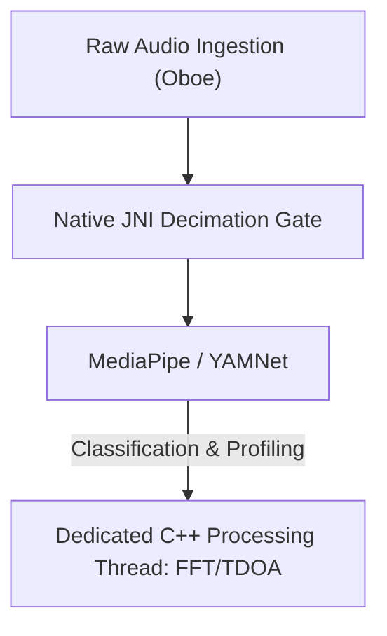

# Vigilant Ear 👂🛡️ (редакция для Android)

**Дата вступления в силу:** 6 июня 2026 г.

**Vigilant Ear** — продвинутый высокопроизводительный Android-инструмент акустических исследований и доступности, созданный для направленной и пространственной осведомлённости в реальном времени для сообщества глухих и слабослышащих (D/HH). Традиционное ПО распознавания звука определяет только *что* это за звук. **Vigilant Ear говорит, где он, кто его издаёт и что говорят.** Это комплексный тактический радар: edge-вычисления машинного обучения и акустическая физика отслеживают *откуда* идёт звук, его оценочное расстояние, траекторию пути и разделённые, переведённые слова отдельных говорящих.

---

## 🌍 Глобальный охват и локализация

Чтобы поддерживать пользователей по всему миру, платформа включает полную нативную матрицу локализации:

- **English**
- **Spanish (Español)**
- **Portuguese (Português)**
- **Chinese (简体中文)**
- **French (Français)**
- **German (Deutsch)**
- **Japanese (日本語)**
- **Arabic (العربية)**
- **Korean (한국어)**
- **Russian (Русский)**

Все тактические оверлеи, HUD-оповещения и меню настроек динамически подстраиваются под системную локаль.

---

## 🚀 Ключевые возможности

- **Умное энергосбережение и WakeLocks**: для долгой работы батареи и бережного отношения к ресурсам система реализует условный фоновый мониторинг с надёжными WakeLocks и Foreground Services. Если категории экстренных оповещений выключены, циклы захвата микрофона и движки обработки эффективно «засыпают».
- **Тактическая симуляция оповещений**: встроенный on-device симулятор позволяет проверять тактильные сигнатуры и визуальные реакции на критические дорожки `.emergency` — сирены, сигнализации, дверные звонки, люди рядом и суровая погода (включая ленты NWS, MeteoGate Europe и CMA/MEM China) — без реальных акустических триггеров.
- **Multi-Target Tracker (MTT)**: одновременно изолирует и отслеживает независимые звуковые сигнатуры окружения с уникальными session-маркерами и физическим persistence-mapping, используя уточняющие пороги для непрерывного трекинга.
- **Интеграция Shazam**: распознавание музыки окружения в реальном времени, динамически отображаемое на пространственном радаре.
- **Acoustic Radar HUD**: полностью живая тактическая панель с телеметрией питания, сети, задержки обработки и FPS (analysis Hz), плюс направленная сетка целей по азимуту и энергии.
- **Geographic Road Snapping**: проецирует относительные акустические азимуты на глобальные GPS-координаты, интеллектуально «прилипая» векторы транспорта к проверенным улицам.
- **Speaker Mode (живые направленные субтитры)**: расшифровывает речь людей рядом в строки субтитров — по одной на голос. Диаризация говорящих на устройстве разделяет голоса цветом и прокруткой, со стрелками направления к говорящему.
- **Живой перевод на устройстве**: расшифровывает и переводит иностранную речь в реальном времени. Весь конвейер — слышать, разделять говорящих, расшифровывать и переводить — работает на устройстве без облачной зависимости.

---

## 🧬 Архитектура и Neural Math Engine

На Android Vigilant Ear использует высокооптимизированную **Native SoundML Architecture** на C++ и realtime-аудиодвижке Oboe, чтобы обеспечить минимально возможную задержку на разном железе.

## ⚡ Архитектурное разделение

Чтобы UI-поток оставался полностью незаблокированным при непрерывном высокочастотном input tap, платформа строго разделяет Kotlin и C++:

- **Kotlin UI / Foreground Service**: жизненные циклы foreground service, разрешения, ориентация устройства и метрики геолокации для плавного HUD.
- **AcousticEngine (Native C++)**: низкоуровневые потоки Oboe и операции с железом. Буферы захвата глубоко копируются прямо на высокоприоритетном tap-потоке, передавая снимки в выделенную native-очередь обработки без остановки UI.

### 🧠 Продвинутый акустический конвейер

- **Dual-Classifier Architecture**: NPU-делегированный основной классификатор для критичного, высокочастотного профилирования звука, paired с CPU-делегированным neural ticker для непрерывной ambient-осведомлённости. Нагрузка ML-буферов активно мониторится, чтобы динамически троттлить inference-корутины и не допускать backlog захвата.
- **Acute vs. Broadband Physics**: логика трекинга различается по структуре звука. Резкие транзиенты (хлопки, разбитое стекло) нативно триггерятся строгими алгоритмами Peak (+16 dB) и RMS (+3.5 dB). Широкополосные звуки (музыка, транспорт) используют более низкие пороги уверенности (0.10f vs 0.25f) и интеллектуально «сеются» для непрерывного persistence.
- **Constraints & Refinement**: трекер группирует одинаковые звуки в пределах 25° spatial delta и точно «старит» их с помощью `tailMemory` из `AppGlobals`. UI-бродкасты трекинга аккуратно троттлятся, чтобы не жечь ресурсы.
- **Parallel Spatial Math**: высокопроизводительные математические пайплайны (`kiss_fft`, расчёты Time Difference of Arrival (TDOA) и Doppler-трекинг) выполняются целиком в выделенных native-асинхронных потоках.

### 📊 Бенчмарки производительности

- **Active Mode**: рассчитан на плавный comprehensive live HUD-трекинг.
- **Hardware Recovery**: надёжная реализация Oboe обеспечивает автоматическое, субсекундное восстановление при смене audio route (Bluetooth, наушники, динамик) без потери tracking-сессий.

---

## 🛠️ Технологический стек (2026)

- **Язык**: Kotlin (Coroutines, Channels), C++ (JNI, Native Audio)
- **Фреймворки**: Android SDK, Jetpack Compose (UI), Oboe (Real-time Audio), MediaPipe / YAMNet
- **Базовое железо**: устройства Android 10+ с поддерживаемым выравниванием стереомикрофонов для точности TDOA-азимута.

---

## 📊 Конфиденциальность и безопасность

- **Local-First Isolation**: все классификации аудио, спектральная математика и проекции азимута происходят исключительно на устройстве. «Сырые» аудиопотоки никогда не записываются, не кэшируются и не передаются ни при каких условиях.
- **Нет удалённой телеметрии и диагностики**: Vigilant Ear рассчитан на полностью локальную работу. Мы не собираем, не передаём и не храним удалённую телеметрию, журналы сбоев, диагностику или аналитику использования на наших серверах.

---

## ⚖️ Отказ от ответственности

Vigilant Ear — экспериментальное средство акустических исследований и пространственной доступности. Оно не сертифицировано как утилита жизнеобеспечения. Разрешение трекинга может динамически меняться в зависимости от топологии местности, погоды, ветра и калибровки микрофонов. Пользователи всегда должны сохранять обычную осведомлённость об окружении.

**Электронная почта:** [vigilantear@wingdingssocial.com](mailto:vigilantear@wingdingssocial.com)

Vigilant Ear — инструмент доступности, созданный с заботой. Пользуйтесь им ответственно.

Сделано с ❤️ для сообщества глухих и слабослышащих и акустических исследований.

© 2026 Wingdings, Inc.  
All rights reserved.
