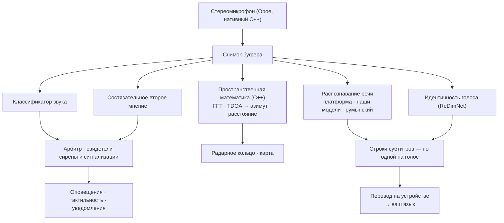

# Vigilant Ear 👂🛡️ (Android)

*Действует с Android 1.1.8 · сентябрь 2026.*

## Акустический радар для тех, кто не слышит.

Приложение, созданное специально для сообщества глухих, слабослышащих и CODA. Большинство приложений распознавания звука говорят, *что* это за звук. **Vigilant Ear говорит, где он, кто его издаёт и что говорят** — превращая Android-телефон в картину звука вокруг вас в реальном времени.

Направление сирены. Стук за спиной. Люди в разговоре, нарисованные как отдельные расшифрованные голоса. Если кто-то говорит на языке, который вы не читаете, слова могут прийти **переведёнными на ваш, на телефоне.**

Всё важное работает на устройстве. Аудио не записывается и не загружается для распознавания. Ничто не требует, чтобы вы что-то услышали.

- 🧭 **Направление, а не только обнаружение.** *Что, где* и *что сказано* — а не просто «что-то прозвучало».
- 📣 **Name Called.** Укажите своё имя, ребёнка, партнёра — «заказ для Marie готов» касается телефона, с направлением, когда его удалось измерить.
- 🔒 **Приватность по задумке.** Классификация, субтитры, перевод и идентичность голоса работают на вашем телефоне. Названные голоса шифруются на этом устройстве, и облачного пути для списка голосов нет.
- 🌐 **Auto-Translate для румынского.** Субтитры на румынском можно перевести на этом телефоне, на устройстве.
- 👁️ **Сделано для глухих / слабослышащих / CODA.** Различимая тактильная отдача на каждый звук, высокий контраст, подсказки без опоры только на цвет, крупные зоны нажатия.

---

## Для кого это

- **Глухие, слабослышащие и CODA-пользователи**, которым нужна ситуационная осведомлённость о звуке — стук, сигнализация, сирена, человек рядом — которую можно оставить включённой и которой можно доверять.
- Всем, кому нужны **живые субтитры с направлением и разделением говорящих** или **перевод на устройстве** речи людей рядом.
- Пользователям доступности и акустических исследований, интересующимся локализацией звука на устройстве.

> Vigilant Ear — **средство доступности**, а не сертифицированное устройство обеспечения безопасности жизни.

---

## Что оно делает

### 🧭 Видит звук — направление и расстояние
Используя два микрофона телефона, Vigilant Ear измеряет **угол, откуда пришёл звук**, и ставит его живым маркером на радарном кольце «носом вперёд» и на карте. Математика — когерентно взвешенная Time Difference of Arrival: предпочесть частотные полосы, в которых оба микрофона согласны, затем превратить крошечную задержку прихода в азимут. Два микрофона на одной линии сами по себе не различают лево и право, поэтому показание честно несёт эту неоднозначность, а не выдумывает сторону.

**Насколько хорошо это работает, зависит от вашей конкретной модели, и мы говорим какой.** Математике азимута нужно истинное расстояние между двумя микрофонами. Этот промежуток **физически измерен на трёх устройствах — Pixel 9, Pixel 9 Pro / Pro XL и Pixel 10a.** Любая другая модель работает с промежутком, оценённым по высоте корпуса: близко, но не измерено, и направление соответственно менее острое. Список в исходниках приложения и растёт по мере измерений; лучше назвать три, чем намекнуть на пятнадцать.

Расстояние — оценка по громкости, и показано как оценка. Опорная тишина комнаты, относительно которой идёт измерение, **измеряется на каждом устройстве**, а не предполагается — телефон учит свой собственный шумовой пол, а не берёт чужую константу.

### 🚨 Узнаёт важные звуки — и предупреждает
Классификатор на устройстве распознаёт сотни бытовых звуков и следит за критическими — **сирены, сигнализации, дверные звонки и стуки, плач ребёнка, человек рядом и суровая погода.** Работают два классификатора, а не один: основной и состязательное второе мнение, с арбитром между ними, чтобы плохой кадр одной модели не стал оповещением. Сирены и дымовые сигнализации получают сверху отдельное подтверждение — паттерн T3 дымового датчика — конкретный ритм, а не просто громкий писк.

Когда что-то срабатывает, вы получаете оповещение на экране, уведомление и **различимый рисунок вибрации на каждый звук** — число импульсов берётся из профиля самого звука, так что сигнализация в кармане не ощущается как дверной звонок.

Предупреждения о суровой погоде приходят из официальных публичных лент — **NWS** (США), **MeteoGate** (Европа), **CMA** (Китай), **KMA** (Корея), **JMA** (Япония), **ECCC** (Канада), **BOM** (Австралия), **INMET** (Бразилия) и **NDMA** (Индия) — бесплатно для всех и сужаются до тех, что покрывают ваше место. **Оповещения о землетрясениях** приходят из мировой ленты USGS: подтверждение, что то, что вы почувствовали, было землетрясением, а не раннее предупреждение.

### 💬 Speaker Mode — живые субтитры *(бесплатно)*
Включите Speaker Mode, и Vigilant Ear расшифровывает речь людей рядом в строки субтитров. Идентичность голоса на устройстве держит говорящих различными и цветокодированными, по голосовым отпечаткам, которые никогда не покидают телефон.

**Три распознавателя, выбранные за вас.** Приложение использует собственный распознаватель речи телефона для языков, которые он уже умеет, переходит на свои модели для тех, которых не умеет, и несёт отдельную румынскую модель для языка, который не умеет ни тот ни другой. Вы выбираете язык, а не движок.

Разделение по голосам есть и становится лучше. Относитесь к строкам как к *тому, что сказали рядом с вами*, с сильной подсказкой кто — не как к судебному протоколу о том, кто это сказал.

**Грубую лексику можно скрывать.** Включите — и ругательства заменяются символами, так что фраза читается и без слова. 🔴 **У этого есть настоящий предел, и мы его не замажем:** маскировку делает собственный распознаватель вашего телефона, поэтому она действует только на языки, которые этот распознаватель обрабатывает. Языки, которые субтитрируют наши скачанные модели, приходят без маски, что бы ни говорил переключатель.

**Субтитры приводят в порядок, а на некоторых телефонах — больше, чем в порядок.** Каждая строка проходит детерминированную очистку. На свежем железе Pixel и Galaxy, где доступен Gemini Nano, строки ещё получают корректурный проход. Это улучшение и никогда не зависимость — субтитрам это не нужно, и большинство телефонов этого не видят.

### 🌐 Auto-Translate — ваш язык, вживую *(Power Pack+)*
Когда человек рядом говорит на другом языке, Vigilant Ear определяет его и показывает субтитры **на вашем языке**. Определение, расшифровка и перевод работают на устройстве. Вам не нужно заранее знать или выбирать чужой язык.

**Румынский включён.** Определение, субтитры и Auto-Translate обрабатывают его на этом телефоне.

### 📣 Name Called
Следит в этих субтитрах за именами, которые вы укажете — своим, ребёнка, партнёра, именем, которое стойка вызывает для заказа. Когда одно произнесено, вы получаете одно оповещение, не второй пузырь субтитров, и направление, откуда пришёл голос, **когда это направление действительно измерили**. Список хранится в keystore устройства и никогда его не покидает.

### 🫧 Standing Watch и глубокий гул
**Standing Watch** — состояние самой комнаты, всегда включено и без настройки: ровная лампа, пока комната держит свой рисунок, изменение, когда что-то сдвигается.

**Барометр** телефона следит за волнами давления — погода, дверь, тяжёлый грузовик — и рисует их мягким кольцом, которое расширяется от того места, где вы есть. 🔴 **Намеренно без направления на нём.** Один датчик давления не может сказать, откуда пришла волна давления, а кольцо, которое заявило бы азимут, его бы выдумало.

### 📓 Witness Ear — необязательный журнал на 24 часа
По умолчанию выключен. Пока он включён, то, что приложение услышало и где, остаётся **на этом телефоне** до суток, готовое к экспорту простым PDF. Одна кнопка мгновенно стирает журнал. Это единственное в приложении, что что-то сохраняет, поэтому оно выключено, пока вы его не выберете.

### 🔗 Remote Link — связаться с тем, кого нет рядом *(Power Pack+)*
То, что обычно делает телефонный звонок, — через видео и текст. Вы отправляете код приглашения; другой человек входит из Vigilant Ear. Близость не нужна — вы можете быть где угодно. **Аудио не используется ни на каком этапе,** поэтому связь ни на одной стороне не зависит от слуха, и вы можете жестикулировать друг другу через приложение. Приложение несёт видео; остальное делаете вы двое.

### 🎵 Music ID *(Power Pack+)*
Распознаёт музыку вокруг вас и отслеживает смену песен. Детектор chroma-подписи первым владеет вопросом «музыка правда играет?», потому что общие классификаторы знаменито называют тихие комнаты и сирены «музыкой».

### 🪄 Feature Playground и обучающий тур
**Feature Playground** позволяет тренировать оповещения и смотреть, как срабатывают функции, не дожидаясь настоящего, всегда с водяным знаком, чтобы тренировка никогда не притворялась живым событием. **Обучающий тур** проходит карту, HUD, панель шестерёнки, настройки и Power Pack+, его можно повторить в любой момент из шапочки выпускника.

### ♿ Сначала доступность
Сделано для глухих / слабослышащих / CODA и пользователей с нарушением цветовосприятия: подсказки без опоры только на цвет, крупные зоны нажатия, мультимодальные оповещения (тактильность + визуал + на экране), вибрационные подписи на каждый звук и экран стартовой проверки, который точно показывает, какие разрешения выданы, отсутствуют или отказаны.

---

## Бесплатно и Power Pack+

Ядро безопасности **бесплатно навсегда**:

- **Звуковые оповещения** — сирены, сигнализации, стуки и дверные звонки, плач ребёнка, человек рядом, с тактильностью и уведомлениями.
- **Живые субтитры** — Speaker Mode, на устройстве, с разделением голосов и необязательным скрытием грубой лексики.
- **Name Called** — имена, которые вы вводите, с оповещением и направлением там, где его измерили.
- **Standing Watch** — состояние комнаты, всегда включено.
- **Оповещения о суровой погоде** — девять официальных национальных лент для вашего региона.
- **Оповещения о землетрясениях** — USGS, по всему миру.
- **Witness Ear** — необязательный журнал на 24 часа и его экспорт в PDF.
- **Feature Playground** и обучающий тур.

**Power Pack+** — одноразовая разблокировка — **не подписка** — с бесплатным пробным периодом. На Android добавляет ровно четыре вещи:

- **Auto-Translate** — перевод речи рядом на ваш язык на устройстве.
- **Music ID** — распознавание песен.
- **Remote Link** — размещение видео- и текстовой связи двух устройств.
- **Названные голоса** — дать имена людям, которых слышит приложение, чтобы их субтитры несли имя.

Перед покупкой приложение **зондирует ваш реальный телефон** и говорит, будет ли каждая из этих вещей на нём работать, работать медленно или не работать вовсе. Лучше потерять продажу, чем взять деньги за то, что этот аппарат не может выполнить.

Бесплатно или Power Pack+ — **ваше аудио остаётся на устройстве для распознавания**: уровень меняет, какие функции разблокированы, никогда — куда уходит звук.

---

## Как это работает

Захватить один раз на аудиопотоке высокого приоритета, скопировать буфер и раздать специалистам, которые никогда не блокируют друг друга и экран:

- **Kotlin и C++, строго разделены.** Kotlin владеет экраном, службой переднего плана, разрешениями и геолокацией. Нативный движок владеет микрофоном и математикой. Аудиобуферы копируются на потоке захвата и отдаются в нативную очередь, так что картинка не дёргается, пока телефон думает.
- **Определение языка — своя модель, а не догадка.** Приложение использует ту же модель VoxLingua107 ECAPA на каждой платформе, так что все отвечают на «какой это язык?» одинаково.
- **Погода и землетрясения идут противоположным путём от аудио.** Ничто из вашего звука не выходит; *данные* оповещений входят, через небольшой кэш, который мы держим, так что одно получение публичных данных служит каждому пользователю, и ваш телефон никогда не обращается к серверу чужого правительства напрямую.

---

## Что мы измерили — и чего нет

Мы не публиковали Android-цифры настольных тестов азимута и расстояния. **Этот документ их не выдумает.**

Определение языка уже меняли однажды: прежний детектор в комнате ответил *китайский* на румынскую речь. Уверенный неверный язык значит неверный распознаватель, а это субтитры, которые тихо бессмыслица — для читающего, который не слышит комнату, хуже, чем никаких субтитров.

**На Android ещё не измерено:** точность азимута против рулетки, точность расстояния против известных дальностей и точность разделения говорящих на настоящей записи. Пока этого нет, относитесь к направлению как к хорошему указанию, а к расстоянию — как к оценке.

Модели речи и голоса скачиваются, когда они вам впервые нужны, предпочтительно по Wi-Fi. Приложение спрашивает, прежде чем тянуть что-то большое. После этого распознавание офлайн.

---

## Конфиденциальность

- **На устройстве, всегда, для основного конвейера.** Классификация, пространственная математика, расшифровка, идентичность голоса и перевод работают на вашем телефоне. Сырое аудио никогда не записывается, не кэшируется и не передаётся.
- **Названные голоса остаются здесь.** Голосовые отпечатки шифруются ключом в Android Keystore, который никогда не покидает устройство. **Облачного пути для списка голосов нет.** Если телефон сбросить, отпечатки нечитаемы, и вы записываете их заново — это правильное поведение, а не ограничение.
- **Субтитры недолговечны**, если вы сознательно не включите Witness Ear, и этот журнал локальный, ограничен 24 часами и стирается одной кнопкой.
- **Нет рекламы и поведенческой аналитики.** Сеть ограничена картами, публичным кэшем оповещений, необязательным распознаванием песен, дорожным контекстом и биллингом Play.

Подробности: [PRIVACY.md](PRIVACY.md) · [TERMS.md](TERMS.md) · [SUPPORT.md](SUPPORT.md)

---

## Оборудование

- **Android 13 или новее.**
- **Стереомикрофоны** нужны для определения направления; острее всего на устройствах, у которых промежуток между микрофонами физически измерен.

---

## Локализация

Интерфейс, оповещения и субтитры переведены на **английский, испанский, португальский (Бразилия), французский, немецкий, итальянский, турецкий, арабский, японский, упрощённый китайский, корейский, русский и хинди** — 13 языков, по системному языку или ручному выбору в приложении. Румынские субтитры и Auto-Translate работают в этой сборке.

---

## Статус и отказ от ответственности

Vigilant Ear — **экспериментальное средство акустической доступности**, а не сертифицированная утилита безопасности жизни. Направление и расстояние меняются с окружением, погодой, ветром и микрофонным железом. **Всегда сохраняйте обычную осведомлённость об окружении** — не полагайтесь на него как на единственный источник сведений о безопасности.

---

**Контакт:** [vigilantear@wingdingssocial.com](mailto:vigilantear@wingdingssocial.com)

Сделано с ❤️ для сообщества D/HH и акустических исследований.

    
  <strong>© 2026 Wingdings, Inc.</strong> 
  All rights reserved. 
  Patent Pending

