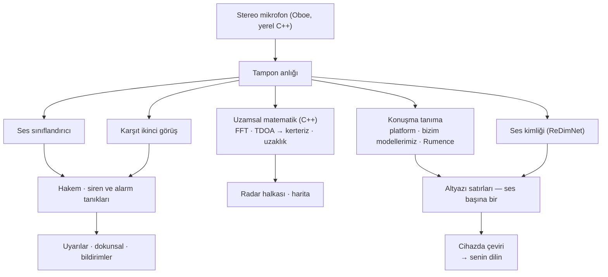

# Vigilant Ear 👂🛡️ (Android)

*Android 1.1.8 sürümünden itibaren geçerlidir · Eylül 2026.*

## Duyamayan insanlar için akustik bir radar.

Sağır, az duyan ve CODA topluluğu için özel yapılmış bir uygulama. Çoğu ses tanıma uygulaması bir sesin *ne* olduğunu söyler. **Vigilant Ear nerede olduğunu, kimin yaptığını ve ne söylendiğini söyler** — bir Android telefonu çevrendeki sesin gerçek zamanlı bir resmine çevirir.

Bir sirenin yönü. Arkanındaki bir vuruş. Bir konuşmadaki insanlar, ayrı transkribe sesler olarak çizilmiş. Okumadığın bir dilde konuşuluyorsa sözcükler **senin diline çevrilmiş, telefonda** gelebilir.

Önemli olan her şey cihazda çalışır. Ses tanıma için kaydedilmez veya yüklenmez. Hiçbir şey bir şey duymaya bağlı değildir.

- 🧭 **Yalnızca algılama değil, yön.** *Ne, nerede* ve *ne söylendi* — yalnızca “bir ses oldu” değil.
- 📣 **Name Called.** Adını, bir çocuğu, bir eşi listele — “Marie için sipariş hazır” telefona dokunur, yön ölçülebildiyse yönle.
- 🔒 **Tasarım gereği özel.** Sınıflandırma, altyazı, çeviri ve ses kimliği telefonunda çalışır. Adlandırılmış sesler bu cihazda şifrelenir ve ses listesi için bir bulut yolu yoktur.
- 🌐 **Rumence Auto-Translate.** Rumence altyazılar bu telefonda, cihazda çevrilebilir.
- 👁️ **Sağır / az duyan / CODA için.** Sese göre belirgin dokunsal, yüksek karşıtlık, renkten bağımsız ipuçları, büyük dokunma hedefleri.

---

## Kimin için

- Sesin durum farkındalığını isteyen **sağır, az duyan ve CODA kullanıcılar** — vuruş, alarm, siren, yakındaki kişi — açık bırakıp güvenebileceğin.
- **Yön ve konuşmacı ayrımıyla canlı altyazı** veya yakındaki insanların **cihazda çevirisine** ihtiyaç duyan herkes.
- Cihazda ses yerelleştirmesiyle ilgilenen erişilebilirlik ve akustik araştırma kullanıcıları.

> Vigilant Ear bir erişilebilirlik **yardımcısıdır**, sertifikalı bir hayat kurtarma cihazı değildir.

---

## Ne yapar

### 🧭 Sesi görür — yön ve uzaklık
Telefonun iki mikrofonunu kullanarak Vigilant Ear bir sesin **hangi açıdan geldiğini** ölçer ve onu baş yukarı radar halkası ile haritada canlı bir işaret olarak yerleştirir. Matematik, bağdaşıklık ağırlıklı Time Difference of Arrival: her iki mikrofonun anlaştığı frekans bantlarını yeğle, sonra o minik varış gecikmesini kerterize çevir. Bir çizgideki iki mikrofon tek başına solu sağdan ayıramaz, bu yüzden okuma bu belirsizliği uydurulan bir yan yerine dürüst taşır.

**Bunun ne kadar iyi çalıştığı tam telefonuna bağlıdır, ve hangisi olduğunu söyleriz.** Kerteriz matematiği iki mikrofon arasındaki gerçek mesafeyi ister. O aralık **üç cihazda fiziksel ölçülmüştür — Pixel 9, Pixel 9 Pro / Pro XL ve Pixel 10a.** Diğer her model, gövde yüksekliğinden tahmin edilen bir aralıkla çalışır; yakın ama ölçülmemiş, yön de o ölçüde daha az keskin. Liste uygulamanın kendi kaynağındadır ve cihazlar ölçüldükçe büyür; on beş ima etmektense üçü adlandırmayı yeğleriz.

Uzaklık ses yüksekliğinden bir tahmindir ve olduğu gibi, tahmin olarak gösterilir. Ölçümün dayandığı sessiz oda referansı **cihaz başına ölçülür**, varsayılmaz — telefon kendi gürültü tabanını öğrenir, bir sabiti ödünç almaz.

### 🚨 Önemli sesleri tanır — ve seni uyarır
Cihazda bir sınıflandırıcı yüzlerce gündelik sesi tanımlar ve kritik olanları izler — **sirenler, alarmlar, kapı zilleri ve vuruşlar, bebek ağlaması, yakındaki bir kişi ve şiddetli hava.** Bir değil iki sınıflandırıcı çalışır: bir birincil ve karşıt bir ikinci görüş, aralarında bir hakem; tek bir modelin kötü karesi uyarı olmasın. Sirenler ve duman alarmları bunun üstüne ayrı onay alır — bir duman dedektörünün T3 örüntüsü belirli bir ritimdir, yalnızca yüksek bir bip değil.

Bir şey ateşleyince ekranda bir uyarı, bir bildirim ve **sese göre belirgin bir titreşim örüntüsü** alırsın — darbe sayısı sesin kendi profilinden gelir, böylece bir alarm cepten kapı zili gibi gelmez.

Şiddetli hava uyarıları resmi kamu akışlarından gelir — ABD **NWS**, Avrupa **MeteoGate**, **Çin CMA**, **Kore KMA**, **Japonya JMA**, **Kanada ECCC**, **Avustralya BOM**, **Brezilya INMET** ve **Hindistan NDMA** — tüm kullanıcılar için ücretsiz, bulunduğun yeri kapsayanlara daraltılmış. **Deprem uyarıları** USGS’nin dünya çapı akışından gelir: hissettiğin şeyin bir deprem olduğunun onayı, erken uyarı değil.

### 💬 Speaker Mode — canlı altyazılar *(ücretsiz)*
Speaker Mode’u aç, Vigilant Ear yakında konuşan insanları altyazı satırlarına döker. Cihazda ses kimliği konuşmacıları ayrı ve renk kodlu tutar, telefonu hiç bırakmayan ses izlerinden.

**Üç tanıyıcı, senin için seçilmiş.** Uygulama, telefonunun kendi konuşma tanıyıcısını zaten hallettiği diller için kullanır, halletemedikleri için kendi modellerine düşer ve ikisinin de yapamadığı dil için ayrı bir Rumence model taşır. Sen bir dil seçersin, bir motor değil.

Sese göre ayırma vardır ve gelişmektedir. Satırları *yanında ne söylendi* diye tut, kim olduğuna dair güçlü bir ipucuyla — kimin söylediğinin mahkeme kaydı olarak değil.

**Sert dil gizlenebilir.** Aç, küfürler simgelerle değişir; cümle sözcük olmadan da okunur. 🔴 **Bunun gerçek bir sınırı var ve üstünü örtmeyeceğiz:** gizlemeyi telefonunun kendi tanıyıcısı yapar, yani yalnızca o tanıyıcının hallettiği dillere uygulanır. Bizim indirilen modellerimizin altyazıladığı diller, anahtar ne derse desin, gizlenmeden gelir.

**Altyazılar toparlanır, bazı telefonlarda toparlanmanın ötesinde.** Her satır belirleyici bir temizlikten geçer. Gemini Nano’nun olduğu güncel Pixel ve Galaxy donanımında satırlar bir düzeltme geçişi de alır. Bu bir iyileştirmedir, asla bir bağımlılık değil — altyazıların buna ihtiyacı yoktur ve çoğu telefon bunu hiç görmez.

### 🌐 Auto-Translate — senin dilin, canlı *(Power Pack+)*
Yakındaki biri başka bir dil konuşunca Vigilant Ear bunu algılar ve altyazılarını **senin dilinde** çizer. Algılama, yazıya dökme ve çeviri hep cihazda çalışır. Diğer dili önceden bilmen veya seçmen gerekmez.

**Rumence dahildir.** Algılama, altyazı ve Auto-Translate hepsi bunu bu telefonda halleder.

### 📣 Name Called
Bu altyazılarda listelediğin adları izler — senin, bir çocuğun, bir eşin, bir gişenin sipariş için seslendiği ad. Biri söylenince ikinci bir altyazı balonu değil bir uyarı alırsın, ve sesin geldiği yön **o yön gerçekten ölçüldüğünde**. Liste cihazın keystore’unda tutulur ve onu hiç bırakmaz.

### 🫧 Standing Watch ve derin uğultu
**Standing Watch** odanın kendi durumudur, yapılandıracak bir şey yok, her zaman açık: oda örüntüsünü korurken durağan bir lamba, bir şey kayınca bir değişim.

Telefonun **barometresi** basınç dalgalarını izler — hava, bir kapı, ağır bir kamyon — ve onları bulunduğun yerden genişleyen yumuşak bir halka olarak çizer. 🔴 **Bilerek üzerinde yön yok.** Tek bir basınç duyargası bir basınç dalgasının hangi yönden geldiğini söyleyemez; kerteriz iddia eden bir halka onu uydurmuş olur.

### 📓 Witness Ear — isteğe bağlı 24 saatlik bir günlük
Varsayılan kapalı. Açıkken uygulamanın duyduğu ve nerede olduğu **bu telefonda** bir güne kadar kalır, yalın bir PDF olarak dışa aktarmaya hazır. Bir düğme günlüğü anında siler. Uygulamada bir şey tutan tek şey budur; bu yüzden sen seçene dek kapalıdır.

### 🔗 Remote Link — yanında olmayan birine ulaş *(Power Pack+)*
Bir telefon aramasının normalde yaptığı şey, video ve metinle. Bir davet kodu gönderirsin; diğer kişi Vigilant Ear içinden katılır. Yakınlık gerekmez — ikiniz her yerde olabilirsiniz. **Hiçbir noktada ses kullanılmaz,** bu yüzden bağın iki uçta da işitmeye bağlı bir yanı yoktur ve uygulama üzerinden biriyle işaretleşmene yol verir. Uygulama videoyu taşır; gerisini ikiniz yaparsınız.

### 🎵 Music ID *(Power Pack+)*
Çevrende çalan müziği tanır ve şarkı değişimlerini izler. Bir kroma imza algılayıcısı önce “gerçekten müzik çalıyor mu?” sorusunun sahibidir, çünkü genel sınıflandırıcılar sessiz odaları ve sirenleri ünlü biçimde “müzik” der.

### 🪄 Feature Playground ve rehberli bir tur
**Feature Playground** gerçek şeyi beklemeden uyarı alıştırmanı ve özelliklerin tetiklenmesini görmeni sağlar, her zaman filigranlı; alıştırma asla canlı olay gibi durmasın. Bir **rehberli tur** haritayı, HUD’u, dişli panelini, tercihleri ve Power Pack+’ı gezer, mezuniyet kepinden istediğin zaman yeniden oynatılır.

### ♿ Önce erişilebilirlik
Sağır / az duyan / CODA ve renk körü kullanıcılar için: renkten bağımsız ipuçları, büyük dokunma hedefleri, çok kipli uyarılar (dokunsal + görsel + ekranda), sese göre titreşim imzaları ve hangi izinlerin verildiğini, eksik veya reddedildiğini tam gösteren bir başlangıç doğrulama ekranı.

---

## Ücretsiz ve Power Pack+

Güvenlik çekirdeği **sonsuza dek ücretsizdir**:

- **Ses uyarıları** — sirenler, alarmlar, vuruşlar ve kapı zilleri, bebek ağlaması, yakındaki kişi, dokunsal ve bildirimlerle.
- **Canlı altyazılar** — Speaker Mode, cihazda, ses ayrımı ve isteğe bağlı sert dil gizlemesiyle.
- **Name Called** — yazdığın adlar, ölçüldüğü yerde yönle uyarılır.
- **Standing Watch** — odanın durumu, her zaman açık.
- **Şiddetli hava uyarıları** — bölgen için dokuz resmi ulusal akış.
- **Deprem uyarıları** — USGS, dünya çapı.
- **Witness Ear** — isteğe bağlı 24 saatlik günlük ve PDF dışa aktarımı.
- **Feature Playground** ve rehberli tur.

**Power Pack+** tek seferlik kilit açmadır — **abonelik değil** — ücretsiz denemeyle. Android’de tam dört şey ekler:

- **Auto-Translate** — yakındaki konuşmanın senin diline cihazda çevirisi.
- **Music ID** — şarkı tanıma.
- **Remote Link** — iki cihazlık bir video ve metin bağını barındırma.
- **Adlandırılmış sesler** — uygulamanın duyduğu insanları adlandırma, altyazıları adlarını taşısın.

Satın almadan önce uygulama **asıl telefonunu yoklar** ve bunların her birinin onda çalışacağını, yavaş çalışacağını veya hiç çalışmayacağını söyler. Bu aygıtın koşturamayacağı bir şey için para almaktansa satışı kaybetmeyi yeğleriz.

Ücretsiz veya Power Pack+, **sesin tanıma için cihazda kalır** — katman yalnızca hangi özelliklerin açık olduğunu değiştirir, sesin nereye gittiğini asla.

---

## Nasıl çalışır

Yüksek öncelikli bir ses iş parçacığında bir kez yakala, tamponu kopyala ve birbirini veya ekranı asla tıkamayan uzmanlara dağıt:

- **Kotlin ve C++, sıkı ayrılmış.** Kotlin ekranın, ön plan hizmetinin, izinlerin ve konumun sahibidir. Yerel bir motor mikrofonun ve matematiğin sahibidir. Ses tamponları yakalama iş parçacığında kopyalanır ve yerel bir kuyruğa verilir; telefon düşünürken resim takılmaz.
- **Dil kimliği kendi modelidir, bir tahmin değil.** Uygulama her platformda aynı VoxLingua107 ECAPA modelini kullanır; hepsi “bu hangi dil?” sorusuna aynı biçimde cevap verir.
- **Hava ve depremler sesin ters yolunu tutar.** Sesinden hiçbir şey dışarı çıkmaz; uyarı *verisi* içeri gelir, işlettiğimiz küçük bir önbellekten, böylece kamu verisinin bir çekimi her kullanıcıya hizmet eder ve telefonun asla yabancı bir hükümetin sunucusuna doğrudan bağlanmaz.

---

## Ne ölçtük — ve ne ölçmedik

Yön ve uzaklık için Android masa testi rakamları yayımlamadık. **Bu belge onları uydurmayacak.**

Dil kimliği bir kez zaten değiştirildi: önceki algılayıcı, bir odada, Rumence konuşmaya *Çince* dedi. Kendinden emin yanlış bir dil yanlış tanıyıcı demektir, o da sessizce saçma altyazı demektir — odayı duyamayan bir okur için hiç altyazıdan daha kötü.

**Android’de henüz ölçülmedi:** şerit metreye karşı kerteriz doğruluğu, bilinen menzillere karşı uzaklık doğruluğu ve gerçek bir kayıtta konuşmacı ayrımı doğruluğu. Ölçülene dek yönü iyi bir işaret, uzaklığı bir tahmin say.

Konuşma ve ses modelleri ilk ihtiyaç duyduğunda iner, yeğlenen Wi-Fi üzerinden. Uygulama büyük bir şey çekmeden önce sorar. Ondan sonra tanıma çevrimdışıdır.

---

## Gizlilik

- **Çekirdek hat için her zaman cihazda.** Sınıflandırma, uzamsal matematik, yazıya dökme, ses kimliği ve çeviri telefonunda çalışır. Ham ses asla kaydedilmez, önbelleğe alınmaz veya iletilmez.
- **Adlandırılmış sesler burada kalır.** Ses izleri, cihazı hiç bırakmayan Android Keystore’daki bir anahtarla şifrelenir. **Ses listesi için bir bulut yolu yoktur.** Telefon sıfırlanırsa izler okunamaz ve yeniden kaydolursun — bu doğru davranıştır, bir kısıtlama değil.
- **Altyazılar geçicidir** sen bilinçle Witness Ear’ı açmadıkça; o günlük yereldir, 24 saatle sınırlıdır ve bir düğmeyle silinir.
- **Reklam veya davranışsal analitik yok.** Ağ kullanımı haritalar, kamu uyarı önbelleği, isteğe bağlı şarkı tanıma, yol bağlamı ve Play faturalamasıyla sınırlıdır.

Ayrıntılar: [PRIVACY.md](/tr/privacy/) · [TERMS.md](/tr/terms/) · [SUPPORT.md](/tr/support/)

---

## Donanım

- **Android 13 veya daha yeni.**
- **Stereo mikrofonlar** yön bulmak için gerekir; mikrofon aralığı fiziksel ölçülmüş cihazlarda en keskin.

---

## Yerelleştirme

Arayüz, uyarılar ve altyazılar **İngilizce, İspanyolca, Portekizce (Brezilya), Fransızca, Almanca, İtalyanca, Türkçe, Arapça, Japonca, Basitleştirilmiş Çince, Korece, Rusça ve Hintçe** dillerine çevrilmiştir — 13 dil, sistem dilini veya uygulamadaki elle seçimi izler. Bu derlemede Rumence altyazılar ve Auto-Translate çalışır.

---

## Durum ve feragat

Vigilant Ear **deneysel bir akustik erişilebilirlik yardımcısıdır**, sertifikalı bir hayat kurtarma aracı değil. Yön ve uzaklık çevre, hava, rüzgar ve mikrofon donanımıyla değişir. **Her zamanki çevre farkındalığını koru** — güvenlik bilgisinin tek kaynağı olarak ona bel bağlama.

---

**İletişim:** [vigilantear@wingdingssocial.com](mailto:vigilantear@wingdingssocial.com)

D/HH topluluğu ve akustik araştırma için ❤️ ile yapıldı.

    
  <strong>© 2026 Wingdings, Inc.</strong> 
  All rights reserved. 
  Patent Pending

