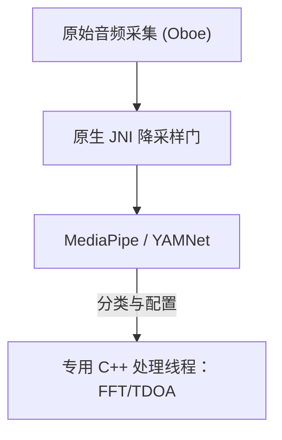

# Vigilant Ear 👂🛡️ (Android Edition)

**生效日期：** 2026年6月6日

**Vigilant Ear** 是一款先进的超高性能 Android 声学研究与无障碍工具，专为聋人和听力障碍（D/HH）群体设计，提供实时的方向和空间感知功能。传统的环境音识别软件只能识别声音*是什么*。**Vigilant Ear 能够告诉您声音在哪里、是谁发出的，以及他们说了什么。** 它充当着一个全面的战术雷达，结合边缘计算机器学习与复杂的声学物理，精确追踪声音的发源*地*、预估距离、绝对轨迹路径，以及不同说话者独立翻译出的词句。

---

## 🌍 全球覆盖与本地化

为了支持全球用户，该平台配备了完整的原生本地化矩阵，支持：

- **英语 (English)**
- **西班牙语 (Español)**
- **葡萄牙语 (Português)**
- **中文 (简体中文)**
- **法语 (Français)**
- **德语 (Deutsch)**
- **日语 (日本語)**
- **阿拉伯语 (العربية)**

所有战术覆盖、HUD 警报以及首选项菜单都会根据系统语言环境动态调整。

---

## 🚀 核心功能与特性

- **智能电源门控与唤醒锁 (WakeLocks)：** 为了最大限度延长电池寿命并保护系统资源，系统采用强大的唤醒锁和前台服务实现条件性后台监控。如果紧急警报类别被禁用，麦克风采集循环和处理引擎将高效进入休眠状态。
- **战术警报模拟：** 包含一个强大的设备端模拟套件，允许用户在没有真实声学触发的情况下，测试关键的 `.emergency` 声音（如警笛、警报、门铃、附近的人和恶劣天气——包括 NWS、欧洲 MeteoGate 和中国气象局 CMA/MEM 数据源）的触觉特征和视觉响应。
- **多目标追踪器 (MTT)：** 使用独特的会话标记与物理持久性映射结合，同时隔离和追踪独立的环境声音特征，并利用高级细化阈值进行持续追踪。
- **Shazam 集成：** 实时识别环境音乐并动态映射到空间雷达上。
- **声学雷达 HUD：** 这是一个完全实时的战术仪表盘，提供有关系统电源、网络容量、处理延迟和 FPS（分析 Hz）的实时遥测数据，同时通过一个按方位角和能量追踪环境声学目标的定向网格来显示。
- **地理道路贴合：** 将相对的数学声学方位角投影到全球 GPS 坐标上，智能地将实时车辆矢量贴合到已验证的街道上。
- **说话者模式 (实时定向字幕)：** 将附近说话的人的话语转录成字幕行，每个声音一行。设备端的说话者日志化使用独特的颜色和滚动线条分离声音，并配有指向说话者位置的定向箭头。
- **实时设备端翻译：** 实时转录和翻译外语。整个处理流程——聆听、分离说话者、转录和翻译——完全在设备端运行，不依赖云端。

---

## 🧬 核心架构与神经数学引擎

Android 版的 Vigilant Ear 使用基于 C++ 处理和 Oboe 实时音频引擎的深度优化的**原生 SoundML 架构**，以确保在各种硬件上实现尽可能低的延迟。

## ⚡ 架构解耦

为了在持续处理高频输入采集时保持 UI 线程完全不被阻塞，平台采用了严格的 Kotlin 和 C++ 分离：

- **Kotlin UI / 前台服务：** 管理前台服务生命周期、权限、设备方向状态和位置指标，以顺畅地驱动 HUD。
- **声学引擎 (原生 C++)：** 管理低级别的 Oboe 音频流和硬件操作。采集缓冲区直接在高优先级的采集线程上深度复制，将快照直接传递给专门的原生处理队列，而不会使 UI 停滞。

### 🧠 高级声学处理流程

- **双分类器架构：** 利用委托给 NPU 的主分类器进行关键的、高频的声音配置，并配合委托给 CPU 的神经心跳进行持续的环境声音感知。ML 缓冲区负载受到主动监控，以动态限制推理协程，防止采集积压。
- **锐度 vs 宽带物理：** 根据声音结构区分追踪逻辑。锐利的瞬态声音（如拍手声和玻璃破碎声）通过严格的峰值 (+16dB) 和 RMS (+3.5dB) 算法原声触发。宽带声音（如音乐和车辆）使用特定的较低置信度阈值（0.10f 对比 0.25f），并被智能播种以确保持续的追踪持久性。
- **约束与细化：** 追踪器将 25 度空间增量内的相同声音分组，并使用 `AppGlobals` 中的 `tailMemory` 约束进行精准的老化处理。对 UI 的追踪广播经过精心节流以防止资源耗尽。
- **并行空间数学：** 高性能数学流水线（包括 `kiss_fft`、到达时间差 (TDOA) 计算和多普勒追踪算法）完全在专用的原生异步线程中执行。

### 📊 性能基准测试

- **活跃模式：** 旨在顺畅地提供全面的实时 HUD 追踪。
- **硬件恢复：** 稳健的 Oboe 实现确保在音频路由变更（蓝牙、耳机、扬声器切换）时自动在亚秒级恢复，而不会丢失追踪会话。

---

## 🛠️ 技术栈 (2026)

- **语言：** Kotlin (协程、通道)，C++ (JNI、原生音频)
- **框架：** Android SDK，Jetpack Compose (UI)，Oboe (实时音频)，MediaPipe / YAMNet
- **硬件基线：** 搭载受支持的立体声麦克风阵列的 Android 10+ 设备，用于 TDOA 方位精度。

---

## 📊 隐私与安全防护措施

- **本地优先隔离：** 所有音频分类、频谱数学和方位角投影均在设备端独占进行。在任何情况下都绝对不会记录、缓存或传输原始音频流。
- **无远程遥测或诊断：** Vigilant Ear 旨在完全在您的设备本地运行。我们不会收集、传输或在服务器上存储任何远程遥测、崩溃日志、诊断记录或使用分析数据。

---

## ⚖️ 免责声明

Vigilant Ear 是一款实验性的声学研究和空间无障碍辅助工具。它未被认证为生命安全实用程序。追踪分辨率可能会根据区域拓扑结构、当前天气、风力条件和麦克风硬件校准动态波动。用户必须始终保持正常的环境感知。

**联系邮箱：** [vigilantear@wingdingssocial.com](mailto:vigilantear@wingdingssocial.com)

Vigilant Ear 是一款用心打造的无障碍工具。请负责任地使用。

为 D/HH 社区和声学研究倾注 ❤️ 打造。

© 2026 Wingdings, Inc.  
保留所有权利。
