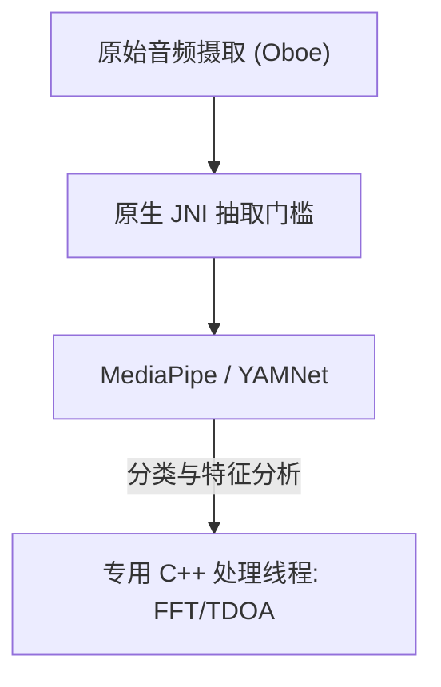

# VigilantEar 👂🛡️ (Android 版本)

**生效日期：** 2026年6月6日

**VigilantEar** 是一款先进的、超高性能的 Android 声学研究与无障碍辅助工具，专为失聪及听力障碍 (D/HH) 群体提供实时的方向与空间感知。传统的声音识别软件只能识别声音是*什么*；VigilantEar 作为一个综合性的战术雷达，结合了边缘计算的机器学习与复杂的声学物理学，能够精确追踪声音来自*哪里*、估计的距离，以及其绝对路径轨迹。

---

## 🌍 全球覆盖与本地化

为了支持全球用户，该平台配备了完整的原生本地化矩阵，支持：

- **英语 (English)**
- **西班牙语 (Español)**
- **葡萄牙语 (Português)**
- **中文 (简体中文)**
- **法语 (Français)**
- **德语 (Deutsch)**
- **日语 (日本語)**

所有战术叠加层、HUD 警报以及首选项菜单都会根据系统语言环境动态调整。

---

## 🚀 核心功能与特性

- **智能电源管理与唤醒锁 (WakeLocks)**：为最大限度延长电池寿命并保护系统资源，系统通过强大的唤醒锁和前台服务 (Foreground Services) 实现了条件性后台监控。如果禁用了紧急警报类别，麦克风采样循环和处理引擎将高效地进入休眠状态。
- **战术警报模拟**：包含强大的设备端模拟套件，允许用户测试关键 `.emergency` 轨迹的触觉反馈和视觉响应，如警笛、警报、门铃、附近人员以及恶劣天气（包括美国国家气象局 NWS、欧洲 MeteoGate 和中国 CMA/MEM 的数据源），无需真实的声学触发条件。
- **多目标追踪器 (MTT)**：使用唯一的会话标记结合物理持久性映射，同时隔离并追踪独立的环境声音特征，并利用高级微调阈值实现持续追踪。
- **Shazam 集成**：实时环境音乐识别，并将其动态映射到空间雷达上。
- **地理道路吸附**：将相对数学声学方位角投影到全球 GPS 坐标上，将实时车辆矢量智能地吸附到已验证的街道上。

---

## 🧬 核心架构与神经数学引擎

Android 上的 VigilantEar 采用了高度优化的 **原生 SoundML 架构 (Native SoundML Architecture)**，它围绕 C++ 处理和 Oboe 实时音频引擎构建，以确保在各种硬件上实现尽可能低的延迟。

## ⚡ 架构解耦

为在持续处理高频输入的同时保持 UI 线程完全不被阻塞，平台在 Kotlin 和 C++ 之间使用了严格的分离：

- **Kotlin UI / 前台服务**：管理前台服务生命周期、权限、设备方向状态和位置指标，以流畅驱动 HUD。
- **声学引擎 (原生 C++)**：管理底层的 Oboe 音频流和硬件操作。输入缓冲区在最高优先级线程上被直接深拷贝，将快照直接传递给专用的原生处理队列，而不会使 UI 停滞。

### 🧠 高级声学流水线

- **双分类器架构**：使用委托给 NPU 的主分类器进行关键的、高频的声音分析，并辅以委托给 CPU 的神经心跳机制进行持续的环境声音感知。ML 缓冲区负载受到主动监控，以动态限制推理协程，防止输入积压。
- **瞬态与宽带物理**：根据声音结构区分追踪逻辑。剧烈的瞬态声音（如拍手声和玻璃破碎声）通过严格的峰值 (+16dB) 和均方根 (+3.5dB) 算法在原生层触发。宽带声音（如音乐和车辆）使用特定的较低置信度阈值（0.10f 与 0.25f），并通过智能播种来确保持续的追踪稳定性。
- **约束与微调**：追踪器将在 25 度空间差以内的相同声音进行分组，并利用来自 `AppGlobals` 的 `tailMemory` 约束来精确老化它们。向 UI 的追踪广播经过了仔细限流以防资源消耗。
- **并行空间计算**：高性能数学流水线（包括 `kiss_fft`、到达时间差 (TDOA) 计算和多普勒跟踪算法）完全在专用的原生异步线程中执行。

### 📊 性能基准测试

- **活跃模式**：旨在流畅地提供全面的实时 HUD 追踪。
- **硬件恢复**：强大的 Oboe 实现可确保在音频路由发生改变（蓝牙、耳机、扬声器切换）时，在一秒内自动恢复，而不会丢失追踪会话。

---

## 🛠️ 技术栈 (2026)

- **语言**：Kotlin (协程, 通道), C++ (JNI, 原生音频)
- **框架**：Android SDK, Jetpack Compose (UI), Oboe (实时音频), MediaPipe / YAMNet
- **硬件基准**：运行 Android 10+ 的设备，需要支持的立体声麦克风对齐以保证 TDOA 方位精度。

---

## 📊 隐私与安全护栏

- **本地优先隔离**：所有音频分类、频谱计算和方位投影完全在设备端进行。在任何情况下绝不会录制、缓存或传输原始音频流。
- **无远程遥测或诊断**：VigilantEar 旨在完全在您的设备本地运行。我们不会在我们的服务器上收集、传输或存储任何远程遥测、崩溃日志、诊断记录或使用分析。

---

## ⚖️ 免责声明

VigilantEar 是一个实验性的声学研究与空间无障碍辅助工具。它未经认证为生命安全设施。追踪分辨率可能会根据区域地形、当前天气、风况以及麦克风硬件校准情况而动态波动。用户必须始终保持对环境的正常感知。

**联系邮箱：** [vigilantear@wingdingssocial.com](mailto:vigilantear@wingdingssocial.com)

VigilantEar 是一款用心打造的无障碍工具。请负责任地使用。

用 ❤️ 为失聪及听力障碍群体及声学研究而作。

© 2026 Wingdings, Inc.  
保留所有权利。
