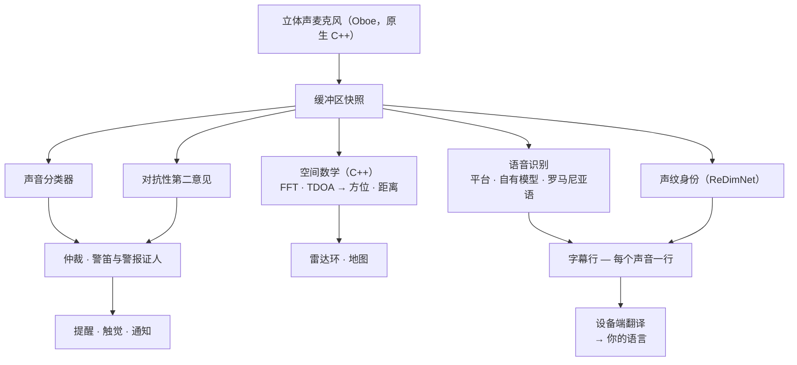

# Vigilant Ear 👂🛡️ (Android)

*自 Android 1.1.8 起生效 · 2026 年 9 月。*

## 为听不到声音的人准备的声学雷达。

这是一款专为聋人、重听及 CODA 群体打造的应用。大多数声音识别应用只会告诉你声音是*什么*。**Vigilant Ear 告诉你声音在哪里、是谁发出的，以及他们在说什么** —— 把一部 Android 手机变成周围声音的实时画面。

警笛的方向。身后的敲门声。对话里的人被画成各自独立的转录声线。如果有人说的是你看不懂的语言，他们的话可以**译成你的语言，就在这部手机上。**

要紧的事都在设备上完成。音频不会为了识别而被录制或上传。任何环节都不依赖听力。

- 🧭 **不只是检测，还有方向。** *是什么、在哪里，* 以及 *说了什么* —— 而不只是“有声音”。
- 📣 **Name Called.** 登记你的名字、孩子、伴侣 —— “Marie 的订单好了”会轻震手机，能测到时还带方向。
- 🔒 **天生注重隐私。** 分类、字幕、翻译和声纹身份都在你的手机上运行。已命名的声音在本机加密，没有把名册送上云端的路径。
- 🌐 **罗马尼亚语 Auto-Translate。** 罗马尼亚语字幕可以在这部手机上、在设备内翻译。
- 👁️ **为聋人 / 重听 / CODA 而做。** 按声音区分的触觉、高对比视觉、不依赖颜色的提示、足够大的点击目标。

---

## 为谁而做

- **希望掌握声音环境态势的聋人、重听及 CODA 用户** —— 敲门、警报、警笛、附近的人 —— 可以一直开着并放心依赖。
- 任何需要**带方向与说话人分离的实时字幕**，或需要对身边人做**设备端翻译**的人。
- 对设备端声音定位感兴趣的辅助功能与声学研究用户。

> Vigilant Ear 是辅助功能**辅助工具**，不是经认证的生命安全设备。

---

## 它能做什么

### 🧭 看见声音 —— 方向与距离
利用手机的两只麦克风，Vigilant Ear 测出声音**从哪个角度到达**，并以实时标记画在朝上的雷达环和地图上。计算是相干加权的到达时间差：偏爱两只麦一致的频段，再把微小到达时差变成方位。同一直线上的两只麦无法独自分清左右，所以读数诚实地带着这份歧义，而不是编造一侧。

**效果好不好取决于你那部确切的手机，我们会说清楚是哪几部。** 方位计算需要两只麦克风之间的真实间距。该间距在 **三款设备上做过物理实测 —— Pixel 9、Pixel 9 Pro / Pro XL 和 Pixel 10a。** 其他机型用机身高度估出的间距运行，接近但未经实测，方向相应地没那么锐。名单在应用自己的源码里，测过的机型增加时名单会变长；我们宁愿点名这三款，也不暗示有十五款。

距离是根据响度的估计，并按估计值如实显示。它对照的安静房间基准是 **按设备实测的**，而不是假定的 —— 手机学习自己的噪声底，而不是借用一个常数。

### 🚨 识别重要声音 —— 并提醒你
设备端分类器可识别数百种日常声音，并盯住关键的那些 —— **警笛、警报、门铃和敲门、婴儿哭声、附近的人，以及恶劣天气。** 跑的是两个分类器而不是一个：一个主分类器，一个对抗性第二意见，中间有仲裁，所以单个模型的坏帧不会变成提醒。警笛和烟雾报警器在此之上还有专门确认 —— 烟雾探测器的 T3 模式是特定节奏，不只是一声很响的哔。

触发时你会得到屏幕提醒、通知，以及 **每种声音独特的振动模式** —— 脉冲次数来自该声音自己的配置，所以隔着口袋，警报也不会摸起来像门铃。

恶劣天气警告来自官方公共源 —— 美国 **NWS**、欧洲 **MeteoGate**、**中国 CMA**、**韩国 KMA**、**日本 JMA**、**加拿大 ECCC**、**澳大利亚 BOM**、**巴西 INMET** 和 **印度 NDMA** —— 对所有用户免费，并收窄到覆盖你所在位置的那些。**地震提醒**来自 USGS 全球源：确认你感到的是地震，不是预警。

### 💬 Speaker Mode —— 实时字幕 *(免费)*
打开 Speaker Mode，Vigilant Ear 会把附近说话的人转录成字幕行。设备端声纹身份让说话人保持可区分并按颜色编码，声纹从不离开手机。

**三个识别器，替你选好。** 应用对手机自带语音识别已经能处理的语言用它，对它不能处理的语言回退到我们自己的模型，并为两者都做不了的那一种语言携带专用罗马尼亚语模型。你选的是语言，不是引擎。

按声音分离已经有，并在改进。把这些行当作 *附近说了什么*，并带有是谁的较强提示 —— 不要当作谁说了什么的庭审记录。

**可以屏蔽粗口。** 打开后，咒骂会被符号替换，句子去掉那个词仍然读得通。🔴 **这一项有真正的限制，我们不会掩饰：** 屏蔽是你手机自己的识别器在做，所以只适用于该识别器处理的语言。由我们下载的自有模型出字幕的语言，无论开关怎么说，到达时都不会被屏蔽。

**字幕会整理，在有的手机上还不止整理。** 每一行都经过确定性清理。在可使用 Gemini Nano 的较新 Pixel 和 Galaxy 上，行还会过一遍校对。这是增强，从来不是依赖 —— 字幕并不需要它，大多数手机也永远见不到它。

### 🌐 Auto-Translate —— 你的语言，实时 *(Power Pack+)*
附近的人若说另一种语言，Vigilant Ear 会检出并把字幕呈现为**你的语言**。检测、转录和翻译都在设备上运行。你不必先知道或选择对方语言。

**包含罗马尼亚语。** 检测、字幕和 Auto-Translate 都在这部手机上处理它。

### 📣 Name Called
在这些字幕里监视你列出的名字 —— 你自己的、孩子的、伴侣的、柜台为订单叫的那个名字。有人说出其中一个时，你会得到一次提醒，不是第二个字幕气泡，以及声音来自的方向 —— **仅当该方向确实被测到时**。名单存在设备密钥库中，从不离开。

### 🫧 Standing Watch 与深层隆隆
**Standing Watch** 是房间自身的状态，一直开着，没有要配置的东西：房间保持其模式时是一盏稳定的灯，有变化时灯会变。

手机的**气压计**监视压力波 —— 天气、一扇门、一辆重型卡车 —— 并把它们画成从你所在位置向外扩开的柔和圆环。🔴 **故意不带方向。** 一只气压传感器无法告诉你压力波从哪边来，声称有方位的圆环就是在编造方位。

### 📓 Witness Ear —— 可选的 24 小时日志
默认关闭。开启期间，应用听到的内容和位置最多在 **这部手机上** 保留一天，可导出为简单 PDF。一个按钮立刻清空日志。这是应用里唯一会保留任何东西的功能，所以在你选择之前一直关着。

### 🔗 Remote Link —— 联系不在身边的人 *(Power Pack+)*
通常一通电话会做的事，改用视频和文字来做。你发送邀请码；对方从 Vigilant Ear 内部加入。没有距离要求 —— 两人可以在任何地方。**全程不使用音频，** 所以链路两端都不依赖听力，并让你能在应用里和对方用手语。应用运送视频；其余由你们两人完成。

### 🎵 Music ID *(Power Pack+)*
识别周围播放的音乐并跟踪切歌。色度特征检测器先掌管“是否真在放音乐”这个问题，因为通用分类器常常把静室和警笛叫成“音乐”。

### 🪄 Feature Playground 与引导导览
**Feature Playground** 让你练习提醒、看到功能触发，而不必等待真事发生；始终带水印，练习绝不会装成现场事件。**引导导览**走一遍地图、HUD、齿轮面板、偏好设置和 Power Pack+，随时可从学位帽图标重放。

### ♿ 辅助功能优先
为聋人 / 重听 / CODA 和色盲用户而做：不依赖颜色的提示、足够大的点击目标、多通道提醒（触觉 + 视觉 + 屏幕）、按声音区分的振动特征，以及启动核对屏，准确显示哪些权限已授予、缺失或被拒绝。

---

## 免费与 Power Pack+

安全核心 **永久免费**：

- **声音提醒** —— 警笛、警报、敲门和门铃、婴儿哭声、附近的人，带触觉和通知。
- **实时字幕** —— Speaker Mode，设备端，带声音分离和可选粗口屏蔽。
- **Name Called** —— 你输入的名字，在测到方向的地方带方向提醒。
- **Standing Watch** —— 房间状态，一直开着。
- **恶劣天气提醒** —— 覆盖你所在地区的九路官方国家源。
- **地震提醒** —— USGS，全球。
- **Witness Ear** —— 可选的 24 小时日志及其 PDF 导出。
- **Feature Playground** 与引导导览。

**Power Pack+** 是一次性解锁 —— **不是订阅** —— 带免费试用。在 Android 上它恰好增加四样：

- **Auto-Translate** —— 把附近的话在设备上译成你的语言。
- **Music ID** —— 歌曲识别。
- **Remote Link** —— 主持两台设备之间的视频和文字链路。
- **已命名的声音** —— 为应用听到的人命名，让字幕带上他们的名字。

购买前，应用会 **探测你实际的这部手机**，告诉你每一项在上面能跑、跑得慢，还是完全不能跑。我们宁愿丢掉这笔买卖，也不收一部跑不动这些功能的手机的钱。

无论免费还是 Power Pack+，**用于识别的音频都留在设备上** —— 档次改变的是解锁哪些功能，从来不是声音去向哪里。

---

## 工作原理

在高优先级音频线程上采集一次，复制缓冲区，再分发给互不阻塞、也不阻塞屏幕的专项处理：

```mermaid
graph TD
    A["立体声麦克风（Oboe，原生 C++）"] --> B["缓冲区快照"]
    B --> C["声音分类器"]
    B --> Y["对抗性第二意见"]
    C --> S["仲裁 · 警笛与警报证人"]
    Y --> S
    S --> H["提醒 · 触觉 · 通知"]
    B --> D["空间数学（C++）<br/>FFT · TDOA → 方位 · 距离"]
    D --> R["雷达环 · 地图"]
    B --> F["语音识别<br/>平台 · 自有模型 · 罗马尼亚语"]
    B --> E["声纹身份（ReDimNet）"]
    F --> G["字幕行 — 每个声音一行"]
    E --> G
    G --> T["设备端翻译<br/>→ 你的语言"]
```

- **Kotlin 与 C++，严格分开。** Kotlin 负责屏幕、前台服务、权限和位置。原生引擎负责麦克风和数学。音频缓冲区在采集线程上复制并交给原生队列，所以手机在思考时画面也不会卡顿。
- **语言识别是自己的模型，不是猜测。** 应用在每个平台使用同一套 VoxLingua107 ECAPA 模型，因此它们都以同样的方式回答“这是什么语言？”。
- **天气和地震走与音频相反的路径。** 你的声音没有任何东西外送；提醒*数据*进来，经过我们运营的小型缓存，一次抓取公共数据即可服务所有用户，你的手机从不直接联系外国政府的服务器。

---

## 我们测过的 —— 以及还没测的

我们尚未公布 Android 上方位和距离的桌面测试数字。**本文不会编造它们。**

语言识别已经更换过一次：先前的检测器在房间里把罗马尼亚语说成了 *中文*。一次自信的错误语言意味着错误的识别器，也就意味着静静变成胡话的字幕 —— 对听不到房间的读者来说，这比没有字幕更糟。

**Android 上尚未测量：** 对照卷尺的方位精度、对照已知距离的距离精度，以及真实录音上的说话人分离精度。在测出之前，请把方向当作较好的指示，把距离当作估计。

语音和声纹模型在你第一次需要时下载，优先走 Wi-Fi。拉取任何大内容前应用会询问。此后识别离线进行。

---

## 隐私

- **核心流水线始终在设备上。** 分类、空间数学、转录、声纹身份和翻译都在你的手机上运行。原始音频从不被录制、缓存或传输。
- **已命名的声音留在这里。** 声纹用保存在 Android Keystore、从不离开设备的密钥加密。**没有把名册送上云端的路径。** 手机重置后声纹不可读，你需要重新登记 —— 这是正确行为，不是限制。
- **字幕是短暂的**，除非你故意打开 Witness Ear；该日志在本地，上限 24 小时，一键清空。
- **无广告或行为分析。** 网络使用仅限于地图、公共提醒缓存、可选歌曲识别、道路环境和 Play 结算。

完整详情：[PRIVACY.md](/zh-Hans/privacy/) · [TERMS.md](/zh-Hans/terms/) · [SUPPORT.md](/zh-Hans/support/)

---

## 硬件

- **Android 13 或更新。**
- **立体声麦克风** 为测向所必需；在麦克风间距经过物理实测的设备上最锐。

---

## 本地化

界面、提醒和字幕已译为 **英语、西班牙语、葡萄牙语（巴西）、法语、德语、意大利语、土耳其语、阿拉伯语、日语、简体中文、韩语、俄语和印地语** —— 13 种语言，跟随系统语言或应用内的手动选择。罗马尼亚语字幕和 Auto-Translate 在此版本上可用。

---

## 状态与免责声明

Vigilant Ear 是**实验性声学辅助功能工具**，不是经认证的生命安全公用设施。方向和距离随周围环境、天气、风力和麦克风硬件而变。**请始终保持你惯常的环境意识** —— 不要把它当作安全信息的唯一来源。

---

**联系方式：** [vigilantear@wingdingssocial.com](mailto:vigilantear@wingdingssocial.com)

为聋人 / 重听群体与声学研究倾心打造 ❤️。

    
  <strong>© 2026 Wingdings, Inc.</strong> 
  All rights reserved. 
  Patent Pending

