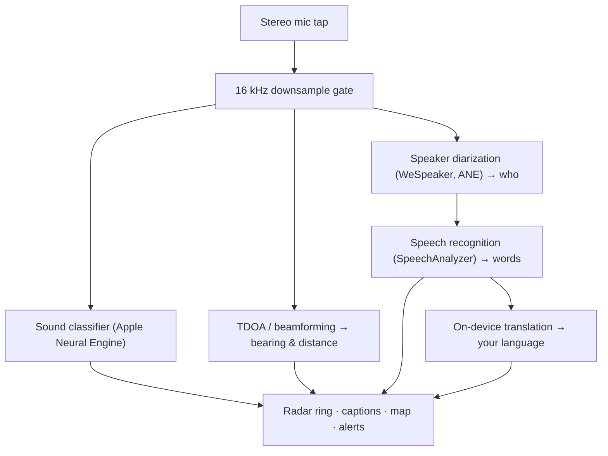

# VigilantEar 👂🛡️ (Apple Edition)

*An acoustic radar for people who can't hear.*

Most sound-recognition apps tell you *what* a sound is. **VigilantEar tells you where it is, who's making it, and what they're saying** — turning an iPhone into a real-time map of the sound around you, built for the deaf and hard-of-hearing (D/HH) community.

A siren's direction and distance. A knock behind you. The people in a conversation, drawn as separate voices on a ring — each one captioned, color-coded by speaker, with an arrow to where they're standing. And if someone is speaking a language you don't read, their words arrive **translated into yours.**

Everything runs on the device. Nothing is recorded, cached, or sent anywhere.

---

## Who it's for

- **Deaf and hard-of-hearing users** who want situational awareness of sound — not just "a sound happened," but *what, where, who,* and *what was said.*
- Anyone who needs **live captions with direction and speaker separation**, or **on-device translation** of the people around them.
- Acoustic-research and accessibility tinkerers interested in on-device sound localization.

> VigilantEar is an accessibility **aid**, not a certified life-safety device. See the disclaimer below.

---

## What it does

### 🧭 It sees sound — direction & distance
Using the iPhone's stereo microphones, VigilantEar estimates the **bearing and rough distance** of sounds around you and places them as live dots on a heading-up radar ring and map. Move, and the dots hold their real-world position. This is the core: spatial awareness of a world you can't hear.

### 🚨 It recognizes important sounds — and warns you
An on-device classifier identifies **300+ everyday sounds** and watches five critical categories — **sirens, alarms, doorbells/knocks, a person nearby, and severe weather.** When one fires, you get a clear on-screen alert and an optional **push notification**, even when the app is in the background or your phone is asleep. Turn the alert categories off and the engine fully hibernates while backgrounded, to save battery.

Severe-weather warnings come from official public feeds — the US **NWS**, the European **MeteoAlarm** network, and **China's CMA** — automatically narrowed to the feeds that actually cover where you are.

### 💬 Speaker Mode — live, directional captions
Turn on **Speaker Mode** and VigilantEar transcribes the people talking near you into **caption rows, one per voice.** On-device speaker diarization tells the voices apart, so each person keeps their own color and their own line of scrollback — *who* is saying *what* — with a small arrow pointing to where they actually are in the room. The live speaker is highlighted; older lines dim and age out.

### 🌐 Live translation — read a language you can't hear, in your own
Tell VigilantEar the **languages you might hear**, and it transcribes that speech and renders it **in your language**, live, with a 🌐 marker and a gentle fade-in. The whole chain — hear → separate speakers → transcribe → translate → display — runs **entirely on the device**; the only network moment is a one-time language-pack download. For a deaf person with a friend who speaks another language, this means reading their side of the conversation in real time.

### 🎵 Music & broadcast awareness
**ShazamKit** identifies music playing around you and surfaces the title, re-checking automatically when the song changes. And when a voice looks like it's coming from a TV or radio rather than a person in the room, it's tagged with a **📻** instead of being mistaken for someone present — the words still show, just labeled honestly.

### 🛰️ Constellation — many iPhones, one shared ear *(experimental)*
With two or more Ultra-Wideband iPhones, **Constellation** pairs them so they can sense each other's position (via Apple's Nearby Interaction / UWB) and, eventually, fuse what they each hear into a single, far more precise picture of where a sound is coming from — a kind of distributed, passive **synthetic-aperture sonar.** It's opt-in, off by default, and gated to devices with the right hardware.

### 🗺️ Maps, roads & path prediction
Sound bearings are projected onto real GPS coordinates and drawn on a MapKit view. Vehicle sounds are **snapped to nearby streets** (via OpenStreetMap road data) and their paths predicted, so a passing car reads as moving *along the road* rather than drifting through buildings.

---

## How it works (under the hood)

VigilantEar is a **local-first, on-device** pipeline. Raw audio is captured on a high-priority tap, copied, and fanned out to independent processing actors without ever stalling the UI:

- **Spatial math** — fast Fourier transforms, Time-Difference-of-Arrival, and Doppler tracking run on detached background tasks.
- **Speech** — iOS 26's `SpeechAnalyzer`/`SpeechTranscriber` handle transcription; **WeSpeaker** embeddings cluster the audio into distinct voices; Apple's **Translation** framework does the on-device translation.
- **Concurrency** — Swift 6 strict isolation keeps the microphone tap, the acoustic math, and the map's `CADisplayLink` render loop cleanly separated, so the UI stays smooth (target 60 FPS marker glide) while everything else runs hot in the background.
- **Efficiency** — the 16 kHz downsampling gate cuts the data the classifier sees by ~80%, keeping the active footprint light and the backgrounded "always-listening" mode lighter still.

---

## Privacy

- **On-device, always.** All classification, spatial math, transcription, diarization, and translation happen on your iPhone. Raw audio is never recorded, cached, or transmitted.
- **Transcripts are ephemeral.** Captions live in memory for the session and are not persisted or uploaded.
- **No telemetry.** No analytics, crash logs, or usage data are sent to any server.

Full details: [PRIVACY.md](PRIVACY.md) · [TERMS.md](TERMS.md) · [SUPPORT.md](SUPPORT.md)

---

## Hardware & platforms

- **iPhone (full experience).** A stereo-microphone iPhone is required for direction-finding. Recommended iPhone 13 or newer.
- **iPad (captions only).** iPads expose a single audio channel, so they transcribe and caption but can't compute direction — a good fit for a stationary, big-screen display.
- **Constellation** needs **Ultra-Wideband** — iPhone 11 or later, excluding the SE and "e" models.

---

## Localization

Fully localized — interface, alerts, and captions — into **English, Spanish, Portuguese, French, German, Japanese, and Simplified Chinese**, following the system locale.

---

## Status & disclaimer

VigilantEar is an **experimental acoustic-accessibility aid**, not a certified life-safety utility. Localization resolution varies with surroundings, weather, wind, and microphone hardware. **Always maintain your normal environmental awareness** — don't rely on it as your only source of safety information.

---

**Contact:** [vigilantear@wingdingssocial.com](mailto:vigilantear@wingdingssocial.com)

Made with ❤️ for the D/HH community and acoustic research.

© 2026 Wingdings, Inc. All rights reserved.
