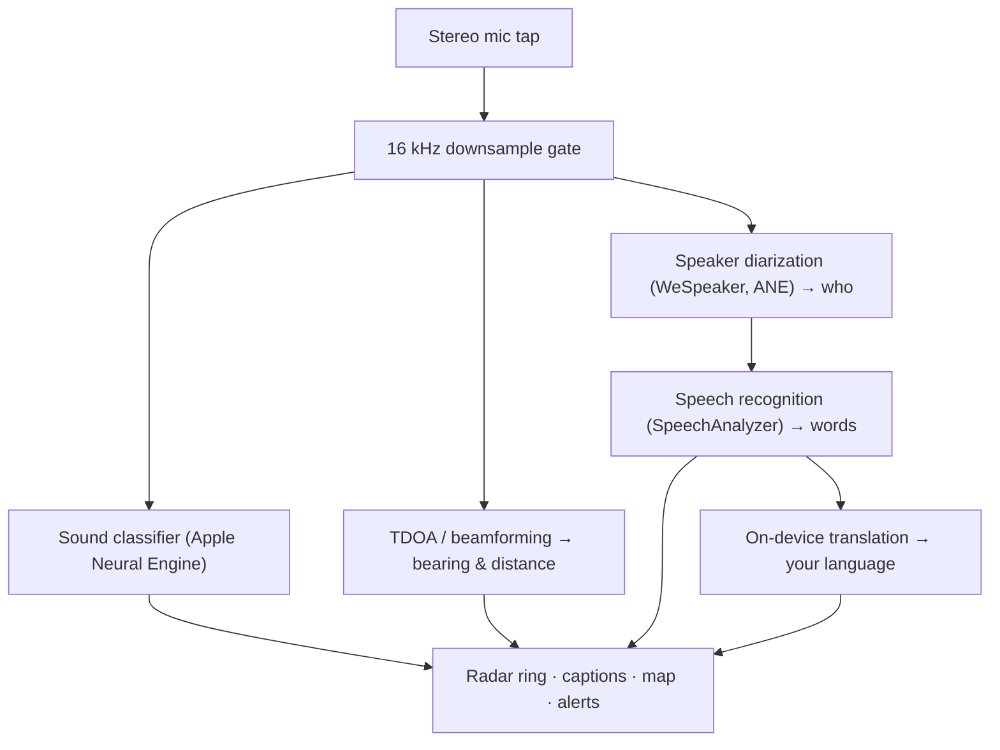

# Vigilant Ear 👂🛡️ (Apple Edition)

*An acoustic radar for people who can't hear.*

An app built specifically for the Deaf/HH community! Most sound-recognition apps tell you *what* a sound is. **Vigilant Ear tells you where it is, who's making it, and what they're saying** — turning an iPhone into a real-time sonic tricorder to visually describe the sound around you.

A siren's direction and distance. A knock behind you. The people in a conversation, drawn as separate transcribed voices — each one captioned and directionally placed by speaker. If someone is speaking a language you don't read then their words arrive **translated into yours.**

Everything runs on the device. Nothing is recorded, cached, or sent anywhere.

- 🧭 **Direction, not just detection.** Most apps tell you *what* a sound is — Vigilant Ear shows you *where* it is, *who's* making it, and *what they're saying.*
- 🔒 **Private by design.** All recognition, captioning, and translation happen on your iPhone. Nothing is recorded or sent anywhere.
- 🛰️ **More phones, one shared ear.** Constellation links Ultra-Wideband iPhones to fuse what each one hears into a sharper, directional picture.
- 🔋 **Light on battery.** An always-listening mode that hibernates when idle — engineered to run light enough to leave on.
- 👁️ **Made for the Deaf/HoH community.** Haptics, high-contrast visuals, and color-independent cues throughout.

---

## Who it's for

- **Deaf and hard-of-hearing users** who want situational awareness of sound — not just "a sound happened," but *what, where, who,* and *what was said.*
- Anyone who needs **live captions with direction and speaker separation**, or **on-device translation** of your friends sitting nearby.
- Acoustic-research and accessibility tinkerers interested in on-device sound localization.

> Vigilant Ear is an accessibility **aid**, not a certified life-safety device.

---

## What it does

### 🧭 It sees sound — direction & distance
Using the iPhone's stereo microphones, Vigilant Ear estimates the **bearing and rough distance** of sounds around you and places them as live dots on a heading-up radar ring and map. Move, and the dots hold their real-world position. This is the core: spatial awareness of a world you can't hear.

### 🚨 It recognizes important sounds — and warns you
An on-device classifier identifies **300+ everyday sounds** and watches the critical categories — **sirens, alarms, doorbells/knocks, a person nearby, and severe weather.** When one fires, you get a clear on-screen alert and an optional **push notification**, even when the app is in the background or your phone is asleep. Turn all of the alert categories off and the engine fully hibernates while backgrounded to save battery.

Severe-weather warnings come from official public feeds: the United States' **NWS** is built in for free; the European **MeteoGate** network and **China's CMA** are part of Premium. Feeds are automatically narrowed to the ones that actually cover where you are.

### 💬 Speaker Mode — live, directional captions *(Premium)*
Turn on **Speaker Mode** and Vigilant Ear transcribes the people talking near you into **caption blocks, one per voice.** On-device speaker diarization tells the voices apart, so each person keeps their own block and quirky icon — *who* is saying *what* — with a small circle on the inner ring directing you to their room position. The live speaker is highlighted; older text scrolls away slowly or as space for new text is needed.

### 🌐 Speaker Auto-Translate — read a language you can't hear, in your own *(Premium)*
With Speaker Mode on, when a nearby person speaks another language, Vigilant Ear detects it and renders their captions **in your language**, live, with their "from" language identification in the title bar of their block. The whole chain — hear → separate speakers → transcribe → translate → display — runs **entirely on the device**; the only network moment is a one-time language-pack download from Apple. For a deaf person with a friend who speaks another language, this means reading their side of the conversation in real time **without having to know about and choose that language beforehand**.

### 🎵 Music & broadcast awareness *(Premium)*
**ShazamKit** identifies music playing around you and displays the title with automatic song change signature detection. And when a voice looks like it's coming from a TV or radio rather than a person in the room, it's tagged with a **📻** instead of being mistaken for someone present — the words still show; they are just labeled honestly.

### 🛰️ Constellation — many iPhones, one shared ear *(Premium)*
With two or more Ultra-Wideband-enabled iPhones (most since iPhone 11), The **Constellation** mode pairs them so they can sense each other's position (via Apple's Nearby Interaction / UWB) and fuse what they each hear into a single, far more precise picture of where a sound is coming from — a kind of distributed, passive **synthetic-aperture sonar.** It's gated to devices with the right hardware.

### 🗺️ Maps, roads & path prediction
Sound bearings are projected onto real GPS coordinates and drawn on a map view. Vehicle sounds are **snapped to nearby streets** (via open-source road data feeds) and their paths predicted, so a passing car reads as moving *along the road* rather than drifting through buildings.  (Try out the fire truck demo to preview it.)

---

## Free & Premium

The safety core is **free, forever**:

- **Local sound alerts** — alarms, sirens, doorbells/knocks, and a person nearby — detected on-device, with on-screen and push warnings.
- **NWS severe-weather warnings** for the United States.

A one-time **Premium unlock** — with a free trial to start, and **not a subscription** — adds the full situational-awareness layer:

- **Speaker Mode** — live, directional, per-speaker captions.
- **Speaker Auto-Translate** — on-device translation of nearby speech into your language.
- **Constellation** — multi-iPhone shared hearing over Ultra-Wideband.
- **Music ID** — ShazamKit song recognition.
- **International weather feeds** — Europe (MeteoGate) and China (CMA).

Free or Premium, **everything runs on the device** — the tier only changes which features are unlocked, never where your audio goes.

---

## How it works (under the hood)

Vigilant Ear is a **local-first, on-device** pipeline. Raw audio is captured on a high-priority tap, copied, and fanned out to independent processing actors without ever stalling the UI:

- **Spatial math** — fast Fourier transforms, Time-Difference-of-Arrival, and Doppler tracking run on detached background tasks.
- **Speech** — iOS 26's `SpeechAnalyzer`/`SpeechTranscriber` handle transcription; **WeSpeaker** embeddings cluster the audio into distinct voices; Apple's **Translation** framework does the on-device translation.
- **Concurrency** — Swift 6 strict isolation keeps the microphone tap, the acoustic math, and the map's `CADisplayLink` render loop cleanly separated, so the UI stays smooth (target 60 FPS marker glide) while everything else runs hot in the background.
- **Efficiency** — the 16 kHz downsampling gate cuts the data the classifier sees by ~80%, keeping the active footprint light and the backgrounded "always-listening" mode lighter still.

---

## Privacy

- **On-device, always.** All classification, spatial math, transcription, diarization  (speaker signature/identification), and translation happen on your iPhone. Raw audio is never recorded, cached, or transmitted.
- **Transcripts are ephemeral.** Captions live in memory for the session and are not persisted or uploaded.
- **No telemetry.** No analytics, crash logs, or usage data are sent to any server.

Full details: [PRIVACY.md](PRIVACY.md) · [TERMS.md](TERMS.md) · [SUPPORT.md](SUPPORT.md)

---

## Hardware & platforms

- **iPhone (full experience).** A stereo-microphone iPhone is required for direction-finding. Recommended iPhone 13 or newer.
- **iPad (captions only).** iPads expose a single audio channel, so they transcribe and caption but can't compute direction — a good fit for a stationary, big-screen display.
- **Constellation** needs **Ultra-Wideband** — iPhone 11 or later, excluding the SE and "e" models.

---

## Localization

Fully localized — interface, alerts, and captions — into **English, Spanish, Portuguese, French, German, Arabic, Japanese, and Simplified Chinese** (8 languages).  They follow the system locale setting or can be chosen manually in the app.

---

## Status & disclaimer

Vigilant Ear is an **experimental acoustic-accessibility aid**, not a certified life-safety utility. Localization resolution varies with surroundings, weather, wind, and microphone hardware. **Always maintain your normal environmental awareness** — don't rely on it as your only source of safety information.

---

**Contact:** [vigilantear@wingdingssocial.com](mailto:vigilantear@wingdingssocial.com)

Made with ❤️ for the D/HH community and acoustic research.

© 2026 Wingdings, Inc. All rights reserved.
