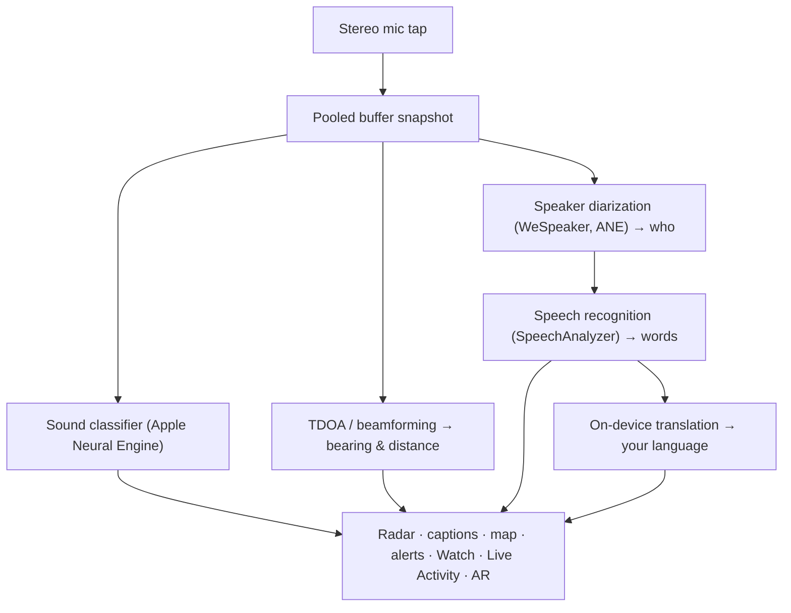

# Vigilant Ear 👂🛡️

*An acoustic radar for people who can't hear.*

An app built specifically for the Deaf and hard-of-hearing community. Most sound-recognition apps tell you *what* a sound is. **Vigilant Ear tells you where it is, who's making it, and what they're saying** — turning an iPhone into a real-time sonic tricorder that describes the sound around you.

A siren's direction and distance. A knock behind you. The people in a conversation, drawn as separate transcribed voices — each one captioned and directionally placed. If someone is speaking a language you don't read, their words can arrive **translated into yours.** Alerts reach your **Lock Screen, Dynamic Island, and Apple Watch** so a glance is enough.

Everything that matters runs on the device. Audio is not recorded or uploaded for recognition. Nothing depends on hearing a thing.

- 🧭 **Direction, not just detection.** *What, where, who,* and *what was said* — not merely “a sound happened.”
- 🔒 **Private by design.** Classification, captioning, and translation run on your iPhone. Captions are live and ephemeral; they are not saved as a transcript archive.
- ⌚ **On your wrist and Lock Screen.** Apple Watch direction companion + Live Activity keep the last alert and which way it came from one look away.
- 🛰️ **More phones, one shared ear.** Constellation links Ultra-Wideband iPhones to fuse what each one hears into a sharper directional picture.
- 👁️ **Made for Deaf / HoH.** Distinct haptics, high-contrast visuals, color-independent cues, large tap targets, and Reduce Motion respect throughout.

---

## Who it's for

- **Deaf and hard-of-hearing users** who want situational awareness of sound — Home Watch (knock, alarm, baby, phone) and Street Watch (siren, approach) you can leave on and trust.
- Anyone who needs **live captions with direction and speaker separation**, or **on-device translation** of people sitting nearby.
- Accessibility and acoustic-research users interested in on-device sound localization.

> Vigilant Ear is an accessibility **aid**, not a certified life-safety device.

---

## What it does

### 🧭 It sees sound — direction & distance
Using the iPhone's stereo microphones, Vigilant Ear estimates the **bearing and rough distance** of sounds around you and places them as live markers on a heading-up radar ring and map. Move, and the markers hold their real-world position. This is the core: spatial awareness of a world you can't hear.

### 🚨 It recognizes important sounds — and warns you
An on-device classifier identifies hundreds of everyday sounds and watches the critical categories — **sirens, alarms, doorbells/knocks, baby cry, a person nearby, and severe weather.** When one fires, you get a clear on-screen alert, optional **push notification**, and a distinct **haptic** — even when the app is backgrounded or the phone is asleep. Critical categories default ready so enabling notifications doesn't mean “everything off.” Turn all alert categories off and the engine fully hibernates while backgrounded to save battery.

Severe-weather warnings come from official public CAP feeds — U.S. **NWS**, Europe **MeteoGate**, **China CMA**, and **Korea KMA** — free for all users. Feeds are narrowed to the ones that cover where you are.

### ⌚ Apple Watch + Live Activity — glance and know
- **Apple Watch companion** — the direction of an alert points on your wrist so a glance tells you where to look. Redesigned Watch UI with the app ear icon, threat HUD layout, and double-tap to minimize. Alerts can still show the direction arrow when the Watch app is not open.
- **Live Activity** — Vigilant Ear stays on your **Lock Screen**, in the **Dynamic Island**, and in the **Watch Smart Stack**, so the last alert and its bearing are always one look away.

### 💬 Speaker Mode — live, directional captions *(free)*
Turn on **Speaker Mode** and Vigilant Ear transcribes people talking near you into **caption blocks, one per voice.** On-device speaker diarization keeps voices distinct — *who* is saying *what* — with a directional cue on the inner ring. The live speaker is highlighted; older text scrolls away as space is needed. Captions are free; automatic translation is the optional Power Pack+ layer.

### 🌐 Speaker Auto-Translate — your language, live *(Power Pack+)*
With Speaker Mode on, when a nearby person speaks another language, Vigilant Ear can detect it and render their captions **in your language**, with the source language shown on their block. The chain — hear → separate speakers → transcribe → translate → display — runs **on the device**; the only network moment is a one-time language-pack download from Apple. You don't have to know or pick the other language first.

### 🎵 Music & broadcast awareness *(Power Pack+)*
**ShazamKit** identifies music playing around you and tracks song changes. When a voice looks like it's coming from a TV or radio rather than a person in the room, it's tagged with a **📻** — the words still show; they're labeled honestly.

### 🛰️ Constellation — many iPhones, one shared ear *(Power Pack+)*
With two or more Ultra-Wideband-enabled iPhones (most since iPhone 11), **Constellation** pairs them so they can sense each other's position and fuse what each one hears into a single, more precise picture of where a sound is coming from — a distributed, passive listening array. Gated to devices with the right hardware. Mesh captions older than a peer's connect time are not retransmitted.

### 📷 Camera AR — “see the sound”
Open the camera pill on the title rail and pin detected sounds at their real bearing in the live camera view. Markers cluster by speaker or by sound category and direction so the view stays readable; sources age-fade when they go quiet.

### 🗺️ Maps, roads & path prediction
Sound bearings project onto real GPS coordinates on the map. Vehicle sounds can be **snapped to nearby streets** and their paths predicted so a passing truck reads as moving *along the road* rather than through buildings. (Try the fire-truck demo.)

### 🪄 Practice Playground — prove it without ears
**Playground Mode** is public for everyone: Home & Street practice (knock, alarm, baby, siren, weather), multi-phone and conversation demos, and a clear watermark so practice never pretends to be a live event. Closing the panel tears demos down cleanly (no stuck GPS spoof, no leftover flags).

### ♿ Accessibility first
Built for Deaf / hard-of-hearing and color-blind users: **color-independent** cues, **≥44 pt** tap targets, **Reduce Motion** respect, multimodal alerts (haptic + visual + Watch), and a startup verification screen that shows permission status with clear green / grey / red (and burnt-orange “disallowed”) states — including the notification grant that acts as the master alert switch.

---

## Free & Power Pack+

The safety core is **free, forever**:

- **Home Watch & Street Watch** — local sound alerts (alarms, sirens, knocks/doorbells, baby, person nearby) with on-screen, haptic, and optional push delivery.
- **Live captions** — Speaker Mode, on-device, directional where hardware allows.
- **Severe-weather CAP** — NWS, MeteoGate, CMA, KMA for your region.
- **Demo Mode** — practice alerts and feature previews with a DEMO watermark.
- **Apple Watch companion & Live Activity** — glanceable direction and last alert.

**Power Pack+** is a one-time unlock (**not a subscription**) with a **90-day free trial**. It adds the superpowers:

- **Speaker Auto-Translate** — on-device translation of nearby speech into your language.
- **Constellation** — multi-iPhone shared hearing over Ultra-Wideband.
- **Music ID** — ShazamKit song recognition.

Free or Power Pack+, **your audio stays on the device for recognition** — the tier only changes which features are unlocked, never where raw audio is sent for analysis.

---

## How it works (under the hood)

Vigilant Ear is a **local-first, on-device** pipeline. Raw audio is captured on a high-priority tap, copied into a **pooled buffer free-list** (no alloc thrash on the realtime path), and fanned out to independent processors without stalling the UI or interrupting the streamer:

- **Spatial math** — FFTs, Time-Difference-of-Arrival, and Doppler tracking on background tasks.
- **Speech** — iOS 26 `SpeechAnalyzer` / `SpeechTranscriber` for transcription; **WeSpeaker** embeddings for voice identity; Apple's **Translation** framework for on-device translation.
- **Concurrency** — Swift 6 isolation keeps the microphone tap, acoustic math, and UI render loop cleanly separated.
- **Efficiency** — downsampling and load-adaptive classification keep always-listening light enough to leave on.

---

## Privacy

- **On-device, always for the core pipeline.** Classification, spatial math, transcription, diarization, and translation run on your iPhone. Raw audio is not recorded or uploaded for recognition.
- **Captions are ephemeral.** Live captions stay in memory for the session; exported debug logs do not include caption text.
- **No advertising or behavioral analytics SDKs.** Limited network use is only for maps, public weather feeds, optional Shazam fingerprints, road context, and App Store purchases — see the full policy.

Full details: [PRIVACY.md](PRIVACY.md) · [TERMS.md](TERMS.md) · [SUPPORT.md](SUPPORT.md)

---

## Hardware & platforms

- **iPhone (full experience).** Stereo microphones required for direction-finding. Recommended **iPhone 13 or newer**.
- **Apple Watch.** Companion alerts with direction arrow; works with Live Activity / Smart Stack.
- **iPad (captions-focused).** Single-channel mics → captions without full direction.
- **Constellation** needs **Ultra-Wideband** — iPhone 11 or later, excluding SE and “e” models.
- **Android.** Separate build with core radar, alerts, captions, and weather; Constellation mesh is iOS-first. See product site updates as Android parity grows.

**Current Apple marketing version:** 1.0.7 (in progress / shipping track). Built for modern iOS (SpeechAnalyzer-era).

---

## Localization

Fully localized — interface, alerts, and captions — into **English, Spanish, Portuguese (Brazil), French, German, Arabic, Japanese, Simplified Chinese, and Korean** (9 languages). Follows the system locale or a manual choice in the app.

---

## Status & disclaimer

Vigilant Ear is an **experimental acoustic-accessibility aid**, not a certified life-safety utility. Localization resolution varies with surroundings, weather, wind, and microphone hardware. **Always maintain your normal environmental awareness** — don't rely on it as your only source of safety information.

Some capabilities (camera AR markers, Critical Alerts entitlement upgrade when granted by Apple, advanced multi-pack sound authoring) continue to evolve; the free Home / Street watch and live captions are the product you can trust day one.

---

**Contact:** [vigilantear@wingdingssocial.com](mailto:vigilantear@wingdingssocial.com)

Made with ❤️ for the D/HH community and acoustic research.

    
  <strong>© 2026 Wingdings, Inc.</strong> 
  All rights reserved. 
  Patent Pending

