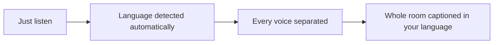
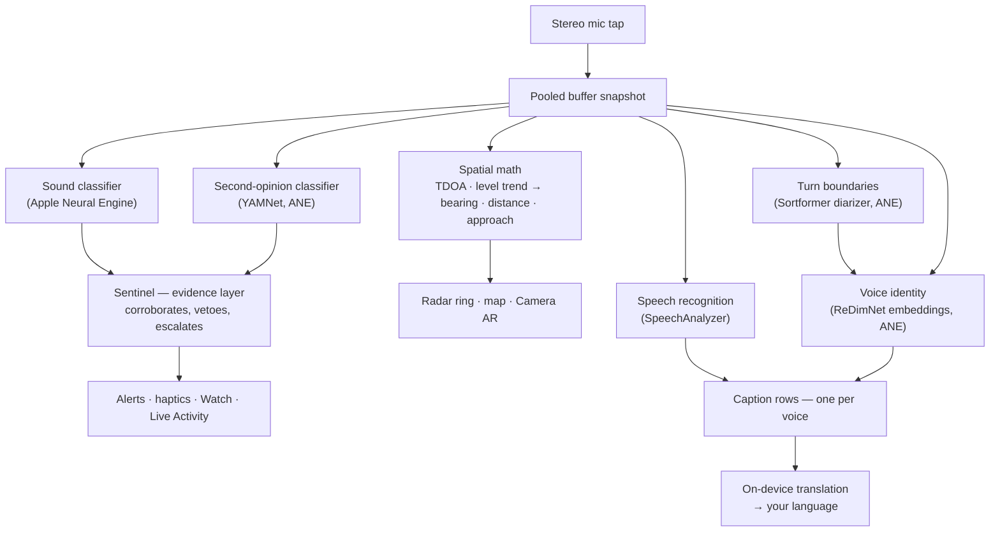
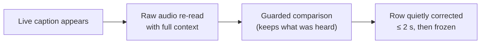
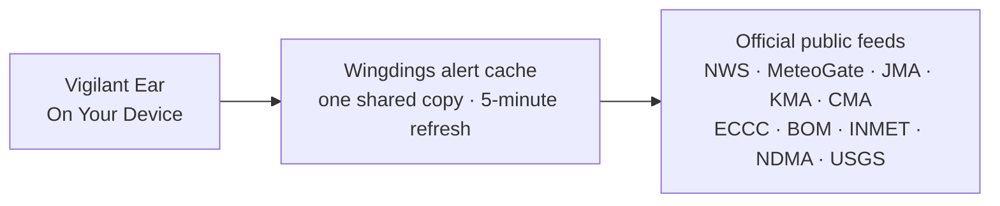

# Vigilant Ear 👂🛡️

*Effective as of version 1.1.6 · September 2026.*

## An acoustic radar for people who can't hear.

An app built specifically for the Deaf, hard-of-hearing, and CODA community. Most sound-recognition apps tell you *what* a sound is. **Vigilant Ear tells you where it is, who's making it, and what they're saying** — turning an iPhone into a real-time sonic tricorder that describes the sound around you.

A siren's direction and distance. A knock behind you. The people in a conversation, drawn as separate transcribed voices — each one captioned and directionally placed. If someone is speaking a language you don't read, their words can arrive **translated into yours.** Alerts reach your **Lock Screen, Dynamic Island, and Apple Watch** so a glance is enough.

Everything that matters runs on the device. Audio is not recorded or uploaded for recognition. Nothing depends on hearing a thing.

- 🧭 **Direction, not just detection.** *What, where, who,* and *what was said* — not merely “a sound happened.”
- 🔒 **Private by design.** Classification, captioning, and translation run on your iPhone. Captions are live and ephemeral; they are not saved as a transcript archive.
- ⌚ **On your wrist and Lock Screen.** Apple Watch direction companion + Live Activity keep the last alert and which way it came from one look away.
- 🛰️ **More phones, one shared ear.** Constellation links Ultra-Wideband iPhones to fuse what each one hears into a sharper directional picture.
- 👁️ **Made for Deaf / HoH / CODA.** Distinct haptics, high-contrast visuals, color-independent cues, large tap targets, and Reduce Motion respect throughout.

---

## Who it's for

- **Deaf, hard-of-hearing, and CODA users** who want situational awareness of sound — Home Watch (knock, alarm, baby, phone) and Street Watch (siren, approach) you can leave on and trust.
- Anyone who needs **live captions with direction and speaker separation**, or **on-device translation** of people sitting nearby.
- Accessibility and acoustic-research users interested in on-device sound localization.

> Vigilant Ear is an accessibility **aid**, not a certified life-safety device.

---

## What it does

### 🧭 It sees sound — direction & distance
Using the iPhone's two microphones, Vigilant Ear measures the **angle of a sound and whether it is ahead of you or behind you**, holds that reading steady to about a degree, and places it as a live marker on a heading-up radar ring and map. Two microphones on one line can't tell left from right on their own — a sound 50° to your right and one 50° to your left arrive with the same tiny time gap — so the app draws the reading plus a **fainter ghost on the other side**, and a turn of the wrist or a second phone settles it. Distance is estimated from loudness against a street-calibrated curve and shown as the estimate it is: *≈ 50 ft*, with a likely range. Move, and the markers hold their real-world position. This is the core: spatial awareness of a world you can't hear. (Numbers below.)

### 🚨 It recognizes important sounds — and warns you
An on-device classifier identifies hundreds of everyday sounds and watches the critical categories — **sirens, alarms — including a dedicated car-alarm class — doorbells/knocks, baby cry, a person nearby, and severe weather.** When one fires, you get a clear on-screen alert, optional **push notification**, and a distinct **haptic** — even when the app is backgrounded or the phone is asleep. Critical categories default ready so enabling notifications doesn't mean “everything off.” Turn all alert categories off and the engine fully hibernates while backgrounded to save battery. A **Sentinel** layer cross-checks alerts against independent evidence — direction, motion, and public feeds — so what fires is corroborated, not a lone classifier guess. It works both ways: a siren-shaped moment inside a song gets held, but a real siren repeating through your music breaks through and alerts.

Severe-weather warnings come from official public feeds — U.S. **NWS**, Europe **MeteoGate**, **China CMA**, **Korea KMA**, **Japan JMA**, **Canada ECCC**, **Australia BOM**, **Brazil INMET**, and **India NDMA** — free for all users. Feeds are narrowed to the ones that cover where you are. In Japan the app also reads JMA's **advance bulletins** — the plain-language notices issued days before a typhoon or heavy rain, not only the warnings issued once danger has arrived — plus the sudden-downpour and landslide bulletins. Advance notices are shown quietly, without the sound and vibration reserved for a real warning.

### ⌚ Apple Watch + Live Activity — glance and know
- **Apple Watch companion** — the direction of an alert points on your wrist so a glance tells you where to look. Redesigned Watch UI with the app ear icon, threat HUD layout, and double-tap to dismiss an alert. Alerts can still show the direction arrow when the Watch app is not open.
- **Live Activity** — Vigilant Ear stays on your **Lock Screen**, in the **Dynamic Island**, and in the **Watch Smart Stack**, so the last alert and its bearing are always one look away.
- **Partner alerts on your wrist** — when a linked Constellation partner's phone raises an alert, it can reach your Watch too, direction included. A reliability pass keeps the companion light on Watch battery all day.

### 💬 Speaker Mode — live, directional captions *(free)*
Turn on **Speaker Mode** and Vigilant Ear transcribes people talking near you into **caption blocks, one per voice.** On-device speaker diarization keeps voices distinct — *who* is saying *what* — with a directional cue on the inner ring. The live speaker is highlighted; older text scrolls away as space is needed.

Two things most caption apps won't do: **honesty about confidence** — a subtle per-row quality mark and dotted underlines beneath doubtful words tell you when to trust a line and when to double-check — and **self-correction**: right after a sentence lands, the app re-reads the audio with full context and can restore a missed or misheard word within a couple of seconds, then the text freezes.

Captions are free; automatic translation is the optional Power Pack+ layer. Captions can also be **spoken aloud to your Bluetooth hearing devices** — free, in Preferences. **Direction Tones** (also free, in Preferences → Captions) add an optional audio cue in the ear you choose that signals where a speaker is — useful with a hearing aid or single-sided hearing, and available to anyone.

### 🌐 Speaker Auto-Translate — your language, live *(Power Pack+)*
With Speaker Mode on, when a nearby person speaks another language, Vigilant Ear can detect it and render their captions **in your language**, with the source language shown on their block. The chain — hear → separate speakers → transcribe → translate → display — runs **on the device**; the only network moment is a one-time language-pack download from Apple. You don't have to know or pick the other language first.

This is the closest shipping thing to **science fiction's universal translator** — the device that simply understands. Vigilant Ear detects the language on its own, follows every speaker in the room, and captions them all in your language — no earbuds, no setup, on your device.

```mermaid
graph LR
    A["Just listen"] --> B["Language detected automatically"] --> C["Every voice separated"] --> D["Whole room captioned in your language"]
```

### 🎵 Music & broadcast awareness *(Power Pack+)*
**ShazamKit** identifies music playing around you and tracks song changes.

### 🎛️ Acoustic Scope — see sound like an engineer
A professional live view of the sound around you: spectrum, spectrogram, ⅓-octave RTA bands, chroma, and harmonic partials — **free for everyone**. The tools that capture sounds for training your own custom packs are part of Power Pack+.

### 📦 Custom Sound Packs — teach it your world *(Power Pack+)*
Teach Vigilant Ear the sounds that matter to you — from local birds to your building's door chime. Add-on packs stack on top of the built-in detection, so new sounds never crowd out sirens and alarms. A step-by-step guide is built into the app.

### 🛰️ Constellation — many iPhones, one shared ear *(Power Pack+)*
With two or more Ultra-Wideband-enabled iPhones (most since iPhone 11), **Constellation** pairs them so they can sense each other's position and fuse what each one hears into a single, more precise picture of where a sound is coming from — a distributed, passive listening array. Captions are fused too: each phone transcribes what its own microphone hears, and the words are aligned across phones so the one nearest a speaker contributes what it heard — words only one phone caught are kept rather than lost. The phones connect **directly to each other** — no router, no shared Wi-Fi network and no internet; Wi-Fi simply has to be switched on, over the same peer-to-peer link AirDrop uses. Gated to devices with the right hardware. Mesh captions older than a peer's connect time are not retransmitted.

**Partner messages** — send a quick text to a linked partner's phone; it lands in their caption feed and can arrive translated into their language, on-device. Messaging is age-aware: built on Apple's Declared Age Range, texting between an adult and a minor stays off unless both people have deliberately named each other. Alerts and captions are never gated — only person-to-person texting.

### 🔗 Remote Link — reach someone who isn't with you *(Power Pack+ to start)*
The thing a phone call would normally do, done with video and text instead. You send an invitation code; the other person joins from inside Vigilant Ear **without owning Power Pack+**. Unlike Constellation there is no proximity requirement — the two of you can be anywhere.

**No audio is used at any point.** Video and text only, so nothing about the link depends on hearing at either end — and it gives you a way to sign with someone through the app. The app itself does not understand sign language; it carries the video and the two of you do the rest. The connection is direct between the two phones wherever the network allows it, and the app shows you plainly whether it is **Direct** or **Relayed**, so you always know if your video is passing through a relay.

### 📷 Camera AR — “see the sound”
Open the camera pill on the title rail and pin detected sounds at their real bearing in the live camera view. Markers cluster by speaker or by sound category and direction so the view stays readable; sources age-fade when they go quiet.

### 🗺️ Maps, roads & path prediction
Sound bearings project onto real GPS coordinates on the map. Vehicle sounds can be **snapped to nearby streets** and their paths predicted so a passing truck reads as moving *along the road* rather than through buildings. (Try the fire-truck demo.)

### 🪄 Feature Playground — prove it without ears
**Feature Playground** is public for everyone: Home & Street practice (knock, alarm, baby, siren, weather), multi-phone and conversation demos, and a clear watermark so practice never pretends to be a live event. Closing the panel tears demos down cleanly (no stuck GPS spoof, no leftover flags).

### ♿ Accessibility first
Built for Deaf / hard-of-hearing / CODA and color-blind users: **color-independent** cues, **≥44 pt** tap targets, **Reduce Motion** respect, multimodal alerts (haptic + visual + Watch), and a startup verification screen that shows permission status with clear green / grey / red (and burnt-orange “disallowed”) states — including the notification grant that acts as the master alert switch.

---

## Free & Power Pack+

The safety core is **free, forever**:

- **Home Watch & Street Watch** — local sound alerts (alarms, sirens, knocks/doorbells, baby, person nearby) with on-screen, haptic, and optional push delivery.
- **Live captions** — Speaker Mode, on-device, directional where hardware allows, with honest confidence marks, ~2-second self-correction, optional spoken output to Bluetooth hearing devices, and Direction Tones.
- **Standing Watch** — the room's own condition, always on with nothing to configure: a steady cyan lamp while the room holds its pattern, amber when something changes — a new voice, sudden quiet, or something approaching.
- **Severe-weather alerts** — NWS, MeteoGate (Europe — served fresh from our 5-minute alert cache), CMA, KMA, JMA (Japan), ECCC (Canada), BOM (Australia), INMET (Brazil), and NDMA (India) for your region.
- **Earthquake alerts (USGS, worldwide)** — feel a buzz and see the area that felt it on your map when a quake is reported nearby. A confirmation from the official USGS feed — not an early warning: if you felt shaking, this tells you what it was. On-device deep-rumble (infrasound) sensing can arm the check the moment the ground moves.
- **Feature Playground** — practice alerts and feature previews with a clear PREVIEW watermark.
- **Apple Watch companion & Live Activity** — glanceable direction and last alert.
- **Acoustic Scope** — pro-grade live sound visualization, free for everyone. (The capture-for-training tools are Power Pack+.)

**Power Pack+** is a one-time unlock (**not a subscription**) with a **90-day free trial**. It adds the superpowers:

- **Speaker Auto-Translate** — on-device translation of nearby speech into your language.
- **Constellation** — multi-iPhone shared hearing over Ultra-Wideband, with partner messages.
- **Music ID** — ShazamKit song recognition.
- **Custom Sound Packs** — add-on classifiers you train for your own sounds.

Free or Power Pack+, **your audio stays on the device for recognition** — the tier only changes which features are unlocked, never where raw audio is sent for analysis.

---

## How it works (under the hood)

Vigilant Ear is a **local-first, on-device** pipeline built in layers: capture once, then let independent specialists read the same sound and check each other's work. Raw audio is captured on a high-priority tap, copied into a **pooled buffer free-list** (no alloc thrash on the realtime path), and fanned out without stalling the UI:

```mermaid
graph TD
    A["Stereo mic tap"] --> B["Pooled buffer snapshot"]
    B --> C["Sound classifier<br/>(Apple Neural Engine)"]
    B --> Y["Second-opinion classifier<br/>(YAMNet, ANE)"]
    C --> S["Sentinel — evidence layer<br/>corroborates, vetoes, escalates"]
    Y --> S
    S --> H["Alerts · haptics · Watch · Live Activity"]
    B --> D["Spatial math<br/>TDOA · level trend → bearing · distance · approach"]
    D --> R["Radar ring · map · Camera AR"]
    B --> F["Speech recognition<br/>(SpeechAnalyzer)"]
    B --> N["Turn boundaries<br/>(Sortformer diarizer, ANE)"]
    N --> E["Voice identity<br/>(ReDimNet embeddings, ANE)"]
    B --> E
    F --> G["Caption rows — one per voice"]
    E --> G
    G --> T["On-device translation<br/>→ your language"]
```

No single model is trusted alone. The **Sentinel** layer sits between detection and alerting: independent engines corroborate or veto each other frame by frame — and when repeated real-world evidence piles up against a veto (a real siren wailing through your music), the evidence wins and the alert fires.

Captions get their own second chance. Every finalized sentence is quietly re-read from a short in-memory audio ring with full context — corrections land within about two seconds, then the text freezes for good:

```mermaid
graph LR
    L["Live caption appears"] --> K["Raw audio re-read<br/>with full context"] --> V["Guarded comparison<br/>(keeps what was heard)"] --> W["Row quietly corrected<br/>≤ 2 s, then frozen"]
```

- **Spatial math** — FFTs, coherence-weighted Time Difference of Arrival (TDOA — favor the frequency bands both microphones agree on, then turn the tiny arrival lag into a bearing), and level-trend approach tracking on background tasks. The microphone pair is read in a fixed orientation so direction works the same whether you hold the phone upright or sideways.
- **Speech** — iOS 26 `SpeechAnalyzer` / `SpeechTranscriber` for transcription; Apple's **Translation** framework for on-device translation. Voice identity is evidence-based: a voice is confirmed as a real person only from independent windows of sound, and an uncertain match shows as unattributed rather than guessing the wrong name.
- **Two models for two questions** — telling voices apart takes *when the speaker changed* and *who that speaker is*, and they are not the same problem. A **Sortformer** streaming diarizer marks the turn boundaries; **ReDimNet** embeddings decide whose voice sits inside each one. Cutting on the boundary matters more than it sounds: a window that straddles two people contains both of them, and no embedding model can undo that afterwards. Underneath both sits a voice-activity floor — if the diarizer goes quiet in a hard room rather than guessing, turns still get cut, so the app degrades instead of blending two speakers into one.
- **Music truth** — a chroma **song-signature detector** owns the "is music actually playing?" decision, because general classifiers famously call silent rooms and sirens "music." Shazam only runs once the signature agrees something musical is really there.
- **Concurrency** — Swift 6 isolation keeps the microphone tap, acoustic math, and UI render loop cleanly separated.
- **Efficiency** — downsampling, load-adaptive classification, and evidence-gated network use keep always-listening light enough to leave on.

Weather and earthquake alerts take the opposite path from audio — nothing about your sound ever goes out, but alert *data* comes in. **Every** official feed flows through a small cache we operate, so one fetch of the public data serves every user — and your phone never contacts a foreign government's servers:

```mermaid
graph LR
    P1["Vigilant Ear<br/>On Your Device"] --> W["Wingdings alert cache<br/>one shared copy · 5-minute refresh"]
    W --> N["Official public feeds<br/>NWS · MeteoGate · JMA · KMA · CMA<br/>ECCC · BOM · INMET · NDMA · USGS"]
```

---

## What your phone can hear — measured

Your iPhone has two microphones about six inches apart, a barometer, and a very good clock. That is enough to tell you which way a sound is, roughly how far, whether it is coming toward you, and whether a door just opened. Here is how accurate each of those is, how we checked, and why it matters if you can't hear the sound yourself. Direction and related figures were measured on an iPhone 17 and an iPhone 16 Pro Max in September 2026. Distance stays an estimate by nature — we say so on screen.

**Direction — to a couple of degrees.** A sound reaches the top microphone before the bottom one, or after, and from that gap the app works out how far off the phone's axis the sound is and whether it is in front or behind. The phone's two channels are not plain microphones but a processed stereo image, and that image adds a fixed pattern of its own whenever a room is noisy. The app now learns that pattern from a few quiet seconds after launch and takes it out before reading the direction.

| What we measured | Result |
|---|---|
| Median error across 96 simulated rooms, quiet office to hard-walled room at 5 dB SNR | 1.0° |
| iPhone 17 on a desk, room noise on, speaker 30° off the axis | read 61.7° from the side plane against an expected 60°, wobble 1.6° |
| Same, speaker straight off the phone's side | read 4.5° against an expected 0°, wobble 2.2° |
| Same, speaker straight ahead | every reading at the maximum delay, as it should be |
| Readings landing on the image's own pattern instead of the sound | none, at any angle |

*Why it matters:* if you can't hear a siren, "behind you, off to one side" tells you where to look. A reading that holds still is only worth trusting once it has been checked against a tape measure, and this one was, twice, the second time after the first check turned out to be too kind.

**Distance — shown as the estimate it is.** One microphone can't measure distance, only loudness, and a loud truck far away can sound like a quiet car up close. The app estimates distance from loudness using a curve fitted on a real street, then says it the way a careful person would: *about 50 ft, likely between 25 and 100.*

| What we measured | Result |
|---|---|
| Real car detections replayed through the calibration | 1,131 |
| Landing inside the 100-foot road they were actually on | 73% |
| Far-lane cars | estimated 78 and 87 ft where the tape said 73 and 85 ft |

The road (a city intersection) was measured lane by lane; when the curve errs, it errs on the near side. The calibration is locked by an automated test so it can't silently drift. Alarms inside your own space, like a smoke detector, get no distance figure at all — they are already in the room with you.

**Motion — coming toward you.** For cars and sirens, getting louder usually means getting closer. The app watches how fast a sound's level rises over a few seconds: a sustained climb of about 1.5 dB per second (a clear, steady increase in loudness) means approaching, a matching fall means leaving, and a sound that stops changing stops being called either after about four seconds. A single loud moment — a horn tap, a door slam — can't trigger it. Built on physics and nine automated tests; a recorded street pass-by is the next field confirmation.

**The air in the room — a door has a signature.** The barometer can notice a door opening about fourteen feet away: pressure dips as the door swings, then rebounds as it closes. Over fourteen hours of quiet and fifteen door events, every door made that two-part shape and nothing else in the house did.

| Event | Pressure rate | Shape |
|---|---|---|
| Front door, opened and closed, ×10 | 0.6–1.8 Pa/s | dip, then rebound, ~5 s apart |
| Front door, slammed, ×5 | 1.1–2.5 Pa/s | same pair, taller |
| Air conditioning cycling overnight, ×8 | 0.11–0.46 Pa/s | slow ramp over minutes, identical on both phones |
| A quiet room | ~0.02 Pa/s | nothing |
| Walking past, sneezing | — | the motion sensor notices and the phone ignores it |

A screen door, which doesn't seal the room, was invisible — exactly as it should be. Today a pressure shift can show as deep rumbles on the map; a dedicated quiet-night door alert is measured and designed, and is not yet the everyday default.

**Constellation — two phones settle the side.** Each phone on the mesh draws a line toward the sound from where it sits, and the lines only cross cleanly on one side. When they do, the ghost disappears and the app can say left or right again. In simulation, two phones **40 meters apart** place a siren 50 meters away to within about 2 meters.

**How anything here gets believed.** Every number went through the same three gates, in order: a simulated room with the answer known in advance; small automated tests that recreate the exact case that would fool the app and run on every change; then the real phones on a real desk with distances measured by hand. Nothing counts as accurate until it survives the third. For someone who can't hear the sound, the app's word is the only word — it should be earned the way a lab earns it.

Deeper notes for engineers: [Physics](https://vigilantear.com/en/physics/) — TDOA, distance, motion, Constellation, and barometric detection, with every figure tagged MEASURED / BENCHED / MODELLED.

---

## Privacy

- **On-device, always for the core pipeline.** Classification, spatial math, transcription, diarization, and translation run on your iPhone. Raw audio is not recorded or uploaded for recognition.
- **Captions are ephemeral.** Live captions stay in memory for the session; exported debug logs do not include caption text.
- **No advertising or behavioral analytics SDKs.** Limited network use is only for maps, public weather feeds, optional Shazam fingerprints, road context, and App Store purchases — see the full policy.

Full details: [PRIVACY.md](PRIVACY.md) · [TERMS.md](TERMS.md) · [SUPPORT.md](SUPPORT.md)

---

## Hardware & platforms

- **iPhone (full experience).** Works in portrait or landscape — hold it however you like. Stereo microphones required for direction-finding. Recommended **iPhone 13 or newer**.
- **Apple Watch.** Companion alerts with direction arrow; works with Live Activity / Smart Stack.
- **iPad (native).** Adaptive layout: on the big screen, live captions get a see-through panel beside the map that tucks away when nobody is talking. Single-channel mics → captions without full direction.
- **Constellation** needs **Ultra-Wideband** — iPhone 11 or later, excluding SE and “e” models. It does **not** need a Wi-Fi network: with Wi-Fi switched on, the phones discover each other directly, so Constellation works with no router and no internet as long as the phones are near each other.
- **Android.** Separate build with core radar, alerts, captions, and weather; Constellation mesh is iOS-first. See product site updates as Android parity grows.

---

## Localization

Fully localized — interface, alerts, and captions — into **English, Spanish, Portuguese (Brazil), French, German, Italian, Arabic, Japanese, Simplified Chinese, Korean, Russian, and Hindi** (12 languages). Follows the system locale or a manual choice in the app.

---

## Status & disclaimer

Vigilant Ear is an **experimental acoustic-accessibility aid**, not a certified life-safety utility. Localization resolution varies with surroundings, weather, wind, and microphone hardware. **Always maintain your typical environmental awareness** — don't rely on it as your only source of safety information.

Some capabilities (camera AR markers, Critical Alerts entitlement upgrade when granted by Apple, advanced multi-pack sound authoring) continue to evolve; the free Home / Street watch and live captions are the product you can trust day one.

---

**Contact:** [vigilantear@wingdingssocial.com](mailto:vigilantear@wingdingssocial.com)

Made with ❤️ for the D/HH community and acoustic research.

    
  <strong>© 2026 Wingdings, Inc.</strong> 
  All rights reserved. 
  Patent Pending

