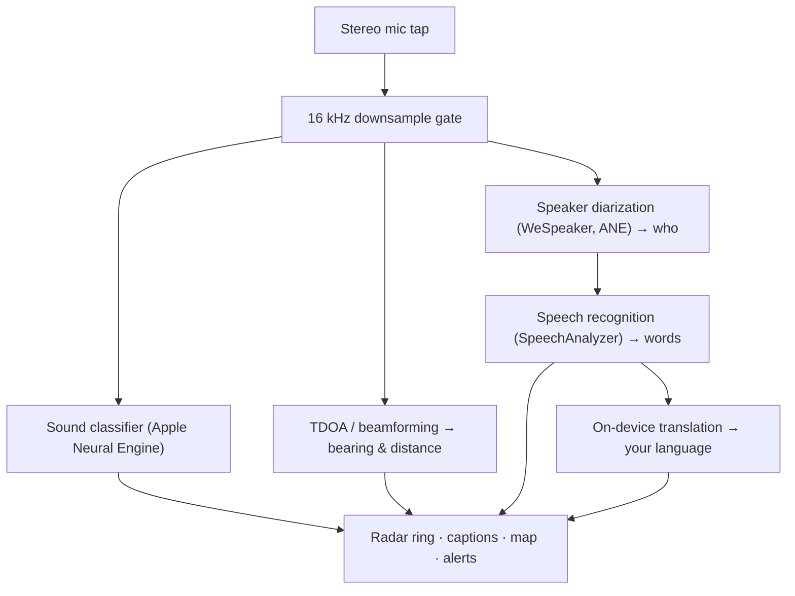

# Vigilant Ear 👂🛡️ (إصدار Apple)

*رادار صوتي للأشخاص الذين لا يسمعون.*

تطبيق مُصمَّم خصيصًا لمجتمع الصم وضعاف السمع! معظم تطبيقات التعرف على الأصوات تُخبرك *بما* هو الصوت. **Vigilant Ear يُخبرك أين هو، ومن يُصدره، وماذا يقول** — مُحوِّلًا iPhone إلى جهاز صوتي ثلاثي الأبعاد يصف بصريًا الأصوات من حولك في الوقت الفعلي.

اتجاه صافرة سيارة الإسعاف ومسافتها. طرق باب خلفك. المتحدثون في محادثة، مُقدَّمون كأصوات منفصلة ومُفرَّغة — كل منهم بتسمية توضيحية ومكان اتجاهي حسب المتحدث. وإن كان أحدهم يتحدث بلغة لا تقرأها، تصلك كلماته **مُترجَمةً إلى لغتك.**

كل شيء يعمل على الجهاز. لا شيء يُسجَّل أو يُخزَّن أو يُرسَل إلى أي مكان.

---

## لمن هو؟

- **المستخدمون الصم وضعاف السمع** الذين يريدون الوعي الظرفي بالأصوات — ليس مجرد "حدث صوت ما"، بل *ما هو، وأين، ومن، وماذا قيل.*
- كل من يحتاج إلى **تسميات توضيحية حية مع الاتجاه والفصل بين المتحدثين**، أو **الترجمة على الجهاز** للأصدقاء الجالسين قريبًا.
- الباحثون في مجال الصوتيات والمهتمون بإمكانية الوصول والراغبون في تجربة تحديد الموقع الصوتي على الجهاز.

> Vigilant Ear أداة مساعدة لإمكانية الوصول، وليس جهازًا معتمدًا لسلامة الحياة.

---

## ماذا يفعل؟

### 🧭 يرى الصوت — الاتجاه والمسافة
باستخدام الميكروفونات الستيريو في iPhone، يُقدِّر Vigilant Ear **الاتجاه والمسافة التقريبية** للأصوات من حولك ويضعها كنقاط حية على حلقة رادار ومخطط بالاتجاه الرأسي. تحرَّك، وستحتفظ النقاط بمواضعها الفعلية في العالم الحقيقي. هذا هو جوهر التطبيق: الوعي المكاني بعالم لا تستطيع سماعه.

### 🚨 يتعرف على الأصوات المهمة — ويُنبِّهك
يُحدِّد مصنِّف على الجهاز **أكثر من 300 صوت يومي** ويراقب الفئات الحرجة — **صافرات الطوارئ، والإنذارات، وأجراس/طرق الباب، وشخص قريب، والطقس الشديد.** عند اكتشاف أي منها، تحصل على تنبيه واضح على الشاشة و**إشعار دفع** اختياري، حتى عندما يكون التطبيق في الخلفية أو هاتفك في وضع السكون. أوقف جميع فئات التنبيه وسيدخل المحرك في وضع السبات الكامل عند التشغيل في الخلفية لتوفير البطارية.

تأتي تحذيرات الطقس الشديد من مصادر عامة رسمية: شبكة **NWS** الأمريكية مدمجة مجانًا؛ أما شبكة **MeteoGate** الأوروبية و**CMA** الصينية فهي جزء من الاشتراك المميز. يتم تضييق نطاق المصادر تلقائيًا لتشمل فقط المناطق التي تغطي موقعك.

### 💬 Speaker Mode — تسميات توضيحية حية واتجاهية *(مميز)*
شغِّل **Speaker Mode** وسيُفرِّغ Vigilant Ear كلام المتحدثين القريبين منك إلى **كتل تسمية توضيحية، كتلة واحدة لكل صوت.** يميّز نظام تمييز المتحدثين على الجهاز الأصوات عن بعضها، لذا يحتفظ كل شخص بكتلته وأيقونته المميزة — *من* يقول *ماذا* — مع دائرة صغيرة على الحلقة الداخلية تُرشدك إلى موقعه في الغرفة. يُبرَز المتحدث الحالي؛ والنصوص القديمة تتمرر ببطء أو عند الحاجة لمساحة لنص جديد.

### 🌐 Speaker Auto-Translate — اقرأ لغة لا تسمعها، بلغتك الخاصة *(مميز)*
مع تشغيل Speaker Mode، عندما يتحدث شخص قريب بلغة أخرى، يكتشف Vigilant Ear ذلك ويعرض تسمياته التوضيحية **بلغتك**، مباشرةً، مع تحديد لغة "المصدر" في شريط عنوان كتلته. السلسلة الكاملة — استماع ← فصل المتحدثين ← تفريغ ← ترجمة ← عرض — تعمل **بالكامل على الجهاز**؛ اللحظة الوحيدة التي تحتاج فيها إلى شبكة هي تنزيل حزمة اللغة لمرة واحدة من Apple. بالنسبة لشخص أصم لديه صديق يتحدث لغة أخرى، هذا يعني قراءة جانبه من المحادثة في الوقت الفعلي **دون الحاجة إلى معرفة تلك اللغة مسبقًا أو اختيارها.**

### 🎵 الوعي بالموسيقى والبث *(مميز)*
يُحدِّد **ShazamKit** الموسيقى العازفة من حولك ويعرض العنوان مع اكتشاف تلقائي لتغيُّر الأغنية. وعندما يبدو صوت ما قادمًا من تلفاز أو راديو بدلًا من شخص في الغرفة، يُوسَم بـ **📻** بدلًا من الخلط بينه وبين شخص حاضر — لا تزال الكلمات تظهر؛ لكنها مُصنَّفة بصدق.

### 🛰️ Constellation — عدة أجهزة iPhone، أذن واحدة مشتركة *(مميز)*
مع جهازَي iPhone أو أكثر يدعمان Ultra-Wideband (معظم الأجهزة منذ iPhone 11)، يربط وضع **Constellation** بينها لتتحسس مواضع بعضها (عبر Nearby Interaction / UWB من Apple) وتدمج ما تسمعه كل منها في صورة واحدة أكثر دقة بكثير عن مصدر الصوت — نوع من **السونار الاصطناعي الموزع السلبي.** مقيَّد بالأجهزة التي تمتلك المعدات المناسبة.

### 🗺️ الخرائط والطرق وتوقع المسار
تُسقَط اتجاهات الصوت على إحداثيات GPS حقيقية وتُرسَم على عرض الخريطة. تُثبَّت أصوات المركبات على **الشوارع القريبة** (عبر بيانات الطرق مفتوحة المصدر) وتُتوقَّع مساراتها، لتظهر السيارة المارة وكأنها تتحرك *على الطريق* بدلًا من الانجراف عبر المباني. (جرِّب عرض شاحنة الإطفاء التجريبي لمعاينته.)

---

## المجاني والمميز

جوهر الأمان **مجاني، للأبد**:

- **تنبيهات الصوت المحلية** — الإنذارات، والصافرات، وأجراس/طرق الباب، وشخص قريب — مكتشَفة على الجهاز، مع تحذيرات على الشاشة وإشعارات دفع.
- **تحذيرات الطقس الشديد من NWS** للولايات المتحدة.

**فتح مميز** لمرة واحدة — مع تجربة مجانية للبدء، و**ليس اشتراكًا** — يُضيف طبقة الوعي الظرفي الكاملة:

- **Speaker Mode** — تسميات توضيحية حية واتجاهية لكل متحدث.
- **Speaker Auto-Translate** — ترجمة على الجهاز للكلام القريب إلى لغتك.
- **Constellation** — سماع مشترك بين أجهزة iPhone متعددة عبر Ultra-Wideband.
- **Music ID** — التعرف على الأغاني عبر ShazamKit.
- **مصادر الطقس الدولية** — أوروبا (MeteoGate) والصين (CMA).

مجانيًا أو مميزًا، **كل شيء يعمل على الجهاز** — المستوى يغيّر فقط الميزات المفعَّلة، وليس أين تذهب بياناتك الصوتية.

---

## كيف يعمل (تحت الغطاء)

Vigilant Ear هو خط أنابيب **محلي أولًا، على الجهاز**. يُلتقَط الصوت الخام على نقطة الوصول عالية الأولوية، ويُنسَخ ويُوزَّع على معالجات مستقلة دون إيقاف واجهة المستخدم:

- **الرياضيات المكانية** — تحويلات فورييه السريعة، والتحديد بالفارق الزمني للوصول (TDOA)، وتتبع دوبلر تعمل على مهام خلفية منفصلة.
- **الكلام** — يتولى `SpeechAnalyzer`/`SpeechTranscriber` في iOS 26 عملية التفريغ؛ وتجميعات **WeSpeaker** تُصنِّف الصوت إلى أصوات متمايزة؛ وإطار عمل **Translation** من Apple يُنجز الترجمة على الجهاز.
- **التزامن** — يحافظ Swift 6 بعزله الصارم على فصل نقطة الوصول بالميكروفون، والرياضيات الصوتية، وحلقة عرض `CADisplayLink` للخريطة بشكل نظيف، لتبقى واجهة المستخدم سلسة (هدف 60 إطارًا في الثانية) بينما يعمل كل شيء آخر بكثافة في الخلفية.
- **الكفاءة** — تقليص تردد 16 كيلوهرتز يُخفِّض البيانات التي يراها المصنِّف بنسبة ~80%، مما يُبقي البصمة النشطة خفيفة ووضع "الاستماع الدائم" في الخلفية أخف.

---

## الخصوصية

- **على الجهاز، دائمًا.** كل التصنيف والرياضيات المكانية والتفريغ وتمييز المتحدثين (بصمة/تعريف المتحدث) والترجمة تحدث على iPhone الخاص بك. لا يُسجَّل الصوت الخام أو يُخزَّن أو يُرسَل.
- **التسميات التوضيحية مؤقتة.** تعيش في الذاكرة طوال الجلسة ولا تُحفظ أو تُرفع.
- **لا قياس عن بُعد.** لا تُرسَل أي بيانات تحليلية أو سجلات أعطال أو بيانات استخدام إلى أي خادم.

التفاصيل الكاملة: [PRIVACY.md](PRIVACY.md) · [TERMS.md](TERMS.md) · [SUPPORT.md](SUPPORT.md)

---

## الأجهزة والمنصات

- **iPhone (التجربة الكاملة).** يُشترَط وجود iPhone بميكروفون ستيريو لتحديد الاتجاه. يُوصى بـ iPhone 13 أو أحدث.
- **iPad (التسميات التوضيحية فقط).** تكشف أجهزة iPad قناةً صوتية واحدة، لذا تُفرِّغ وتُضيف تسميات توضيحية لكنها لا تستطيع حساب الاتجاه — مناسب كعرض ثابت بشاشة كبيرة.
- **Constellation** تحتاج إلى **Ultra-Wideband** — iPhone 11 أو أحدث، باستثناء طرازَي SE و"e".

---

## التوطين

مُترجَم بالكامل — الواجهة والتنبيهات والتسميات التوضيحية — إلى **الإنجليزية والإسبانية والبرتغالية والفرنسية والألمانية والعربية واليابانية والصينية المبسَّطة** (8 لغات). تتبع إعداد اللغة في النظام أو يمكن اختيارها يدويًا داخل التطبيق.

---

## الحالة وإخلاء المسؤولية

Vigilant Ear أداة **تجريبية لإمكانية الوصول الصوتي**، وليس أداة معتمدة لسلامة الحياة. تتفاوت دقة التحديد المكاني مع البيئة المحيطة والطقس والرياح ومعدات الميكروفون. **احتفظ دائمًا بوعيك البيئي الاعتيادي** — لا تعتمد عليه كمصدرك الوحيد لمعلومات الأمان.

---

**للتواصل:** [vigilantear@wingdingssocial.com](mailto:vigilantear@wingdingssocial.com)

صُنع بـ ❤️ لمجتمع الصم/ضعاف السمع والبحث الصوتي.

© 2026 Wingdings, Inc. All rights reserved.
