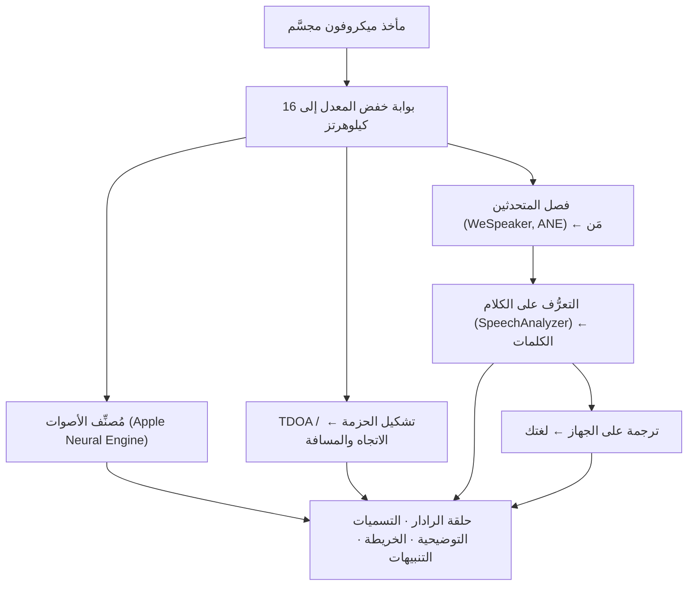

# VigilantEar 👂🛡️ (إصدار Apple)

*رادار صوتي لمن لا يستطيعون السمع.*

تطبيق مُصمَّم خصيصًا لمجتمع الصُّمّ وضعاف السمع! معظم تطبيقات التعرُّف على الأصوات تخبرك *ما* هو الصوت. **أمّا VigilantEar فيخبرك أين هو، ومَن يُصدره، وماذا يقول** — مُحوِّلًا iPhone إلى جهاز استشعار صوتي آنيّ يصف لك الصوت من حولك بصريًا.

اتجاه صفّارة الإنذار ومسافتها. طرقةٌ خلفك. الأشخاص في محادثة، مرسومين كأصوات منفصلة مُفرَّغة نصيًا — كلٌّ منها مكتوبٌ ومُحدَّد الاتجاه بحسب المتحدث. وإذا كان أحدهم يتحدث بلغة لا تقرؤها، فإنّ كلماته تصلك **مُترجَمةً إلى لغتك.**

كل شيء يعمل على الجهاز. لا شيء يُسجَّل أو يُخزَّن مؤقتًا أو يُرسَل إلى أي مكان.

---

## لمن هذا التطبيق

- **المستخدمون الصُّمّ وضعاف السمع** الذين يريدون وعيًا ظرفيًا بالصوت — ليس مجرد "حدث صوتٌ ما"، بل *ماذا، وأين، ومَن،* و*ماذا قِيل.*
- كل من يحتاج إلى **تسميات توضيحية حيّة مع تحديد الاتجاه وفصل المتحدثين**، أو **ترجمة على الجهاز** لأصدقائك الجالسين بقربك.
- المهتمون بالأبحاث الصوتية وهُواة إمكانية الوصول المهتمون بتحديد موقع الصوت على الجهاز.

> VigilantEar هو **وسيلة مساعدة** لإمكانية الوصول، وليس جهازًا مُعتمَدًا لسلامة الحياة.

---

## ماذا يفعل

### 🧭 يرى الصوت — الاتجاه والمسافة
باستخدام ميكروفونات iPhone المجسَّمة، يُقدِّر VigilantEar **الاتجاه والمسافة التقريبية** للأصوات من حولك ويضعها كنقاطٍ حيّة على حلقة رادار وخريطة موجَّهتين نحو وجهتك. تحرَّك، وستحافظ النقاط على موضعها الحقيقي في العالم. هذا هو الجوهر: وعيٌ مكانيّ بعالمٍ لا تستطيع سماعه.

### 🚨 يتعرَّف على الأصوات المهمة — ويُنبِّهك
يُحدِّد مُصنِّفٌ يعمل على الجهاز **أكثر من 300 صوتٍ يومي** ويراقب الفئات الحرجة — **صفّارات الإنذار، والمنبّهات، وأجراس الأبواب/الطرقات، ووجود شخص قريب، والطقس القاسي.** وعندما يُطلَق أحدها، تحصل على تنبيهٍ واضح على الشاشة و**إشعارٍ منبثقٍ** اختياري، حتى عندما يكون التطبيق في الخلفية أو يكون هاتفك في وضع السكون. أوقِف جميع فئات التنبيه وسيدخل المُحرِّك في سُبات تامّ أثناء عمله في الخلفية للحفاظ على البطارية.

تأتي تحذيرات الطقس القاسي من خلاصاتٍ عامّة رسمية: خدمة **NWS** في الولايات المتحدة مُضمَّنة مجانًا؛ أمّا شبكة **MeteoAlarm** الأوروبية و**CMA** الصينية فهما جزءٌ من Premium. تُضيَّق الخلاصات تلقائيًا لتقتصر على تلك التي تُغطّي مكان وجودك فعليًا.

### 💬 وضع المتحدث — تسميات توضيحية حيّة ومُوجَّهة *(Premium)*
شغِّل **وضع المتحدث** ليُفرِّغ VigilantEar نصيًا كلام الأشخاص المتحدثين بقربك إلى **كتل تسميات توضيحية، واحدة لكل صوت.** يُميِّز فصلُ المتحدثين العامل على الجهاز بين الأصوات، فيحتفظ كل شخص بكتلته الخاصة وأيقونته المميّزة — *مَن* يقول *ماذا* — مع دائرة صغيرة على الحلقة الداخلية تُرشدك إلى موضعه في الغرفة. يُبرَز المتحدث الحالي؛ والنصوص الأقدم تنزلق بعيدًا ببطء أو عند الحاجة إلى مساحة لنصٍّ جديد.

### 🌐 الترجمة التلقائية للمتحدث — اقرأ لغةً لا تسمعها، بلغتك أنت *(Premium)*
مع تشغيل وضع المتحدث، عندما يتحدث شخصٌ قريب بلغة أخرى، يكتشفها VigilantEar ويُظهِر تسمياته التوضيحية **بلغتك**، بشكل حيّ، مع تحديد لغته "المصدر" في شريط عنوان كتلته. السلسلة كاملةً — السماع ← فصل المتحدثين ← التفريغ النصي ← الترجمة ← العرض — تعمل **بالكامل على الجهاز**؛ واللحظة الشبكية الوحيدة هي تنزيلٌ لمرة واحدة لحزمة لغة من Apple. وبالنسبة لشخصٍ أصمّ لديه صديقٌ يتحدث لغة أخرى، فهذا يعني قراءة جانبه من المحادثة في الوقت الفعلي **دون الحاجة إلى معرفة تلك اللغة واختيارها مسبقًا**.

### 🎵 الوعي بالموسيقى والبثّ *(Premium)*
يُحدِّد **ShazamKit** الموسيقى التي تُعزَف من حولك ويعرض العنوان مع كشفٍ تلقائي لبصمة تغيُّر الأغنية. وعندما يبدو أنّ صوتًا ما قادمٌ من تلفاز أو راديو بدلًا من شخصٍ في الغرفة، يُوسَم بالرمز **📻** بدلًا من الخلط بينه وبين شخصٍ حاضر — تبقى الكلمات ظاهرة؛ لكنها تُوسَم بصدق.

### 🛰️ Constellation — عدّة أجهزة iPhone، أُذنٌ واحدة مشتركة *(Premium)*
مع وجود جهازَي iPhone أو أكثر مزوَّدَين بتقنية Ultra-Wideband (معظم الأجهزة منذ iPhone 11)، يقوم وضع **Constellation** بإقرانها بحيث تستطيع استشعار موضع بعضها بعضًا (عبر Nearby Interaction / UWB من Apple) ودمج ما يسمعه كلٌّ منها في صورة واحدة أكثر دقّةً بكثير لمصدر الصوت — نوعٌ من **السونار ذي الفتحة الاصطناعية** الموزَّع والسلبي. وهو مقصورٌ على الأجهزة ذات العتاد المناسب.

### 🗺️ الخرائط والطرق والتنبؤ بالمسار
تُسقَط اتجاهات الصوت على إحداثيات GPS حقيقية وتُرسَم على عرض خريطة. تُلصَق أصوات المركبات **بالشوارع القريبة** (عبر خلاصات بيانات طرق مفتوحة المصدر) ويُتنبَّأ بمساراتها، بحيث تُقرَأ سيارة مارّة على أنها تتحرك *على طول الطريق* بدلًا من أن تنجرف عبر المباني. (جرِّب عرض شاحنة الإطفاء التوضيحي لمعاينة ذلك.)

---

## المجاني وPremium

جوهر السلامة **مجانيٌّ إلى الأبد**:

- **تنبيهات الصوت المحلية** — المنبّهات، وصفّارات الإنذار، وأجراس الأبواب/الطرقات، ووجود شخص قريب — مكتشَفة على الجهاز، مع تحذيرات على الشاشة ومنبثقة.
- **تحذيرات الطقس القاسي من NWS** للولايات المتحدة.

أمّا **فتح Premium لمرة واحدة** — مع تجربة مجانية للبدء، و**ليس اشتراكًا** — فيُضيف طبقة الوعي الظرفي الكاملة:

- **وضع المتحدث** — تسميات توضيحية حيّة ومُوجَّهة ولكل متحدث على حدة.
- **الترجمة التلقائية للمتحدث** — ترجمة على الجهاز للكلام القريب إلى لغتك.
- **Constellation** — سماعٌ مشترك عبر عدّة أجهزة iPhone باستخدام Ultra-Wideband.
- **تعريف الموسيقى** — التعرُّف على الأغاني عبر ShazamKit.
- **خلاصات الطقس الدولية** — أوروبا (MeteoAlarm) والصين (CMA).

سواءٌ بالنسخة المجانية أو Premium، **كل شيء يعمل على الجهاز** — فالفئة تُغيِّر فقط الميزات المُتاحة، وليس وجهة صوتك أبدًا.

---

## كيف يعمل (تحت الغطاء)

VigilantEar هو سلسلة معالجة **تعمل على الجهاز أولًا ومحليًا**. يُلتقَط الصوت الخام عبر مأخذٍ عالي الأولوية، ويُنسَخ، ويُوزَّع على عناصر معالجة مستقلة دون أن يُعطِّل واجهة المستخدم أبدًا:

- **الرياضيات المكانية** — تحويلات فورييه السريعة، وفرق وقت الوصول (TDOA)، وتتبُّع Doppler تعمل على مهامّ خلفية منفصلة.
- **الكلام** — يتولّى `SpeechAnalyzer`/`SpeechTranscriber` في iOS 26 عملية التفريغ النصي؛ وتُجمِّع تضمينات **WeSpeaker** الصوتَ في أصواتٍ متمايزة؛ ويقوم إطار عمل **Translation** من Apple بالترجمة على الجهاز.
- **التزامن** — يُبقي العزل الصارم في Swift 6 مأخذَ الميكروفون، والرياضيات الصوتية، وحلقة عرض `CADisplayLink` للخريطة منفصلةً بوضوح، فتبقى واجهة المستخدم سلسة (بهدف انزلاق المؤشر عند 60 إطارًا في الثانية) بينما يعمل كل شيء آخر بكامل طاقته في الخلفية.
- **الكفاءة** — تَخفِض بوابة خفض المعدل إلى 16 كيلوهرتز البياناتِ التي يراها المُصنِّف بنحو 80%، ممّا يُبقي البصمة النشطة خفيفة ووضع "الاستماع الدائم" في الخلفية أخفّ منها.

---

## الخصوصية

- **على الجهاز، دائمًا.** كل عمليات التصنيف، والرياضيات المكانية، والتفريغ النصي، وفصل المتحدثين (بصمة/تحديد هوية المتحدث)، والترجمة تحدث على جهاز iPhone خاصتك. الصوت الخام لا يُسجَّل أو يُخزَّن مؤقتًا أو يُنقَل أبدًا.
- **النصوص المُفرَّغة عابرة.** تبقى التسميات التوضيحية في الذاكرة طوال الجلسة ولا تُحفَظ أو تُرفَع.
- **لا قياس عن بُعد.** لا تُرسَل أي تحليلات أو سجلّات أعطال أو بيانات استخدام إلى أي خادم.

التفاصيل الكاملة: [PRIVACY_ar.md](PRIVACY_ar.md) · [TERMS_ar.md](TERMS_ar.md) · [SUPPORT_ar.md](SUPPORT_ar.md)

---

## العتاد والمنصّات

- **iPhone (التجربة الكاملة).** يُشترَط جهاز iPhone بميكروفون مجسَّم لتحديد الاتجاه. يُوصى بـ iPhone 13 أو أحدث.
- **iPad (التسميات التوضيحية فقط).** تُتيح أجهزة iPad قناة صوتية واحدة فقط، لذا فهي تُفرِّغ نصيًا وتعرض التسميات التوضيحية لكنها لا تستطيع حساب الاتجاه — وهي خيارٌ مناسب لشاشة عرضٍ كبيرة ثابتة.
- **Constellation** يحتاج إلى **Ultra-Wideband** — iPhone 11 أو أحدث، باستثناء طرازَي SE و"e".

---

## التعريب

مُعرَّب بالكامل — الواجهة والتنبيهات والتسميات التوضيحية — إلى **الإنجليزية والإسبانية والبرتغالية والفرنسية والألمانية والعربية واليابانية والصينية المبسَّطة** (8 لغات). تتبع إعداد لغة النظام أو يمكن اختيارها يدويًا داخل التطبيق.

---

## الحالة وإخلاء المسؤولية

VigilantEar هو **وسيلة مساعدة صوتية تجريبية لإمكانية الوصول**، وليس أداةً مُعتمَدةً لسلامة الحياة. تتفاوت دقّة تحديد الموقع تبعًا للمحيط والطقس والرياح وعتاد الميكروفون. **حافِظ دائمًا على وعيك البيئي المعتاد** — لا تعتمد عليه كمصدرك الوحيد لمعلومات السلامة.

---

**التواصل:** [vigilantear@wingdingssocial.com](mailto:vigilantear@wingdingssocial.com)

صُنِع بـ ❤️ لمجتمع الصُّمّ وضعاف السمع (D/HH) وللأبحاث الصوتية.

© 2026 Wingdings, Inc. All rights reserved.
