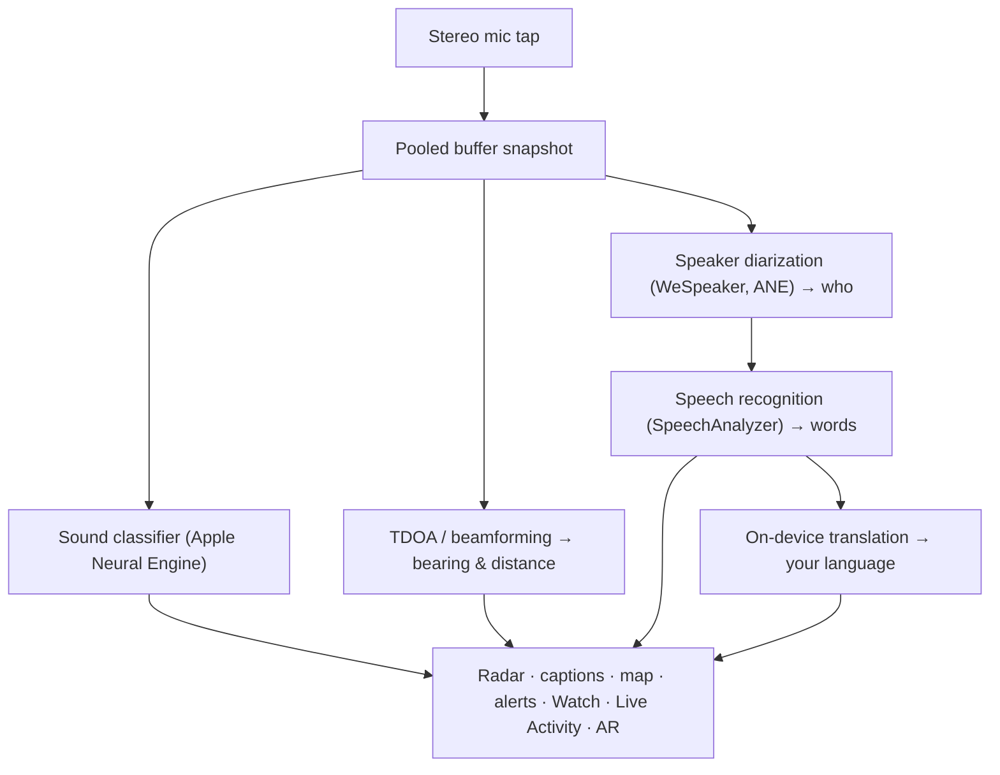

# Vigilant Ear 👂🛡️

*رادار صوتي للأشخاص الذين لا يستطيعون السمع.*

تطبيق صُمم خصيصًا لمجتمع الصم وضعاف السمع. معظم تطبيقات التعرف على الصوت تخبرك *ما هو* الصوت. **Vigilant Ear يخبرك بمكانه، ومن يصدره، وماذا يقولون** — محولًا جهاز iPhone إلى جهاز قياس صوتي حيوي يصف الصوت من حولك.

اتجاه ومسافة صفارة الإنذار. طرقة خلفك. الأشخاص في محادثة، مرسومين كأصوات منفصلة ومكتوبة — كل واحد معنون ومحدد الاتجاه. إذا كان شخص ما يتحدث بلغة لا تقرأها، يمكن أن تصل كلماته **مترجمة إلى لغتك.** تصل التنبيهات إلى **شاشة القفل (Lock Screen)، والجزيرة التفاعلية (Dynamic Island)، و Apple Watch** لذا تكفي نظرة سريعة.

كل ما يهم يعمل على الجهاز. لا يتم تسجيل الصوت أو تحميله للتعرف عليه. لا شيء يعتمد على سماع أي شيء.

- 🧭 **الاتجاه، وليس فقط الاكتشاف.** *ماذا، وأين، ومن،* و *ماذا قيل* — وليس مجرد "حدث صوت".
- 🔒 **الخصوصية حسب التصميم.** يعمل التصنيف، والتعليق الصوتي، والترجمة على هاتف iPhone الخاص بك. التعليقات التوضيحية حية ومؤقتة؛ ولا يتم حفظها كأرشيف نصوص.
- ⌚ **على معصمك وشاشة القفل.** يبقيك رفيق الاتجاه في Apple Watch + الأنشطة الحية (Live Activity) على اطلاع بآخر تنبيه ومن أي اتجاه جاء بنظرة واحدة.
- 🛰️ **هواتف أكثر، أذن واحدة مشتركة.** يربط Constellation أجهزة iPhone التي تدعم النطاق فائق العرض (Ultra-Wideband) لدمج ما يسمعه كل منها في صورة اتجاهية أوضح.
- 👁️ **مصنوع للصم / ضعاف السمع.** استجابة لمسية مميزة، ومرئيات عالية التباين، وإشارات مستقلة عن اللون، وأهداف نقر كبيرة، واحترام خيار تقليل الحركة (Reduce Motion) في كل مكان.

---

## لمن هذا

- **المستخدمون الصم وضعاف السمع** الذين يريدون الوعي الظرفي بالصوت — مراقبة المنزل (طرقة، إنذار، طفل، هاتف) ومراقبة الشارع (صفارة إنذار، اقتراب) يمكنك تركها والوثوق بها.
- أي شخص يحتاج إلى **تعليقات حية مع تحديد الاتجاه وفصل المتحدثين**، أو **ترجمة على الجهاز** للأشخاص الجالسين بالجوار.
- مستخدمو تسهيلات الاستخدام والباحثون في مجال الصوتيات المهتمون بتحديد موقع الصوت على الجهاز.

> تطبيق Vigilant Ear هو **مساعد** لتسهيلات الاستخدام، وليس جهازًا معتمدًا للسلامة والحياة.

---

## ماذا يفعل

### 🧭 يرى الصوت — الاتجاه والمسافة
باستخدام ميكروفونات الستيريو الخاصة بجهاز iPhone، يقوم Vigilant Ear بتقدير **الاتجاه والمسافة التقريبية** للأصوات من حولك ويضعها كعلامات حية على حلقة رادار متجهة لأعلى وخريطة. تحرك، وتحتفظ العلامات بموقعها في العالم الحقيقي. هذا هو الجوهر: الوعي المكاني بعالم لا يمكنك سماعه.

### 🚨 يتعرف على الأصوات المهمة — ويحذرك
يحدد مُصنف على الجهاز مئات الأصوات اليومية ويراقب الفئات الحرجة — **صفارات الإنذار، والإنذارات، وأجراس الأبواب/الطرقات، وبكاء الأطفال، والأشخاص القريبين، والطقس القاسي.** عندما ينطلق أحدها، تحصل على تنبيه واضح على الشاشة، و **إشعار دفع (push notification)** اختياري، و **استجابة لمسية** مميزة — حتى عندما يكون التطبيق في الخلفية أو الهاتف في وضع السكون. الفئات الحرجة تكون جاهزة افتراضيًا لذا تمكين الإشعارات لا يعني "إيقاف كل شيء". أوقف تشغيل جميع فئات التنبيهات وسينام المحرك تمامًا أثناء وجوده في الخلفية لتوفير البطارية.

تأتي تحذيرات الطقس القاسي من خلاصات CAP العامة الرسمية — **NWS** في الولايات المتحدة، و **MeteoGate** في أوروبا، و **CMA** في الصين، و **KMA** في كوريا — مجانًا لجميع المستخدمين. تقتصر الخلاصات على تلك التي تغطي مكان تواجدك.

### ⌚ Apple Watch + الأنشطة الحية (Live Activity) — نظرة واحدة وتعرف
- **رفيق Apple Watch** — يشير اتجاه التنبيه على معصمك لذا تخبرك النظرة السريعة أين تنظر. واجهة مستخدم Watch معاد تصميمها مع أيقونة أذن التطبيق، وتخطيط شاشة التهديدات (HUD)، والنقر المزدوج لإغلاق التنبيه. يمكن للتنبيهات أن تستمر في إظهار سهم الاتجاه عندما لا يكون تطبيق Watch مفتوحًا.
- **الأنشطة الحية (Live Activity)** — يبقى Vigilant Ear على **شاشة القفل (Lock Screen)**، وفي **الجزيرة التفاعلية (Dynamic Island)**، وفي **الحزمة المكدسة الذكية لـ Watch (Watch Smart Stack)**، لذلك يكون التنبيه الأخير واتجاهه دائمًا على بُعد نظرة واحدة.

### 💬 وضع المتحدث — تعليقات حية واتجاهية *(مجاني)*
قم بتشغيل **وضع المتحدث (Speaker Mode)** ويقوم Vigilant Ear بنسخ كلام الأشخاص الذين يتحدثون بالقرب منك إلى **كتل تعليقات، واحدة لكل صوت.** تحافظ يوميات المتحدث على الجهاز على تميز الأصوات — *من* يقول *ماذا* — مع إشارة اتجاهية على الحلقة الداخلية. يتم إبراز المتحدث الحي؛ وتتلاشى النصوص القديمة كلما كانت هناك حاجة إلى مساحة. التعليقات التوضيحية مجانية؛ الترجمة التلقائية هي طبقة Power Pack+ الاختيارية.

### 🌐 الترجمة التلقائية للمتحدث — لغتك، حية *(Power Pack+)*
مع تشغيل وضع المتحدث (Speaker Mode)، عندما يتحدث شخص قريب بلغة أخرى، يمكن لـ Vigilant Ear اكتشافها وتقديم تعليقاته **بلغتك**، مع إظهار لغة المصدر على كتلته. تعمل السلسلة — الاستماع ← فصل المتحدثين ← النسخ ← الترجمة ← العرض — **على الجهاز**؛ لحظة الشبكة الوحيدة هي تنزيل حزمة لغة لمرة واحدة من Apple. ليس عليك أن تعرف أو تختار اللغة الأخرى أولاً.

### 🎵 الموسيقى والوعي بالبث *(Power Pack+)*
يحدد **ShazamKit** الموسيقى التي يتم تشغيلها من حولك ويتتبع تغييرات الأغاني. عندما يبدو أن الصوت قادم من جهاز تلفزيون أو راديو بدلاً من شخص في الغرفة، يتم تمييزه بـ **📻** — تظل الكلمات تظهر؛ يتم تصنيفها بصدق.

### 🎛️ النطاق الصوتي — شاهد الصوت كمهندس *(Power Pack+)*
عرض احترافي مباشر للصوت من حولك: الطيف، والمخطط الطيفي، ونطاقات RTA بثلث أوكتاف، والكروما، والتوافقيات الجزئية — مع أدوات لالتقاط الأصوات لتدريب حزمك الخاصة.

### 📦 حزم الصوت المخصصة — علِّمه عالمك *(Power Pack+)*
علِّم Vigilant Ear الأصوات التي تهمك — من طيور منطقتك إلى جرس باب مبناك. تُضاف الحزم فوق الكشف المدمج، فلا تزاحم صفارات الإنذار والمنبهات أبدًا. مع دليل خطوة بخطوة داخل التطبيق.

### 🛰️ Constellation — هواتف عديدة، أذن واحدة مشتركة *(Power Pack+)*
مع جهازين أو أكثر من أجهزة iPhone التي تدعم النطاق فائق العرض (معظمها منذ iPhone 11)، يقوم **Constellation** بإقرانها حتى تتمكن من استشعار موقع بعضها البعض ودمج ما يسمعه كل منها في صورة واحدة أكثر دقة عن المكان الذي يأتي منه الصوت — مصفوفة استماع سلبية وموزعة. يقتصر على الأجهزة التي تحتوي على الأجهزة المناسبة. لا يتم إعادة إرسال تعليقات الشبكة الأقدم من وقت اتصال النظير.

### 📷 الكاميرا والواقع المعزز (Camera AR) — "رؤية الصوت"
افتح حبة الكاميرا في شريط العنوان وقم بتثبيت الأصوات المكتشفة في اتجاهها الحقيقي في عرض الكاميرا المباشر. تتجمع العلامات حسب المتحدث أو حسب فئة الصوت والاتجاه بحيث يظل العرض قابلاً للقراءة؛ وتتلاشى المصادر مع تقدم العمر عندما تصبح هادئة.

### 🗺️ الخرائط، الطرق وتوقع المسار
تُسقط اتجاهات الصوت على إحداثيات GPS حقيقية على الخريطة. يمكن **تثبيت أصوات المركبات في الشوارع القريبة** وتوقع مساراتها بحيث تُقرأ شاحنة مارة على أنها تتحرك *على طول الطريق* بدلاً من عبر المباني. (جرب عرض سيارة الإطفاء التوضيحي.)

### 🪄 ملعب الميزات — أثبت ذلك بدون آذان
**ملعب الميزات** متاح للجميع: تدريب المنزل والشارع (طرقة، إنذار، طفل، صفارة إنذار، طقس)، والعروض التوضيحية للمحادثات والهواتف المتعددة، وعلامة مائية واضحة بحيث لا يتظاهر التدريب أبدًا بأنه حدث حقيقي. إغلاق اللوحة يزيل العروض التوضيحية بنظافة (لا يوجد انتحال عالق لنظام تحديد المواقع العالمي، ولا علامات متبقية).

### ♿ تسهيلات الاستخدام أولاً
صُمم للمستخدمين الصم / ضعاف السمع وعمى الألوان: إشارات **مستقلة عن اللون**، أهداف نقر **≥44 نقطة**، احترام **تقليل الحركة (Reduce Motion)**، تنبيهات متعددة الوسائط (لمسية + بصرية + Watch)، وشاشة التحقق من بدء التشغيل توضح حالة الأذونات مع حالات واضحة باللون الأخضر / الرمادي / الأحمر (والبرتقالي المحروق للحالات "غير المسموح بها") — بما في ذلك إذن الإشعارات الذي يعمل كمفتاح التنبيه الرئيسي.

---

## المجاني و Power Pack+

جوهر السلامة **مجاني، للأبد**:

- **Home Watch & Street Watch** — تنبيهات صوتية محلية (إنذارات، صفارات إنذار، طرقات/أجراس أبواب، طفل، شخص قريب) مع عرض على الشاشة، ولمسي، وتسليم إشعار دفع (push) اختياري.
- **تعليقات حية** — Speaker Mode، على الجهاز، اتجاهية حيثما تسمح الأجهزة.
- **CAP للطقس القاسي** — NWS، MeteoGate، CMA، KMA لمنطقتك.
- **ملعب الميزات** — ممارسة التنبيهات ومعاينة الميزات بعلامة مائية PREVIEW واضحة.
- **Apple Watch companion & Live Activity** — اتجاه يمكن إلقاء نظرة سريعة عليه وآخر تنبيه.

**Power Pack+** هو فتح لمرة واحدة (**ليس اشتراكًا**) مع **إصدار تجريبي مجاني لمدة 90 يومًا**. يضيف القوى الخارقة:

- **Speaker Auto-Translate** — ترجمة على الجهاز للكلام القريب إلى لغتك.
- **Constellation** — استماع مشترك عبر هواتف iPhone متعددة باستخدام النطاق فائق العرض (Ultra-Wideband).
- **Music ID** — التعرف على الأغاني بواسطة ShazamKit.
- **النطاق الصوتي** — تصوير صوتي مباشر بمستوى احترافي وأدوات التقاط.
- **حزم الصوت المخصصة** — مصنِّفات إضافية تدرِّبها على أصواتك الخاصة.

سواء كان مجانيًا أو Power Pack+، **يبقى الصوت الخاص بك على الجهاز للتعرف عليه** — الفئة تغير فقط الميزات غير المقفلة، وليس أبدًا المكان الذي يتم إرسال الصوت الخام إليه للتحليل.

---

## كيف يعمل (تحت الغطاء)

Vigilant Ear هو خط أنابيب **محلي أولاً، وعلى الجهاز**. يتم التقاط الصوت الخام على نقرة عالية الأولوية، ونسخها في **قائمة خالية من التخزين المؤقت المجمعة (pooled buffer free-list)** (بدون إرهاق تخصيص على المسار في الوقت الحقيقي)، وتوزيعها على معالجات مستقلة دون إيقاف واجهة المستخدم أو مقاطعة البث:

- **الرياضيات المكانية** — تحويلات فورييه السريعة (FFTs)، وفرق وقت الوصول (Time-Difference-of-Arrival)، وتتبع دوبلر (Doppler tracking) في مهام الخلفية.
- **الكلام** — iOS 26 `SpeechAnalyzer` / `SpeechTranscriber` للنسخ؛ تضمين **WeSpeaker** لهوية الصوت؛ إطار عمل **الترجمة (Translation)** من Apple للترجمة على الجهاز.
- **التزامن** — عزل Swift 6 يبقي نقرة الميكروفون، والرياضيات الصوتية، وحلقة عرض واجهة المستخدم مفصولة بشكل نظيف.
- **الكفاءة** — الاختزال والتصنيف التكيفي مع الحمل يبقي الاستماع الدائم خفيفًا بما يكفي لتركه قيد التشغيل.

---

## الخصوصية

- **على الجهاز، دائمًا لخط الأنابيب الأساسي.** يعمل التصنيف، والرياضيات المكانية، والنسخ، ويوميات المتحدث، والترجمة على جهاز iPhone الخاص بك. لا يتم تسجيل الصوت الخام أو تحميله للتعرف عليه.
- **التعليقات التوضيحية مؤقتة.** تبقى التعليقات التوضيحية الحية في الذاكرة للجلسة؛ سجلات التصحيح المُصدرة لا تتضمن نص التعليقات.
- **لا إعلانات أو حزم أدوات تحليلات سلوكية.** يقتصر الاستخدام المحدود للشبكة فقط على الخرائط، وخلاصات الطقس العامة، وبصمات Shazam الاختيارية، وسياق الطريق، ومشتريات App Store — راجع السياسة الكاملة.

التفاصيل الكاملة: [PRIVACY.md](PRIVACY.md) · [TERMS.md](TERMS.md) · [SUPPORT.md](SUPPORT.md)

---

## الأجهزة والمنصات

- **iPhone (تجربة كاملة).** مطلوب ميكروفونات ستيريو لتحديد الاتجاه. يُوصى بـ **iPhone 13 أو أحدث**.
- **Apple Watch.** تنبيهات مصاحبة مع سهم اتجاه؛ تعمل مع الأنشطة الحية (Live Activity) / الحزمة المكدسة الذكية (Smart Stack).
- **iPad (يركز على التعليقات التوضيحية).** ميكروفونات أحادية القناة ← تعليقات توضيحية بدون اتجاه كامل.
- **Constellation** يحتاج إلى **نطاق فائق العرض (Ultra-Wideband)** — iPhone 11 أو أحدث، باستثناء طرازات SE و "e".
- **Android.** بناء منفصل مع الرادار الأساسي، والتنبيهات، والتعليقات التوضيحية، والطقس؛ شبكة Constellation مخصصة لنظام iOS أولاً. راجع تحديثات موقع المنتج مع نمو التكافؤ لنظام Android.

**إصدار App Store الحالي:** 1.0.7. مصمم لأنظمة iOS الحديثة (عصر SpeechAnalyzer).

---

## الترجمة / التوطين

مترجم بالكامل — الواجهة، والتنبيهات، والتعليقات التوضيحية — إلى **الإنجليزية، والإسبانية، والبرتغالية (البرازيل)، والفرنسية، والألمانية، والعربية، واليابانية، والصينية المبسطة، والكورية** (9 لغات). يتبع لغة النظام أو الاختيار اليدوي في التطبيق.

---

## الحالة وإخلاء المسؤولية

Vigilant Ear هو **مساعد وصول صوتي تجريبي**، وليس أداة معتمدة للسلامة والحياة. تختلف دقة تحديد الموقع مع البيئة المحيطة، والطقس، والرياح، وأجهزة الميكروفون. **حافظ دائمًا على وعيك البيئي الطبيعي** — لا تعتمد عليه كمصدر وحيد لمعلومات السلامة.

تستمر بعض الإمكانات (علامات الكاميرا للواقع المعزز، ترقية استحقاق التنبيهات الحرجة (Critical Alerts) عند منحها بواسطة Apple، التأليف الصوتي المتقدم متعدد الحزم) في التطور؛ إن Home / Street watch والتعليقات الحية المجانية هي المنتج الذي يمكنك الوثوق به في اليوم الأول.

---

**للتواصل:** [vigilantear@wingdingssocial.com](mailto:vigilantear@wingdingssocial.com)

صُنع بـ ❤️ لمجتمع الصم/ضعاف السمع والبحث الصوتي.

    
  <strong>© 2026 Wingdings, Inc.</strong> 
  جميع الحقوق محفوظة. 
  في انتظار براءة الاختراع

