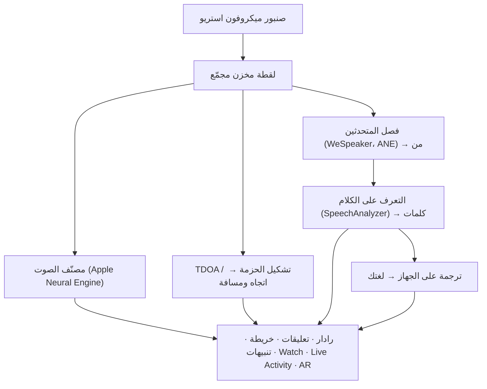

# Vigilant Ear 👂🛡️

*رادار صوتي لمن لا يستطيعون السمع.*

تطبيق مُصمَّم خصيصًا لمجتمع الصم وضعاف السمع. معظم تطبيقات التعرف على الأصوات تخبرك *ما* هو الصوت. **Vigilant Ear يخبرك أين هو، ومن يصدره، وماذا يقولون** — محوّلًا الـ iPhone إلى جهاز استشعار صوتي فوري يصف الصوت من حولك.

اتجاه صفارة الإنذار والمسافة إليها. طرقٌ خلفك. الأشخاص في محادثة، مرسومون كأصوات منفصلة مُنسوخة — كل واحد منهم مترجمٌ نصيًا وموضوعٌ مكانيًا بالاتجاه. إذا كان أحدهم يتحدث بلغة لا تقرأها، يمكن أن تصل كلماته **مترجمة إلى لغتك.** تصل التنبيهات إلى **شاشة القفل وDynamic Island وApple Watch** بحيث تكفي نظرة واحدة.

كل ما يهم يعمل على الجهاز. لا يُسجَّل الصوت ولا يُرفع للتعرف. لا شيء يعتمد على سماع أي شيء.

- 🧭 **الاتجاه، وليس الاكتشاف فحسب.** *ماذا، وأين، ومن،* و*ماذا قيل* — وليس مجرد «حدث صوت.»
- 🔒 **خصوصية حسب التصميم.** يعمل التصنيف والتعليق النصي والترجمة على جهاز iPhone الخاص بك. التعليقات مباشرة وعابرة؛ لا تُحفظ كأرشيف نصوص.
- ⌚ **على معصمك وشاشة القفل.** رفيق الاتجاه على Apple Watch + Live Activity يبقيان آخر تنبيه ومن أين أتى على بعد نظرة واحدة.
- 🛰️ **هواتف أكثر، أذن مشتركة واحدة.** يربط Constellation أجهزة iPhone الداعمة لـ Ultra-Wideband لدمج ما يسمعه كل جهاز في صورة اتجاهية أدق.
- 👁️ **مصنوع للصم / ضعاف السمع.** اهتزازات مميزة، مرئيات عالية التباين، إشارات مستقلة عن اللون، أهداف لمس كبيرة، واحترام Reduce Motion في كل مكان.

---

## لمن هو

- **مستخدمو الصم وضعاف السمع** الذين يريدون وعيًا موقفيًا بالصوت — Home Watch (طرق، إنذار، طفل، هاتف) وStreet Watch (صفارة إنذار، اقتراب) يمكنك تركهما مفعّلين والثقة بهما.
- أي شخص يحتاج **تعليقات حية مع الاتجاه وفصل المتحدثين**، أو **ترجمة على الجهاز** للأشخاص الجالسين بالقرب.
- مستخدمو إمكانية الوصول والبحث الصوتي المهتمون بتحديد مواقع الأصوات على الجهاز.

> Vigilant Ear **أداة** مساعدة لإمكانية الوصول، وليست جهاز سلامة حياة معتمدًا.

---

## ماذا يفعل

### 🧭 يرى الصوت — الاتجاه والمسافة
باستخدام ميكروفونات الـ iPhone الاستريو، يقدّر Vigilant Ear **الاتجاه والمسافة التقريبية** للأصوات من حولك ويضعها كعلامات حية على حلقة رادار موجهة للأمام وعلى الخريطة. تحرّك، فتحتفظ العلامات بمواقعها في العالم الحقيقي. هذا هو الجوهر: وعي مكاني بعالم لا تستطيع سماعه.

### 🚨 يتعرف على الأصوات المهمة — ويحذّرك
يحدد مصنّف على الجهاز مئات الأصوات اليومية ويراقب الفئات الحرجة — **صفارات الإنذار، الإنذارات، أجراس الأبواب/الطرق، بكاء الطفل، شخص قريب، والطقس القاسي.** عند الإطلاق، تحصل على تنبيه واضح على الشاشة، و**إشعار دفع** اختياري، و**اهتزاز** مميز — حتى عندما يكون التطبيق في الخلفية أو الهاتف نائمًا. الفئات الحرجة جاهزة افتراضيًا بحيث لا يعني تفعيل الإشعارات «كل شيء متوقف.» أوقف كل فئات التنبيه فيدخل المحرك في سبات كامل أثناء الخلفية لتوفير البطارية.

تأتي تحذيرات الطقس القاسي من تغذيات CAP العامة الرسمية — **NWS** في الولايات المتحدة، **MeteoGate** في أوروبا، **China CMA**، و**Korea KMA** — مجانًا لجميع المستخدمين. تُضيَّق التغذيات إلى تلك التي تغطي موقعك.

### ⌚ Apple Watch + Live Activity — نظرة وتعرف
- **رفيق Apple Watch** — يشير اتجاه التنبيه على معصمك فتقول لك نظرة واحدة أين تنظر. واجهة Watch معاد تصميمها بأيقونة أذن التطبيق، وتخطيط HUD للتهديد، والنقر المزدوج للتصغير. يمكن أن تظل التنبيهات تعرض سهم الاتجاه عندما لا يكون تطبيق Watch مفتوحًا.
- **Live Activity** — يبقى Vigilant Ear على **شاشة القفل**، وفي **Dynamic Island**، وفي **Watch Smart Stack**، بحيث يكون آخر تنبيه واتجاهه دائمًا على بعد نظرة واحدة.

### 💬 Speaker Mode — تعليقات حية واتجاهية *(مجاني)*
فعّل **Speaker Mode** فينسخ Vigilant Ear كلام الأشخاص القريبين إلى **كتل تعليقات، واحدة لكل صوت.** يبقي فصل المتحدثين على الجهاز الأصوات مميزة — *من* يقول *ماذا* — مع إشارة اتجاهية على الحلقة الداخلية. يُبرَز المتحدث الحي؛ ويتدحرج النص الأقدم بعيدًا عند الحاجة للمساحة. التعليقات مجانية؛ والترجمة التلقائية هي طبقة Power Pack+ الاختيارية.

### 🌐 Speaker Auto-Translate — لغتك، مباشرة *(Power Pack+)*
مع تفعيل Speaker Mode، عندما يتحدث شخص قريب بلغة أخرى، يمكن لـ Vigilant Ear اكتشافها وعرض تعليقاتهم **بلغتك**، مع إظهار لغة المصدر على كتلتهم. السلسلة — اسمع → افصل المتحدثين → انسخ → ترجم → اعرض — تعمل **على الجهاز**؛ اللحظة الشبكية الوحيدة هي تنزيل حزمة لغة لمرة واحدة من Apple. لا يلزمك معرفة اللغة الأخرى أو اختيارها أولًا.

### 🎵 الوعي بالموسيقى والبث *(Power Pack+)*
يحدد **ShazamKit** الموسيقى التي تُشغَّل حولك ويتتبع تغيّر الأغاني. عندما يبدو الصوت كأنه يأتي من تلفاز أو راديو وليس من شخص في الغرفة، يُوسَم بـ **📻** — تظهر الكلمات؛ وتُسمَّى بصراحة.

### 🛰️ Constellation — عدة أجهزة iPhone، أذن مشتركة واحدة *(Power Pack+)*
مع جهازي iPhone أو أكثر يدعمان Ultra-Wideband (معظمها منذ iPhone 11)، **Constellation** يربطهما بحيث يستشعران موضع كل منهما ويدمجان ما يسمعه كل جهاز في صورة أدق لمصدر الصوت — مصفوفة استماع موزعة وسلبية. مقتصر على الأجهزة ذات العتاد المناسب. لا يُعاد إرسال تعليقات الشبكة الأقدم من وقت اتصال النظير.

### 📷 Camera AR — «انظر الصوت» *(معاينة)*
افتح كبسولة الكاميرا على شريط العنوان وثبّت الأصوات المكتشفة عند اتجاهها الحقيقي في عرض الكاميرا الحي. تتجمع العلامات حسب المتحدث أو حسب فئة الصوت والاتجاه ليبقى العرض مقروءًا؛ وتخفت المصادر مع تقدم العمر عندما تهدأ.

### 🗺️ الخرائط والطرق وتوقع المسار
تُسقَط اتجاهات الصوت على إحداثيات GPS حقيقية على الخريطة. يمكن **التقاط أصوات المركبات إلى الشوارع القريبة** وتوقع مساراتها بحيث يُقرأ شاحنة عابرة وهي تتحرك *على طول الطريق* وليس عبر المباني. (جرّب عرض شاحنة الإطفاء التجريبي.)

### 🪄 Demo Mode — أثبته دون أذنين
**Demo Mode** عام للجميع: تمارين Home وStreet (طرق، إنذار، طفل، صفارة إنذار، طقس)، عروض متعددة الهواتف والمحادثة، وعلامة مائية واضحة **DEMO:** حتى لا يتظاهر التمرين بأنه حدث حي. إغلاق اللوحة يُزيل العروض نظيفًا (لا تزييف GPS عالق، ولا أعلام متبقية).

### ♿ إمكانية الوصول أولًا
مبني للصم / ضعاف السمع ومستخدمي عمى الألوان: إشارات **مستقلة عن اللون**، أهداف لمس **≥44 pt**، احترام **Reduce Motion**، تنبيهات متعددة الوسائط (اهتزاز + بصري + Watch)، وشاشة تحقق عند البدء تعرض حالة الأذونات بألوان أخضر / رمادي / أحمر واضحة (وبرتقالي محروق «غير مسموح») — بما في ذلك منح الإشعارات الذي يعمل كمفتاح رئيسي للتنبيهات.

---

## المجاني وPower Pack+

نواة السلامة **مجانية إلى الأبد**:

- **Home Watch وStreet Watch** — تنبيهات أصوات محلية (إنذارات، صفارات إنذار، طرق/أجراس أبواب، طفل، شخص قريب) مع تسليم على الشاشة واهتزاز ودفع اختياري.
- **التعليقات الحية** — Speaker Mode، على الجهاز، اتجاهي حيث يسمح العتاد.
- **CAP للطقس القاسي** — NWS وMeteoGate وCMA وKMA لمنطقتك.
- **Demo Mode** — تمارين تنبيهات ومعاينات ميزات بعلامة مائية DEMO.
- **رفيق Apple Watch وLive Activity** — اتجاه قابل للنظر وآخر تنبيه.

**Power Pack+** فتح لمرة واحدة (**ليس اشتراكًا**) مع **تجربة مجانية لمدة 90 يومًا**. يضيف القدرات المتقدمة:

- **Speaker Auto-Translate** — ترجمة على الجهاز للكلام القريب إلى لغتك.
- **Constellation** — سمع مشترك متعدد iPhone عبر Ultra-Wideband.
- **Music ID** — التعرف على الأغاني عبر ShazamKit.

مجاني أو Power Pack+، **يبقى الصوت على الجهاز للتعرف** — المستوى يغيّر فقط الميزات المفتوحة، لا أين يُرسَل الصوت الخام للتحليل.

---

## كيف يعمل (تحت الغطاء)

Vigilant Ear خط أنابيب **محلي أولًا، على الجهاز**. يُلتقَط الصوت الخام على صنبور عالي الأولوية، ويُنسَخ إلى **قائمة حرة لمخازن مجمّعة** (بدون هدر تخصيص على المسار اللحظي)، ويُوزَّع على معالجات مستقلة دون إيقاف واجهة المستخدم أو مقاطعة المُبثِّث:

- **الرياضيات المكانية** — تحويلات FFT وتتبع Time-Difference-of-Arrival وDoppler على مهام خلفية.
- **الكلام** — `SpeechAnalyzer` / `SpeechTranscriber` في iOS 26 للنسخ؛ تضمينات **WeSpeaker** لهوية الصوت؛ إطار عمل **Translation** من Apple للترجمة على الجهاز.
- **التوازي** — عزل Swift 6 يبقي صنبور الميكروفون والرياضيات الصوتية وحلقة رسم واجهة المستخدم منفصلة بوضوح.
- **الكفاءة** — تقليل العينات والتصنيف المتكيف مع الحمل يبقيان الاستماع الدائم خفيفًا بما يكفي لتركه مفعّلًا.

---

## الخصوصية

- **على الجهاز، دائمًا لنواة خط الأنابيب.** يعمل التصنيف والرياضيات المكانية والنسخ وفصل المتحدثين والترجمة على جهاز iPhone الخاص بك. لا يُسجَّل الصوت الخام ولا يُرفع للتعرف.
- **التعليقات عابرة.** تبقى التعليقات الحية في الذاكرة للجلسة؛ ولا تتضمن سجلات التصحيح المُصدَّرة نص التعليقات.
- **لا حزم SDK للإعلانات أو تحليلات السلوك.** الاستخدام الشبكي المحدود فقط للخرائط وتغذيات الطقس العامة وبصمات Shazam الاختيارية وسياق الطريق ومشتريات App Store — انظر السياسة الكاملة.

التفاصيل الكاملة: [PRIVACY.md](PRIVACY.md) · [TERMS.md](TERMS.md) · [SUPPORT.md](SUPPORT.md)

---

## العتاد والمنصات

- **iPhone (التجربة الكاملة).** ميكروفونات استريو مطلوبة لتحديد الاتجاه. يُوصى بـ **iPhone 13 أو أحدث**.
- **Apple Watch.** تنبيهات رفيقة بسهم اتجاه؛ يعمل مع Live Activity / Smart Stack.
- **iPad (مركّز على التعليقات).** ميكروفونات أحادية القناة → تعليقات دون اتجاه كامل.
- يحتاج **Constellation** إلى **Ultra-Wideband** — iPhone 11 أو أحدث، باستثناء طرازات SE و«e».
- **Android.** بناء منفصل مع الرادار الأساسي والتنبيهات والتعليقات والطقس؛ شبكة Constellation أولًا على iOS. انظر تحديثات موقع المنتج مع نمو تكافؤ Android.

**إصدار التسويق الحالي من Apple:** 1.0.7 (قيد التقدم / مسار الشحن). مبني لأنظمة iOS الحديثة (عصر SpeechAnalyzer).

---

## التوطين

مُوطَّن بالكامل — الواجهة والتنبيهات والتعليقات — إلى **الإنجليزية والإسبانية والبرتغالية (البرازيل) والفرنسية والألمانية والعربية واليابانية والصينية المبسطة والكورية** (9 لغات). يتبع لغة النظام أو اختيارًا يدويًا في التطبيق.

---

## الحالة وإخلاء المسؤولية

Vigilant Ear **أداة تجريبية لإمكانية الوصول الصوتية**، وليست أداة سلامة حياة معتمدة. تختلف دقة التوطين المكاني حسب المحيط والطقس والرياح وعتاد الميكروفون. **حافظ دائمًا على وعيك البيئي العادي** — لا تعتمد عليه كمصدر وحيد لمعلومات السلامة.

بعض القدرات (علامات Camera AR، ترقية استحقاق Critical Alerts عند منحها من Apple، تأليف حزم صوت متعددة متقدم) ما زالت تتطور؛ مراقبة Home / Street المجانية والتعليقات الحية هي المنتج الذي يمكنك الوثوق به من اليوم الأول.

---

**التواصل:** [vigilantear@wingdingssocial.com](mailto:vigilantear@wingdingssocial.com)

صُنع بـ ❤️ لمجتمع D/HH والبحث الصوتي.

    
  <strong>© 2026 Wingdings, Inc.</strong> 
  All rights reserved. 
  Patent Pending

