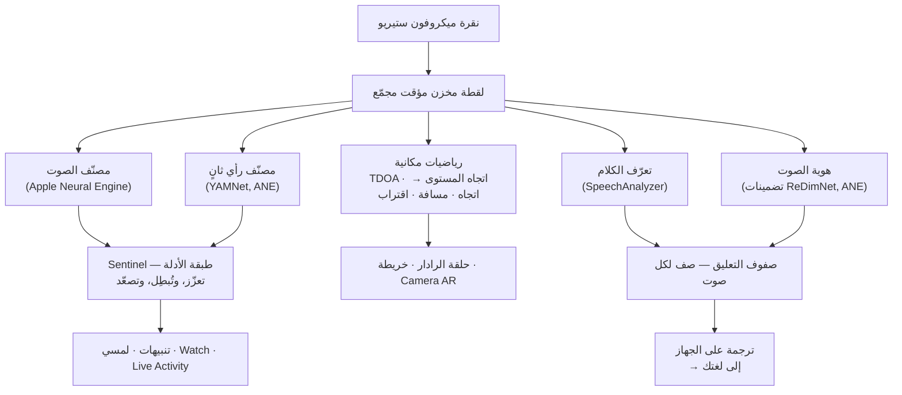
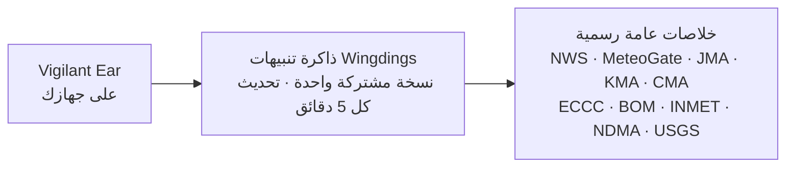

# Vigilant Ear 👂🛡️

*يسري اعتبارًا من الإصدار 1.1.3 · سبتمبر 2026.*

## رادار صوتي للأشخاص الذين لا يستطيعون السمع.

تطبيق صُمم خصيصًا لمجتمع الصم وضعاف السمع وأبناء الصم (CODA). معظم تطبيقات التعرف على الصوت تخبرك *ما هو* الصوت. **Vigilant Ear يخبرك بمكانه، ومن يصدره، وماذا يقولون** — محوّلًا جهاز iPhone إلى جهاز قياس صوتي حيّ يصف الصوت من حولك.

اتجاه صفارة الإنذار ومسافتها. طرقة خلفك. الأشخاص في محادثة، مرسومون كأصوات منفصلة ومنسوخة — كلّ صوت معنون ومحدد الاتجاه. إذا كان شخص يتحدث بلغة لا تقرأها، يمكن أن تصل كلماته **مترجمة إلى لغتك.** تصل التنبيهات إلى **شاشة القفل (Lock Screen)، والجزيرة التفاعلية (Dynamic Island)، وApple Watch** — فتكفي نظرة سريعة.

كل ما يهم يعمل على الجهاز. لا يُسجَّل الصوت ولا يُرفَع للتعرف عليه. لا شيء يعتمد على سماع أي شيء.

- 🧭 **الاتجاه، وليس الاكتشاف فقط.** *ماذا، وأين، ومن،* و*ماذا قيل* — وليس مجرد «حدث صوت».
- 🔒 **الخصوصية حسب التصميم.** يعمل التصنيف والتعليق والترجمة على جهاز iPhone الخاص بك. التعليقات حية ومؤقتة؛ ولا تُحفظ كأرشيف نصوص.
- ⌚ **على معصمك وشاشة القفل.** رفيق الاتجاه في Apple Watch + Live Activity يبقيان آخر تنبيه واتجاهه على بُعد نظرة واحدة.
- 🛰️ **هواتف أكثر، أذن مشتركة واحدة.** يربط Constellation أجهزة iPhone التي تدعم Ultra-Wideband لدمج ما يرصده كلّ منها في صورة اتجاهية أوضح.
- 👁️ **مصنوع للصم / ضعاف السمع / CODA.** استجابات لمسية مميزة، ومرئيات عالية التباين، وإشارات مستقلة عن اللون، وأهداف نقر كبيرة، واحترام خيار Reduce Motion في كل مكان.

---

## لمن هذا

- **المستخدمون الصم وضعاف السمع وCODA** الذين يريدون وعيًا ظرفيًا بالصوت — Home Watch (طرقة، إنذار، طفل، هاتف) وStreet Watch (صفارة إنذار، اقتراب) يمكنك تركها والوثوق بها.
- أي شخص يحتاج إلى **تعليقات حية مع تحديد الاتجاه وتمييز المتحدثين**، أو **ترجمة على الجهاز** للأشخاص الجالسين بالجوار.
- مستخدمو تسهيلات الاستخدام والباحثون في الصوتيات المهتمون بتحديد موقع الصوت على الجهاز.

> Vigilant Ear هو **مساعد لتسهيلات الاستخدام**، وليس جهازًا معتمدًا للسلامة والحياة.

---

## ماذا يفعل

### 🧭 يرى الصوت — الاتجاه والمسافة
باستخدام ميكروفونَي جهاز iPhone، يقيس Vigilant Ear **زاوية الصوت وما إذا كان أمامك أو خلفك**، ويثبّت القراءة في حدود درجة تقريبًا، ويضعها كعلامة حية على حلقة رادار متجهة لأعلى وعلى الخريطة. ميكروفونان على خطّ واحد لا يستطيعان وحدهما التمييز بين اليسار واليمين — فصوت عند 50° إلى يمينك وآخر عند 50° إلى يسارك يصلان بالفجوة الزمنية الضئيلة نفسها — لذلك يرسم التطبيق القراءة إضافة إلى **شبح أخف على الجانب الآخر**، وتُحسَم المسألة بإدارة المعصم أو بهاتف ثانٍ. تُقدَّر المسافة من شدة الصوت وفق منحنى معايرة شارعٍ حقيقي، وتُعرض كما هي تقديرًا: *≈ 50 قدمًا*، مع نطاق مرجّح. تحرّك، فتحتفظ العلامات بموقعها في العالم الحقيقي. هذا هو الجوهر: وعي مكاني بعالم لا تستطيع سماعه. (الأرقام أدناه.)

### 🚨 يتعرف على الأصوات المهمة — ويحذّرك
يحدد مصنّف على الجهاز مئات الأصوات اليومية ويراقب الفئات الحرجة — **صفارات الإنذار، والإنذارات — بما في ذلك فئة مخصصة لإنذار السيارات — وأجراس الأبواب/الطرقات، وبكاء الأطفال، وشخص قريب، والطقس القاسي.** عندما ينطلق أحدها، تحصل على تنبيه واضح على الشاشة، و**إشعار دفع (push notification)** اختياري، و**استجابة لمسية** مميزة — حتى عندما يكون التطبيق في الخلفية أو الهاتف في وضع السكون. الفئات الحرجة جاهزة افتراضيًا، لذا تمكين الإشعارات لا يعني «إيقاف كل شيء». أوقف جميع فئات التنبيهات فينام المحرك تمامًا أثناء الخلفية لتوفير البطارية. تقوم طبقة **Sentinel** بمطابقة التنبيهات مع أدلة مستقلة — الاتجاه والحركة والخلاصات العامة — بحيث يكون ما ينطلق معزَّزًا بالأدلة، وليس تخمين مصنّف واحد منعزل. وتعمل بالاتجاهين: لحظة تشبه صفارة الإنذار داخل أغنية تُحتجَز، أما صفارة إنذار حقيقية تتكرر عبر موسيقاك فتخترق وتُنبّه.

تأتي تحذيرات الطقس القاسي من الخلاصات العامة الرسمية — **NWS** في الولايات المتحدة، و**MeteoGate** في أوروبا، و**CMA** في الصين، و**KMA** في كوريا، و**JMA** في اليابان، و**ECCC** في كندا، و**BOM** في أستراليا، و**INMET** في البرازيل، و**NDMA** في الهند — مجانًا لجميع المستخدمين. تُضيَّق الخلاصات إلى تلك التي تغطي مكان تواجدك. وفي اليابان يقرأ التطبيق أيضًا **النشرات المسبقة** من JMA — الإشعارات بلغة واضحة التي تُصدَر أيامًا قبل إعصار أو أمطار غزيرة، وليس فقط التحذيرات بعد وصول الخطر — إضافة إلى نشرات الهطول المفاجئ والانهيارات الأرضية. تُعرض الإشعارات المسبقة بهدوء، دون الصوت والاهتزاز المخصصين لتحذير حقيقي.

### ⌚ Apple Watch + Live Activity — نظرة وتعرف
- **رفيق Apple Watch** — يشير اتجاه التنبيه على معصمك فتخبرك النظرة السريعة أين تنظر. واجهة Watch معاد تصميمها مع أيقونة أذن التطبيق، وتخطيط شاشة التهديدات (HUD)، والنقر المزدوج لإغلاق التنبيه. يمكن للتنبيهات أن تُظهر سهم الاتجاه حتى عندما لا يكون تطبيق Watch مفتوحًا.
- **Live Activity** — يبقى Vigilant Ear على **شاشة القفل (Lock Screen)**، وفي **الجزيرة التفاعلية (Dynamic Island)**، وفي **Watch Smart Stack**، فيكون آخر تنبيه واتجاهه دائمًا على بُعد نظرة واحدة.
- **تنبيهات الشركاء على معصمك** — عندما يطلق هاتف شريك Constellation مرتبط تنبيهًا، يمكن أن يصل أيضًا إلى ساعتك Watch، مع الاتجاه. وتحافظ جولة موثوقية على خفة الرفيق على بطارية الساعة طوال اليوم.

### 💬 Speaker Mode — تعليقات حية واتجاهية *(مجاني)*
شغّل **Speaker Mode** فينسخ Vigilant Ear كلام الأشخاص القريبين إلى **كتل تعليقات، واحدة لكل صوت.** يُبقي تمييز المتحدثين على الجهاز الأصوات متمايزة — *من* يقول *ماذا* — مع إشارة اتجاهية على الحلقة الداخلية. يُبرَز المتحدث الحي؛ ويتراجع النص الأقدم كلما احتيجت المساحة.

أمران نادرًا ما تفعلهما تطبيقات التعليق: **الصدق بشأن الثقة** — علامة جودة خفيفة لكل صف وخطوط منقّطة تحت الكلمات المشكوك فيها تخبرك متى تثق بالسطر ومتى تراجع — و**التصحيح الذاتي**: بعد ثوانٍ من استقرار الجملة، يعيد التطبيق قراءة الصوت بالسياق الكامل ويمكنه استعادة كلمة فاتت أو أُسيء قراءتها خلال نحو ثانيتين، ثم يتجمد النص.

التعليقات مجانية؛ الترجمة التلقائية هي طبقة Power Pack+ الاختيارية. ويمكن أيضًا **نطق التعليقات بصوت عالٍ عبر أجهزة السمع بتقنية Bluetooth** — مجانًا، من التفضيلات. و**Direction Tones** (مجانية أيضًا، في التفضيلات ثم التعليقات) تضيف إشارة صوتية اختيارية في الأذن التي تختارها تدل على مكان المتحدث — مفيدة مع سماعة طبية أو سمع أحادي الجانب، ومتاحة للجميع.

### 🌐 Speaker Auto-Translate — لغتك، حية *(Power Pack+)*
مع تشغيل Speaker Mode، عندما يتحدث شخص قريب بلغة أخرى، يمكن لـ Vigilant Ear اكتشافها وعرض تعليقاته **بلغتك**، مع إظهار لغة المصدر على كتلته. تعمل السلسلة — الاستماع ثم فصل المتحدثين ثم النسخ ثم الترجمة ثم العرض — **على الجهاز**؛ لحظة الشبكة الوحيدة هي تنزيل حزمة لغة لمرة واحدة من Apple. ليس عليك أن تعرف أو تختار اللغة الأخرى أولًا.

هذا أقرب ما وصلنا إليه من **المترجم الكوني** في الخيال العلمي — الجهاز الذي يفهم ببساطة. يكتشف Vigilant Ear اللغة بنفسه، ويتابع كل متحدث في الغرفة، ويعرضهم جميعًا بلغتك — دون سماعات، ودون إعداد، وعلى جهازك.

```mermaid
graph LR
    A["فقط استمع"] --> B["كشف اللغة تلقائيًا"] --> C["فصل كل الأصوات"] --> D["تعليق الغرفة كلها بلغتك"]
```

### 🎵 الموسيقى والوعي بالبث *(Power Pack+)*
يحدد **ShazamKit** الموسيقى التي تُشغَّل من حولك ويتتبع تغييرات الأغاني.

### 🎛️ Acoustic Scope — شاهد الصوت كمهندس
عرض احترافي مباشر للصوت من حولك: الطيف، والمخطط الطيفي، ونطاقات RTA بثلث أوكتاف، والكروما، والتوافقيات الجزئية — **مجاني للجميع**. أما أدوات التقاط الأصوات لتدريب حزمك الخاصة فهي ضمن Power Pack+.

### 📦 Custom Sound Packs — علِّمه عالمك *(Power Pack+)*
علِّم Vigilant Ear الأصوات التي تهمك — من طيور منطقتك إلى جرس باب مبناك. تُضاف الحزم فوق الكشف المدمج، فلا تزاحم صفارات الإنذار والإنذارات أبدًا. مع دليل خطوة بخطوة داخل التطبيق.

### 🛰️ Constellation — هواتف عديدة، أذن مشتركة واحدة *(Power Pack+)*
مع جهازين أو أكثر من أجهزة iPhone التي تدعم Ultra-Wideband (معظمها منذ iPhone 11)، يقوم **Constellation** بإقرانها حتى تستشعر مواقع بعضها البعض وتدمج ما يرصده كلّ منها في صورة واحدة أدقّ عن مصدر الصوت — مصفوفة استماع سلبية وموزعة. وتُدمَج التعليقات أيضًا: ينسخ كل هاتف ما يلتقطه ميكروفونه، وتُحاذى الكلمات عبر الهواتف فيساهم الأقرب إلى المتحدث بما سمعه — فتُحفظ الكلمات التي التقطها هاتف واحد بدل أن تضيع. تتصل الهواتف **ببعضها مباشرة** — بلا راوتر، وبلا شبكة Wi-Fi مشتركة، وبلا إنترنت؛ يكفي تشغيل Wi-Fi، عبر الرابط النظير-للنظير نفسه الذي يستخدمه AirDrop. يقتصر على الأجهزة ذات العتاد المناسب. لا تُعاد إرسال تعليقات الشبكة الأقدم من وقت اتصال النظير.

**رسائل الشركاء** — أرسل نصًا سريعًا إلى هاتف شريك مرتبط؛ يصل إلى موجز تعليقاته ويمكن أن يصل مترجمًا إلى لغته، على الجهاز. المراسلة تراعي العمر: استنادًا إلى Declared Age Range من Apple، تظل المراسلة بين بالغ وقاصر معطّلة ما لم يقم كلاهما بتسمية الآخر عمدًا. لا تُقيَّد التنبيهات أو التعليقات أبدًا — فقط الرسائل من شخص إلى شخص.

### 🔗 Remote Link — تواصل مع من ليس معك *(Power Pack+ للبدء)*
ما يفعله الاتصال الهاتفي عادةً، لكن بالفيديو والنص بدلًا منه. ترسل رمز دعوة؛ وينضم الآخر من داخل Vigilant Ear **دون امتلاك Power Pack+**. بخلاف Constellation لا يُشترط القرب — يمكنكما أن تكونا في أي مكان.

**لا يُستخدم أي صوت في أي مرحلة.** فيديو ونص فقط، فلا يعتمد الرابط على السمع في أي طرف — ويمنحك طريقة للتواصل بالإشارة عبر التطبيق. التطبيق نفسه لا يفهم لغة الإشارة؛ ينقل الفيديو وأنتما تقومان بالباقي. الاتصال مباشر بين الهاتفين حيث تسمح الشبكة، ويعرض التطبيق بوضوح ما إذا كان **Direct** أو **Relayed**، فتعرف دائمًا إن كان الفيديو يمر عبر مرحل.

### 📷 Camera AR — «رؤية الصوت»
افتح كبسولة الكاميرا في شريط العنوان وثبّت الأصوات المكتشفة عند اتجاهها الحقيقي في عرض الكاميرا المباشر. تتجمع العلامات حسب المتحدث أو حسب فئة الصوت والاتجاه ليبقى العرض قابلًا للقراءة؛ وتتلاشى المصادر تدريجيًا عندما تهدأ.

### 🗺️ الخرائط والطرق وتوقع المسار
تُسقَط اتجاهات الصوت على إحداثيات GPS حقيقية على الخريطة. يمكن **تثبيت أصوات المركبات على الشوارع القريبة** وتوقع مساراتها فتُقرأ شاحنة مارة على أنها تتحرك *على طول الطريق* لا عبر المباني. (جرّب عرض سيارة الإطفاء التوضيحي.)

### 🪄 Feature Playground — أثبت ذلك بلا آذان
**Feature Playground** متاح للجميع: تدريب Home وStreet (طرقة، إنذار، طفل، صفارة إنذار، طقس)، وعروض الهواتف المتعددة والمحادثات، وعلامة مائية واضحة بحيث لا يتظاهر التدريب أبدًا بأنه حدث حي. إغلاق اللوحة يزيل العروض بنظافة (بلا انتحال GPS عالق، وبلا أعلام متبقية).

### ♿ تسهيلات الاستخدام أولًا
صُمم للمستخدمين الصم / ضعاف السمع / CODA وعمى الألوان: إشارات **مستقلة عن اللون**، أهداف نقر **≥44 نقطة**، احترام **Reduce Motion**، تنبيهات متعددة الوسائط (لمسية + بصرية + Watch)، وشاشة تحقق عند البدء تُظهر حالة الأذونات بألوان واضحة أخضر / رمادي / أحمر (وبرتقالي محروق للحالات «غير المسموح بها») — بما في ذلك منح الإشعارات الذي يعمل كمفتاح التنبيه الرئيسي.

---

## المجاني و Power Pack+

جوهر السلامة **مجاني، إلى الأبد**:

- **Home Watch وStreet Watch** — تنبيهات صوتية محلية (إنذارات، صفارات إنذار، طرقات/أجراس أبواب، طفل، شخص قريب) مع عرض على الشاشة، واستجابة لمسية، وتسليم إشعار دفع اختياري.
- **تعليقات حية** — Speaker Mode، على الجهاز، اتجاهية حيثما يسمح العتاد، مع علامات ثقة صريحة، وتصحيح ذاتي خلال نحو ثانيتين، وإخراج صوتي اختياري إلى أجهزة السمع بتقنية Bluetooth، وDirection Tones.
- **Standing Watch** — حالة الغرفة نفسها، دائمًا دون إعداد: مصباح سماوي ثابت ما دامت الغرفة محافظة على نمطها، وكهرماني عندما يتغير شيء — صوت جديد، أو هدوء مفاجئ، أو شيء يقترب.
- **تنبيهات الطقس القاسي** — NWS، وMeteoGate (أوروبا — تُقدَّم طازجة من ذاكرة التخزين المؤقت للتنبيهات لدينا كل 5 دقائق)، وCMA، وKMA، وJMA (اليابان)، وECCC (كندا)، وBOM (أستراليا)، وINMET (البرازيل)، وNDMA (الهند) لمنطقتك.
- **تنبيهات الزلازل (USGS، عالميًا)** — تشعر باهتزاز وترى على خريطتك المنطقة التي شعرت بالهزة عند الإبلاغ عن زلزال قريب. تأكيد من خلاصة USGS الرسمية — وليس إنذارًا مبكرًا: إذا شعرت بالاهتزاز، فهذا يخبرك بما كان. ويمكن لاستشعار الهدير العميق (دون الصوتي) على الجهاز تفعيل التحقق لحظة تحرك الأرض.
- **Feature Playground** — ممارسة التنبيهات ومعاينة الميزات بعلامة مائية PREVIEW واضحة.
- **رفيق Apple Watch وLive Activity** — اتجاه يمكن إلقاء نظرة سريعة عليه وآخر تنبيه.
- **Acoustic Scope** — تصور صوتي مباشر بمستوى احترافي، مجاني للجميع. (أدوات الالتقاط للتدريب ضمن Power Pack+.)

**Power Pack+** هو فتح لمرة واحدة (**ليس اشتراكًا**) مع **تجربة مجانية لمدة 90 يومًا**. يضيف القوى الخارقة:

- **Speaker Auto-Translate** — ترجمة على الجهاز للكلام القريب إلى لغتك.
- **Constellation** — استماع مشترك عبر أجهزة iPhone متعددة فوق Ultra-Wideband، مع رسائل الشركاء.
- **Music ID** — التعرف على الأغاني بواسطة ShazamKit.
- **Custom Sound Packs** — مصنّفات إضافية تدرّبها على أصواتك الخاصة.

سواء كان مجانيًا أو Power Pack+، **يبقى الصوت على الجهاز للتعرف عليه** — الطبقة تغيّر فقط الميزات المفتوحة، ولا تغيّر أبدًا أين يُرسَل الصوت الخام للتحليل.

---

## كيف يعمل (تحت الغطاء)

Vigilant Ear هو خط أنابيب **محلي أولًا، وعلى الجهاز** مبني بطبقات: التقاط مرة واحدة، ثم يقرأ متخصصون مستقلون الصوت نفسه ويراجعون عمل بعضهم. يُلتقَط الصوت الخام على نقرة عالية الأولوية، ويُنسَخ إلى **قائمة حرة لمخازن مؤقتة مجمّعة (pooled buffer free-list)** (بلا إرهاق تخصيص على المسار الفوري)، ويُوزَّع دون إيقاف واجهة المستخدم:

```mermaid
graph TD
    A["نقرة ميكروفون ستيريو"] --> B["لقطة مخزن مؤقت مجمّع"]
    B --> C["مصنّف الصوت<br/>(Apple Neural Engine)"]
    B --> Y["مصنّف رأي ثانٍ<br/>(YAMNet, ANE)"]
    C --> S["Sentinel — طبقة الأدلة<br/>تعزّز، وتُبطِل، وتصعّد"]
    Y --> S
    S --> H["تنبيهات · لمسي · Watch · Live Activity"]
    B --> D["رياضيات مكانية<br/>TDOA · اتجاه المستوى → اتجاه · مسافة · اقتراب"]
    D --> R["حلقة الرادار · خريطة · Camera AR"]
    B --> F["تعرّف الكلام<br/>(SpeechAnalyzer)"]
    B --> E["هوية الصوت<br/>(تضمينات ReDimNet, ANE)"]
    F --> G["صفوف التعليق — صف لكل صوت"]
    E --> G
    G --> T["ترجمة على الجهاز<br/>→ إلى لغتك"]
```

لا يُوثَق بنموذج واحد وحده. تجلس طبقة **Sentinel** بين الكشف والتنبيه: محركات مستقلة تعزّز أو تُبطِل بعضها إطارًا بإطار — وعندما تتراكم أدلة واقعية متكررة ضد إبطال (صفارة إنذار حقيقية تعوي عبر موسيقاك)، تفوز الأدلة وينطلق التنبيه.

والتعليقات تحصل على فرصة ثانية خاصة بها. كل جملة مُنهَاة تُعاد قراءتها بهدوء من حلقة صوت قصيرة في الذاكرة بالسياق الكامل — تصل التصحيحات خلال نحو ثانيتين، ثم يتجمد النص نهائيًا:

```mermaid
graph LR
    L["يظهر التعليق الحي"] --> K["إعادة قراءة الصوت الخام<br/>بالسياق الكامل"] --> V["مقارنة محروسة<br/>(تُبقي ما التُقط)"] --> W["تصحيح هادئ للصف<br/>≤ 2 ث، ثم يتجمد"]
```

- **الرياضيات المكانية** — تحويلات فورييه السريعة (FFTs)، وفرق وقت الوصول الموزون بالتماسك (TDOA — تفضيل نطاقات التردد التي يتفق عليها الميكروفونان، ثم تحويل فجوة الوصول الضئيلة إلى اتجاه)، وتتبع الاقتراب باتجاه المستوى في مهام الخلفية. يُقرأ زوج الميكروفونات بتوجيه ثابت فيعمل الاتجاه بالطريقة نفسها سواء أمسكت الهاتف عموديًا أو أفقيًا.
- **الكلام** — iOS 26 `SpeechAnalyzer` / `SpeechTranscriber` للنسخ؛ تضمينات **ReDimNet** لهوية الصوت؛ وإطار عمل **Translation** من Apple للترجمة على الجهاز. هوية الصوت قائمة على الأدلة: يُؤكَّد الصوت كشخص حقيقي فقط من نوافذ صوت مستقلة، والمطابقة غير المؤكدة تظهر بلا إسناد بدل تخمين الاسم الخطأ.
- **حقيقة الموسيقى** — كاشف **توقيع أغنية بالكروما** يملك قرار «هل الموسيقى تُشغَّل فعلًا؟»، لأن المصنّفات العامة كثيرًا ما تسمّي الغرف الصامتة وصفارات الإنذار «موسيقى». لا يعمل Shazam إلا بعد أن يوافق التوقيع على وجود شيء موسيقي فعلًا.
- **التزامن** — عزل Swift 6 يبقي نقرة الميكروفون، والرياضيات الصوتية، وحلقة عرض الواجهة مفصولة نظيفًا.
- **الكفاءة** — الاختزال، والتصنيف المتكيّف مع الحمل، واستخدام الشبكة المقيّد بالأدلة يبقي الاستماع الدائم خفيفًا بما يكفي لتركه قيد التشغيل.

الطقس وتنبيهات الزلازل تسلك المسار المعاكس للصوت — لا يخرج شيء من صوتك، لكن *بيانات* التنبيه تدخل. تمر **كل** خلاصة رسمية عبر ذاكرة تخزين مؤقت صغيرة نشغّلها، فجلب واحد للبيانات العامة يخدم كل مستخدم — وهاتفك لا يتصل أبدًا بخوادم حكومة أجنبية:

```mermaid
graph LR
    P1["Vigilant Ear<br/>على جهازك"] --> W["ذاكرة تنبيهات Wingdings<br/>نسخة مشتركة واحدة · تحديث كل 5 دقائق"]
    W --> N["خلاصات عامة رسمية<br/>NWS · MeteoGate · JMA · KMA · CMA<br/>ECCC · BOM · INMET · NDMA · USGS"]
```

---

## ما يمكن لهاتفك رصده — قياسات

لدى جهاز iPhone ميكروفونان يبعدان نحو ستة إنشات، ومقياس ضغط جوي، وساعة دقيقة جدًا. وهذا يكفي لمعرفة اتجاه الصوت، وتقريب المسافة، وما إذا كان يقترب منك، وما إذا فُتح باب للتو. إليك مدى دقة كلّ منها، وكيف تحققنا، ولماذا يهم إن كنت لا تستطيع سماع الصوت بنفسك. قِيست أرقام الاتجاه وما يتصل بها على iPhone 17 وiPhone 16 Pro Max في سبتمبر 2026. المسافة تبقى تقديرًا بطبيعتها — ونقول ذلك على الشاشة.

**الاتجاه — إلى بضع درجات.** يصل الصوت إلى الميكروفون العلوي قبل السفلي أو بعده، ومن تلك الفجوة يستنتج التطبيق مدى انحراف الصوت عن محور الهاتف وما إذا كان أمامك أو خلفك. قناتا الهاتف ليستا ميكروفونين خامين بل صورة ستيريو معالجة، وتضيف تلك الصورة نمطًا ثابتًا خاصًا بها كلما كانت الغرفة صاخبة. يتعلم التطبيق الآن ذلك النمط من بضع ثوانٍ هادئة بعد التشغيل ويزيله قبل قراءة الاتجاه.

| ما قسناه | النتيجة |
|---|---|
| الوسيط عبر 96 غرفة محاكاة، من مكتب هادئ إلى غرفة جدران صلبة عند 5 dB SNR | 1.0° |
| iPhone 17 على مكتب، ضوضاء الغرفة شغّالة، ومكبر عند 30° عن المحور | قرأ 61.7° من مستوى الجانب مقابل متوقع 60°، تذبذب 1.6° |
| نفسه، مكبر مباشرة عن جانب الهاتف | قرأ 4.5° مقابل متوقع 0°، تذبذب 2.2° |
| نفسه، مكبر أمام الهاتف مباشرة | كل قراءة عند أقصى تأخير، كما ينبغي |
| قراءات تهبط على نمط الصورة نفسه بدل الصوت | لا شيء، عند أي زاوية |

*لماذا يهم:* إن كنت لا تستطيع سماع صفارة إنذار، فـ«خلفك، إلى أحد الجانبين» يخبرك أين تنظر. والقراءة التي تثبت لا تستحق الثقة إلا بعد التحقق بشريط قياس — وهذا ما حدث مرتين، والمرة الثانية بعد أن تبين أن التحقق الأول كان متساهلًا أكثر مما ينبغي.

**المسافة — تُعرض كما هي تقديرًا.** ميكروفون واحد لا يقيس المسافة، بل الشدة فقط، وشاحنة صاخبة بعيدة قد تبدو كسيارة هادئة قريبة. يقدّر التطبيق المسافة من الشدة بمنحنى مُعايَر في شارع حقيقي، ثم يقولها كما يقولها شخص حذر: *نحو 50 قدمًا، على الأرجح بين 25 و100.*

| ما قسناه | النتيجة |
|---|---|
| اكتشافات سيارات حقيقية أُعيد تشغيلها عبر المعايرة | 1,131 |
| الهبوط داخل طريق المائة قدم الذي كانت عليه فعلًا | 73% |
| سيارات المسار البعيد | قُدِّرت 78 و87 قدمًا حيث قال الشريط 73 و85 قدمًا |

قِيس الطريق (تقاطع مدينة) مسارًا بمسار؛ وعندما يخطئ المنحنى يخطئ إلى الجانب الأقرب. تُقفَل المعايرة باختبار آلي فلا تنزاح بصمت. الإنذارات داخل مساحتك — ككاشف دخان — لا تحصل على رقم مسافة أصلًا؛ فهي أصلًا في الغرفة معك.

**الحركة — يقترب منك.** للسيارات وصفارات الإنذار، ازدياد الشدة عادةً يعني الاقتراب. يراقب التطبيق سرعة ارتفاع مستوى الصوت على بضع ثوانٍ: صعود مستمر بنحو 1.5 dB في الثانية (زيادة واضحة وثابتة في الشدة) يعني اقترابًا، وهبوط مطابق يعني ابتعادًا، والصوت الذي يتوقف عن التغير يتوقف عن وصف أي منهما بعد نحو أربع ثوانٍ. لحظة صاخبة واحدة — نفخة بوق، إغلاق باب — لا تستطيع تشغيله. مبني على الفيزياء وتسعة اختبارات آلية؛ والمرور المسجَّل في الشارع هو التأكيد الميداني التالي.

**هواء الغرفة — للباب توقيع.** يستطيع مقياس الضغط ملاحظة فتح باب على بُعد نحو أربعة عشر قدمًا: يهبط الضغط مع تأرجح الباب، ثم يرتد مع إغلاقه. على مدى أربع عشرة ساعة هادئة وخمسة عشر حدث باب، صنع كل باب ذلك الشكل الثنائي ولم يصنعه شيء آخر في المنزل.

| الحدث | معدل الضغط | الشكل |
|---|---|---|
| الباب الأمامي، فتح وإغلاق، ×10 | 0.6–1.8 Pa/s | هبوط ثم ارتداد، ~5 ث بينهما |
| الباب الأمامي، إغلاق بقوة، ×5 | 1.1–2.5 Pa/s | الزوج نفسه، أطول |
| تكييف الهواء ليلًا، ×8 | 0.11–0.46 Pa/s | منحدر بطيء على دقائق، متطابق على الهاتفين |
| غرفة هادئة | ~0.02 Pa/s | لا شيء |
| مرور ماشيًا، عطاس | — | يستشعره مستشعر الحركة فيتجاهله الهاتف |

باب الشاشة، الذي لا يحكم إغلاق الغرفة، كان غير مرئي — تمامًا كما ينبغي. اليوم يمكن أن يظهر تحوّل الضغط كهدير عميق على الخريطة؛ وتنبيه باب ليلي هادئ مخصص مَقيس ومُصمَّم، وليس بعد الافتراضي اليومي.

**Constellation — هاتفان يحسمان الجانب.** يرسم كل هاتف على الشبكة خطًا نحو الصوت من موقعه، وتتقاطع الخطوط بوضوح على جانب واحد فقط. وعندما يحدث ذلك يختفي الشبح ويستطيع التطبيق القول يسارًا أو يمينًا من جديد. في المحاكاة، هاتفان يبعدان **40 مترًا** يضعان صفارة إنذار على بُعد 50 مترًا في حدود نحو مترين.

**كيف يُصدَّق أي رقم هنا.** مرّ كل رقم بالبوابات الثلاث نفسها، بالترتيب: غرفة محاكاة جوابها معروف مسبقًا؛ ثم اختبارات آلية صغيرة تعيد الحالة الدقيقة التي قد تخدع التطبيق وتعمل مع كل تغيير؛ ثم الهواتف الحقيقية على مكتب حقيقي بمسافات مقيسة يدويًا. لا يُعدّ شيء دقيقًا حتى ينجو من الثالثة. ولمن لا يستطيع سماع الصوت، كلمة التطبيق هي الكلمة الوحيدة — فلتُكتسَب كما تكتسبها المختبرات.

ملاحظات أعمق للمهندسين: [Physics](https://vigilantear.com/en/physics/) — TDOA، والمسافة، والحركة، وConstellation، والكشف البارومتري، مع كل رقم موسوم MEASURED / BENCHED / MODELLED.

---

## الخصوصية

- **على الجهاز، دائمًا لخط الأنابيب الأساسي.** يعمل التصنيف، والرياضيات المكانية، والنسخ، وتمييز المتحدثين، والترجمة على جهاز iPhone الخاص بك. لا يُسجَّل الصوت الخام ولا يُرفَع للتعرف عليه.
- **التعليقات مؤقتة.** تبقى التعليقات الحية في الذاكرة للجلسة؛ وسجلات التصحيح المُصدَّرة لا تتضمن نص التعليق.
- **لا إعلانات ولا حزم أدوات تحليلات سلوكية.** يقتصر الاستخدام المحدود للشبكة على الخرائط، وخلاصات الطقس العامة، وبصمات Shazam الاختيارية، وسياق الطريق، ومشتريات App Store — راجع السياسة الكاملة.

التفاصيل الكاملة: [PRIVACY.md](PRIVACY.md) · [TERMS.md](TERMS.md) · [SUPPORT.md](SUPPORT.md)

---

## الأجهزة والمنصات

- **iPhone (تجربة كاملة).** يعمل رأسيًا وأفقيًا — أمسكه كما يحلو لك. مطلوب ميكروفونات ستيريو لتحديد الاتجاه. يُوصى بـ **iPhone 13 أو أحدث**.
- **Apple Watch.** تنبيهات مصاحبة مع سهم اتجاه؛ تعمل مع Live Activity / Smart Stack.
- **iPad (أصلي).** تخطيط متكيّف: على الشاشة الكبيرة تحصل التعليقات الحية على لوحة شفافة بجانب الخريطة تُطوَى عندما لا يتحدث أحد. ميكروفونات أحادية القناة ثم تعليقات بلا اتجاه كامل.
- **Constellation** يحتاج إلى **Ultra-Wideband** — iPhone 11 أو أحدث، باستثناء طرازات SE و«e». ولا يحتاج إلى شبكة Wi-Fi: مع تشغيل Wi-Fi تكتشف الهواتف بعضها مباشرة، لذا يعمل Constellation بلا راوتر وبلا إنترنت ما دامت الهواتف قريبة من بعضها.
- **Android.** بناء منفصل مع الرادار الأساسي، والتنبيهات، والتعليقات، والطقس؛ شبكة Constellation مخصصة لـ iOS أولًا. راجع تحديثات موقع المنتج مع نمو التكافؤ لنظام Android.

---

## التوطين

مترجم بالكامل — الواجهة، والتنبيهات، والتعليقات — إلى **الإنجليزية، والإسبانية، والبرتغالية (البرازيل)، والفرنسية، والألمانية، والإيطالية، والعربية، واليابانية، والصينية المبسطة، والكورية، والروسية، والهندية** (12 لغة). يتبع لغة النظام أو الاختيار اليدوي في التطبيق.

---

## الحالة وإخلاء المسؤولية

Vigilant Ear هو **مساعد تجريبي لتسهيلات الاستخدام الصوتية**، وليس أداة معتمدة للسلامة والحياة. تختلف دقة تحديد الموقع مع البيئة المحيطة، والطقس، والرياح، وعتاد الميكروفون. **حافظ دائمًا على وعيك البيئي المعتاد** — لا تعتمد عليه كمصدر وحيد لمعلومات السلامة.

تستمر بعض الإمكانات (علامات Camera AR، وترقية استحقاق Critical Alerts عند منحها من Apple، وتأليف الصوت المتقدم متعدد الحزم) في التطور؛ إن Home / Street Watch والتعليقات الحية المجانية هي المنتج الذي يمكنك الوثوق به في اليوم الأول.

---

**للتواصل:** [vigilantear@wingdingssocial.com](mailto:vigilantear@wingdingssocial.com)

صُنع بـ ❤️ لمجتمع الصم/ضعاف السمع والبحث الصوتي.

    
  <strong>© 2026 Wingdings, Inc.</strong> 
  جميع الحقوق محفوظة. 
  في انتظار براءة الاختراع

