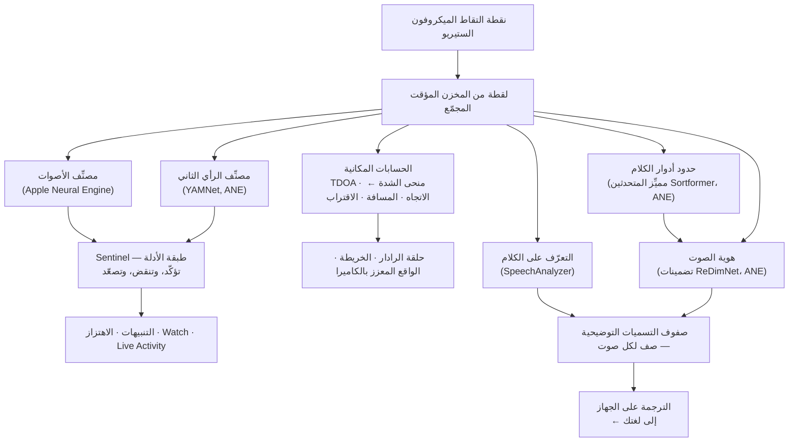
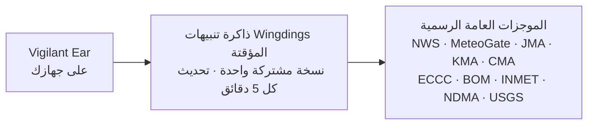

# Vigilant Ear 👂🛡️

*يسري اعتبارًا من الإصدار 1.1.9 · سبتمبر 2026.*

## رادار صوتي لمن لا يستطيع السمع.

تطبيق صُمِّم خصيصًا لمجتمع الصم وضعاف السمع وأبناء الصم (CODA). تخبرك معظم تطبيقات التعرّف على الأصوات *ما* هو الصوت. أما **Vigilant Ear فيخبرك أين هو، ومن يُصدره، وماذا يقول** — محوّلًا iPhone إلى «ترايكوردر» صوتي يعمل في الوقت الفعلي ويصف لك الصوت من حولك.

اتجاه صافرة الإنذار ومسافتها. طرقة خلفك. المشاركون في محادثة، وقد رُسموا أصواتًا منفصلة محوّلة إلى نص — لكل صوت تسميته التوضيحية وموضعه بحسب اتجاهه. وإذا كان أحدهم يتحدث بلغة لا تقرؤها، فيمكن أن تصلك كلماته **مترجمةً إلى لغتك.** وتصل التنبيهات إلى **شاشة القفل وDynamic Island وApple Watch**، فتكفيك نظرة واحدة.

كل ما يهم يعمل على الجهاز. لا يُسجَّل الصوت ولا يُرفع للتعرّف عليه. ولا شيء يتوقف على أن تسمع أي شيء.

- 🧭 **الاتجاه، لا مجرد الرصد.** *ماذا، وأين، ومن،* و*ماذا قيل* — لا مجرد «حدث صوتٌ ما».
- 📣 **نداء الاسم.** أدرج اسمك، واسم طفل، واسم شريك — فعبارة «طلب ماري جاهز» تنقر على الساعة وتشير إلى الجهة.
- 🔒 **الخصوصية في صميم التصميم.** يجري التصنيف وإنشاء التسميات التوضيحية والترجمة على iPhone الخاص بك. التسميات التوضيحية حيّة وعابرة؛ ولا تُحفظ أرشيفًا للنصوص.
- ⌚ **على معصمك وعلى شاشة القفل.** رفيق الاتجاه على Apple Watch + Live Activity يُبقيان آخر تنبيه والجهة التي جاء منها على بُعد نظرة واحدة.
- 🛰️ **هواتف أكثر، وأذن واحدة مشتركة.** يربط Constellation بين أجهزة iPhone المزوّدة بتقنية Ultra-Wideband ليدمج ما يسمعه كلٌّ منها في صورة اتجاهية أدق.
- 👁️ **مصمَّم للصم / ضعاف السمع / CODA.** اهتزازات مميزة، ومرئيات عالية التباين، وإشارات لا تعتمد على اللون، وأهداف لمس كبيرة، واحترام إعداد تقليل الحركة في كل مكان.

---

## لمن هذا التطبيق

- **المستخدمون الصم وضعاف السمع وأبناء الصم (CODA)** الذين يريدون وعيًا ظرفيًا بالأصوات من حولهم — Home Watch (طرق، إنذار، رضيع، هاتف) وStreet Watch (صافرة إنذار، اقتراب) يمكنك تركهما يعملان والوثوق بهما.
- كل من يحتاج إلى **تسميات توضيحية حيّة مع الاتجاه والفصل بين المتحدثين**، أو إلى **ترجمة على الجهاز** لكلام من يجلسون بالقرب منه.
- مستخدمو تسهيلات الاستخدام والباحثون في الصوتيات المهتمون بتحديد موقع الصوت على الجهاز.

> تطبيق Vigilant Ear **أداة مساعدة** لتسهيلات الاستخدام، وليس جهازًا معتمدًا لسلامة الأرواح.

---

## ما الذي يفعله

### 🧭 يرى الصوت — الاتجاه والمسافة
باستخدام ميكروفونَي iPhone، يقيس Vigilant Ear **زاوية الصوت وما إذا كان أمامك أم خلفك**، ويُبقي تلك القراءة ثابتة في حدود درجة واحدة تقريبًا، ويضعها علامةً حيّة على حلقة رادار يتجه أعلاها نحو ما تواجهه، وعلى الخريطة. فالميكروفونان الواقعان على خط واحد لا يستطيعان وحدهما التمييز بين اليسار واليمين — إذ يصل الصوت الآتي من 50° إلى يمينك والصوت الآتي من 50° إلى يسارك بالفارق الزمني الضئيل نفسه — لذلك يرسم التطبيق القراءة ومعها **صورة شبحية أبهت على الجانب الآخر**، ويكفي أن تدير معصمك أو تستعين بهاتف ثانٍ لحسم الأمر. وتُقدَّر المسافة من شدة الصوت وفق منحنى مُعايَر في الشارع، وتُعرض على حقيقتها تقديرًا: *≈ 50 ft*، مع نطاق مرجَّح — بوحدات القياس في البلد الذي أنت فيه، لا بوحدات اللغة التي تقرأ بها التطبيق. وإذا تحركت، حافظت العلامات على مواضعها في العالم الحقيقي. هذا هو الجوهر: وعي مكاني بعالم لا تستطيع سماعه. (الأرقام أدناه.)

### 🚨 يتعرّف على الأصوات المهمة — وينبّهك
يتعرّف مصنِّف يعمل على الجهاز على مئات الأصوات اليومية ويراقب الفئات الحرجة — **صفارات الإنذار، وأجهزة الإنذار — بما فيها فئة مخصصة لإنذار السيارات — وأجراس الأبواب/الطرق، وبكاء الرضيع، ووجود شخص قريب، والطقس القاسي.** وحين تنطلق إحداها، يصلك تنبيه واضح على الشاشة، و**إشعار فوري** اختياري، و**اهتزاز** مميز — حتى عندما يعمل التطبيق في الخلفية أو يكون الهاتف في وضع السكون. والفئات الحرجة جاهزة افتراضيًا، فلا يعني تفعيل الإشعارات أن تجد «كل شيء متوقفًا». وإذا أوقفت جميع فئات التنبيه، يدخل المحرك في سبات تام أثناء عمله في الخلفية توفيرًا للبطارية. وتتحقق طبقة **Sentinel** من التنبيهات بمقارنتها بأدلة مستقلة — الاتجاه والحركة والموجزات العامة — فيكون ما ينطلق مؤكَّدًا بالأدلة، لا تخمينًا من مصنِّف منفرد. ويعمل ذلك في الاتجاهين: لحظة تشبه صافرة الإنذار داخل أغنية يُحتجز تنبيهها، أما صافرة إنذار حقيقية تتكرر وسط موسيقاك فتخترقها وتنبّهك.

تأتي تحذيرات الطقس القاسي من الموجزات العامة الرسمية — **NWS** في الولايات المتحدة، و**MeteoGate** في أوروبا، و**CMA في الصين**، و**KMA في كوريا**، و**JMA في اليابان**، و**ECCC في كندا**، و**BOM في أستراليا**، و**INMET في البرازيل**، و**NDMA في الهند** — مجانًا لجميع المستخدمين. وتقتصر الموجزات على تلك التي تغطي مكان وجودك. وفي اليابان، يقرأ التطبيق أيضًا **النشرات المسبقة** الصادرة عن JMA — وهي إشعارات بلغة مبسطة تصدر قبل أيام من الإعصار أو الأمطار الغزيرة، لا التحذيرات التي تصدر بعد وصول الخطر فحسب — إضافةً إلى نشرات الأمطار الغزيرة المفاجئة والانهيارات الأرضية. وتُعرض الإشعارات المسبقة بهدوء، دون الصوت والاهتزاز المخصصين للتحذير الحقيقي.

### ⌚ Apple Watch + Live Activity — نظرة فتعرف
- **رفيق Apple Watch** — يظهر اتجاه التنبيه على معصمك، فتخبرك نظرة واحدة أين تنظر. واجهة Watch مُعاد تصميمها بأيقونة الأذن الخاصة بالتطبيق، وتخطيط HUD لعرض التهديدات، والنقر المزدوج لإغلاق التنبيه. ويظل بإمكان التنبيهات إظهار سهم الاتجاه حتى عندما لا يكون تطبيق Watch مفتوحًا.
- **Live Activity** — يبقى Vigilant Ear على **شاشة القفل**، وفي **Dynamic Island**، وفي **Smart Stack على Watch**، فيظل آخر تنبيه واتجاهه دائمًا على بُعد نظرة واحدة.
- **تنبيهات الشريك على معصمك** — عندما يُطلق هاتف شريك مرتبط عبر Constellation تنبيهًا، يمكن أن يصل إلى ساعتك أيضًا، مع اتجاهه. وتُبقي مراجعةٌ مخصصة للموثوقية الرفيقَ خفيفًا على بطارية Watch طوال اليوم.

### 💬 Speaker Mode — تسميات توضيحية حيّة تُظهر الاتجاه *(مجاني)*
شغّل **Speaker Mode**، فيحوّل Vigilant Ear كلام من يتحدثون بالقرب منك إلى **كتل من التسميات التوضيحية، كتلة لكل صوت.** ويُبقي تمييز المتحدثين على الجهاز الأصوات منفصلة — *من* يقول *ماذا* — مع إشارة إلى الاتجاه على الحلقة الداخلية. ويُبرَز المتحدث الحالي، بينما ينزاح النص الأقدم كلما احتيج إلى مساحة.

أمران لا تفعلهما معظم تطبيقات التسميات التوضيحية: **الصراحة بشأن درجة الثقة** — علامة جودة خفيفة لكل سطر، وخطوط منقطة تحت الكلمات المشكوك فيها، تخبرك متى تثق بالسطر ومتى تتحقق منه مجددًا — و**التصحيح الذاتي**: فور اكتمال الجملة، يعيد التطبيق قراءة الصوت بسياقه الكامل، ويمكنه استعادة كلمة فائتة أو أسيء سماعها في غضون ثانيتين تقريبًا، ثم يتجمد النص.

**نداء الاسم** (في التفضيلات، ويبقى متوقفًا حتى تشغّله) يراقب تلك التسميات التوضيحية بحثًا عن الأسماء التي تدرجها — اسمك، واسم طفل، واسم شريك. وحين يقول أحدهم «طلب ماري جاهز»، يصلك اهتزاز مميز وتنبيه على Watch مع الاتجاه، لا فقاعة تسمية توضيحية أخرى. وتظل الكلمات تظهر في Speaker Mode ككلام؛ أما هذه فهي النقرة التي تُعلمك بأنهم كانوا يتحدثون *إليك*.

**يمكن إخفاء الألفاظ النابية** (التفضيلات ← التعليقات التوضيحية). فمن دون ذلك تصل الشتائم نصًا صريحًا لا شيء يخفف وقعها، ولا تُتاح للقارئ فرصة لصرف نظره أولًا؛ شغّل هذا الخيار فتُستبدل تلك الكلمات برموز، وتبقى الجملة مقروءة من دون الكلمة. ومحرك التعرّف على الكلام في جهازك نفسه هو الذي يقرر ما يُعدّ لفظًا نابيًا — لا قائمة كلمات من عندنا — ولذلك يتبع اللغة التي يجري تحويلها إلى نص. وفي أي حساب مُعلَن أنه لشخص دون 18 عامًا، يكون الخيار مفعّلًا دائمًا ويظهر عليه قفل. وهو ينطبق على الكلام الذي يحوّله *هذا* الجهاز إلى نص؛ أما النص المرحَّل من هاتف مقترن فقد حُوِّل إلى نص هناك، ويصل نصًا مكتملًا.

**الكلمة التي شدّد عليها المتحدث تظهر بخط عريض.** فحين تُنطق بصوت مسموع، تكون «لم أقل ذلك» بالضغط على «ذلك» و«لم أقل ذلك» بلا ضغط جملتين مختلفتين، والنص المكتوب المتطابق يُضيّع الفرق بينهما كليًا. يرصد التطبيق الكلمة الوحيدة التي رفع فيها صوت المتحدث طبقته ويكتبها بخط عريض — كلمة واحدة في السطر على الأكثر، ولا شيء إطلاقًا حين لا يكون متأكدًا، لأن تمييز الكلمة الخطأ يُقوِّل المتحدث ما لم يقله. والميزة متوقفة في الصينية واليابانية، حيث تحدد طبقة الصوت *أيّ كلمة هي*، لا مدى قوة الضغط عليها.

التسميات التوضيحية مجانية؛ أما الترجمة التلقائية فهي الطبقة الاختيارية ضمن Power Pack+. ويمكن أيضًا **نطق التسميات التوضيحية بصوت مسموع عبر أجهزة السمع التي تعمل بتقنية Bluetooth** — مجانًا، من التفضيلات. وتضيف **نغمات الاتجاه** (المجانية أيضًا، في التفضيلات ← التعليقات التوضيحية) إشارة صوتية اختيارية في الأذن التي تختارها تدل على مكان المتحدث — وهي مفيدة لمن يستخدم معينًا سمعيًا أو يسمع من جهة واحدة، ومتاحة للجميع.

### 🌐 ترجمة تلقائية — بلغتك، مباشرةً *(Power Pack+)*
عند تشغيل Speaker Mode، وحين يتحدث شخص قريب منك بلغة أخرى، يستطيع Vigilant Ear اكتشافها وعرض تسمياته التوضيحية **بلغتك**، مع إظهار لغة المصدر على كتلته. وتعمل السلسلة — الاستماع ← فصل المتحدثين ← التحويل إلى نص ← الترجمة ← العرض — **على الجهاز**؛ واللحظة الوحيدة التي تُستخدم فيها الشبكة هي تنزيل حزمة لغة لمرة واحدة من Apple، وحين يكون هذا التنزيل هو ما تنتظره، يخبرك التطبيق بذلك بدل أن يتركك تنظر إلى نص غير مترجم. ولا يلزمك أن تعرف اللغة الأخرى أو تختارها مسبقًا.

هذا أقرب منتج متاح فعلًا إلى **المترجم الكوني في الخيال العلمي** — الجهاز الذي يفهم ببساطة. يكتشف Vigilant Ear اللغة من تلقاء نفسه، ويتابع كل متحدث في الغرفة، ويعرض كلامهم جميعًا بتسميات توضيحية بلغتك — بلا سماعات أذن، وبلا إعداد، وعلى جهازك.

```mermaid
graph LR
    A["استمع فقط"] --> B["اكتشاف اللغة تلقائيًا"] --> C["فصل كل صوت عن غيره"] --> D["الغرفة كلها بتسميات توضيحية بلغتك"]
```

### 🎵 الوعي بالموسيقى والبث *(Power Pack+)*
يتعرّف **ShazamKit** على الموسيقى التي تُشغَّل من حولك ويتتبع تغيّر الأغاني.

### 🎛️ Acoustic Scope — شاهد الصوت كما يراه المهندسون
عرض احترافي حيّ للصوت من حولك: الطيف، ومخطط الطيف، ونطاقات RTA بعرض ⅓ أوكتاف، والكروما، والنغمات الجزئية التوافقية — **مجانًا للجميع**. **النغمات الجزئية تقرأ الموسيقى:** تُسمّى كل نغمة باسم نوتتها الموسيقية وإلى جانبها سلسلتها التوافقية، وتُسمّى الأصوات الأعلى، مثل أجهزة إنذار الدخان، بطبقتها الحقيقية، ويمكنك تحديد نوتة مستهدفة تُرسم خطًا تغني عليه أو تضبط آلتك وفقه. ويعمل دون أن يرفع حرارة الجهاز — فترك مخطط الطيف مفتوحًا لا يكلّف شيئًا يُذكر، مهما طالت مشاهدتك. أما أدوات التقاط الأصوات لتدريب حزمك المخصصة فهي جزء من Power Pack+.

### 📦 حزم الصوت المخصصة — علّمه عالمك *(Power Pack+)*
علّم Vigilant Ear الأصوات التي تهمك — من طيور منطقتك إلى جرس باب مبناك. تُضاف الحزم الإضافية فوق الرصد المدمج، فلا تزاحم الأصوات الجديدة صفارات الإنذار وأجهزة الإنذار أبدًا. وفي التطبيق دليل مدمج خطوة بخطوة.

### 🛰️ Constellation — أجهزة iPhone عديدة، وأذن واحدة مشتركة *(Power Pack+)*
مع اثنين أو أكثر من أجهزة iPhone التي تدعم Ultra-Wideband (معظم الطرازات منذ iPhone 11)، يقرن **Constellation** بينها لتستشعر مواضع بعضها بعضًا وتدمج ما يسمعه كلٌّ منها في صورة واحدة أدق لمصدر الصوت — مصفوفة استماع موزعة وسلبية. وتُدمج التسميات التوضيحية أيضًا: يحوّل كل هاتف ما يسمعه ميكروفونه إلى نص، وتُحاذى الكلمات بين الهواتف ليساهم الهاتف الأقرب إلى المتحدث بما سمعه — وتُحفظ الكلمات التي لم يلتقطها إلا هاتف واحد بدل أن تضيع. تتصل الهواتف **ببعضها مباشرةً** — بلا راوتر، ولا شبكة Wi-Fi مشتركة، ولا إنترنت؛ يكفي أن يكون Wi-Fi مُشغّلًا، عبر رابط الند للند نفسه الذي يستخدمه AirDrop. ويقتصر على الأجهزة المزودة بالعتاد المناسب. ولا يُعاد إرسال التسميات التوضيحية عبر الشبكة إذا كانت أقدم من وقت اتصال الجهاز النظير.

**رسائل الشركاء** — أرسل نصًا سريعًا إلى هاتف شريك مرتبط؛ فيظهر في تدفق التسميات التوضيحية لديه، ويمكن أن يصل مترجمًا إلى لغته، على الجهاز. والمراسلة تراعي العمر: فاستنادًا إلى Declared Age Range من Apple، تبقى المراسلة النصية بين بالغ وقاصر متوقفة ما لم يُسمِّ كلٌّ منهما الآخر عن قصد. ولا تُقيَّد التنبيهات ولا التسميات التوضيحية أبدًا — بل المراسلة النصية بين الأشخاص فقط.

### 🔗 Remote Link — تواصل مع من ليس معك *(Power Pack+ للبدء)*
ما تؤديه المكالمة الهاتفية عادةً، ولكن بالفيديو والنص بدلًا منها. ترسل رمز دعوة، فينضم الطرف الآخر من داخل Vigilant Ear **دون أن يمتلك Power Pack+**. وعلى خلاف Constellation، لا يُشترط القرب — يمكن أن يكون كلٌّ منكما في أي مكان.

**لا يُستخدم أي صوت في أي مرحلة.** فيديو ونص فقط، فلا شيء في الرابط يعتمد على السمع في أيٍّ من الطرفين — وهو يمنحك وسيلة للتخاطب بلغة الإشارة مع شخص آخر عبر التطبيق. والتطبيق نفسه لا يفهم لغة الإشارة؛ إنه ينقل الفيديو، وأنتما تتوليان الباقي. ويكون الاتصال مباشرًا بين الهاتفين حيثما تسمح الشبكة بذلك، ويوضّح لك التطبيق حالته صراحةً: **مباشر** أم **مرحَّل**، فتعرف دائمًا إن كان الفيديو الخاص بك يمر عبر مُرحِّل.

**والتسميات التوضيحية تنتقل أيضًا.** ما يحوّله كل هاتف إلى نص يظهر على الهاتف الآخر، مترجمًا إلى لغة القارئ عند الحاجة. ويمكن لأي منكما إيقاف الرابط مؤقتًا — الفيديو والتسميات التوضيحية — ثم استئنافه، وإنهاء الاتصال من الشاشة الرئيسية.

### 📷 الواقع المعزز بالكاميرا — «رؤية الصوت»
افتح كبسولة الكاميرا في شريط العنوان وثبّت الأصوات المرصودة عند اتجاهها الحقيقي في عرض الكاميرا المباشر. تتجمع العلامات بحسب المتحدث أو بحسب فئة الصوت واتجاهه ليبقى العرض مقروءًا؛ وتبهت المصادر تدريجيًا حين تصمت.

### 🗺️ الخرائط والطرق وتوقّع المسار
تُسقَط اتجاهات الأصوات على إحداثيات GPS حقيقية على الخريطة. ويمكن **تثبيت أصوات المركبات على الشوارع القريبة** وتوقّع مساراتها، فتظهر الشاحنة المارة وهي تتحرك *على امتداد الطريق* لا عبر المباني. (جرّب العرض التوضيحي لشاحنة الإطفاء.)

### 🪄 Feature Playground — تحقّق منه دون حاجة إلى السمع
يتاح **Feature Playground** للجميع: تدريبات المنزل والشارع (طرق، إنذار، رضيع، صافرة إنذار، طقس)، وعروض توضيحية لتعدد الهواتف وللمحادثات، وعلامة مائية واضحة كي لا يتظاهر التدريب أبدًا بأنه حدث حقيقي. وإغلاق اللوحة يُنهي العروض التوضيحية بنظافة (لا موقع GPS وهميًا عالقًا، ولا أعلام حالة متبقية).

### ♿ تسهيلات الاستخدام أولًا
مصمَّم للمستخدمين الصم / ضعاف السمع / CODA ومن لديهم عمى الألوان: إشارات **لا تعتمد على اللون**، وأهداف لمس **≥44 pt**، واحترام إعداد **تقليل الحركة**، و**تخطيطات من اليمين إلى اليسار** لقراء العربية، وتنبيهات متعددة الوسائط (اهتزاز + بصري + Watch)، وشاشة تحقق عند بدء التشغيل تعرض حالة الأذونات بحالات واضحة: أخضر / رمادي / أحمر (وبرتقالي محروق لحالة «غير مسموح») — بما في ذلك إذن الإشعارات الذي يعمل بمثابة المفتاح الرئيسي للتنبيهات.

---

## المجاني وPower Pack+

جوهر السلامة **مجاني، إلى الأبد**:

- **Home Watch وStreet Watch** — تنبيهات صوتية محلية (أجهزة إنذار، صفارات إنذار، طرق/أجراس أبواب، رضيع، شخص قريب) تصلك على الشاشة وبالاهتزاز وعبر إشعارات فورية اختيارية.
- **التسميات التوضيحية الحيّة** — Speaker Mode، على الجهاز، مع تحديد الاتجاه حيث يسمح العتاد، وعلامات ثقة صريحة، وتصحيح ذاتي خلال ~2 ثانية، ونطق اختياري عبر أجهزة السمع التي تعمل بتقنية Bluetooth، ونغمات الاتجاه.
- **نداء الاسم** — أسماء اختيارية تكتبها بنفسك (اسمك، أطفالك، شريكك). والتطابق يعني تنبيهًا على Watch/الهاتف مع الاتجاه، لا تسمية توضيحية ثانية.
- **Standing Watch** — حالة الغرفة نفسها، يعمل دائمًا دون أي إعداد: مصباح سماوي ثابت ما دامت الغرفة محافظة على نمطها، وكهرماني حين يتغير شيء ما — صوت جديد، أو هدوء مفاجئ، أو شيء يقترب.
- **تنبيهات الطقس القاسي** — NWS، وMeteoGate (أوروبا — تصلك حديثة من ذاكرة التنبيهات المؤقتة لدينا التي تتجدد كل 5 دقائق)، وCMA، وKMA، وJMA (اليابان)، وECCC (كندا)، وBOM (أستراليا)، وINMET (البرازيل)، وNDMA (الهند) لمنطقتك.
- **تنبيهات الزلازل (USGS، حول العالم)** — تشعر باهتزاز وترى على خريطتك المنطقة التي شعرت بالهزة عند الإبلاغ عن زلزال قريب. إنه تأكيد من موجز USGS الرسمي — لا إنذار مبكر: إن شعرت بهزة، فهذا يخبرك بماهيتها. ويمكن لاستشعار الهدير العميق (الموجات دون الصوتية) على الجهاز أن يُفعّل التحقق في اللحظة التي تتحرك فيها الأرض.
- **Feature Playground** — تنبيهات تدريبية ومعاينات للميزات مع علامة مائية واضحة «معاينة».
- **رفيق Apple Watch وLive Activity** — الاتجاه وآخر تنبيه بلمحة واحدة.
- **Acoustic Scope** — عرض مرئي حي للصوت بمستوى احترافي، مجاني للجميع. (أدوات الالتقاط للتدريب ضمن Power Pack+.)

**Power Pack+** حزمة تفتحها مرة واحدة (**ليست اشتراكًا**) مع **فترة تجريبية مجانية مدتها 90 يومًا**. وتضيف القدرات الخارقة:

- **ترجمة تلقائية** — ترجمة الكلام القريب منك إلى لغتك على الجهاز.
- **Constellation** — سمع مشترك بين عدة أجهزة iPhone عبر Ultra-Wideband، مع رسائل الشركاء.
- **Music ID** — التعرّف على الأغاني عبر ShazamKit.
- **حزم الصوت المخصصة** — مصنِّفات إضافية تدرّبها على أصواتك الخاصة.

سواء استخدمت النسخة المجانية أو Power Pack+، **يبقى صوتك على الجهاز لأغراض التعرّف** — فالمستوى لا يغيّر إلا الميزات المفتوحة، ولا يغيّر أبدًا المكان الذي يُرسل إليه الصوت الخام للتحليل.

---

## كيف يعمل (من الداخل)

تطبيق Vigilant Ear سلسلة معالجة **محلية أولًا وعلى الجهاز**، مبنية في طبقات: التقاط الصوت مرة واحدة، ثم ترك متخصصين مستقلين يقرؤون الصوت نفسه ويراجع كلٌّ منهم عمل الآخر. يُلتقط الصوت الخام عبر نقطة التقاط عالية الأولوية، ويُنسخ إلى **قائمة حرة (free-list) من المخازن المؤقتة المجمّعة** (بلا تخصيص متكرر للذاكرة يُثقل المسار الآني)، ثم يُوزَّع دون تعطيل واجهة المستخدم:

```mermaid
graph TD
    A["نقطة التقاط الميكروفون الستيريو"] --> B["لقطة من المخزن المؤقت المجمّع"]
    B --> C["مصنِّف الأصوات<br/>(Apple Neural Engine)"]
    B --> Y["مصنِّف الرأي الثاني<br/>(YAMNet, ANE)"]
    C --> S["Sentinel — طبقة الأدلة<br/>تؤكّد، وتنقض، وتصعّد"]
    Y --> S
    S --> H["التنبيهات · الاهتزاز · Watch · Live Activity"]
    B --> D["الحسابات المكانية<br/>TDOA · منحى الشدة ← الاتجاه · المسافة · الاقتراب"]
    D --> R["حلقة الرادار · الخريطة · الواقع المعزز بالكاميرا"]
    B --> F["التعرّف على الكلام<br/>(SpeechAnalyzer)"]
    B --> N["حدود أدوار الكلام<br/>(مميِّز المتحدثين Sortformer، ANE)"]
    N --> E["هوية الصوت<br/>(تضمينات ReDimNet، ANE)"]
    B --> E
    F --> G["صفوف التسميات التوضيحية — صف لكل صوت"]
    E --> G
    G --> T["الترجمة على الجهاز<br/>← إلى لغتك"]
```

لا يُوثق بأي نموذج منفردًا. تقع طبقة **Sentinel** بين الرصد والتنبيه: إذ تؤكد المحركات المستقلة بعضها بعضًا أو تنقضه إطارًا بإطار — وحين تتراكم أدلة واقعية متكررة ضد النقض (صافرة إنذار حقيقية تدوّي وسط موسيقاك)، تنتصر الأدلة وينطلق التنبيه.

وللتسميات التوضيحية فرصتها الثانية الخاصة بها. فكل جملة مكتملة تُعاد قراءتها بهدوء من حلقة صوتية قصيرة في الذاكرة بسياقها الكامل — وتصل التصحيحات في غضون ثانيتين تقريبًا، ثم يتجمد النص نهائيًا:

```mermaid
graph LR
    L["تظهر التسمية التوضيحية الحيّة"] --> K["إعادة قراءة الصوت الخام<br/>بسياقه الكامل"] --> V["مقارنة محتاطة<br/>(تحتفظ بما سُمع)"] --> W["تصحيح السطر بهدوء<br/>≤ 2 s، ثم يُجمَّد"]
```

- **الحسابات المكانية** — تحويلات فورييه السريعة (FFTs)، وفرق زمن الوصول الموزون بالتماسك (TDOA — تفضيل نطاقات التردد التي يتفق عليها الميكروفونان، ثم تحويل الفارق الزمني الضئيل في الوصول إلى اتجاه)، وتتبع الاقتراب من منحى الشدة، وكلها في مهام تعمل في الخلفية. ويُقرأ زوج الميكروفونات بتوجيه ثابت، فيعمل تحديد الاتجاه بالطريقة نفسها سواء أمسكت الهاتف عموديًا أو أفقيًا.
- **الكلام** — `SpeechAnalyzer` / `SpeechTranscriber` في iOS 26 لتحويل الكلام إلى نص؛ وإطار عمل **Translation** من Apple للترجمة على الجهاز. وتقوم هوية الصوت على الأدلة: لا يُؤكَّد أن الصوت لشخص حقيقي إلا من نوافذ صوتية مستقلة، والتطابق غير المؤكد يظهر دون نسبة إلى أحد بدل تخمين الاسم الخطأ.
- **نموذجان لسؤالين** — التمييز بين الأصوات يتطلب معرفة *متى تغيّر المتحدث* و*من يكون ذلك المتحدث*، وليستا المشكلة نفسها. يحدد مميِّز المتحدثين المتدفق **Sortformer** حدود أدوار الكلام، وتحسم تضمينات **ReDimNet** صاحب الصوت داخل كل دور. والقطع عند الحد أهم مما يبدو: فالنافذة التي تمتد عبر شخصين تحتويهما كليهما، ولا يستطيع أي نموذج تضمين إصلاح ذلك لاحقًا. وتحت كليهما أرضية لرصد النشاط الصوتي — فإذا صمت مميِّز المتحدثين في غرفة صعبة بدل أن يخمّن، تظل الأدوار تُقطع، فيتراجع أداء التطبيق بدل أن يدمج متحدثَين في متحدث واحد.
- **حقيقة الموسيقى** — يتولى **كاشف توقيع الأغاني** القائم على الكروما قرار «هل تُعزف موسيقى فعلًا؟»، لأن المصنِّفات العامة معروفة بأنها تصف الغرف الصامتة وصفارات الإنذار بأنها «موسيقى». ولا يعمل Shazam إلا بعد أن يؤكد التوقيع وجود شيء موسيقي فعلًا.
- **التزامن** — يُبقي العزل في Swift 6 نقطة التقاط الميكروفون والحسابات الصوتية وحلقة عرض الواجهة منفصلة بإحكام.
- **الكفاءة** — خفض معدل العينات، والتصنيف المتكيّف مع الحمل، واستخدام الشبكة المشروط بالأدلة، كلها تُبقي الاستماع الدائم خفيفًا بما يكفي لتركه يعمل.

وتسلك تنبيهات الطقس والزلازل المسار المعاكس لمسار الصوت — لا يخرج أبدًا أي شيء يتعلق بصوتك، لكن *بيانات* التنبيهات تدخل. إذ يمر **كل** موجز رسمي عبر ذاكرة تخزين مؤقت صغيرة نشغّلها، فيخدم جلبٌ واحد للبيانات العامة جميع المستخدمين — ولا يتصل هاتفك أبدًا بخوادم حكومة أجنبية:

```mermaid
graph LR
    P1["Vigilant Ear<br/>على جهازك"] --> W["ذاكرة تنبيهات Wingdings المؤقتة<br/>نسخة مشتركة واحدة · تحديث كل 5 دقائق"]
    W --> N["الموجزات العامة الرسمية<br/>NWS · MeteoGate · JMA · KMA · CMA<br/>ECCC · BOM · INMET · NDMA · USGS"]
```

---

## ما يستطيع هاتفك سماعه — بالقياس

في iPhone لديك ميكروفونان تفصل بينهما نحو ستة إنشات، ومقياس للضغط الجوي، وساعة دقيقة جدًا. وهذا يكفي ليخبرك من أي اتجاه يأتي الصوت، وعلى أي بُعد تقريبًا، وهل يقترب منك، وهل فُتح باب للتو. وإليك مدى دقة كلٍّ من ذلك، وكيف تحققنا منه، ولماذا يهمك ذلك إن كنت لا تستطيع سماع الصوت بنفسك. قيست أرقام الاتجاه والأرقام المتصلة به على iPhone 17 وiPhone 16 Pro Max في سبتمبر 2026. أما المسافة فتبقى تقديرًا بطبيعتها — ونقول ذلك على الشاشة.

**الاتجاه — في حدود درجتين تقريبًا.** يصل الصوت إلى الميكروفون العلوي قبل السفلي أو بعده، ومن هذا الفارق يحسب التطبيق مقدار ابتعاد الصوت عن محور الهاتف، وما إذا كان في الأمام أم في الخلف. وقناتا الهاتف ليستا ميكروفونين عاديين، بل صورة ستيريو معالَجة، وتضيف هذه الصورة نمطًا ثابتًا خاصًا بها كلما كانت الغرفة صاخبة. وبات التطبيق الآن يتعلم هذا النمط من بضع ثوانٍ هادئة بعد التشغيل، ويزيله قبل قراءة الاتجاه.

| ما قسناه | النتيجة |
|---|---|
| الخطأ الوسيط عبر 96 غرفة محاكاة، من مكتب هادئ إلى غرفة ذات جدران صلبة عند 5 dB SNR | 1.0° |
| iPhone 17 على مكتب، مع تشغيل ضوضاء الغرفة، ومكبّر صوت منحرف 30° عن المحور | قرأ 61.7° من المستوى الجانبي مقابل 60° متوقعة، بتذبذب 1.6° |
| الإعداد نفسه، ومكبّر الصوت مقابل جانب الهاتف مباشرة | قرأ 4.5° مقابل 0° متوقعة، بتذبذب 2.2° |
| الإعداد نفسه، ومكبّر الصوت أمامه مباشرة | كل القراءات عند أقصى تأخير، كما ينبغي |
| قراءات وقعت على نمط الصورة نفسها بدل الصوت | لا شيء، عند أي زاوية |

*لماذا يهم ذلك:* إن كنت لا تستطيع سماع صافرة إنذار، فعبارة «خلفك، إلى أحد الجانبين» تخبرك أين تنظر. والقراءة الثابتة لا تستحق الثقة إلا بعد التحقق منها بشريط القياس، وهذه القراءة تحققنا منها مرتين، والثانية بعدما تبيّن أن التحقق الأول كان متساهلًا أكثر مما ينبغي.

**المسافة — تُعرض على حقيقتها: تقديرًا.** لا يستطيع ميكروفون واحد قياس المسافة، بل شدة الصوت فقط، وقد يبدو صوت شاحنة صاخبة بعيدة كصوت سيارة هادئة قريبة. يقدّر التطبيق المسافة من شدة الصوت باستخدام منحنى مُعايَر على شارع حقيقي، ثم يعبّر عنها كما يفعل شخص حريص: *نحو 50 ft، والأرجح بين 25 و100.*

| ما قسناه | النتيجة |
|---|---|
| رصدات حقيقية لسيارات أُعيد تمريرها عبر المعايرة | 1,131 |
| الواقعة منها داخل الطريق الممتد 100 قدم الذي كانت عليه فعلًا | 73% |
| سيارات المسار البعيد | التقدير 78 و87 ft بينما قال شريط القياس 73 و85 ft |

قيس الطريق (تقاطع في مدينة) مسارًا مسارًا؛ وحين يخطئ المنحنى، يخطئ نحو الجانب الأقرب. والمعايرة مثبّتة باختبار آلي فلا يمكن أن تنحرف بصمت. أما أجهزة الإنذار داخل مساحتك الخاصة، ككاشف الدخان، فلا يُعرض لها أي رقم للمسافة إطلاقًا — فهي أصلًا في الغرفة معك.

**الحركة — يقترب منك.** في السيارات وصفارات الإنذار، يعني ازدياد الصوت عادةً الاقتراب. يراقب التطبيق سرعة ارتفاع مستوى الصوت على مدى بضع ثوانٍ: فالصعود المستمر بنحو 1.5 dB في الثانية (زيادة واضحة وثابتة في الشدة) يعني الاقتراب، والهبوط المماثل يعني الابتعاد، والصوت الذي يتوقف عن التغير يتوقف وصفه بأيٍّ منهما بعد نحو أربع ثوانٍ. ولا يمكن للحظة صاخبة واحدة — نقرة على بوق، أو صفقة باب — أن تُطلقه. هذا مبني على الفيزياء وتسعة اختبارات آلية؛ والتأكيد الميداني التالي تسجيلٌ لمرور مركبة في الشارع.

**هواء الغرفة — للباب توقيع.** يستطيع مقياس الضغط الجوي ملاحظة فتح باب على بُعد نحو أربعة عشر قدمًا: ينخفض الضغط حين يتأرجح الباب، ثم يرتد حين يُغلق. وعلى مدى أربع عشرة ساعة من الهدوء وخمسة عشر حدثًا لأبواب، رسم كل باب هذا الشكل ذا الجزأين، ولم يرسمه أي شيء آخر في المنزل.

| الحدث | معدل تغيّر الضغط | الشكل |
|---|---|---|
| الباب الأمامي، فُتح وأُغلق، ×10 | 0.6–1.8 Pa/s | انخفاض ثم ارتداد، بفاصل ~5 s |
| الباب الأمامي، أُغلق بقوة، ×5 | 1.1–2.5 Pa/s | الزوج نفسه، أعلى |
| التكييف يعمل ويتوقف دوريًا طوال الليل، ×8 | 0.11–0.46 Pa/s | تدرّج بطيء على مدى دقائق، متطابق على الهاتفين |
| غرفة هادئة | ~0.02 Pa/s | لا شيء |
| المرور سيرًا، العطس | — | يلاحظه مستشعر الحركة فيتجاهله الهاتف |

أما باب الشبك، الذي لا يُحكم إغلاق الغرفة، فلم يظهر إطلاقًا — تمامًا كما ينبغي. واليوم يمكن أن يظهر تغيّر الضغط على الخريطة هديرًا عميقًا؛ وقد قيس تنبيه مخصص للأبواب في الليالي الهادئة وصُمّم، لكنه ليس بعد الإعداد الافتراضي اليومي.

**Constellation — هاتفان يحسمان الجانب.** يرسم كل هاتف في الشبكة خطًا نحو الصوت من موضعه، ولا تتقاطع الخطوط بوضوح إلا على جانب واحد. وحين يحدث ذلك، تختفي الصورة الشبحية ويستطيع التطبيق أن يقول يسارًا أو يمينًا من جديد. وفي المحاكاة، يحدد هاتفان **تفصل بينهما 40 مترًا** موضع صافرة إنذار على بُعد 50 مترًا في حدود 2 متر تقريبًا.

**كيف يُصدَّق أي شيء هنا.** مرّ كل رقم بالبوابات الثلاث نفسها، بالترتيب: غرفة محاكاة يُعرف جوابها مسبقًا؛ ثم اختبارات آلية صغيرة تعيد إنشاء الحالة بعينها التي قد تخدع التطبيق، وتعمل مع كل تغيير؛ ثم الهواتف الحقيقية على مكتب حقيقي بمسافات مقيسة يدويًا. ولا يُعدّ أي شيء دقيقًا حتى يجتاز البوابة الثالثة. فلمن لا يستطيع سماع الصوت، كلمة التطبيق هي الكلمة الوحيدة — وينبغي أن تُكتسب مصداقيتها بالطريقة التي يكتسبها بها المختبر.

ملاحظات أعمق للمهندسين: [الفيزياء](https://vigilantear.com/en/physics/) — TDOA، والمسافة، والحركة، وConstellation، والرصد البارومتري، مع وسم كل رقم بأنه مَقيس أو مُختبَر معمليًا أو مُنمذَج (MEASURED / BENCHED / MODELLED).

---

## الخصوصية

- **على الجهاز دائمًا، لسلسلة المعالجة الأساسية.** يجري التصنيف والحسابات المكانية والتحويل إلى نص وتمييز المتحدثين والترجمة على iPhone الخاص بك. ولا يُسجَّل الصوت الخام ولا يُرفع للتعرّف عليه.
- **التسميات التوضيحية عابرة.** تبقى التسميات التوضيحية الحيّة في الذاكرة طوال الجلسة؛ ولا تتضمن سجلات التصحيح المُصدَّرة نص التسميات التوضيحية.
- **لا حزم SDK للإعلانات أو لتحليلات السلوك.** يقتصر الاستخدام المحدود للشبكة على الخرائط، وموجزات الطقس العامة، وبصمات Shazam الاختيارية، وسياق الطرق، ومشتريات App Store — راجع السياسة الكاملة.

التفاصيل الكاملة: [سياسة الخصوصية](/ar/privacy/) · [شروط الخدمة](/ar/terms/) · [الدعم](/ar/support/)

---

## الأجهزة والمنصات

- **iPhone (التجربة الكاملة).** يعمل في الوضع العمودي أو الأفقي — أمسكه كما يحلو لك. يتطلب تحديد الاتجاه ميكروفونات ستيريو. ويُوصى باستخدام **iPhone 13 أو أحدث**.
- **Apple Watch.** تنبيهات مرافقة مع سهم الاتجاه؛ تعمل مع Live Activity / Smart Stack.
- **iPad (تطبيق أصلي).** تخطيط متكيّف: على الشاشة الكبيرة، تحظى التسميات التوضيحية الحيّة بلوحة شفافة بجانب الخريطة تنطوي حين لا يتحدث أحد. ميكروفونات أحادية القناة ← تسميات توضيحية دون تحديد كامل للاتجاه.
- يحتاج **Constellation** إلى **Ultra-Wideband** — iPhone 11 أو أحدث، باستثناء طرازات SE و«e». و**لا** يحتاج إلى شبكة Wi-Fi: فمع تشغيل Wi-Fi، تكتشف الهواتف بعضها بعضًا مباشرة، لذا يعمل Constellation بلا راوتر وبلا إنترنت ما دامت الهواتف قريبة من بعضها.
- **Android.** إصدار منفصل يضم الرادار الأساسي والتنبيهات والتسميات التوضيحية والطقس؛ أما شبكة Constellation فتأتي أولًا على iOS. تابع تحديثات موقع المنتج مع تقدّم تكافؤ Android.

---

## التوطين

مُترجَم بالكامل — الواجهة والتنبيهات والتسميات التوضيحية — إلى **الإنجليزية، والإسبانية، والبرتغالية (البرازيل)، والفرنسية، والألمانية، والإيطالية، والتركية، والعربية، واليابانية، والصينية المبسطة، والصينية التقليدية، والكورية، والروسية، والهندية، والرومانية** (15 لغة). يتبع لغة النظام أو اختيارًا يدويًا داخل التطبيق. وتعمل التسميات التوضيحية بالرومانية على الجهاز؛ لكن Apple Translate لا يدعم الرومانية، لذا تعرض ميزة «ترجمة تلقائية» النص الأصلي لهذه اللغة.

---

## الحالة وإخلاء المسؤولية

تطبيق Vigilant Ear **أداة تجريبية مساعدة في تسهيلات الاستخدام الصوتية**، وليس أداة معتمدة لسلامة الأرواح. وتتفاوت دقة تحديد مواقع الأصوات بحسب المحيط والطقس والرياح وعتاد الميكروفون. **حافظ دائمًا على وعيك المعتاد بما يحيط بك** — ولا تعتمد عليه مصدرًا وحيدًا لمعلومات السلامة.

بعض الإمكانات (علامات الواقع المعزز بالكاميرا، وترقية استحقاق Critical Alerts حين تمنحه Apple، والتأليف المتقدم للأصوات بحزم متعددة) لا تزال قيد التطوير؛ أما المراقبة المجانية عبر Home Watch وStreet Watch والتسميات التوضيحية الحيّة فهي المنتج الذي يمكنك الوثوق به من اليوم الأول.

---

**للتواصل:** [vigilantear@wingdingssocial.com](mailto:vigilantear@wingdingssocial.com)

صُنع بـ ❤️ لمجتمع الصم وضعاف السمع وللبحث الصوتي.

    
  <strong>© 2026 Wingdings, Inc.</strong> 
  جميع الحقوق محفوظة. 
  براءة اختراع قيد التسجيل

