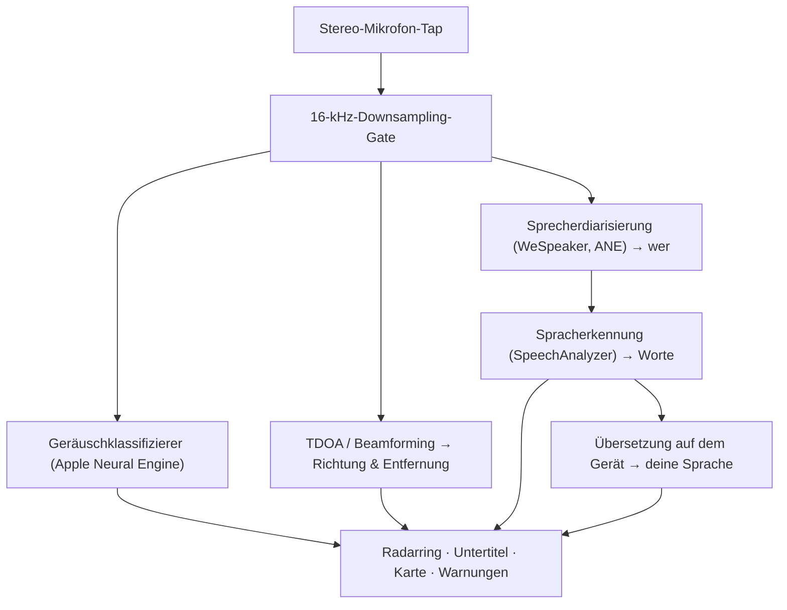

# Vigilant Ear 👂🛡️ (Apple-Edition)

*Ein akustisches Radar für Menschen, die nicht hören können.*

Eine App, die eigens für die Gehörlosen- und Schwerhörigen-Community entwickelt wurde! Die meisten Geräuscherkennungs-Apps sagen dir, *was* ein Geräusch ist. **Vigilant Ear sagt dir, wo es ist, wer es verursacht und was gesagt wird** — und verwandelt ein iPhone in einen akustischen Echtzeit-Tricorder, der die Geräusche um dich herum visuell beschreibt.

Die Richtung und Entfernung einer Sirene. Ein Klopfen hinter dir. Die Personen in einem Gespräch, dargestellt als einzeln transkribierte Stimmen — jede mit Untertiteln versehen und nach Sprecher räumlich verortet. Und wenn jemand eine Sprache spricht, die du nicht lesen kannst, kommen seine Worte **in deine Sprache übersetzt** bei dir an.

Alles läuft auf dem Gerät. Nichts wird aufgezeichnet, zwischengespeichert oder irgendwohin gesendet.

---

## Für wen sie gedacht ist

- **Gehörlose und schwerhörige Nutzerinnen und Nutzer**, die ein Situationsbewusstsein für Geräusche wünschen — nicht nur „ein Geräusch ist aufgetreten", sondern *was, wo, wer* und *was gesagt wurde.*
- Alle, die **Live-Untertitel mit Richtungsangabe und Sprechertrennung** benötigen oder die **On-Device-Übersetzung** von Freundinnen und Freunden, die in der Nähe sitzen.
- Tüftlerinnen und Tüftler aus den Bereichen Akustikforschung und Barrierefreiheit, die sich für Geräuschortung auf dem Gerät interessieren.

> Vigilant Ear ist eine **Hilfe** zur Barrierefreiheit, kein zertifiziertes lebensrettendes Gerät.

---

## Was sie kann

### 🧭 Sie sieht Geräusche — Richtung & Entfernung
Mithilfe der Stereomikrofone des iPhones schätzt Vigilant Ear **Richtung und ungefähre Entfernung** von Geräuschen in deiner Umgebung und platziert sie als Live-Punkte auf einem nach Blickrichtung ausgerichteten Radarring und einer Karte. Wenn du dich bewegst, behalten die Punkte ihre reale Position bei. Das ist der Kern: räumliches Bewusstsein für eine Welt, die du nicht hören kannst.

### 🚨 Sie erkennt wichtige Geräusche — und warnt dich
Ein Klassifizierer auf dem Gerät erkennt **über 300 Alltagsgeräusche** und überwacht die kritischen Kategorien — **Sirenen, Alarme, Türklingeln/Klopfen, eine Person in der Nähe und Unwetter.** Wird eines davon ausgelöst, erhältst du eine deutliche Warnung auf dem Bildschirm und optional eine **Push-Benachrichtigung**, selbst wenn die App im Hintergrund läuft oder dein Telefon im Ruhezustand ist. Schaltest du alle Warnkategorien aus, geht die Engine im Hintergrund vollständig in den Ruhezustand, um Akku zu sparen.

Unwetterwarnungen stammen aus offiziellen öffentlichen Feeds: Der US-amerikanische **NWS** ist kostenlos integriert; das europäische **MeteoAlarm**-Netzwerk und Chinas **CMA** sind Teil von Premium. Die Feeds werden automatisch auf diejenigen eingegrenzt, die deinen aktuellen Standort tatsächlich abdecken.

### 💬 Sprechermodus — Live-Untertitel mit Richtungsangabe *(Premium)*
Aktiviere den **Sprechermodus**, und Vigilant Ear transkribiert die Personen, die in deiner Nähe sprechen, in **Untertitelblöcke, einen pro Stimme.** Die Sprecherdiarisierung auf dem Gerät unterscheidet die Stimmen, sodass jede Person ihren eigenen Block und ihr eigenes charakteristisches Symbol behält — *wer* sagt *was* — mit einem kleinen Kreis auf dem inneren Ring, der dich zu ihrer Position im Raum leitet. Die gerade sprechende Person wird hervorgehoben; älterer Text scrollt langsam weg oder wird ausgeblendet, sobald Platz für neuen Text benötigt wird.

### 🌐 Sprecher-Auto-Übersetzung — lies in deiner eigenen Sprache, was du nicht hören kannst *(Premium)*
Ist der Sprechermodus aktiv und spricht eine Person in der Nähe eine andere Sprache, erkennt Vigilant Ear dies und gibt ihre Untertitel **in deiner Sprache** wieder, in Echtzeit, mit der Angabe ihrer Ausgangssprache in der Titelzeile ihres Blocks. Die gesamte Kette — hören → Sprecher trennen → transkribieren → übersetzen → anzeigen — läuft **vollständig auf dem Gerät**; der einzige Netzwerkmoment ist ein einmaliger Download eines Sprachpakets von Apple. Für eine gehörlose Person mit einem Freund, der eine andere Sprache spricht, bedeutet das, dessen Gesprächsbeitrag in Echtzeit mitlesen zu können — **ohne diese Sprache vorab kennen und auswählen zu müssen.**

### 🎵 Musik- & Sendungserkennung *(Premium)*
**ShazamKit** erkennt Musik, die um dich herum läuft, und zeigt den Titel an, mit automatischer Erkennung des Liedwechsels anhand der Signatur. Und wenn eine Stimme eher aus einem Fernseher oder Radio als von einer Person im Raum zu kommen scheint, wird sie mit einem **📻** gekennzeichnet, statt fälschlicherweise für eine anwesende Person gehalten zu werden — die Worte werden weiterhin angezeigt, sie sind nur ehrlich als solche ausgewiesen.

### 🛰️ Constellation — viele iPhones, ein gemeinsames Ohr *(Premium)*
Mit zwei oder mehr Ultra-Wideband-fähigen iPhones (die meisten seit dem iPhone 11) koppelt der **Constellation**-Modus die Geräte, sodass sie die Position der jeweils anderen erfassen können (über Apples Nearby Interaction / UWB) und das, was sie jeweils hören, zu einem einzigen, weitaus präziseren Bild davon zusammenfügen, woher ein Geräusch kommt — eine Art verteiltes, passives **Synthetic-Aperture-Sonar.** Die Funktion ist auf Geräte mit der passenden Hardware beschränkt.

### 🗺️ Karten, Straßen & Wegvorhersage
Geräuschrichtungen werden auf reale GPS-Koordinaten projiziert und in einer Kartenansicht dargestellt. Fahrzeuggeräusche werden **an nahegelegene Straßen angeheftet** (über quelloffene Straßendaten-Feeds) und ihre Wege vorhergesagt, sodass ein vorbeifahrendes Auto als Bewegung *entlang der Straße* erscheint, statt durch Gebäude zu driften. (Probiere die Feuerwehrauto-Demo aus, um es vorab zu erleben.)

---

## Kostenlos & Premium

Der Sicherheitskern ist **für immer kostenlos**:

- **Lokale Geräuschwarnungen** — Alarme, Sirenen, Türklingeln/Klopfen und eine Person in der Nähe — auf dem Gerät erkannt, mit Warnungen auf dem Bildschirm und per Push.
- **NWS-Unwetterwarnungen** für die Vereinigten Staaten.

Eine einmalige **Premium-Freischaltung** — mit kostenloser Testphase zum Start und **kein Abonnement** — ergänzt die vollständige Ebene des Situationsbewusstseins:

- **Sprechermodus** — Live-Untertitel mit Richtungsangabe, pro Sprecher.
- **Sprecher-Auto-Übersetzung** — Übersetzung von Sprache in der Nähe in deine Sprache, auf dem Gerät.
- **Constellation** — gemeinsames Hören über mehrere iPhones via Ultra-Wideband.
- **Musikerkennung** — Lieder­erkennung mit ShazamKit.
- **Internationale Wetter-Feeds** — Europa (MeteoAlarm) und China (CMA).

Ob kostenlos oder Premium — **alles läuft auf dem Gerät.** Die Stufe ändert nur, welche Funktionen freigeschaltet sind, niemals, wohin dein Audio gelangt.

---

## So funktioniert sie (unter der Haube)

Vigilant Ear ist eine **lokal-zuerst arbeitende Pipeline auf dem Gerät.** Rohaudio wird über einen Tap mit hoher Priorität erfasst, kopiert und an unabhängige Verarbeitungs-Akteure verteilt, ohne dabei jemals die Benutzeroberfläche ins Stocken zu bringen:

- **Räumliche Berechnungen** — schnelle Fourier-Transformationen, Time-Difference-of-Arrival und Doppler-Tracking laufen in abgekoppelten Hintergrundtasks.
- **Sprache** — `SpeechAnalyzer`/`SpeechTranscriber` aus iOS 26 übernehmen die Transkription; **WeSpeaker**-Embeddings gruppieren das Audio in einzelne Stimmen; Apples **Translation**-Framework erledigt die Übersetzung auf dem Gerät.
- **Nebenläufigkeit** — die strikte Isolation von Swift 6 hält den Mikrofon-Tap, die akustischen Berechnungen und die `CADisplayLink`-Render-Schleife der Karte sauber getrennt, sodass die Benutzeroberfläche flüssig bleibt (angestrebtes Marker-Gleiten bei 60 FPS), während alles andere im Hintergrund auf Hochtouren läuft.
- **Effizienz** — das 16-kHz-Downsampling-Gate reduziert die Datenmenge, die der Klassifizierer verarbeitet, um rund 80 % und hält so den aktiven Ressourcenbedarf gering — und den „immer hörenden" Hintergrundmodus noch geringer.

---

## Datenschutz

- **Immer auf dem Gerät.** Sämtliche Klassifizierung, räumliche Berechnungen, Transkription, Diarisierung (Sprechersignatur/-identifikation) und Übersetzung finden auf deinem iPhone statt. Rohaudio wird niemals aufgezeichnet, zwischengespeichert oder übertragen.
- **Transkripte sind flüchtig.** Untertitel bleiben für die Dauer der Sitzung im Arbeitsspeicher und werden nicht dauerhaft gespeichert oder hochgeladen.
- **Keine Telemetrie.** Es werden keine Analyse-, Absturz- oder Nutzungsdaten an irgendeinen Server gesendet.

Alle Details: [PRIVACY.md](PRIVACY.md) · [TERMS.md](TERMS.md) · [SUPPORT.md](SUPPORT.md)

---

## Hardware & Plattformen

- **iPhone (vollständiges Erlebnis).** Für die Richtungsbestimmung wird ein iPhone mit Stereomikrofon benötigt. Empfohlen wird iPhone 13 oder neuer.
- **iPad (nur Untertitel).** iPads stellen nur einen einzelnen Audiokanal bereit, transkribieren und untertiteln daher zwar, können aber keine Richtung berechnen — gut geeignet als stationäre Anzeige auf großem Bildschirm.
- **Constellation** benötigt **Ultra-Wideband** — iPhone 11 oder neuer, ausgenommen die SE- und „e"-Modelle.

---

## Lokalisierung

Vollständig lokalisiert — Benutzeroberfläche, Warnungen und Untertitel — in **Englisch, Spanisch, Portugiesisch, Französisch, Deutsch, Arabisch, Japanisch und vereinfachtes Chinesisch** (8 Sprachen). Sie richten sich nach der Spracheinstellung des Systems oder können in der App manuell gewählt werden.

---

## Status & Haftungsausschluss

Vigilant Ear ist eine **experimentelle akustische Hilfe zur Barrierefreiheit**, kein zertifiziertes lebensrettendes Hilfsmittel. Die Ortungsgenauigkeit variiert je nach Umgebung, Wetter, Wind und Mikrofon-Hardware. **Behalte stets deine gewohnte Aufmerksamkeit für deine Umgebung bei** — verlasse dich nicht als einzige Sicherheitsquelle darauf.

---

**Kontakt:** [vigilantear@wingdingssocial.com](mailto:vigilantear@wingdingssocial.com)

Mit ❤️ für die D/HH-Community und die Akustikforschung erstellt.

© 2026 Wingdings, Inc. All rights reserved.
