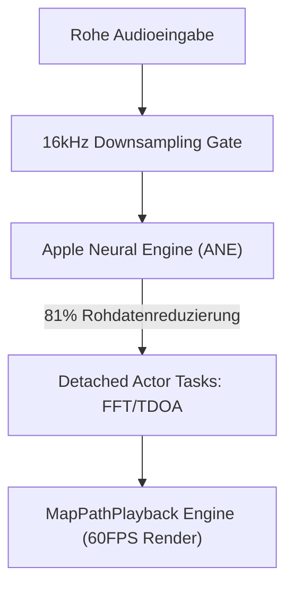

# VigilantEar 👂🛡️ (Apple Edition)

**Gültigkeitsdatum:** 6. Juni 2026

**VigilantEar** ist ein fortschrittliches, extrem leistungsstarkes akustisches Forschungs- und Barrierefreiheits-Tool für iOS, das entwickelt wurde, um der Gehörlosen- und Schwerhörigen-Community (D/HH) ein Echtzeit-Richtungs- und räumliches Bewusstsein zu bieten. Herkömmliche Tonerkennungssoftware identifiziert nur, *was* ein Geräusch ist; VigilantEar fungiert als umfassendes taktisches Radar, das maschinelles Lernen mit Edge-Computing und hochkomplexe akustische Physik kombiniert, um genau zu verfolgen, *wo* ein Geräusch entsteht, seine geschätzte Entfernung und seinen absoluten Pfadverlauf.

---

## 🌍 Globale Reichweite & Lokalisierung

Um Benutzer weltweit zu unterstützen, verfügt die Plattform über eine vollständige native Lokalisierungsmatrix, die Folgendes unterstützt:

- **Englisch**
- **Spanisch (Español)**
- **Portugiesisch (Português)**
- **Chinesisch (简体中文)**
- **Französisch (Français)**
- **Deutsch**
- **Japanisch (日本語)**

Alle taktischen Overlays, HUD-Warnungen und Einstellungsmenüs passen sich dynamisch an die Systemeinstellungen an.

---

## 🚀 Hauptfunktionen & Fähigkeiten

- **Intelligente Leistungssteuerung (Smart Power Gating)**: Um die Batterielebensdauer zu maximieren und Systemressourcen zu schonen, implementiert das System einen bedingten Hintergrundmonitor. Wenn die fünf zentralen Kategorien für Notfallwarnungen vom Benutzer deaktiviert werden, gehen die Mikrofoneingabeschleifen und Verarbeitungs-Engines im Hintergrund automatisch in einen vollständigen Ruhezustand über.
- **Filmische taktische Simulation (Cinematic Tactical Simulation)**: Beinhaltet eine robuste On-Device-Simulationssuite, die es Benutzern ermöglicht, haptische Signaturen und visuelle Reaktionen für alle fünf kritischen `.emergency`-Spuren – Sirenen, Alarme, Türklingeln, Personen in der Nähe und Unwetter – zu testen, ohne dass reale akustische Auslöser erforderlich sind. Die Feuerwehrauto-Simulation wird sicher auf einer entkoppelten, filmischen 60FPS-Physik-Wiedergabe-Engine ausgeführt, was visuell beeindruckende Karteninteraktionen unabhängig von akustischer Abfrage gewährleistet.
- **Multi-Ziel-Tracker (MTT)**: Isoliert und verfolgt gleichzeitig unabhängige akustische Umgebungssignaturen mithilfe eindeutiger UUID-Sitzungsmarkierungen in Kombination mit physikalischer Persistenzabbildung.
- **ShazamKit-Integration**: Echtzeit-Identifikation von Umgebungsmusik, die dynamisch auf dem räumlichen Radar abgebildet wird.
- **Geografische Straßenausrichtung & Physik-Engine (Geographic Road Snapping & Physics Engine)**: Projiziert relative mathematische akustische Peilungen auf globale GPS-Koordinaten, richtet Echtzeit-Fahrzeugvektoren intelligent über MapKit-Integration an verifizierten Straßen aus und sagt deren Pfad mithilfe des dedizierten `VehiclePathPredictor` voraus.

---

## 🧬 Kernarchitektur & Die Neuronale Mathematik-Engine

VigilantEar nutzt eine benutzerdefinierte **SoundML Push Architektur**, die vollständig auf die Leistungs- und Nebenläufigkeitsgarantien moderner iOS-Hardware ausgelegt ist.

## ⚡ Architektonische Entkopplung

Um einen vollständig unblockierten 120Hz-UI-Thread aufrechtzuerhalten und gleichzeitig einen hochfrequenten Eingabeabgriff sowie komplexes Zeichnen von Karten kontinuierlich zu handhaben, verwendet die Plattform eine strikte Trennung von Belangen über Swift 6 Isolation:

- **MapPath Session Registry (DisplayLink)**: Verfügt über eine entkoppelte CADisplayLink-Engine, die MapKit-Ansichtsaktualisierungen von der akustischen Verarbeitung isoliert und seidenweiche 60-Bilder-pro-Sekunde-Markierungsgleitbewegungen, verblassende Doppler-Spuren und filmische Objektverfolgung garantiert.
- **MicrophoneManager (MainActor)**: Isoliert strikt an die UI gebundene Eigenschaften, den Gerätestatus der Ausrichtung und Standortmetriken, um das HUD reibungslos zu steuern.
- **AcousticEngine (Non-Isolated / Background Actor)**: Verwaltet AVAudioEngine-Zustände auf niedriger Ebene und Hardwareoperationen. Eingabepuffer werden direkt im Thread des hochpriorisierten Abgriffs tief kopiert (Deep Copy), wobei Snapshots direkt an Verarbeitungs-Actors weitergegeben werden, ohne jemals einen Thread-Wechsel zu erzwingen oder den Main Actor aufzuhalten, wodurch Mikro-Stottern vollständig beseitigt wird.

### 🧠 Mathematische Minimierung

- **Auslagerung & Reduzierung**: Audio-Frames durchlaufen ein striktes 16kHz-Downsampling-Gate vor der Verarbeitung, wodurch der Rohdaten-Fußabdruck um 81% drastisch reduziert wird, bevor Klassifikationsvektoren von der Apple Neural Engine (ANE) verarbeitet werden.
- **Parallele räumliche Mathematik**: Hochleistungsfähige mathematische Pipelines (einschließlich schnellen Fourier-Transformationen (FFT), Berechnungen der Zeitdifferenz der Ankunft (TDOA) und Doppler-Verfolgungsalgorithmen) werden vollständig in getrennten, asynchronen Threads ausgeführt.

### 📊 Leistungsbenchmarks

- **Aktiver Modus**: Bietet umfassendes Live-HUD-Tracking und prädiktive 60FPS-Kartenspuren bei einem winzigen CPU-Fußabdruck von 6% auf einem Standard-6-Kern-Prozessor.
- **Minimierter / Hintergrund-Modus**: Wenn die Anwendung minimiert ist, sinkt die Rechenleistung um über 33%, wobei die absolute Umgebungswachsamkeit bei nur 4% CPU-Auslastung mit vernachlässigbarer thermischer Auswirkung aufrechterhalten wird.

---

## 🛠️ Technologie-Stack (2026)

- **Sprache**: Swift 6 (Strikte Nebenläufigkeit, geprüfte Sendable-Modelle, Actor-Isolation)
- **Frameworks**: SwiftUI, MapKit (Annotations- & Timeline-Overlays), Accelerate Framework (vDSP), SoundML
- **Hardware-Grundlinie**: iPhone 13 oder neuer (Stereomikrofon-Ausrichtung für TDOA-Peilungspräzision erforderlich)

---

## 📊 Datenschutz & Sicherheitsrichtlinien

- **Local-First Isolation**: Alle Audioklassifizierungen, Spektralmathematik und Peilungsprojektionen erfolgen ausschließlich auf dem Gerät. Rohe Audiostreams werden unter keinen Umständen jemals aufgezeichnet, zwischengespeichert oder übertragen.
- **Keine Remote-Telemetrie oder Diagnose**: VigilantEar ist so konzipiert, dass es vollständig lokal auf Ihrem Gerät läuft. Wir erfassen, übertragen oder speichern keine Remote-Telemetrie, Absturzberichte, Diagnoseprotokolle oder Nutzungsanalysen auf unseren Servern.

---

## ⚖️ Haftungsausschluss

VigilantEar ist eine experimentelle akustische Forschungs- und räumliche Barrierefreiheitshilfe. Es ist nicht als lebensrettendes Werkzeug zertifiziert. Die Auflösung der Verfolgung kann basierend auf der regionalen Topologie, den vorherrschenden Wetter- und Windbedingungen sowie der Mikrofon-Hardwarekalibrierung dynamisch schwanken. Benutzer müssen stets ein normales Umgebungsbewusstsein aufrechterhalten.

**Kontakt-E-Mail:** [vigilantear@wingdingssocial.com](mailto:vigilantear@wingdingssocial.com)

VigilantEar ist ein Barrierefreiheits-Tool, das mit Sorgfalt entwickelt wurde. Bitte verwenden Sie es verantwortungsbewusst.

Mit ❤️ für die D/HH-Community und die akustische Forschung gemacht.

© 2026 Wingdings, Inc.  
Alle Rechte vorbehalten.
