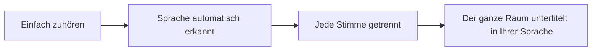
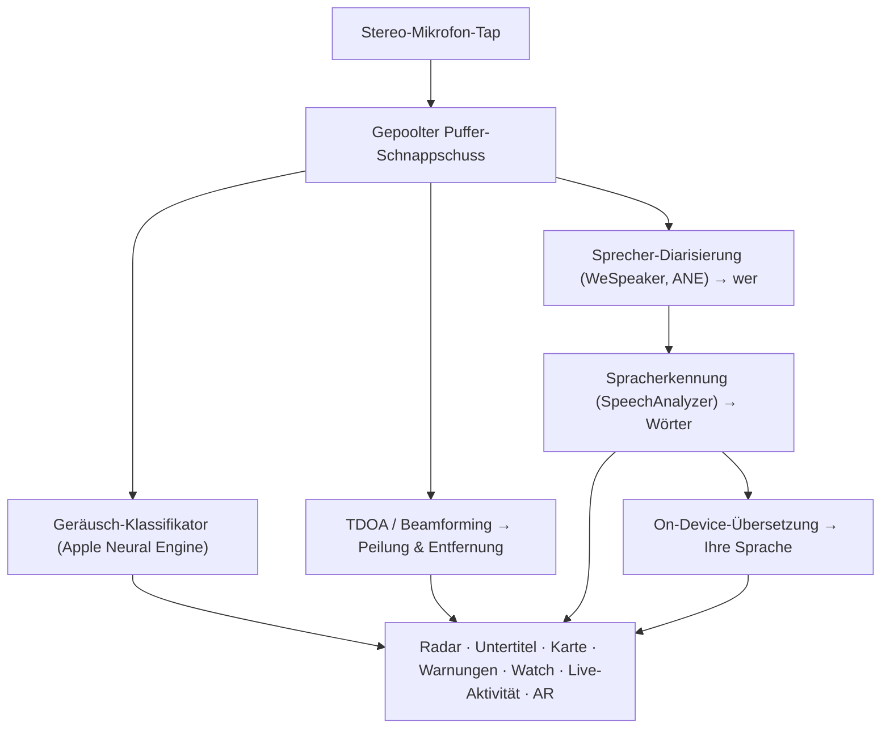

# Vigilant Ear 👂🛡️

*Ein akustisches Radar für Menschen, die nicht hören können.*

Eine App, die speziell für die gehörlose und schwerhörige Gemeinschaft (Deaf and hard-of-hearing) entwickelt wurde. Die meisten Geräuscherkennungs-Apps sagen Ihnen, *was* ein Geräusch ist. **Vigilant Ear sagt Ihnen, wo es ist, wer es macht und was sie sagen** — und verwandelt ein iPhone in einen Echtzeit-Schall-Tricorder, der die Geräusche um Sie herum beschreibt.

Richtung und Entfernung einer Sirene. Ein Klopfen hinter Ihnen. Die Personen in einem Gespräch, als separate transkribierte Stimmen gezeichnet — jede einzelne mit Untertiteln versehen und richtungsbezogen platziert. Wenn jemand eine Sprache spricht, die Sie nicht lesen können, können seine Worte **in Ihre übersetzt** eintreffen. Warnungen erreichen Ihren **Sperrbildschirm, die Dynamic Island und die Apple Watch**, sodass ein Blick genügt.

Alles, was wichtig ist, läuft auf dem Gerät. Audio wird zur Erkennung nicht aufgezeichnet oder hochgeladen. Nichts hängt davon ab, etwas zu hören.

- 🧭 **Richtung, nicht nur Erkennung.** *Was, wo, wer* und *was gesagt wurde* — nicht bloß „ein Geräusch ist aufgetreten.“
- 🔒 **Privat durch Design.** Klassifizierung, Untertitelung und Übersetzung laufen auf Ihrem iPhone. Untertitel sind live und flüchtig; sie werden nicht als Transkript-Archiv gespeichert.
- ⌚ **An Ihrem Handgelenk und auf dem Sperrbildschirm.** Apple Watch-Richtungsbegleiter + Live-Aktivität halten die letzte Warnung und die Richtung, aus der sie kam, einen Blick entfernt.
- 🛰️ **Mehr Telefone, ein geteiltes Ohr.** Constellation verbindet Ultra-Wideband-iPhones, um das, was jedes einzelne hört, zu einem schärferen Richtungsbild zu verschmelzen.
- 👁️ **Gemacht für Gehörlose / Schwerhörige.** Deutliche Haptik, kontrastreiche Visualisierungen, farbunabhängige Hinweise, große Tippziele und durchgehende Beachtung von „Bewegung reduzieren“ (Reduce Motion).

---

## Für wen es ist

- **Gehörlose und schwerhörige Benutzer**, die sich ihrer akustischen Umgebung bewusst sein möchten — Home Watch (Klopfen, Alarm, Baby, Telefon) und Street Watch (Sirene, Annäherung), die Sie eingeschaltet lassen und denen Sie vertrauen können.
- Jeder, der **Live-Untertitel mit Richtung und Sprechertrennung** oder **On-Device-Übersetzung** von Personen in der Nähe benötigt.
- Benutzer im Bereich Barrierefreiheit und Akustikforschung, die sich für die On-Device-Schalllokalisierung interessieren.

> Vigilant Ear ist ein **Hilfsmittel** zur Barrierefreiheit, kein zertifiziertes Lebensrettungsgerät.

---

## Was es tut

### 🧭 Es sieht Geräusche — Richtung & Entfernung
Mithilfe der Stereomikrofone des iPhones schätzt Vigilant Ear die **Peilung und ungefähre Entfernung** von Geräuschen um Sie herum und platziert sie als Live-Markierungen auf einem nach vorne ausgerichteten Radarring und einer Karte. Bewegen Sie sich, und die Markierungen behalten ihre Position in der realen Welt bei. Das ist der Kern: räumliches Bewusstsein für eine Welt, die Sie nicht hören können.

### 🚨 Es erkennt wichtige Geräusche — und warnt Sie
Ein On-Device-Klassifikator identifiziert Hunderte von alltäglichen Geräuschen und überwacht die kritischen Kategorien — **Sirenen, Alarme, Türklingeln/Klopfen, Babygeschrei, eine Person in der Nähe und Unwetter.** Wenn einer ausgelöst wird, erhalten Sie eine klare Warnung auf dem Bildschirm, eine optionale **Push-Benachrichtigung** und eine deutliche **Haptik** — selbst wenn die App im Hintergrund läuft oder das Telefon schläft. Kritische Kategorien sind standardmäßig bereit, sodass das Aktivieren von Benachrichtigungen nicht bedeutet: „alles aus.“ Schalten Sie alle Warnkategorien aus, und die Engine geht vollständig in den Ruhezustand über, während sie im Hintergrund läuft, um Batterie zu sparen.

Unwetterwarnungen stammen aus offiziellen öffentlichen CAP-Feeds — **NWS** der USA, **MeteoGate** in Europa, **CMA** in China und **KMA** in Korea — kostenlos für alle Benutzer. Die Feeds werden auf diejenigen eingegrenzt, die Ihren Aufenthaltsort abdecken.

### ⌚ Apple Watch + Live-Aktivität — ein Blick und Bescheid wissen
- **Apple Watch-Begleiter** — die Richtung einer Warnung zeigt auf Ihrem Handgelenk, sodass ein Blick Ihnen sagt, wohin Sie schauen müssen. Überarbeitete Watch-Benutzeroberfläche mit dem App-Ohr-Symbol, dem Bedrohungs-HUD-Layout und Doppeltippen, um eine Warnung zu schließen. Warnungen können den Richtungspfeil weiterhin anzeigen, wenn die Watch-App nicht geöffnet ist.
- **Live-Aktivität** — Vigilant Ear bleibt auf Ihrem **Sperrbildschirm**, in der **Dynamic Island** und im **Smart-Stapel** der Watch, sodass die letzte Warnung und ihre Peilung immer nur einen Blick entfernt sind.
- **Partnerwarnungen am Handgelenk** — wenn das Telefon eines verbundenen Constellation-Partners eine Warnung auslöst, kann sie auch Ihre Watch erreichen, Richtung inklusive. Ein Zuverlässigkeits-Feinschliff hält den Begleiter den ganzen Tag schonend für die Watch-Batterie.

### 💬 Sprechermodus — live, richtungsbezogene Untertitel *(kostenlos)*
Schalten Sie den **Sprechermodus** ein und Vigilant Ear transkribiert sprechende Personen in Ihrer Nähe in **Untertitelblöcke, einen pro Stimme.** Die On-Device-Sprecherdiarisierung hält Stimmen getrennt — *wer* sagt *was* — mit einem Richtungshinweis auf dem inneren Ring. Der Live-Sprecher wird hervorgehoben; älterer Text scrollt weg, wenn Platz benötigt wird. Untertitel sind kostenlos; automatische Übersetzung ist die optionale Power Pack+-Ebene.

### 🌐 Automatische Sprecher-Übersetzung — Ihre Sprache, live *(Power Pack+)*
Wenn der Sprechermodus aktiviert ist und eine Person in der Nähe eine andere Sprache spricht, kann Vigilant Ear dies erkennen und ihre Untertitel **in Ihrer Sprache** rendern, wobei die Quellsprache auf ihrem Block angezeigt wird. Die Kette — hören → Sprecher trennen → transkribieren → übersetzen → anzeigen — läuft **auf dem Gerät**; der einzige Netzwerkmoment ist ein einmaliger Sprachpaket-Download von Apple. Sie müssen die andere Sprache vorher nicht kennen oder auswählen.

Das ist das bislang Nächste am **Universalübersetzer der Science-Fiction** — dem Gerät, das einfach versteht. Vigilant Ear erkennt die Sprache selbst, folgt jeder sprechenden Person im Raum und untertitelt sie alle in Ihrer Sprache — ohne Ohrhörer, ohne Einrichtung, auf Ihrem Gerät.

### 🎵 Bewusstsein für Musik & Übertragungen *(Power Pack+)*
**ShazamKit** identifiziert Musik, die um Sie herum spielt, und verfolgt Songwechsel. Wenn eine Stimme aussieht, als käme sie eher von einem Fernseher oder Radio als von einer Person im Raum, wird sie mit einem **📻** markiert — die Wörter werden immer noch angezeigt; sie sind ehrlich gekennzeichnet.

### 🎛️ Acoustic Scope — Klang sehen wie ein Toningenieur *(Power Pack+)*
Eine professionelle Live-Ansicht des Klangs um Sie herum: Spektrum, Spektrogramm, ⅓-Oktav-RTA-Bänder, Chroma und harmonische Teiltöne — plus Werkzeuge, um Geräusche für eigene Pakete aufzunehmen.

### 📦 Eigene Soundpakete — bringen Sie ihm Ihre Welt bei *(Power Pack+)*
Bringen Sie Vigilant Ear die Geräusche bei, die für Sie zählen — von heimischen Vögeln bis zur Türklingel Ihres Hauses. Zusatzpakete ergänzen die eingebaute Erkennung, ohne Sirenen und Alarme zu verdrängen. Eine Schritt-für-Schritt-Anleitung ist in der App enthalten.

### 🛰️ Constellation — viele iPhones, ein geteiltes Ohr *(Power Pack+)*
Mit zwei oder mehr Ultra-Wideband-fähigen iPhones (die meisten seit iPhone 11) koppelt **Constellation** diese, sodass sie die Position der anderen erfassen und das, was jedes einzelne hört, zu einem einzigen, präziseren Bild verschmelzen können, woher ein Geräusch kommt — ein verteiltes, passives Hör-Array. Beschränkt auf Geräte mit der richtigen Hardware. Mesh-Untertitel, die älter als die Verbindungszeit eines Peers sind, werden nicht erneut übertragen.

**Partnernachrichten** — senden Sie einen kurzen Text an das Telefon eines verbundenen Partners; er erscheint in dessen Untertitel-Feed und kann direkt auf dem Gerät in dessen Sprache übersetzt ankommen. Die Nachrichtenfunktion berücksichtigt das Alter: Auf Basis von Apples deklariertem Altersbereich bleibt das Schreiben zwischen einem Erwachsenen und einem Minderjährigen deaktiviert, es sei denn, beide haben einander bewusst benannt. Warnungen und Untertitel werden nie eingeschränkt — nur Nachrichten von Person zu Person.

### 📷 Kamera-AR — „das Geräusch sehen“
Öffnen Sie die Kamera-Pille auf der Titelleiste und heften Sie erkannte Geräusche an ihrer realen Peilung in der Live-Kameraansicht an. Markierungen gruppieren sich nach Sprecher oder nach Geräuschkategorie und Richtung, sodass die Ansicht lesbar bleibt; Quellen verblassen durch Alterung, wenn sie leise werden.

### 🗺️ Karten, Straßen & Pfadvorhersage
Geräuschpeilungen werden auf reale GPS-Koordinaten auf der Karte projiziert. Fahrzeuggeräusche können **an nahegelegenen Straßen eingerastet** und ihre Pfade vorhergesagt werden, sodass ein vorbeifahrender LKW als *entlang der Straße* fahrend gelesen wird und nicht durch Gebäude hindurch. (Probieren Sie die Feuerwehrauto-Demo aus.)

### 🪄 Feature-Spielwiese — beweisen Sie es ohne Ohren
Die **Feature-Spielwiese** ist für alle öffentlich: Home- & Street-Übungen (Klopfen, Alarm, Baby, Sirene, Wetter), Multi-Telefon- und Konversations-Demos sowie ein klares Wasserzeichen, damit Übungen niemals vorgeben, ein Live-Ereignis zu sein. Das Schließen des Panels baut Demos sauber ab (kein feststeckender GPS-Spoof, keine übrig gebliebenen Flags).

### ♿ Barrierefreiheit zuerst
Gebaut für gehörlose / schwerhörige und farbenblinde Benutzer: **farbunabhängige** Hinweise, **≥44 pt** Tippziele, Beachtung von **Bewegung reduzieren**, multimodale Warnungen (Haptik + visuell + Watch) und ein Startüberprüfungsbildschirm, der den Berechtigungsstatus mit klaren grünen / grauen / roten (und dunkelorangen „nicht erlaubt“) Zuständen anzeigt — einschließlich der Benachrichtigungsberechtigung, die als Master-Warnschalter fungiert.

---

## Kostenlos & Power Pack+

Der Sicherheitskern ist **kostenlos, für immer**:

- **Home Watch & Street Watch** — lokale Geräuschwarnungen (Alarme, Sirenen, Klopfen/Türklingeln, Baby, Person in der Nähe) mit Bildschirm-, haptischer und optionaler Push-Zustellung.
- **Live-Untertitel** — Sprechermodus, auf dem Gerät, richtungsbezogen, wo die Hardware dies zulässt.
- **Unwetter-CAP** — NWS, MeteoGate, CMA, KMA für Ihre Region.
- **Erdbebenwarnungen (USGS, weltweit)** — Sie spüren eine Vibration und sehen auf Ihrer Karte das Gebiet, in dem das Beben spürbar war, wenn in der Nähe ein Erdbeben gemeldet wird. Eine Bestätigung aus dem offiziellen USGS-Feed — keine Frühwarnung: Wenn Sie ein Beben gespürt haben, sagt Ihnen dies, was es war.
- **Feature-Spielwiese** — Übungswarnungen und Funktionsvorschauen mit klarem PREVIEW-Wasserzeichen.
- **Apple Watch-Begleiter & Live-Aktivität** — auf einen Blick erkennbare Richtung und letzte Warnung.

**Power Pack+** ist eine einmalige Freischaltung (**kein Abonnement**) mit einer **kostenlosen 90-Tage-Testversion**. Es fügt die Superkräfte hinzu:

- **Automatische Sprecher-Übersetzung** — On-Device-Übersetzung von Sprache in der Nähe in Ihre Sprache.
- **Constellation** — geteiltes Hören mit mehreren iPhones über Ultra-Wideband, mit Partnernachrichten.
- **Musik-ID** — ShazamKit-Songerkennung.
- **Acoustic Scope** — professionelle Live-Klangvisualisierung und Aufnahme-Werkzeuge.
- **Eigene Soundpakete** — Zusatz-Klassifizierer, die Sie für Ihre eigenen Geräusche trainieren.

Kostenlos oder Power Pack+, **Ihr Audio bleibt für die Erkennung auf dem Gerät** — die Stufe ändert nur, welche Funktionen freigeschaltet sind, niemals, wohin rohes Audio zur Analyse gesendet wird.

---

## Wie es funktioniert (unter der Haube)

Vigilant Ear ist eine **Local-First, On-Device** Pipeline. Rohes Audio wird an einem hochpriorisierten Tap erfasst, in eine **gepoolte Puffer-Freiliste** kopiert (kein Zuweisungs-Thrash auf dem Echtzeit-Pfad) und auf unabhängige Prozessoren aufgefächert, ohne die Benutzeroberfläche zu blockieren oder den Streamer zu unterbrechen:

- **Räumliche Mathematik** — FFTs, Time-Difference-of-Arrival (Ankunftszeitdifferenz) und Doppler-Tracking in Hintergrundaufgaben.
- **Sprache** — iOS 26 `SpeechAnalyzer` / `SpeechTranscriber` für die Transkription; **WeSpeaker**-Embeddings für die Stimmenidentität; Apples **Translation**-Framework für die On-Device-Übersetzung.
- **Nebenläufigkeit** — Swift 6-Isolation hält den Mikrofon-Tap, die akustische Mathematik und die UI-Rendering-Schleife sauber getrennt.
- **Effizienz** — Downsampling und lastadaptive Klassifizierung halten das ständige Zuhören so leicht, dass es eingeschaltet bleiben kann.

---

## Datenschutz

- **Auf dem Gerät, immer für die Kern-Pipeline.** Klassifizierung, räumliche Mathematik, Transkription, Diarisierung und Übersetzung laufen auf Ihrem iPhone. Rohes Audio wird zur Erkennung nicht aufgezeichnet oder hochgeladen.
- **Untertitel sind flüchtig.** Live-Untertitel bleiben für die Sitzung im Speicher; exportierte Debug-Protokolle enthalten keinen Untertiteltext.
- **Keine SDKs für Werbung oder Verhaltensanalysen.** Eingeschränkte Netzwerknutzung gibt es nur für Karten, öffentliche Wetter-Feeds, optionale Shazam-Fingerabdrücke, Straßenkontext und App Store-Käufe — siehe die vollständige Richtlinie.

Vollständige Details: [PRIVACY.md](PRIVACY.md) · [TERMS.md](TERMS.md) · [SUPPORT.md](SUPPORT.md)

---

## Hardware & Plattformen

- **iPhone (volles Erlebnis).** Stereomikrofone für die Richtungsfindung erforderlich. Empfohlen: **iPhone 13 oder neuer**.
- **Apple Watch.** Begleitwarnungen mit Richtungspfeil; funktioniert mit Live-Aktivität / Smart-Stapel.
- **iPad (fokussiert auf Untertitel).** Einkanalmikrofone → Untertitel ohne volle Richtung.
- **Constellation** benötigt **Ultra-Wideband** — iPhone 11 oder neuer, ausgenommen SE- und „e“-Modelle.
- **Android.** Separater Build mit Kern-Radar, Warnungen, Untertiteln und Wetter; Constellation-Mesh ist iOS-first. Siehe Produkt-Website-Updates, während die Android-Parität wächst.

**Aktuelle App-Store-Version:** 1.0.9. Gebaut für modernes iOS (SpeechAnalyzer-Ära).

---

## Lokalisierung

Vollständig lokalisiert — Schnittstelle, Warnungen und Untertitel — in **Englisch, Spanisch, Portugiesisch (Brasilien), Französisch, Deutsch, Arabisch, Japanisch, vereinfachtes Chinesisch und Koreanisch** (9 Sprachen). Folgt dem Systemgebietsschema oder einer manuellen Auswahl in der App.

---

## Status & Haftungsausschluss

Vigilant Ear ist ein **experimentelles akustisches Hilfsmittel zur Barrierefreiheit**, kein zertifiziertes Lebensrettungswerkzeug. Die Auflösung der Lokalisierung variiert je nach Umgebung, Wetter, Wind und Mikrofonhardware. **Behalten Sie immer Ihr normales Umweltbewusstsein bei** — verlassen Sie sich nicht darauf als Ihre einzige Quelle für Sicherheitsinformationen.

Einige Funktionen (Kamera-AR-Markierungen, Critical Alerts Entitlement-Upgrade, wenn von Apple gewährt, erweitertes Multi-Pack-Sound-Authoring) entwickeln sich weiter; die kostenlose Home / Street Watch und Live-Untertitel sind das Produkt, dem Sie vom ersten Tag an vertrauen können.

---

**Kontakt:** [vigilantear@wingdingssocial.com](mailto:vigilantear@wingdingssocial.com)

Gemacht mit ❤️ für die D/HH-Gemeinschaft und die Akustikforschung.

    
  <strong>© 2026 Wingdings, Inc.</strong> 
  Alle Rechte vorbehalten. 
  Patent angemeldet

