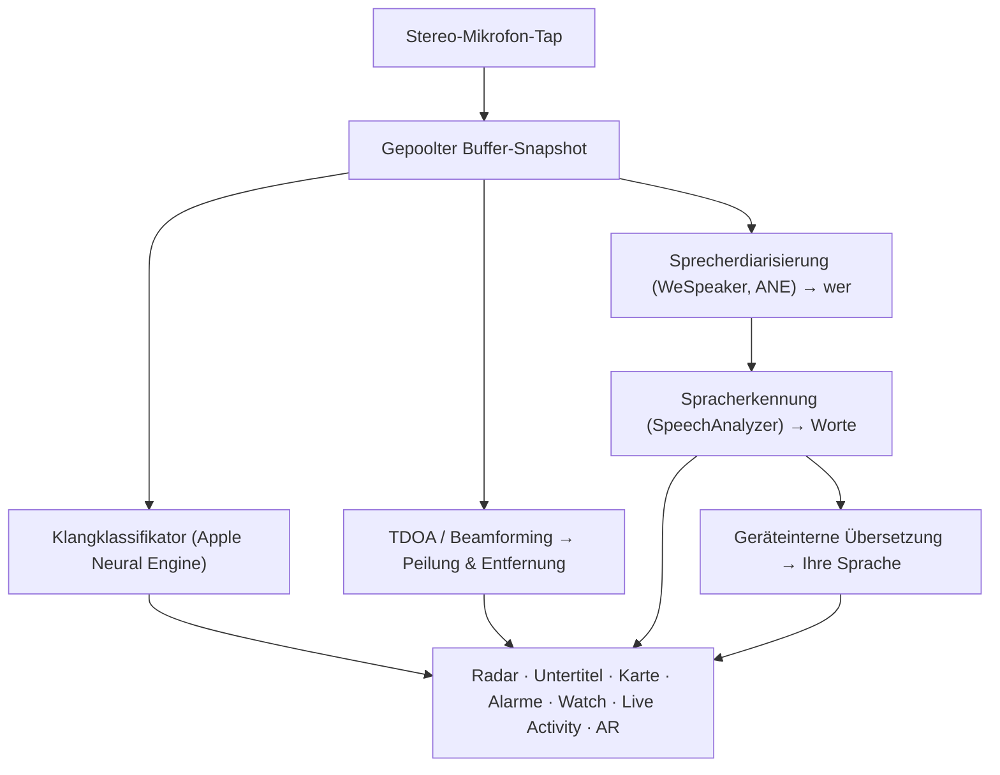

# Vigilant Ear 👂🛡️

*Ein akustisches Radar für Menschen, die nicht hören können.*

Eine App, die speziell für die gehörlose und schwerhörige Community entwickelt wurde. Die meisten Klangerkennungs-Apps sagen Ihnen *was* ein Geräusch ist. **Vigilant Ear sagt Ihnen, wo es ist, wer es verursacht und was gesagt wird** — und verwandelt ein iPhone in einen Echtzeit-Sonic-Tricorder, der die Geräusche um Sie herum beschreibt.

Die Richtung und Entfernung einer Sirene. Ein Klopfen hinter Ihnen. Die Menschen in einem Gespräch, als separate transkribierte Stimmen dargestellt — jede mit Untertiteln und richtungsbezogener Platzierung. Wenn jemand in einer Sprache spricht, die Sie nicht lesen, können seine Worte **in Ihre Sprache übersetzt** ankommen. Alarme erreichen Ihren **Sperrbildschirm, Dynamic Island und Apple Watch**, sodass ein Blick genügt.

Alles, was zählt, läuft auf dem Gerät. Audio wird nicht aufgezeichnet oder zur Erkennung hochgeladen. Nichts hängt davon ab, etwas zu hören.

- 🧭 **Richtung, nicht nur Erkennung.** *Was, wo, wer* und *was wurde gesagt* — nicht nur „ein Geräusch ist passiert.“
- 🔒 **Privat by Design.** Klassifizierung, Untertitelung und Übersetzung laufen auf Ihrem iPhone. Untertitel sind live und flüchtig; sie werden nicht als Transkript-Archiv gespeichert.
- ⌚ **Am Handgelenk und auf dem Sperrbildschirm.** Apple-Watch-Richtungs-Companion + Live Activity halten den letzten Alarm und seine Herkunftsrichtung nur einen Blick entfernt.
- 🛰️ **Mehr Telefone, ein gemeinsames Ohr.** Constellation verbindet Ultra-Wideband-iPhones, um das, was jedes hört, zu einem schärferen Richtungsbild zu fusionieren.
- 👁️ **Gemacht für Gehörlose / Schwerhörige.** Deutliche Haptik, kontrastreiche Visuals, farbunabhängige Hinweise, große Tipptargets und durchgängige Berücksichtigung von Reduce Motion.

---

## Für wen ist die App gedacht

- **Gehörlose und schwerhörige Nutzer**, die Situationswahrnehmung von Geräuschen wollen — Home Watch (Klopfen, Alarm, Baby, Telefon) und Street Watch (Sirene, Annäherung), die Sie eingeschaltet lassen und denen Sie vertrauen können.
- Alle, die **Live-Untertitel mit Richtung und Sprechertrennung** oder **geräteinterne Übersetzung** von Personen in der Nähe brauchen.
- Barrierefreiheits- und Akustik-Forschungsnutzer, die sich für geräteinterne Klanglokalisierung interessieren.

> Vigilant Ear ist ein Barrierefreiheits-**Hilfsmittel**, kein zertifiziertes Lebensschutzgerät.

---

## Was die App kann

### 🧭 Sie sieht Klang — Richtung & Entfernung
Mithilfe der Stereomikrofone des iPhones schätzt Vigilant Ear die **Peilung und ungefähre Entfernung** von Geräuschen um Sie herum und platziert sie als Live-Marker auf einem Heading-up-Radar-Ring und einer Karte. Wenn Sie sich bewegen, behalten die Marker ihre reale Weltposition. Das ist der Kern: räumliches Bewusstsein einer Welt, die Sie nicht hören können.

### 🚨 Sie erkennt wichtige Geräusche — und warnt Sie
Ein geräteseitiger Klassifikator identifiziert Hunderte alltäglicher Geräusche und überwacht die kritischen Kategorien — **Sirenen, Alarme, Türklingeln/Klopfen, Babyschreien, eine Person in der Nähe und Unwetter.** Wenn eines auslöst, erhalten Sie einen klaren Bildschirm-Alarm, optional eine **Push-Benachrichtigung** und eine deutliche **Haptik** — auch wenn die App im Hintergrund ist oder das Telefon schläft. Kritische Kategorien sind standardmäßig bereit, sodass das Aktivieren von Benachrichtigungen nicht „alles aus“ bedeutet. Schalten Sie alle Alarmkategorien aus, und die Engine wechselt im Hintergrund vollständig in den Ruhezustand, um Akku zu sparen.

Unwetterwarnungen stammen aus offiziellen öffentlichen CAP-Feeds — US-**NWS**, Europa-**MeteoGate**, **China CMA** und **Korea KMA** — kostenlos für alle Nutzer. Feeds werden auf die eingeschränkt, die Ihren Standort abdecken.

### ⌚ Apple Watch + Live Activity — einen Blick werfen und wissen
- **Apple-Watch-Companion** — die Richtung eines Alarms zeigt am Handgelenk, sodass ein Blick sagt, wohin Sie schauen sollen. Neu gestaltete Watch-UI mit dem App-Ohr-Icon, Threat-HUD-Layout und Doppeltipp zum Minimieren. Alarme können weiterhin den Richtungspfeil anzeigen, wenn die Watch-App nicht geöffnet ist.
- **Live Activity** — Vigilant Ear bleibt auf Ihrem **Sperrbildschirm**, im **Dynamic Island** und im **Watch Smart Stack**, sodass der letzte Alarm und seine Peilung immer nur einen Blick entfernt sind.

### 💬 Speaker Mode — Live-Untertitel mit Richtungsangabe *(kostenlos)*
Aktivieren Sie **Speaker Mode**, und Vigilant Ear transkribiert Personen, die in Ihrer Nähe sprechen, in **Untertitelblöcke, einen pro Stimme.** Geräteinterne Sprecherdiarisierung hält Stimmen getrennt — *wer* sagt *was* — mit einem Richtungshinweis auf dem inneren Ring. Der aktive Sprecher wird hervorgehoben; älterer Text scrollt weg, wenn Platz benötigt wird. Untertitel sind kostenlos; automatische Übersetzung ist die optionale Power-Pack+-Schicht.

### 🌐 Speaker Auto-Translate — Ihre Sprache, live *(Power Pack+)*
Bei aktiviertem Speaker Mode kann Vigilant Ear, wenn eine Person in der Nähe eine andere Sprache spricht, diese erkennen und deren Untertitel **in Ihrer Sprache** darstellen, mit der Ausgangssprache auf dem Block. Die Kette — hören → Sprecher trennen → transkribieren → übersetzen → anzeigen — läuft **auf dem Gerät**; der einzige Netzwerkmoment ist ein einmaliger Sprachpaket-Download von Apple. Sie müssen die andere Sprache nicht vorher kennen oder auswählen.

### 🎵 Musik- und Rundfunkbewusstsein *(Power Pack+)*
**ShazamKit** identifiziert Musik in Ihrer Umgebung und verfolgt Songwechsel. Wenn eine Stimme eher von einem Fernseher oder Radio zu kommen scheint als von einer Person im Raum, wird sie mit einem **📻** gekennzeichnet — die Worte werden weiterhin angezeigt; sie sind ehrlich beschriftet.

### 🛰️ Constellation — viele iPhones, ein gemeinsames Ohr *(Power Pack+)*
Mit zwei oder mehr Ultra-Wideband-fähigen iPhones (die meisten seit iPhone 11) koppelt **Constellation** sie, sodass sie die Position des jeweils anderen erfassen und das, was jedes hört, zu einem einzigen, präziseren Bild der Schallherkunft fusionieren können — ein verteiltes, passives Hör-Array. Beschränkt auf Geräte mit der richtigen Hardware. Mesh-Untertitel, die älter sind als die Verbindungszeit eines Peers, werden nicht erneut übertragen.

### 📷 Kamera-AR — „den Klang sehen“ *(Vorschau)*
Öffnen Sie die Kamera-Pille in der Titelleiste und pinnen Sie erkannte Geräusche an ihrer realen Peilung in der Live-Kameraansicht. Marker clustern nach Sprecher oder nach Klangkategorie und Richtung, damit die Ansicht lesbar bleibt; Quellen verblassen altersbedingt, wenn sie still werden.

### 🗺️ Karten, Straßen & Wegvorhersage
Schallpeilungen werden auf echte GPS-Koordinaten auf der Karte projiziert. Fahrzeuggeräusche können **auf nahegelegene Straßen eingerastet** und ihre Wege vorhergesagt werden, sodass ein vorbeifahrender Lkw als *entlang der Straße* fahrend erscheint und nicht durch Gebäude. (Probieren Sie die Feuerwehrwagen-Demo.)

### 🪄 Demo Mode — beweisen ohne Ohren
**Demo Mode** ist für alle öffentlich: Home- & Street-Übung (Klopfen, Alarm, Baby, Sirene, Wetter), Mehrtelefon- und Gesprächsdemos und ein klares **DEMO:**-Wasserzeichen, sodass Übung nie als Live-Ereignis vorgetäuscht wird. Das Schließen des Panels baut Demos sauber ab (kein hängender GPS-Spoof, keine Rest-Flags).

### ♿ Barrierefreiheit zuerst
Gebaut für gehörlose / schwerhörige und farbenblinde Nutzer: **farbunabhängige** Hinweise, **≥44 pt** Tipptargets, **Reduce Motion**-Berücksichtigung, multimodale Alarme (Haptik + visuell + Watch) und ein Start-Verifizierungsbildschirm, der den Berechtigungsstatus mit klaren grünen / grauen / roten (und brandorangen „nicht erlaubt“-)Zuständen zeigt — einschließlich der Benachrichtigungsfreigabe, die als Master-Alarm-Schalter wirkt.

---

## Kostenlos & Power Pack+

Der Sicherheitskern ist **für immer kostenlos**:

- **Home Watch & Street Watch** — lokale Klangalarme (Alarme, Sirenen, Klopfen/Türklingeln, Baby, Person in der Nähe) mit Bildschirm-, Haptik- und optionaler Push-Zustellung.
- **Live-Untertitel** — Speaker Mode, geräteintern, mit Richtung, wo die Hardware es zulässt.
- **Unwetter-CAP** — NWS, MeteoGate, CMA, KMA für Ihre Region.
- **Demo Mode** — Übungsalarme und Feature-Vorschauen mit DEMO-Wasserzeichen.
- **Apple-Watch-Companion & Live Activity** — peilbare Richtung und letzter Alarm.

**Power Pack+** ist ein einmaliges Freischalten (**kein Abo**) mit einer **90-tägigen kostenlosen Testphase**. Es fügt die Superkräfte hinzu:

- **Speaker Auto-Translate** — geräteinterne Übersetzung von Sprache in der Nähe in Ihre Sprache.
- **Constellation** — gemeinsames Hören über mehrere iPhones via Ultra-Wideband.
- **Music ID** — ShazamKit-Song-Erkennung.

Kostenlos oder Power Pack+: **Ihr Audio bleibt zur Erkennung auf dem Gerät** — die Stufe ändert nur, welche Funktionen freigeschaltet sind, nie wohin Rohaudio zur Analyse gesendet wird.

---

## So funktioniert es (unter der Haube)

Vigilant Ear ist eine **local-first, geräteinterne** Pipeline. Rohaudio wird auf einem hochprioritären Tap erfasst, in eine **gepoolte Buffer-Free-List** kopiert (kein Allokations-Thrash auf dem Echtzeitpfad) und an unabhängige Prozessoren verteilt, ohne die UI zu blockieren oder den Streamer zu unterbrechen:

- **Räumliche Mathematik** — FFTs, Time-Difference-of-Arrival und Doppler-Tracking in Hintergrundaufgaben.
- **Sprache** — iOS 26 `SpeechAnalyzer` / `SpeechTranscriber` für Transkription; **WeSpeaker**-Embeddings für Stimmidentität; Apples **Translation**-Framework für geräteinterne Übersetzung.
- **Concurrency** — Swift-6-Isolation hält Mikrofon-Tap, akustische Mathematik und UI-Render-Loop sauber getrennt.
- **Effizienz** — Downsampling und lastadaptive Klassifizierung halten Always-Listening leicht genug, um es eingeschaltet zu lassen.

---

## Datenschutz

- **Geräteintern, immer für die Kern-Pipeline.** Klassifizierung, räumliche Mathematik, Transkription, Diarisierung und Übersetzung laufen auf Ihrem iPhone. Rohaudio wird nicht aufgezeichnet oder zur Erkennung hochgeladen.
- **Untertitel sind flüchtig.** Live-Untertitel bleiben für die Sitzung im Speicher; exportierte Debug-Logs enthalten keinen Untertiteltext.
- **Keine Werbe- oder Verhaltensanalyse-SDKs.** Begrenzte Netzwerknutzung nur für Karten, öffentliche Wetter-Feeds, optionale Shazam-Fingerprints, Straßenkontext und App-Store-Käufe — siehe die vollständige Richtlinie.

Vollständige Details: [PRIVACY.md](PRIVACY.md) · [TERMS.md](TERMS.md) · [SUPPORT.md](SUPPORT.md)

---

## Hardware & Plattformen

- **iPhone (volles Erlebnis).** Stereomikrofone für die Richtungssuche erforderlich. Empfohlen **iPhone 13 oder neuer**.
- **Apple Watch.** Companion-Alarme mit Richtungspfeil; funktioniert mit Live Activity / Smart Stack.
- **iPad (untertitelfokussiert).** Ein-Kanal-Mikrofone → Untertitel ohne volle Richtung.
- **Constellation** braucht **Ultra-Wideband** — iPhone 11 oder neuer, ohne SE- und „e“-Modelle.
- **Android.** Separater Build mit Kern-Radar, Alarmen, Untertiteln und Wetter; Constellation-Mesh ist iOS-first. Siehe Produktseiten-Updates, während die Android-Parität wächst.

**Aktuelle Apple-Marketing-Version:** 1.0.7 (in Arbeit / Shipping-Track). Gebaut für modernes iOS (SpeechAnalyzer-Ära).

---

## Lokalisierung

Vollständig lokalisiert — Oberfläche, Alarme und Untertitel — in **Englisch, Spanisch, Portugiesisch (Brasilien), Französisch, Deutsch, Arabisch, Japanisch, Vereinfachtes Chinesisch und Koreanisch** (9 Sprachen). Folgt der System-Locale oder einer manuellen Auswahl in der App.

---

## Status & Haftungsausschluss

Vigilant Ear ist ein **experimentelles akustisches Barrierefreiheits-Hilfsmittel**, kein zertifiziertes Lebensschutz-Utility. Die Lokalisierungsauflösung variiert mit Umgebung, Wetter, Wind und Mikrofon-Hardware. **Bewahren Sie stets Ihre normale Umgebungswahrnehmung** — verlassen Sie sich nicht darauf als einzige Quelle für Sicherheitsinformationen.

Einige Fähigkeiten (Kamera-AR-Marker, Critical-Alerts-Entitlement-Upgrade, wenn von Apple gewährt, fortgeschrittenes Multi-Pack-Sound-Authoring) entwickeln sich weiter; die kostenlose Home-/Street-Watch und Live-Untertitel sind das Produkt, dem Sie ab Tag eins vertrauen können.

---

**Kontakt:** [vigilantear@wingdingssocial.com](mailto:vigilantear@wingdingssocial.com)

Made with ❤️ for the D/HH community and acoustic research.

    
  <strong>© 2026 Wingdings, Inc.</strong> 
  Alle Rechte vorbehalten. 
  Patent angemeldet

