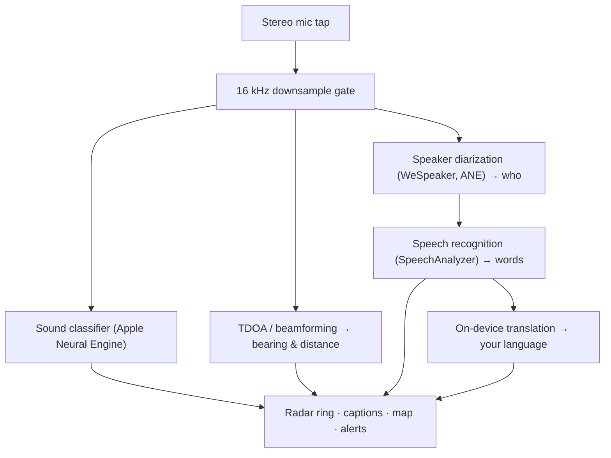

# Vigilant Ear 👂🛡️ (Apple Edition)

*Ein akustisches Radar für Menschen, die nicht hören können.*

Eine App, die speziell für die Gehörlosen-/Schwerhörigen-Community entwickelt wurde! Die meisten Klangerkennung-Apps zeigen Ihnen *was* ein Geräusch ist. **Vigilant Ear sagt Ihnen, wo es sich befindet, wer es verursacht und was dabei gesagt wird** — und verwandelt ein iPhone in einen Echtzeit-Sonic-Tricorder, der Ihre akustische Umgebung visuell beschreibt.

Die Richtung und Entfernung einer Sirene. Ein Klopfen hinter Ihnen. Die Menschen in einem Gespräch, als separate transkribierte Stimmen dargestellt — jede mit Untertiteln und richtungsbezogener Zuordnung zum Sprecher. Wenn jemand in einer Sprache spricht, die Sie nicht lesen, werden seine Worte **in Ihre Sprache übersetzt.**

Alles läuft auf dem Gerät. Nichts wird aufgezeichnet, zwischengespeichert oder gesendet.

---

## Für wen ist die App gedacht?

- **Gehörlose und schwerhörige Nutzer**, die eine Situationswahrnehmung von Klängen möchten — nicht nur „ein Geräusch ist passiert", sondern *was, wo, wer* und *was wurde gesagt.*
- Alle, die **Live-Untertitel mit Richtungsangabe und Sprechertrennung** benötigen, oder eine **gerätegestützte Übersetzung** von Freunden in ihrer unmittelbaren Nähe wünschen.
- Akustik-Forscher und Barrierefreiheits-Enthusiasten, die sich für gerätegestützte Klanglokalisierung interessieren.

> Vigilant Ear ist ein Barrierefreiheits-**Hilfsmittel**, kein zertifiziertes Lebensschutzgerät.

---

## Was die App kann

### 🧭 Sie sieht Klang — Richtung & Entfernung
Mithilfe der Stereomikrofone des iPhones schätzt Vigilant Ear die **Richtung und ungefähre Entfernung** von Klängen in Ihrer Umgebung und stellt sie als Live-Punkte auf einem Heading-up-Radar-Ring und einer Karte dar. Wenn Sie sich bewegen, behalten die Punkte ihre reale Position bei. Dies ist der Kern der App: räumliches Bewusstsein einer Welt, die Sie nicht hören können.

### 🚨 Sie erkennt wichtige Geräusche — und warnt Sie
Ein geräteseitiger Klassifikator identifiziert **über 300 alltägliche Geräusche** und überwacht die kritischen Kategorien — **Sirenen, Alarme, Türklingeln/Klopfen, eine Person in der Nähe und Unwetterwarnungen.** Wenn eines davon ausgelöst wird, erhalten Sie einen deutlichen Bildschirm-Alarm und eine optionale **Push-Benachrichtigung**, auch wenn die App im Hintergrund läuft oder Ihr Telefon im Ruhezustand ist. Schalten Sie alle Alarmkategorien aus, und die Engine wechselt vollständig in den Ruhezustand im Hintergrund, um den Akku zu schonen.

Unwetterwarnungen stammen aus offiziellen öffentlichen Feeds: Der US-amerikanische **NWS** ist kostenlos integriert; das europäische **MeteoGate**-Netzwerk und **Chinas CMA** sind Teil von Premium. Die Feeds werden automatisch auf die eingeschränkt, die Ihren aktuellen Standort tatsächlich abdecken.

### 💬 Speaker Mode — Live-Untertitel mit Richtungsangabe *(Premium)*
Aktivieren Sie **Speaker Mode**, und Vigilant Ear transkribiert die Personen, die in Ihrer Nähe sprechen, in **Untertitelblöcke, einen pro Stimme.** Die geräteseitige Sprecherdiarisierung unterscheidet die Stimmen voneinander, sodass jede Person ihren eigenen Block und ein markantes Symbol erhält — *wer* sagt *was* — mit einem kleinen Kreis auf dem inneren Ring, der Sie zu ihrer Position im Raum führt. Der aktive Sprecher wird hervorgehoben; älterer Text scrollt langsam weg oder wenn Platz für neuen Text benötigt wird.

### 🌐 Speaker Auto-Translate — eine Sprache lesen, die Sie nicht hören, in Ihrer eigenen *(Premium)*
Bei aktiviertem Speaker Mode erkennt Vigilant Ear, wenn eine Person in der Nähe eine andere Sprache spricht, und zeigt deren Untertitel **in Ihrer Sprache** an — live, mit der Kennzeichnung der Ausgangssprache in der Titelleiste des Blocks. Die gesamte Kette — hören → Sprecher trennen → transkribieren → übersetzen → anzeigen — läuft **vollständig auf dem Gerät**; der einzige Netzwerkmoment ist ein einmaliger Sprachpaket-Download von Apple. Für eine gehörlose Person mit einem Freund, der eine andere Sprache spricht, bedeutet dies, dessen Gesprächsanteil in Echtzeit lesen zu können, **ohne diese Sprache vorher kennen und auswählen zu müssen**.

### 🎵 Musik- und Rundfunkbewusstsein *(Premium)*
**ShazamKit** identifiziert Musik in Ihrer Umgebung und zeigt den Titel mit automatischer Erkennung von Songwechsel-Signaturen an. Und wenn eine Stimme eher von einem Fernseher oder Radio zu kommen scheint als von einer Person im Raum, wird sie mit einem **📻** gekennzeichnet, anstatt fälschlicherweise als anwesende Person erkannt zu werden — die Wörter werden weiterhin angezeigt, aber ehrlich gekennzeichnet.

### 🛰️ Constellation — mehrere iPhones, ein gemeinsames Ohr *(Premium)*
Mit zwei oder mehr Ultra-Wideband-fähigen iPhones (die meisten seit iPhone 11) koppelt der **Constellation**-Modus diese Geräte, sodass sie die jeweilige Position des anderen erkennen können (via Apple's Nearby Interaction / UWB) und das, was jedes von ihnen hört, zu einem einzigen, weit präziseren Bild der Schallherkunft zusammenführen — eine Art verteiltes, passives **synthetisches Apertur-Sonar.** Dieses Feature ist auf Geräte mit der entsprechenden Hardware beschränkt.

### 🗺️ Karten, Straßen & Wegvorhersage
Schallpeilungen werden auf echte GPS-Koordinaten projiziert und in einer Kartenansicht dargestellt. Fahrzeuggeräusche werden **auf nahegelegene Straßen eingerastet** (über Open-Source-Straßendaten-Feeds) und ihre Wege vorhergesagt, sodass ein vorbeifahrendes Auto als *entlang der Straße fahrend* und nicht als durch Gebäude driftend erscheint. (Probieren Sie die Feuerwehrauto-Demo, um eine Vorschau zu erhalten.)

---

## Kostenlos & Premium

Der Sicherheitskern ist **kostenlos, für immer**:

- **Lokale Klangwarnungen** — Alarme, Sirenen, Türklingeln/Klopfen und eine Person in der Nähe — geräteseitig erkannt, mit Bildschirm- und Push-Warnungen.
- **NWS-Unwetterwarnungen** für die Vereinigten Staaten.

Ein einmaliges **Premium-Upgrade** — mit einer kostenlosen Testphase zu Beginn, und **kein Abonnement** — fügt die vollständige Situationswahrnehmungs-Ebene hinzu:

- **Speaker Mode** — Live-Untertitel mit Richtungsangabe, pro Sprecher.
- **Speaker Auto-Translate** — gerätegestützte Übersetzung naher Sprache in Ihre Sprache.
- **Constellation** — gemeinsames Hören über mehrere iPhones via Ultra-Wideband.
- **Music ID** — ShazamKit-Musikerkennung.
- **Internationale Wetter-Feeds** — Europa (MeteoGate) und China (CMA).

Ob kostenlos oder Premium, **alles läuft auf dem Gerät** — die Stufe ändert nur, welche Funktionen freigeschaltet sind, nicht, wohin Ihre Audiodaten gehen.

---

## So funktioniert es (unter der Haube)

Vigilant Ear ist eine **local-first, gerätegestützte** Pipeline. Rohaudio wird über einen hochpriorisierten Tap erfasst, kopiert und ohne Unterbrechung der Benutzeroberfläche an unabhängige Verarbeitungsaktoren verteilt:

- **Räumliche Mathematik** — Schnelle Fourier-Transformationen, Time-Difference-of-Arrival und Doppler-Tracking laufen auf abgetrennten Hintergrundaufgaben.
- **Sprache** — iOS 26's `SpeechAnalyzer`/`SpeechTranscriber` übernehmen die Transkription; **WeSpeaker**-Einbettungen clustern das Audio in verschiedene Stimmen; Apples **Translation**-Framework übernimmt die gerätegestützte Übersetzung.
- **Parallelität** — Swift 6's strikte Isolation hält den Mikrofon-Tap, die akustische Mathematik und den `CADisplayLink`-Render-Loop der Karte sauber getrennt, sodass die Benutzeroberfläche flüssig bleibt (Ziel: 60 FPS Marker-Gleiten), während alles andere im Hintergrund läuft.
- **Effizienz** — Das 16-kHz-Downsampling-Gate reduziert die Datenmenge, die der Klassifikator verarbeitet, um ~80%, was den aktiven Speicherbedarf gering hält und den „always-listening"-Hintergrundmodus noch schlanker macht.

---

## Datenschutz

- **Auf dem Gerät, immer.** Alle Klassifizierung, räumliche Mathematik, Transkription, Diarisierung (Sprecher-Signatur/Identifikation) und Übersetzung finden auf Ihrem iPhone statt. Rohaudio wird niemals aufgezeichnet, zwischengespeichert oder übertragen.
- **Transkripte sind flüchtig.** Untertitel leben für die Dauer der Sitzung im Arbeitsspeicher und werden weder gespeichert noch hochgeladen.
- **Kein Telemetrie.** Keine Analysen, Absturzprotokolle oder Nutzungsdaten werden an einen Server gesendet.

Vollständige Details: [PRIVACY.md](PRIVACY.md) · [TERMS.md](TERMS.md) · [SUPPORT.md](SUPPORT.md)

---

## Hardware & Plattformen

- **iPhone (vollständige Erfahrung).** Ein iPhone mit Stereomikrofon ist für die Richtungsbestimmung erforderlich. Empfohlen wird iPhone 13 oder neuer.
- **iPad (nur Untertitel).** iPads stellen nur einen einzelnen Audiokanal bereit, sodass sie transkribieren und Untertitel anzeigen können, aber keine Richtungsberechnung durchführen — ideal für ein stationäres Großbilddisplay.
- **Constellation** benötigt **Ultra-Wideband** — iPhone 11 oder neuer, außer SE- und „e"-Modellen.

---

## Lokalisierung

Vollständig lokalisiert — Benutzeroberfläche, Warnungen und Untertitel — in **Englisch, Spanisch, Portugiesisch, Französisch, Deutsch, Arabisch, Japanisch und Vereinfachtes Chinesisch** (8 Sprachen). Sie folgen der Systemspracheinstellung oder können manuell in der App ausgewählt werden.

---

## Status & Haftungsausschluss

Vigilant Ear ist ein **experimentelles akustisches Barrierefreiheits-Hilfsmittel**, kein zertifiziertes Lebensschutz-Werkzeug. Die Lokalisierungsauflösung variiert je nach Umgebung, Wetter, Wind und Mikrofonhardware. **Behalten Sie stets Ihre normale Umgebungswahrnehmung bei** — verlassen Sie sich nicht ausschließlich auf diese App als Ihre einzige Sicherheitsinformationsquelle.

---

**Kontakt:** [vigilantear@wingdingssocial.com](mailto:vigilantear@wingdingssocial.com)

Mit ❤️ für die D/HH-Community und die akustische Forschung entwickelt.

© 2026 Wingdings, Inc. All rights reserved.
