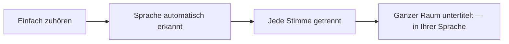
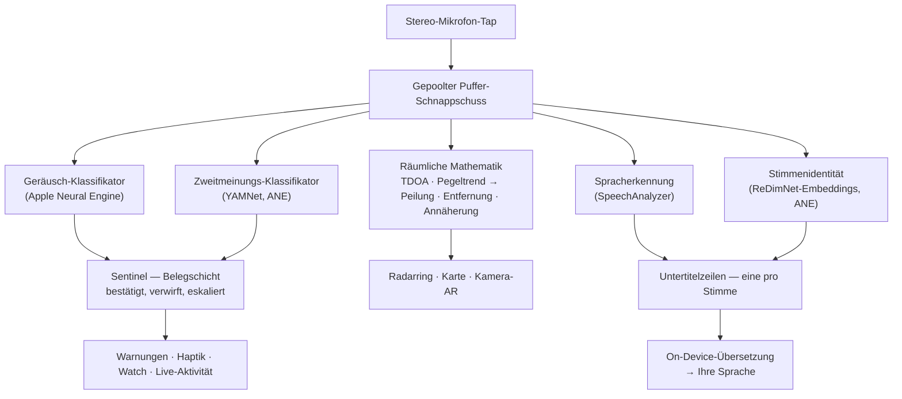
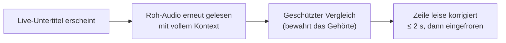
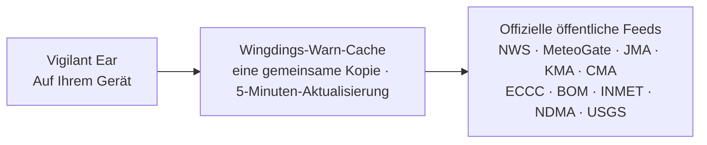

# Vigilant Ear 👂🛡️

*Gültig ab Version 1.1.3 · September 2026.*

## Ein akustisches Radar für Menschen, die nicht hören können.

Eine App, die speziell für die Gemeinschaft der Gehörlosen, Schwerhörigen und CODAs entwickelt wurde. Die meisten Geräuscherkennungs-Apps sagen Ihnen, *was* ein Geräusch ist. **Vigilant Ear sagt Ihnen, wo es ist, wer es macht und was gesprochen wird** — und verwandelt ein iPhone in einen Echtzeit-Schall-Tricorder, der die Geräusche um Sie herum beschreibt.

Richtung und Entfernung einer Sirene. Ein Klopfen hinter Ihnen. Die Personen in einem Gespräch, als separate transkribierte Stimmen dargestellt — jede mit Untertiteln und richtungsbezogen platziert. Wenn jemand eine Sprache spricht, die Sie nicht lesen, können die Worte **in Ihre Sprache übersetzt** ankommen. Warnungen erreichen Ihren **Sperrbildschirm, die Dynamic Island und die Apple Watch**, sodass ein Blick genügt.

Alles Wichtige läuft auf dem Gerät. Audio wird zur Erkennung weder aufgezeichnet noch hochgeladen. Nichts hängt davon ab, etwas zu hören.

- 🧭 **Richtung, nicht nur Erkennung.** *Was, wo, wer* und *was gesagt wurde* — nicht bloß „es gab ein Geräusch.“
- 🔒 **Von Grund auf privat.** Klassifizierung, Untertitelung und Übersetzung laufen auf Ihrem iPhone. Untertitel sind live und flüchtig; sie werden nicht als Transkript-Archiv gespeichert.
- ⌚ **Am Handgelenk und auf dem Sperrbildschirm.** Der Apple-Watch-Richtungsbegleiter plus Live-Aktivität halten die letzte Warnung und ihre Herkunft einen Blick entfernt.
- 🛰️ **Mehr Telefone, ein gemeinsames Ohr.** Constellation verbindet Ultra-Wideband-iPhones und verschmilzt, was jedes Gerät erfasst, zu einem schärferen Richtungsbild.
- 👁️ **Für Gehörlose / Schwerhörige / CODAs.** Deutliche Haptik, kontrastreiche Darstellung, farbunabhängige Hinweise, große Tippflächen und durchgehende Beachtung von „Bewegung reduzieren“.

---

## Für wen es ist

- **Gehörlose, schwerhörige und CODA-Nutzerinnen und -Nutzer**, die akustische Situationswahrnehmung wollen — Home Watch (Klopfen, Alarm, Baby, Telefon) und Street Watch (Sirene, Annäherung), die Sie eingeschaltet lassen und denen Sie vertrauen können.
- Alle, die **Live-Untertitel mit Richtung und Sprechertrennung** oder **On-Device-Übersetzung** von Menschen in der Nähe brauchen.
- Nutzerinnen und Nutzer aus Barrierefreiheit und Akustikforschung, die sich für On-Device-Schalllokalisierung interessieren.

> Vigilant Ear ist ein **Hilfsmittel** zur Barrierefreiheit, kein zertifiziertes Lebensrettungsgerät.

---

## Was es tut

### 🧭 Es sieht Geräusche — Richtung & Entfernung
Über die beiden Mikrofone des iPhones misst Vigilant Ear den **Winkel eines Geräuschs und ob es vor oder hinter Ihnen liegt**, hält die Anzeige auf etwa ein Grad stabil und setzt sie als Live-Markierung auf einen vorausgerichteten Radarring und eine Karte. Zwei Mikrofone auf einer Linie können links und rechts allein nicht unterscheiden — ein Geräusch 50° rechts und eines 50° links erzeugen denselben winzigen Laufzeitunterschied —, deshalb zeichnet die App die Anzeige plus ein **schwächeres Spiegelbild auf der anderen Seite**; eine Drehung des Handgelenks oder ein zweites Telefon löst die Mehrdeutigkeit. Die Entfernung wird aus der Lautstärke anhand einer straßenkalibrierten Kurve geschätzt und so gezeigt, wie sie ist: *≈ 50 ft*, mit wahrscheinlichem Bereich. Bewegen Sie sich, und die Markierungen behalten ihre reale Position. Das ist der Kern: räumliches Bewusstsein für eine Welt, die Sie nicht hören. (Zahlen weiter unten.)

### 🚨 Es erkennt wichtige Geräusche — und warnt Sie
Ein On-Device-Klassifikator erkennt Hunderte alltäglicher Geräusche und überwacht die kritischen Kategorien — **Sirenen, Alarme — einschließlich einer eigenen Autoalarm-Klasse —, Türklingeln/Klopfen, Babygeschrei, eine Person in der Nähe und Unwetter.** Bei einem Treffer gibt es eine klare Bildschirmwarnung, optional eine **Push-Benachrichtigung** und eine eigene **Haptik** — auch wenn die App im Hintergrund ist oder das Telefon schläft. Kritische Kategorien sind standardmäßig bereit, damit Benachrichtigungen einschalten nicht „alles aus“ bedeutet. Schalten Sie alle Warnkategorien aus, geht die Engine im Hintergrund vollständig in den Ruhezustand und spart Akku. Eine **Sentinel**-Schicht prüft Warnungen gegen unabhängige Belege — Richtung, Bewegung und öffentliche Feeds —, sodass auslöst, was bestätigt ist, nicht die Vermutung eines einzelnen Klassifikators. Das gilt in beide Richtungen: ein sirenenähnlicher Moment in einem Song wird zurückgehalten, aber eine echte Sirene, die sich durch Ihre Musik wiederholt, bricht durch und warnt.

Unwetterwarnungen kommen aus offiziellen öffentlichen Feeds — **NWS** (USA), **MeteoGate** (Europa), **CMA** (China), **KMA** (Korea), **JMA** (Japan), **ECCC** (Kanada), **BOM** (Australien), **INMET** (Brasilien) und **NDMA** (Indien) — kostenlos für alle. Die Feeds werden auf die eingegrenzt, die Ihren Ort abdecken. In Japan liest die App außerdem JMAs **Vorab-Bulletins** — die verständlichen Hinweise Tage vor Taifun oder Starkregen, nicht nur die Warnungen, wenn die Gefahr schon da ist — sowie die Bulletins zu Starkregen und Erdrutschen. Vorab-Hinweise erscheinen ruhig, ohne den Sound und die Vibration, die für eine echte Warnung reserviert sind.

### ⌚ Apple Watch + Live-Aktivität — ein Blick genügt
- **Apple-Watch-Begleiter** — die Richtung einer Warnung zeigt am Handgelenk, wohin Sie schauen sollen. Überarbeitete Watch-Oberfläche mit App-Ohr-Symbol, Bedrohungs-HUD und Doppeltippen zum Schließen. Warnungen können den Richtungspfeil weiterhin zeigen, wenn die Watch-App nicht geöffnet ist.
- **Live-Aktivität** — Vigilant Ear bleibt auf Ihrem **Sperrbildschirm**, in der **Dynamic Island** und im **Smart Stack** der Watch, sodass letzte Warnung und Peilung immer einen Blick entfernt sind.
- **Partnerwarnungen am Handgelenk** — wenn das Telefon eines verbundenen Constellation-Partners warnt, kann das auch Ihre Watch erreichen, Richtung inklusive. Ein Zuverlässigkeits-Durchgang hält den Begleiter den ganzen Tag schonend für die Watch-Batterie.

### 💬 Sprechermodus — live, richtungsbezogene Untertitel *(kostenlos)*
Schalten Sie den **Sprechermodus** ein, und Vigilant Ear transkribiert sprechende Personen in der Nähe in **Untertitelblöcke, einen pro Stimme.** On-Device-Sprecherdiarisierung hält Stimmen getrennt — *wer* sagt *was* — mit einem Richtungshinweis auf dem inneren Ring. Der aktuelle Sprecher ist hervorgehoben; älterer Text scrollt weg, wenn Platz fehlt.

Zwei Dinge, die die meisten Untertitel-Apps nicht tun: **ehrliche Konfidenz** — eine dezente Qualitätsmarkierung pro Zeile und gepunktete Unterstreichungen unter unsicheren Wörtern zeigen, wann Sie einer Zeile trauen dürfen und wann Sie nachprüfen sollten — und **Selbstkorrektur**: kurz nachdem ein Satz steht, liest die App das Audio mit vollem Kontext erneut und kann ein verpasstes oder falsch verstandenes Wort innerhalb von etwa zwei Sekunden nachziehen; danach friert der Text ein.

Untertitel sind kostenlos; automatische Übersetzung ist die optionale Power-Pack+-Schicht. Untertitel können außerdem **laut auf Ihren Bluetooth-Hörgeräten vorgelesen werden** — kostenlos, in den Einstellungen. **Richtungstöne** (ebenfalls kostenlos, unter Einstellungen → Untertitel) geben optional einen akustischen Hinweis im gewählten Ohr, wo ein Sprecher ist — hilfreich mit Hörgerät oder einseitigem Hören, und für alle verfügbar.

### 🌐 Automatische Sprecher-Übersetzung — Ihre Sprache, live *(Power Pack+)*
Ist der Sprechermodus an und spricht jemand in der Nähe eine andere Sprache, kann Vigilant Ear das erkennen und die Untertitel **in Ihrer Sprache** anzeigen, mit Quellsprache auf dem Block. Die Kette — erfassen → Sprecher trennen → transkribieren → übersetzen → anzeigen — läuft **auf dem Gerät**; der einzige Netzwerkmoment ist ein einmaliger Sprachpaket-Download von Apple. Die andere Sprache müssen Sie vorher weder kennen noch wählen.

Das ist das bislang Nächste am **Universalübersetzer aus der Science-Fiction** — dem Gerät, das einfach versteht. Vigilant Ear erkennt die Sprache selbst, folgt jeder sprechenden Person im Raum und untertitelt alle in Ihrer Sprache — ohne Ohrhörer, ohne Setup, auf Ihrem Gerät.

```mermaid
graph LR
    A["Einfach zuhören"] --> B["Sprache automatisch erkannt"] --> C["Jede Stimme getrennt"] --> D["Ganzer Raum untertitelt — in Ihrer Sprache"]
```

### 🎵 Musik- & Sendungsbewusstsein *(Power Pack+)*
**ShazamKit** erkennt Musik um Sie herum und verfolgt Songwechsel.

### 🎛️ Acoustic Scope — Klang sehen wie ein Toningenieur
Eine professionelle Live-Ansicht des Klangs um Sie herum: Spektrum, Spektrogramm, ⅓-Oktav-RTA-Bänder, Chroma und harmonische Teiltöne — **für alle kostenlos**. Die Werkzeuge zum Aufnehmen von Klängen für eigene Trainingspakete gehören zu Power Pack+.

### 📦 Eigene Soundpakete — bringen Sie der App Ihre Welt bei *(Power Pack+)*
Bringen Sie Vigilant Ear die Geräusche bei, die für Sie zählen — von heimischen Vögeln bis zur Türklingel Ihres Hauses. Zusatzpakete liegen auf der eingebauten Erkennung, ohne Sirenen und Alarme zu verdrängen. Eine Schritt-für-Schritt-Anleitung steckt in der App.

### 🛰️ Constellation — viele iPhones, ein gemeinsames Ohr *(Power Pack+)*
Mit zwei oder mehr Ultra-Wideband-fähigen iPhones (die meisten seit iPhone 11) koppelt **Constellation** sie so, dass sie gegenseitig Position erfassen und verschmelzen, was jedes hört, zu einem präziseren Bild der Geräuschrichtung — ein verteiltes, passives Hör-Array. Auch Untertitel werden zusammengeführt: jedes Telefon transkribiert, was sein Mikrofon hört, und die Worte werden geräteübergreifend ausgerichtet, sodass das Telefon dem Sprecher am nächsten beiträgt, was es erfasst hat — Worte, die nur ein Gerät gehört hat, bleiben erhalten statt verloren zu gehen. Die Telefone verbinden sich **direkt miteinander** — kein Router, kein gemeinsames WLAN und kein Internet; WLAN muss nur eingeschaltet sein, über dieselbe Peer-to-Peer-Verbindung wie AirDrop. Beschränkt auf Geräte mit der richtigen Hardware. Mesh-Untertitel, die älter sind als die Verbindungszeit eines Peers, werden nicht erneut übertragen.

**Partnernachrichten** — senden Sie einen kurzen Text an das Telefon eines verbundenen Partners; er landet im Untertitel-Feed und kann on-device in dessen Sprache ankommen. Messaging ist altersbewusst: Auf Basis von Apples Declared Age Range bleibt Schreiben zwischen Erwachsenem und Minderjährigem aus, es sei denn, beide haben einander bewusst benannt. Warnungen und Untertitel werden nie eingeschränkt — nur Nachrichten von Person zu Person.

### 🔗 Remote Link — jemanden erreichen, der nicht bei Ihnen ist *(Power Pack+ zum Start)*
Was ein Anruf sonst täte, hier mit Video und Text. Sie senden einen Einladungscode; die andere Person tritt in Vigilant Ear bei **ohne Power Pack+ zu besitzen**. Anders als bei Constellation gibt es keine Nähepflicht — Sie können überall sein.

**An keinem Punkt wird Audio genutzt.** Nur Video und Text, sodass die Verbindung an keinem Ende vom Hören abhängt — und Sie haben einen Weg, über die App zu gebärden. Die App selbst versteht keine Gebärdensprache; sie trägt das Video, den Rest machen Sie beide. Die Verbindung läuft direkt zwischen den beiden Telefonen, soweit das Netz es zulässt, und die App zeigt klar, ob sie **Direct** oder **Relayed** ist, sodass Sie immer wissen, ob Ihr Video über einen Relay läuft.

### 📷 Kamera-AR — „das Geräusch sehen“
Öffnen Sie die Kamera-Schaltfläche in der Titelleiste und heften Sie erkannte Geräusche an ihrer realen Peilung in der Live-Kameraansicht an. Markierungen gruppieren sich nach Sprecher oder nach Geräuschkategorie und Richtung, damit die Ansicht lesbar bleibt; Quellen verblassen mit der Zeit, wenn sie verstummen.

### 🗺️ Karten, Straßen & Pfadvorhersage
Geräuschpeilungen werden auf reale GPS-Koordinaten auf der Karte projiziert. Fahrzeuggeräusche können **an nahegelegene Straßen eingerastet** und ihre Pfade vorhergesagt werden, sodass ein vorbeifahrender LKW *entlang der Straße* erscheint und nicht durch Gebäude. (Probieren Sie die Feuerwehrwagen-Demo.)

### 🪄 Feature-Spielwiese — ohne Ohren beweisen
Die **Feature-Spielwiese** ist für alle öffentlich: Home- & Street-Übungen (Klopfen, Alarm, Baby, Sirene, Wetter), Multi-Telefon- und Gesprächs-Demos sowie ein klares Wasserzeichen, damit Übung nie als Live-Ereignis gilt. Beim Schließen des Panels werden Demos sauber abgebaut (kein hängender GPS-Spoof, keine übrig gebliebenen Flags).

### ♿ Barrierefreiheit zuerst
Gebaut für gehörlose / schwerhörige / CODA- und farbenblinde Nutzerinnen und Nutzer: **farbunabhängige** Hinweise, **≥44 pt** Tippflächen, Beachtung von **Bewegung reduzieren**, multimodale Warnungen (Haptik + visuell + Watch) und ein Startprüfbildschirm mit Berechtigungsstatus in klaren grünen / grauen / roten (und dunkelorangen „nicht erlaubt“) Zuständen — einschließlich der Benachrichtigungsfreigabe als Master-Warnschalter.

---

## Kostenlos & Power Pack+

Der Sicherheitskern ist **kostenlos, für immer**:

- **Home Watch & Street Watch** — lokale Geräuschwarnungen (Alarme, Sirenen, Klopfen/Türklingeln, Baby, Person in der Nähe) mit Bildschirm-, haptischer und optionaler Push-Zustellung.
- **Live-Untertitel** — Sprechermodus, on-device, richtungsbezogen wo die Hardware es erlaubt, mit ehrlichen Konfidenzmarkierungen, ~2-Sekunden-Selbstkorrektur, optionaler Sprachausgabe auf Bluetooth-Hörgeräte und Richtungstönen.
- **Standing Watch** — der Zustand des Raums selbst, immer an und ohne Konfiguration: eine ruhige cyanfarbene Lampe, solange der Raum sein Muster hält, bernsteinfarben, wenn sich etwas ändert — eine neue Stimme, plötzliche Stille oder etwas, das sich nähert.
- **Unwetterwarnungen** — NWS, MeteoGate (Europa — frisch aus unserem 5-Minuten-Warn-Cache), CMA, KMA, JMA (Japan), ECCC (Kanada), BOM (Australien), INMET (Brasilien) und NDMA (Indien) für Ihre Region.
- **Erdbebenhinweise (USGS, weltweit)** — Sie spüren eine Vibration und sehen auf der Karte das Gebiet, in dem das Beben spürbar war, wenn in der Nähe ein Erdbeben gemeldet wird. Eine Bestätigung aus dem offiziellen USGS-Feed — keine Frühwarnung: Wenn Sie Erschütterungen gespürt haben, sagt Ihnen das, was es war. On-Device-Infraschall-Erkennung tiefer Rumpelgeräusche kann die Prüfung scharfschalten, sobald sich der Boden bewegt.
- **Feature-Spielwiese** — Übungswarnungen und Funktionsvorschauen mit klarem PREVIEW-Wasserzeichen.
- **Apple-Watch-Begleiter & Live-Aktivität** — Richtung und letzte Warnung auf einen Blick.
- **Acoustic Scope** — professionelle Live-Klangvisualisierung, für alle kostenlos. (Die Aufnahme-Werkzeuge fürs Training gehören zu Power Pack+.)

**Power Pack+** ist eine einmalige Freischaltung (**kein Abonnement**) mit einer **kostenlosen 90-Tage-Testversion**. Es ergänzt die Superkräfte:

- **Automatische Sprecher-Übersetzung** — On-Device-Übersetzung von Sprache in der Nähe in Ihre Sprache.
- **Constellation** — gemeinsames Hören mit mehreren iPhones über Ultra-Wideband, mit Partnernachrichten.
- **Musik-ID** — ShazamKit-Songerkennung.
- **Eigene Soundpakete** — Zusatz-Klassifikatoren, die Sie für Ihre eigenen Geräusche trainieren.

Kostenlos oder Power Pack+: **Ihr Audio bleibt zur Erkennung auf dem Gerät** — die Stufe ändert nur, welche Funktionen freigeschaltet sind, niemals, wohin Roh-Audio zur Analyse geht.

---

## Wie es funktioniert (unter der Haube)

Vigilant Ear ist eine **local-first, on-device**-Pipeline in Schichten: einmal erfassen, dann lassen unabhängige Spezialisten denselben Klang lesen und sich gegenseitig prüfen. Roh-Audio wird an einem hochpriorisierten Tap erfasst, in eine **gepoolte Puffer-Freiliste** kopiert (kein Allokations-Thrash auf dem Echtzeitpfad) und ohne UI-Stau verteilt:

```mermaid
graph TD
    A["Stereo-Mikrofon-Tap"] --> B["Gepoolter Puffer-Schnappschuss"]
    B --> C["Geräusch-Klassifikator<br/>(Apple Neural Engine)"]
    B --> Y["Zweitmeinungs-Klassifikator<br/>(YAMNet, ANE)"]
    C --> S["Sentinel — Belegschicht<br/>bestätigt, verwirft, eskaliert"]
    Y --> S
    S --> H["Warnungen · Haptik · Watch · Live-Aktivität"]
    B --> D["Räumliche Mathematik<br/>TDOA · Pegeltrend → Peilung · Entfernung · Annäherung"]
    D --> R["Radarring · Karte · Kamera-AR"]
    B --> F["Spracherkennung<br/>(SpeechAnalyzer)"]
    B --> E["Stimmenidentität<br/>(ReDimNet-Embeddings, ANE)"]
    F --> G["Untertitelzeilen — eine pro Stimme"]
    E --> G
    G --> T["On-Device-Übersetzung<br/>→ Ihre Sprache"]
```

Kein einzelnes Modell wird allein vertraut. Die **Sentinel**-Schicht sitzt zwischen Erkennung und Warnung: unabhängige Engines bestätigen oder verwerfen einander Frame für Frame — und wenn sich wiederholte reale Belege gegen ein Veto stapeln (eine echte Sirene durch Ihre Musik), gewinnen die Belege und die Warnung feuert.

Untertitel bekommen eine zweite Chance. Jeder abgeschlossene Satz wird leise aus einem kurzen In-Memory-Audio-Ring mit vollem Kontext erneut gelesen — Korrekturen landen innerhalb von etwa zwei Sekunden, danach friert der Text endgültig ein:

```mermaid
graph LR
    L["Live-Untertitel erscheint"] --> K["Roh-Audio erneut gelesen<br/>mit vollem Kontext"] --> V["Geschützter Vergleich<br/>(bewahrt das Gehörte)"] --> W["Zeile leise korrigiert<br/>≤ 2 s, dann eingefroren"]
```

- **Räumliche Mathematik** — FFTs, kohärenzgewichtetes Time Difference of Arrival (TDOA — Frequenzbänder bevorzugen, in denen beide Mikrofone übereinstimmen, dann die winzige Ankunftsverzögerung in eine Peilung umrechnen) und Pegeltrend-Annäherungsverfolgung in Hintergrundaufgaben. Das Mikrofonpaar wird in fester Orientierung gelesen, damit Richtung gleich funktioniert, ob Sie das Telefon hochkant oder quer halten.
- **Sprache** — iOS 26 `SpeechAnalyzer` / `SpeechTranscriber` für Transkription; **ReDimNet**-Sprecher-Embeddings für Stimmenidentität; Apples **Translation**-Framework für On-Device-Übersetzung. Stimmenidentität ist belegbasiert: eine Stimme gilt erst aus unabhängigen Klangfenstern als echte Person, und eine unsichere Zuordnung bleibt unbenannt statt den falschen Namen zu raten.
- **Musik-Wahrheit** — ein Chroma-**Song-Signatur-Detektor** entscheidet „spielt wirklich Musik?“, weil allgemeine Klassifikatoren berüchtigt stille Räume und Sirenen „Musik“ nennen. Shazam läuft erst, wenn die Signatur etwas Musikalisches bestätigt.
- **Nebenläufigkeit** — Swift-6-Isolation hält Mikrofon-Tap, akustische Mathematik und UI-Render-Schleife sauber getrennt.
- **Effizienz** — Downsampling, lastadaptive Klassifizierung und beleggesteuerte Netzwerknutzung halten Dauerhören leicht genug zum Anlassen.

Wetter geht den umgekehrten Weg zu Audio — nichts von Ihrem Klang geht hinaus, aber Warn-*Daten* kommen herein. **Jeder** offizielle Feed läuft über einen kleinen Cache, den wir betreiben, sodass ein Abruf der öffentlichen Daten alle Nutzerinnen und Nutzer bedient — und Ihr Telefon nie die Server einer ausländischen Behörde kontaktiert:

```mermaid
graph LR
    P1["Vigilant Ear<br/>Auf Ihrem Gerät"] --> W["Wingdings-Warn-Cache<br/>eine gemeinsame Kopie · 5-Minuten-Aktualisierung"]
    W --> N["Offizielle öffentliche Feeds<br/>NWS · MeteoGate · JMA · KMA · CMA<br/>ECCC · BOM · INMET · NDMA · USGS"]
```

---

## Was Ihr Telefon hören kann — gemessen

Ihr iPhone hat zwei Mikrofone etwa sechs Zoll auseinander, ein Barometer und eine sehr gute Uhr. Das reicht, um zu sagen, in welche Richtung ein Geräusch geht, ungefähr wie weit, ob es auf Sie zukommt und ob gerade eine Tür aufging. Hier die Genauigkeit jeder Angabe, wie wir geprüft haben, und warum das zählt, wenn Sie das Geräusch selbst nicht hören. Richtung und verwandte Werte wurden im September 2026 auf einem iPhone 17 und einem iPhone 16 Pro Max gemessen. Entfernung bleibt ihrer Natur nach eine Schätzung — das sagen wir auf dem Bildschirm.

**Richtung — auf ein paar Grad genau.** Ein Geräusch erreicht das obere Mikrofon vor oder nach dem unteren; aus diesem Abstand berechnet die App, wie weit abseits der Telefonachse das Geräusch liegt und ob es vorne oder hinten ist. Die beiden Kanäle des Telefons sind keine rohen Mikrofone, sondern ein verarbeitetes Stereobild, und dieses Bild fügt in lauten Räumen ein festes eigenes Muster hinzu. Die App lernt dieses Muster jetzt aus wenigen stillen Sekunden nach dem Start und rechnet es vor der Richtungsablesung heraus.

| Was wir gemessen haben | Ergebnis |
|---|---|
| Medianfehler über 96 simulierte Räume, vom ruhigen Büro bis zum hartwandigen Raum bei 5 dB SNR | 1,0° |
| iPhone 17 auf dem Schreibtisch, Raumgeräusch an, Lautsprecher 30° von der Achse | gelesen 61,7° von der Seitenebene gegen erwartete 60°, Schwankung 1,6° |
| Dasselbe, Lautsprecher genau seitlich vom Telefon | gelesen 4,5° gegen erwartete 0°, Schwankung 2,2° |
| Dasselbe, Lautsprecher geradeaus | jede Ablesung bei maximaler Verzögerung, wie es sein soll |
| Ablesungen, die auf dem Eigenmuster des Bildes statt auf dem Geräusch landen | keine, in keinem Winkel |

*Warum das zählt:* Wenn Sie eine Sirene nicht hören, sagt „hinter Ihnen, etwas seitlich“ wohin Sie schauen. Eine stabile Anzeige ist erst vertrauenswürdig, wenn sie gegen ein Maßband geprüft wurde — und diese wurde es, zweimal, das zweite Mal nachdem die erste Prüfung zu milde war.

**Entfernung — als die Schätzung, die sie ist.** Ein Mikrofon misst keine Entfernung, nur Lautstärke, und ein lauter LKW weit weg kann wie ein leises Auto nah klingen. Die App schätzt Entfernung aus der Lautstärke mit einer Kurve von einer realen Straße und sagt es so, wie eine vorsichtige Person: *etwa 50 ft, wahrscheinlich zwischen 25 und 100.*

| Was wir gemessen haben | Ergebnis |
|---|---|
| Reale Autoerkennungen, über die Kalibrierung abgespielt | 1.131 |
| Landung innerhalb der 100-Fuß-Straße, auf der sie wirklich waren | 73 % |
| Autos auf der entfernten Spur | geschätzt 78 und 87 ft, Maßband 73 und 85 ft |

Die Straße (eine Stadt-Kreuzung) wurde Spur für Spur gemessen; wenn die Kurve irrt, irrt sie zur nahen Seite. Die Kalibrierung ist durch einen automatisierten Test gesperrt, damit sie nicht still driftet. Alarme in Ihrem eigenen Raum, etwa ein Rauchmelder, bekommen gar keine Entfernungsangabe — sie sind schon bei Ihnen im Raum.

**Bewegung — auf Sie zukommend.** Bei Autos und Sirenen bedeutet lauter meist näher. Die App beobachtet, wie schnell der Pegel über einige Sekunden steigt: ein anhaltender Anstieg von etwa 1,5 dB pro Sekunde (ein klarer, stetiger Lautstärkezuwachs) bedeutet Annäherung, ein entsprechender Abfall bedeutet Entfernung, und ein Geräusch, das sich nicht mehr ändert, wird nach etwa vier Sekunden weder als das eine noch das andere geführt. Ein einzelner lauter Moment — Hupstoß, Türschlag — kann es nicht auslösen. Gebaut auf Physik und neun automatisierten Tests; eine aufgezeichnete Straßen-Vorbeifahrt ist die nächste Feldprüfung.

**Die Luft im Raum — eine Tür hat eine Signatur.** Das Barometer kann eine Türöffnung etwa vierzehn Fuß entfernt bemerken: der Druck sinkt beim Schwingen, reboundet beim Schließen. Über vierzehn Stunden Stille und fünfzehn Türereignisse bildete jede Tür diese Zweiteilung, und nichts anderes im Haus.

| Ereignis | Druckrate | Form |
|---|---|---|
| Haustür, geöffnet und geschlossen, ×10 | 0,6–1,8 Pa/s | Absinken, dann Rebound, ~5 s auseinander |
| Haustür, zugeschlagen, ×5 | 1,1–2,5 Pa/s | dasselbe Paar, höher |
| Klimaanlage über Nacht, ×8 | 0,11–0,46 Pa/s | langsame Rampe über Minuten, identisch auf beiden Telefonen |
| Ein stiller Raum | ~0,02 Pa/s | nichts |
| Vorbeigehen, Niesen | — | der Bewegungssensor bemerkt es und das Telefon ignoriert es |

Eine Fliegengittertür, die den Raum nicht abdichtet, war unsichtbar — genau richtig. Heute kann eine Druckverschiebung als tiefes Rumpeln auf der Karte erscheinen; eine eigene ruhige Nacht-Türwarnung ist gemessen und entworfen und noch nicht der Alltag-Default.

**Constellation — zwei Telefone klären die Seite.** Jedes Telefon im Mesh zieht eine Linie zum Geräusch von seinem Standort, und die Linien kreuzen sich sauber nur auf einer Seite. Dann verschwindet das Spiegelbild, und die App kann wieder links oder rechts sagen. In der Simulation platzieren zwei Telefone **40 Meter auseinander** eine Sirene 50 Meter entfernt auf etwa 2 Meter genau.

**Wie hier etwas als glaubwürdig gilt.** Jede Zahl ging durch dieselben drei Tore, der Reihe nach: ein simulierter Raum mit bekannter Antwort; kleine automatisierte Tests, die den exakten Fall nachbauen, der die App täuschen würde, und bei jeder Änderung laufen; dann die echten Telefone auf einem echten Schreibtisch mit handgemessenen Abständen. Nichts gilt als genau, bis es das dritte übersteht. Für jemanden, der das Geräusch nicht hört, ist das Wort der App das einzige Wort — es sollte so verdient sein, wie ein Labor es verdient.

Tiefere Notizen für Ingenieurinnen und Ingenieure: [Physics](https://vigilantear.com/en/physics/) — TDOA, Entfernung, Bewegung, Constellation und barometrische Erkennung, jede Zahl als MEASURED / BENCHED / MODELLED gekennzeichnet.

---

## Datenschutz

- **Auf dem Gerät, immer für die Kern-Pipeline.** Klassifizierung, räumliche Mathematik, Transkription, Diarisierung und Übersetzung laufen auf Ihrem iPhone. Roh-Audio wird zur Erkennung weder aufgezeichnet noch hochgeladen.
- **Untertitel sind flüchtig.** Live-Untertitel bleiben für die Sitzung im Speicher; exportierte Debug-Protokolle enthalten keinen Untertiteltext.
- **Keine SDKs für Werbung oder Verhaltensanalysen.** Eingeschränkte Netzwerknutzung nur für Karten, öffentliche Wetter-Feeds, optionale Shazam-Fingerabdrücke, Straßenkontext und App-Store-Käufe — siehe die vollständige Richtlinie.

Vollständige Details: [PRIVACY.md](PRIVACY.md) · [TERMS.md](TERMS.md) · [SUPPORT.md](SUPPORT.md)

---

## Hardware & Plattformen

- **iPhone (volles Erlebnis).** Funktioniert im Hoch- und Querformat — halten Sie es, wie Sie möchten. Stereomikrofone für die Richtungsfindung erforderlich. Empfohlen: **iPhone 13 oder neuer**.
- **Apple Watch.** Begleitwarnungen mit Richtungspfeil; funktioniert mit Live-Aktivität / Smart Stack.
- **iPad (nativ).** Adaptives Layout: Auf dem großen Bildschirm erhalten Live-Untertitel ein durchscheinendes Panel neben der Karte, das verschwindet, wenn niemand spricht. Einkanalmikrofone → Untertitel ohne volle Richtung.
- **Constellation** braucht **Ultra-Wideband** — iPhone 11 oder neuer, ohne SE- und „e“-Modelle. Ein WLAN-Netzwerk ist **nicht** nötig: Bei eingeschaltetem WLAN finden sich die Telefone direkt, sodass Constellation ohne Router und ohne Internet funktioniert, solange die Telefone nahe beieinander sind.
- **Android.** Separater Build mit Kern-Radar, Warnungen, Untertiteln und Wetter; Constellation-Mesh ist iOS-first. Siehe Updates auf der Produktseite, während die Android-Parität wächst.

---

## Lokalisierung

Vollständig lokalisiert — Oberfläche, Warnungen und Untertitel — in **Englisch, Spanisch, Portugiesisch (Brasilien), Französisch, Deutsch, Italienisch, Arabisch, Japanisch, vereinfachtes Chinesisch, Koreanisch, Russisch und Hindi** (12 Sprachen). Folgt dem Systemgebietsschema oder einer manuellen Wahl in der App.

---

## Status & Haftungsausschluss

Vigilant Ear ist ein **experimentelles akustisches Hilfsmittel zur Barrierefreiheit**, kein zertifiziertes Lebensrettungswerkzeug. Die räumliche Auflösung variiert mit Umgebung, Wetter, Wind und Mikrofonhardware. **Behalten Sie immer Ihr übliches Umweltbewusstsein** — verlassen Sie sich nicht allein darauf als Sicherheitsquelle.

Einige Funktionen (Kamera-AR-Markierungen, Critical-Alerts-Entitlement-Upgrade, wenn von Apple gewährt, erweitertes Multi-Pack-Sound-Authoring) entwickeln sich weiter; die kostenlose Home-/Street-Watch und Live-Untertitel sind das Produkt, dem Sie vom ersten Tag an vertrauen können.

---

**Kontakt:** [vigilantear@wingdingssocial.com](mailto:vigilantear@wingdingssocial.com)

Gemacht mit ❤️ für die D/HH-Gemeinschaft und die Akustikforschung.

    
  <strong>© 2026 Wingdings, Inc.</strong> 
  Alle Rechte vorbehalten. 
  Patent angemeldet

