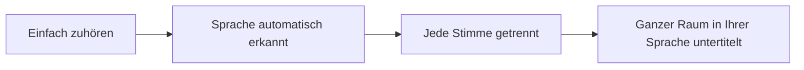
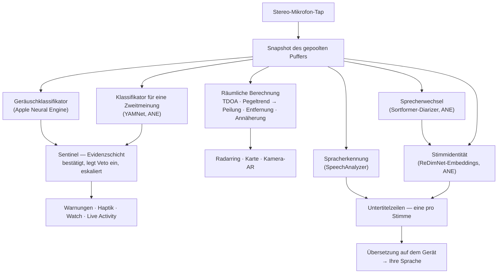
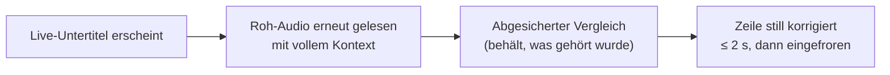
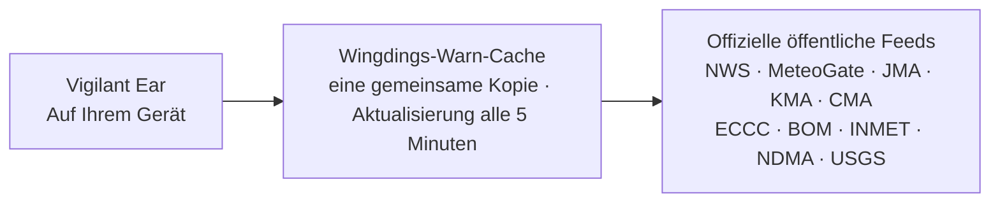

# Vigilant Ear 👂🛡️

*Gültig ab Version 1.1.9 · September 2026.*

## Ein akustisches Radar für Menschen, die nicht hören können.

Eine App, die eigens für die Gemeinschaft der Gehörlosen, Schwerhörigen und CODAs entwickelt wurde. Die meisten Apps zur Geräuscherkennung sagen Ihnen, *was* ein Geräusch ist. **Vigilant Ear sagt Ihnen, wo es ist, von wem es kommt und was gesagt wird** — und macht aus einem iPhone einen akustischen Echtzeit-Trikorder, der die Geräusche um Sie herum beschreibt.

Richtung und Entfernung einer Sirene. Ein Klopfen hinter Ihnen. Die Menschen in einem Gespräch, dargestellt als getrennte, transkribierte Stimmen — jede untertitelt und in ihrer Richtung verortet. Spricht jemand eine Sprache, die Sie nicht lesen, können die Worte **in Ihre Sprache übersetzt** bei Ihnen ankommen. Warnungen erreichen Ihren **Sperrbildschirm, die Dynamic Island und die Apple Watch**, sodass ein Blick genügt.

Alles, worauf es ankommt, läuft auf dem Gerät. Audio wird für die Erkennung weder aufgezeichnet noch hochgeladen. Nichts davon setzt voraus, dass Sie etwas hören.

- 🧭 **Richtung, nicht nur Erkennung.** *Was, wo, wer* und *was gesagt wurde* — nicht bloß „da war ein Geräusch“.
- 📣 **Name gerufen.** Tragen Sie Ihren Namen ein, den eines Kindes, einer Partnerin oder eines Partners — bei „Bestellung für Marie ist fertig“ tippt Ihnen die Watch ans Handgelenk und zeigt, aus welcher Richtung.
- 🔒 **Privat per Design.** Klassifizierung, Untertitelung und Übersetzung laufen auf Ihrem iPhone. Untertitel sind live und flüchtig; sie werden nicht als Transkriptarchiv gespeichert.
- ⌚ **Am Handgelenk und auf dem Sperrbildschirm.** Die Begleit-App mit Richtungsanzeige auf der Apple Watch + Live Activity halten die letzte Warnung und die Richtung, aus der sie kam, nur einen Blick entfernt.
- 🛰️ **Mehr Telefone, ein gemeinsames Ohr.** Constellation verbindet iPhones mit Ultra-Wideband und führt das, was jedes einzelne hört, zu einem schärferen Richtungsbild zusammen.
- 👁️ **Gemacht für Gehörlose / Schwerhörige / CODAs.** Unverwechselbare Haptik, kontrastreiche Darstellung, farbunabhängige Hinweise, große Tippflächen und durchgängige Berücksichtigung von „Bewegung reduzieren“.

---

## Für wen die App gedacht ist

- **Gehörlose, schwerhörige und CODA-Nutzerinnen und -Nutzer**, die wissen möchten, was um sie herum akustisch vor sich geht — Home Watch (Klopfen, Alarm, Baby, Telefon) und Street Watch (Sirene, Annäherung), die Sie eingeschaltet lassen und denen Sie vertrauen können.
- Alle, die **Live-Untertitel mit Richtung und Sprechertrennung** oder eine **Übersetzung auf dem Gerät** für Menschen in ihrer Nähe brauchen.
- Anwenderinnen und Anwender aus Barrierefreiheit und Akustikforschung, die sich für Schallortung auf dem Gerät interessieren.

> Vigilant Ear ist ein **Hilfsmittel** für Barrierefreiheit, kein zertifiziertes Gerät zum Schutz von Leib und Leben.

---

## Was die App kann

### 🧭 Die App sieht Geräusche — Richtung & Entfernung
Mit den beiden Mikrofonen des iPhones misst Vigilant Ear den **Winkel eines Geräuschs und ob es vor oder hinter Ihnen liegt**, hält diesen Messwert auf etwa ein Grad genau stabil und setzt ihn als Live-Markierung auf einen nach Ihrer Blickrichtung ausgerichteten Radarring und auf eine Karte. Zwei Mikrofone auf einer Linie können links und rechts allein nicht unterscheiden — ein Geräusch 50° rechts von Ihnen und eines 50° links von Ihnen kommen mit derselben winzigen Zeitdifferenz an —, deshalb zeichnet die App den Messwert und dazu ein **blasseres Geisterbild auf der anderen Seite**; eine Drehung des Handgelenks oder ein zweites Telefon schafft Klarheit. Die Entfernung wird aus der Lautstärke anhand einer auf der Straße kalibrierten Kurve geschätzt und als das angezeigt, was sie ist, nämlich als Schätzung: *≈ 50 ft*, mit einem wahrscheinlichen Bereich — in den Einheiten des Landes, in dem Sie sich befinden, nicht der Sprache, in der Sie die App lesen. Wenn Sie sich bewegen, behalten die Markierungen ihre Position in der realen Welt. Das ist der Kern: räumliche Wahrnehmung einer Welt, die Sie nicht hören können. (Zahlen weiter unten.)

### 🚨 Die App erkennt wichtige Geräusche — und warnt Sie
Ein Klassifikator auf dem Gerät erkennt Hunderte alltäglicher Geräusche und überwacht die kritischen Kategorien — **Sirenen, Alarme — einschließlich einer eigenen Klasse für Autoalarmanlagen —, Türklingeln/Klopfen, Babyweinen, eine Person in der Nähe und Unwetter.** Schlägt eine davon an, erhalten Sie eine klare Warnung auf dem Bildschirm, optional eine **Push-Benachrichtigung** und eine unverwechselbare **Haptik** — auch wenn die App im Hintergrund läuft oder das Telefon im Standby ist. Kritische Kategorien sind standardmäßig aktiv, damit das Einschalten von Benachrichtigungen nicht „alles aus“ bedeutet. Schalten Sie alle Warnkategorien aus, geht die Engine im Hintergrund vollständig in den Ruhezustand, um Akku zu sparen. Eine **Sentinel**-Schicht gleicht Warnungen mit unabhängigen Belegen ab — Richtung, Bewegung und öffentliche Feeds —, sodass das, was auslöst, bestätigt ist und nicht die einsame Vermutung eines Klassifikators. Das wirkt in beide Richtungen: Ein sirenenähnlicher Moment in einem Song wird zurückgehalten, aber eine echte Sirene, die sich durch Ihre Musik hindurch wiederholt, dringt durch und löst eine Warnung aus.

Unwetterwarnungen stammen aus offiziellen öffentlichen Feeds — **NWS** (USA), **MeteoGate** (Europa), **China CMA**, **Korea KMA**, **Japan JMA**, **Kanada ECCC**, **Australien BOM**, **Brasilien INMET** und **Indien NDMA** — kostenlos für alle Nutzerinnen und Nutzer. Es werden nur die Feeds genutzt, die Ihren Standort abdecken. In Japan liest die App außerdem die **Vorab-Bulletins** der JMA — allgemein verständliche Hinweise, die Tage vor einem Taifun oder Starkregen herausgegeben werden, nicht nur die Warnungen, die kommen, wenn die Gefahr schon da ist — sowie die Bulletins zu Platzregen und Erdrutschen. Vorab-Hinweise erscheinen dezent, ohne den Ton und die Vibration, die einer echten Warnung vorbehalten sind.

### ⌚ Apple Watch + Live Activity — ein Blick, und Sie wissen Bescheid
- **Begleit-App für die Apple Watch** — die Richtung einer Warnung wird an Ihrem Handgelenk angezeigt, sodass Ihnen ein Blick sagt, wohin Sie schauen müssen. Neu gestaltete Watch-Oberfläche mit dem Ohr-Symbol der App, Threat-HUD-Layout und Doppeltippen zum Schließen einer Warnung. Warnungen können den Richtungspfeil auch dann anzeigen, wenn die Watch-App nicht geöffnet ist.
- **Live Activity** — Vigilant Ear bleibt auf Ihrem **Sperrbildschirm**, in der **Dynamic Island** und im **Smart Stack der Watch**, sodass die letzte Warnung und ihre Peilung immer nur einen Blick entfernt sind.
- **Partnerwarnungen am Handgelenk** — schlägt das Telefon eines verbundenen Constellation-Partners Alarm, kann die Warnung auch Ihre Watch erreichen, Richtung inklusive. Eine Überarbeitung für mehr Zuverlässigkeit sorgt dafür, dass die Begleit-App den ganzen Tag schonend mit dem Akku der Watch umgeht.

### 💬 Speaker Mode — Live-Untertitel mit Richtung *(kostenlos)*
Schalten Sie **Speaker Mode** ein, und Vigilant Ear transkribiert, was Menschen in Ihrer Nähe sagen, in **Untertitelblöcke, einen pro Stimme.** Sprecherdiarisierung auf dem Gerät hält die Stimmen auseinander — *wer* sagt *was* — mit einem Richtungshinweis auf dem inneren Ring. Die gerade sprechende Person wird hervorgehoben; älterer Text scrollt weg, sobald Platz gebraucht wird.

Zwei Dinge, die die meisten Untertitel-Apps nicht tun: **ehrliche Angaben zur Zuverlässigkeit** — eine dezente Qualitätsmarkierung pro Zeile und gepunktete Unterstreichungen unter unsicheren Wörtern zeigen Ihnen, wann Sie einer Zeile trauen können und wann Sie besser nachprüfen — und **Selbstkorrektur**: Direkt nachdem ein Satz erschienen ist, liest die App das Audio mit vollem Kontext erneut und kann innerhalb von ein, zwei Sekunden ein verpasstes oder falsch verstandenes Wort wiederherstellen; danach friert der Text ein.

**Name gerufen** (in den Einstellungen; aus, bis Sie es einschalten) achtet in diesen Untertiteln auf Namen, die Sie eintragen — Ihren eigenen, den eines Kindes, den Ihrer Partnerin oder Ihres Partners. Sagt jemand „Bestellung für Marie ist fertig“, erhalten Sie eine unverwechselbare Haptik und eine Warnung auf der Watch mit Richtung statt einer weiteren Untertitelblase. Die Worte erscheinen im Speaker Mode weiterhin als Gesprochenes; dies ist das Antippen, das Ihnen sagt, dass *mit Ihnen* gesprochen wurde.

**Schimpfwörter lassen sich maskieren** (Einstellungen → Untertitel). Andernfalls kommen Kraftausdrücke als reiner Text an, durch nichts abgemildert, und wer liest, hat keine Chance, vorher wegzusehen; schalten Sie dies ein, und diese Wörter werden durch Symbole ersetzt, sodass sich der Satz auch ohne das Wort lesen lässt. Was dazu zählt, entscheidet die Spracherkennung Ihres Geräts selbst — keine Wortliste von uns —, daher richtet sie sich nach der Sprache, die gerade transkribiert wird. Bei einem Konto, für das ein Alter unter 18 angegeben ist, ist die Funktion immer aktiv und zeigt ein Schloss. Sie gilt für Sprache, die *dieses* Gerät transkribiert; Text, der von einem gekoppelten Telefon weitergeleitet wird, wurde dort transkribiert und kommt als fertiger Text an.

**Das Wort, auf das jemand Nachdruck legt, wird fett gesetzt.** Laut ausgesprochen sind „Ich habe DAS nicht gesagt“ und „Ich habe das nicht gesagt“ zwei verschiedene Sätze, und ein identisches Transkript verliert den Unterschied vollständig. Die App achtet auf das eine Wort, bei dem die Stimme in der Tonhöhe nach oben ging, und setzt es fett — höchstens eines pro Zeile und gar keines, wenn sie sich nicht sicher ist, denn das falsche Wort zu markieren hieße, jemandem Worte in den Mund zu legen. Im Chinesischen und Japanischen ist das ausgeschaltet, denn dort sagt die Tonhöhe, *um welches Wort es sich handelt*, und nicht, wie stark es betont wurde.

Untertitel sind kostenlos; die automatische Übersetzung ist die optionale Power Pack+-Ebene. Untertitel können außerdem **laut an Ihre Bluetooth-Hörgeräte ausgegeben werden** — kostenlos, in den Einstellungen. **Richtungstöne** (ebenfalls kostenlos, unter Einstellungen → Untertitel) ergänzen optional einen akustischen Hinweis im Ohr Ihrer Wahl, der signalisiert, wo sich eine sprechende Person befindet — nützlich mit Hörgerät oder bei einseitigem Hören, und für alle verfügbar.

### 🌐 Auto-Übersetzen — Ihre Sprache, live *(Power Pack+)*
Bei eingeschaltetem Speaker Mode kann Vigilant Ear erkennen, wenn eine Person in Ihrer Nähe eine andere Sprache spricht, und ihre Untertitel **in Ihrer Sprache** anzeigen; die Ausgangssprache steht auf ihrem Block. Die Kette — hören → Sprecher trennen → transkribieren → übersetzen → anzeigen — läuft **auf dem Gerät**; der einzige Moment mit Netzwerk ist ein einmaliger Download eines Sprachpakets von Apple, und wenn Sie gerade auf diesen Download warten, sagt die App Ihnen das, statt Sie auf unübersetzten Text blicken zu lassen. Sie müssen die andere Sprache weder kennen noch vorher auswählen.

Von allem, was heute erhältlich ist, kommt dies dem **Universalübersetzer der Science-Fiction** am nächsten — dem Gerät, das einfach versteht. Vigilant Ear erkennt die Sprache selbstständig, folgt jeder sprechenden Person im Raum und untertitelt alle in Ihrer Sprache — ohne Ohrhörer, ohne Einrichtung, auf Ihrem Gerät.

```mermaid
graph LR
    A["Einfach zuhören"] --> B["Sprache automatisch erkannt"] --> C["Jede Stimme getrennt"] --> D["Ganzer Raum in Ihrer Sprache untertitelt"]
```

### 🎵 Musik & Rundfunk im Blick *(Power Pack+)*
**ShazamKit** erkennt Musik, die um Sie herum läuft, und verfolgt Songwechsel.

### 🎛️ Acoustic Scope — Klang sehen wie ein Toningenieur
Eine professionelle Live-Ansicht des Klangs um Sie herum: Spektrum, Spektrogramm, ⅓-Oktav-RTA-Bänder, Chroma und harmonische Teiltöne — **für alle kostenlos**. **Die Teiltöne-Ansicht liest Musik:** Jeder Ton wird mit seiner Note benannt, seine Obertonreihe steht daneben, höhere Klänge wie Rauchmelder werden mit ihrer tatsächlichen Tonhöhe benannt, und Sie können eine Zielnote festlegen, die als Linie eingezeichnet wird, nach der Sie singen oder stimmen können. Es bleibt kühl — das Spektrogramm geöffnet zu lassen, kostet so gut wie nichts, egal wie lange Sie zusehen. Die Werkzeuge, mit denen Sie Klänge für das Training Ihrer eigenen Soundpakete aufnehmen, gehören zu Power Pack+.

### 📦 Eigene Soundpakete — bringen Sie der App Ihre Welt bei *(Power Pack+)*
Bringen Sie Vigilant Ear die Geräusche bei, die Ihnen wichtig sind — von den Vögeln in Ihrer Gegend bis zum Türgong Ihres Hauses. Zusatzpakete setzen auf der eingebauten Erkennung auf, sodass neue Geräusche Sirenen und Alarme nie verdrängen. Eine Schritt-für-Schritt-Anleitung ist in die App eingebaut.

### 🛰️ Constellation — viele iPhones, ein gemeinsames Ohr *(Power Pack+)*
Bei zwei oder mehr Ultra-Wideband-fähigen iPhones (die meisten seit dem iPhone 11) koppelt **Constellation** die Geräte so, dass sie die Position der jeweils anderen erfassen und das, was jedes einzelne hört, zu einem einzigen, genaueren Bild davon zusammenführen, woher ein Geräusch kommt — ein verteiltes, passives Hör-Array. Auch Untertitel werden zusammengeführt: Jedes Telefon transkribiert, was sein eigenes Mikrofon hört, und die Wörter werden über die Telefone hinweg abgeglichen, sodass das Telefon, das einer sprechenden Person am nächsten ist, beisteuert, was es gehört hat — Wörter, die nur ein Telefon erfasst hat, bleiben erhalten, statt verloren zu gehen. Die Telefone verbinden sich **direkt miteinander** — kein Router, kein gemeinsames WLAN und kein Internet; WLAN muss lediglich eingeschaltet sein, über dieselbe Peer-to-Peer-Verbindung, die auch AirDrop nutzt. Nur für Geräte mit der passenden Hardware verfügbar. Mesh-Untertitel, die älter sind als der Verbindungszeitpunkt eines Peers, werden nicht erneut übertragen.

**Partnernachrichten** — senden Sie einen kurzen Text an ein verbundenes Partnertelefon; er landet dort im Untertitel-Feed und kann, auf dem Gerät übersetzt, in der Sprache der empfangenden Person ankommen. Die Nachrichtenfunktion berücksichtigt das Alter: Auf Grundlage von Apples Declared Age Range bleibt das Schreiben zwischen einer erwachsenen und einer minderjährigen Person ausgeschaltet, es sei denn, beide haben einander bewusst benannt. Warnungen und Untertitel werden nie eingeschränkt — nur Textnachrichten von Person zu Person.

### 🔗 Remote Link — jemanden erreichen, der nicht bei Ihnen ist *(Starten erfordert Power Pack+)*
Was sonst ein Telefonanruf leisten würde, erledigen hier Video und Text. Sie senden einen Einladungscode; die andere Person tritt direkt in Vigilant Ear bei, **ohne Power Pack+ zu besitzen**. Anders als bei Constellation müssen Sie nicht in der Nähe sein — Sie beide können sich überall befinden.

**Zu keinem Zeitpunkt wird Audio verwendet.** Nur Video und Text, sodass an keinem der beiden Enden etwas an der Verbindung vom Hören abhängt — und Sie erhalten eine Möglichkeit, über die App mit jemandem zu gebärden. Die App selbst versteht keine Gebärdensprache; sie überträgt das Video, und den Rest machen Sie beide. Die Verbindung läuft direkt zwischen den beiden Telefonen, wo immer das Netz es zulässt, und die App zeigt Ihnen klar den Status **Direkt** oder **Relayed** an, sodass Sie immer wissen, ob Ihr Video über ein Relay läuft.

**Auch Untertitel werden übertragen.** Was jedes Telefon transkribiert, erscheint auf dem anderen — bei Bedarf übersetzt in die Sprache der lesenden Person. Jede Seite kann die Verbindung — Video und Untertitel — pausieren und fortsetzen und vom Hauptbildschirm aus auflegen.

### 📷 Kamera-AR — „das Geräusch sehen“
Öffnen Sie die Kamera-Pille in der Titelleiste und heften Sie erkannte Geräusche in der Live-Kameraansicht an ihrer tatsächlichen Peilung an. Markierungen werden nach sprechender Person oder nach Geräuschkategorie und Richtung gruppiert, damit die Ansicht lesbar bleibt; Quellen verblassen mit der Zeit, wenn sie verstummen.

### 🗺️ Karten, Straßen & Wegvorhersage
Die Peilungen von Geräuschen werden auf echte GPS-Koordinaten auf der Karte projiziert. Fahrzeuggeräusche können **auf nahe gelegene Straßen eingerastet** und ihre Wege vorhergesagt werden, sodass ein vorbeifahrender Lkw als Bewegung *entlang der Straße* erscheint statt durch Gebäude hindurch. (Probieren Sie die Feuerwehrauto-Demo aus.)

### 🪄 Feature Playground — der Beweis, ganz ohne Ohren
Der **Feature Playground** steht allen offen: Übungen für Zuhause & Straße (Klopfen, Alarm, Baby, Sirene, Wetter), Demos mit mehreren Telefonen und mit Gesprächen sowie ein deutliches Wasserzeichen, damit sich eine Übung nie als echtes Ereignis ausgibt. Beim Schließen des Panels werden Demos sauber abgebaut (kein hängengebliebenes GPS-Spoofing, keine übrig gebliebenen Flags).

### ♿ Barrierefreiheit an erster Stelle
Gebaut für gehörlose / schwerhörige / CODA- und farbenblinde Nutzerinnen und Nutzer: **farbunabhängige** Hinweise, Tippflächen von **≥44 pt**, Berücksichtigung der Einstellung **Bewegung reduzieren**, **Rechts-nach-links-Layouts** für arabischsprachige Leserinnen und Leser, multimodale Warnungen (Haptik + Bild + Watch) und ein Prüfbildschirm beim Start, der den Status der Berechtigungen mit klaren Zuständen in Grün / Grau / Rot (und gebranntem Orange für „nicht erlaubt“) anzeigt — einschließlich der Freigabe für Benachrichtigungen, die als Hauptschalter für Warnungen dient.

---

## Kostenlos & Power Pack+

Der Sicherheitskern ist **kostenlos, für immer**:

- **Home Watch & Street Watch** — lokale Geräuschwarnungen (Alarme, Sirenen, Klopfen/Türklingeln, Baby, Person in der Nähe) mit Zustellung auf dem Bildschirm, per Haptik und optional per Push.
- **Live-Untertitel** — Speaker Mode, auf dem Gerät, mit Richtung, wo die Hardware es erlaubt, mit ehrlichen Zuverlässigkeitsmarkierungen, Selbstkorrektur in ~2 Sekunden, optionaler Sprachausgabe an Bluetooth-Hörgeräte und Richtungstönen.
- **Name gerufen** — optionale Namen, die Sie eintippen (Ihr eigener, der Ihrer Kinder, der Ihrer Partnerin oder Ihres Partners). Ein Treffer ist eine Warnung auf Watch/Telefon mit Peilung, kein zweiter Untertitel.
- **Standing Watch** — der Zustand des Raums selbst, immer aktiv, ohne dass Sie etwas einstellen müssen: eine gleichmäßig leuchtende Lampe in Cyan, solange der Raum sein Muster beibehält, Bernsteingelb, sobald sich etwas ändert — eine neue Stimme, plötzliche Stille oder etwas, das sich nähert.
- **Unwetterwarnungen** — NWS, MeteoGate (Europa — frisch aus unserem 5-Minuten-Warn-Cache), CMA, KMA, JMA (Japan), ECCC (Kanada), BOM (Australien), INMET (Brasilien) und NDMA (Indien) für Ihre Region.
- **Erdbebenmeldungen (USGS, weltweit)** — wird in Ihrer Nähe ein Beben gemeldet, spüren Sie eine Vibration und sehen auf Ihrer Karte das Gebiet, in dem es zu spüren war. Eine Bestätigung aus dem offiziellen USGS-Feed — keine Frühwarnung: Wenn Sie Erschütterungen gespürt haben, sagt Ihnen dies, was es war. Die Erkennung von tiefem Grollen (Infraschall) auf dem Gerät kann die Prüfung in dem Moment scharf schalten, in dem sich der Boden bewegt.
- **Feature Playground** — Übungswarnungen und Funktionsvorschauen mit deutlichem VORSCHAU-Wasserzeichen.
- **Begleit-App für die Apple Watch & Live Activity** — Richtung und letzte Warnung auf einen Blick.
- **Acoustic Scope** — Live-Klangvisualisierung auf Profiniveau, für alle kostenlos. (Die Aufnahmewerkzeuge für das Training gehören zu Power Pack+.)

**Power Pack+** ist eine einmalige Freischaltung (**kein Abonnement**) mit einer **kostenlosen 90-Tage-Testphase**. Es ergänzt die Superkräfte:

- **Auto-Übersetzen** — Übersetzung von Sprache in Ihrer Nähe in Ihre Sprache, auf dem Gerät.
- **Constellation** — gemeinsames Hören mehrerer iPhones über Ultra-Wideband, mit Partnernachrichten.
- **Music ID** — Songerkennung mit ShazamKit.
- **Eigene Soundpakete** — Zusatzklassifikatoren, die Sie für Ihre eigenen Geräusche trainieren.

Ob kostenlos oder Power Pack+: **Ihr Audio bleibt für die Erkennung auf dem Gerät** — die Stufe ändert nur, welche Funktionen freigeschaltet sind, niemals, wohin Roh-Audio zur Analyse gesendet wird.

---

## So funktioniert es (unter der Haube)

Vigilant Ear ist eine in Schichten aufgebaute Pipeline, **local-first und auf dem Gerät**: einmal erfassen, dann lesen unabhängige Spezialisten denselben Klang und prüfen gegenseitig ihre Arbeit. Roh-Audio wird über einen Tap mit hoher Priorität erfasst, in eine **Free-List gepoolter Puffer** kopiert (kein Allokations-Thrashing auf dem Echtzeitpfad) und verteilt, ohne die Oberfläche ins Stocken zu bringen:

```mermaid
graph TD
    A["Stereo-Mikrofon-Tap"] --> B["Snapshot des gepoolten Puffers"]
    B --> C["Geräuschklassifikator<br/>(Apple Neural Engine)"]
    B --> Y["Klassifikator für eine Zweitmeinung<br/>(YAMNet, ANE)"]
    C --> S["Sentinel — Evidenzschicht<br/>bestätigt, legt Veto ein, eskaliert"]
    Y --> S
    S --> H["Warnungen · Haptik · Watch · Live Activity"]
    B --> D["Räumliche Berechnung<br/>TDOA · Pegeltrend → Peilung · Entfernung · Annäherung"]
    D --> R["Radarring · Karte · Kamera-AR"]
    B --> F["Spracherkennung<br/>(SpeechAnalyzer)"]
    B --> N["Sprecherwechsel<br/>(Sortformer-Diarizer, ANE)"]
    N --> E["Stimmidentität<br/>(ReDimNet-Embeddings, ANE)"]
    B --> E
    F --> G["Untertitelzeilen — eine pro Stimme"]
    E --> G
    G --> T["Übersetzung auf dem Gerät<br/>→ Ihre Sprache"]
```

Keinem einzelnen Modell wird allein vertraut. Die **Sentinel**-Schicht sitzt zwischen Erkennung und Warnung: Unabhängige Engines bestätigen einander Frame für Frame oder legen ihr Veto ein — und wenn sich wiederholt reale Belege gegen ein Veto häufen (eine echte Sirene, die durch Ihre Musik hindurch heult), gewinnen die Belege, und die Warnung wird ausgelöst.

Untertitel bekommen ihre eigene zweite Chance. Jeder abgeschlossene Satz wird im Stillen mit vollem Kontext erneut aus einem kurzen Audio-Ringpuffer im Arbeitsspeicher gelesen — Korrekturen erscheinen innerhalb von etwa zwei Sekunden, danach friert der Text endgültig ein:

```mermaid
graph LR
    L["Live-Untertitel erscheint"] --> K["Roh-Audio erneut gelesen<br/>mit vollem Kontext"] --> V["Abgesicherter Vergleich<br/>(behält, was gehört wurde)"] --> W["Zeile still korrigiert<br/>≤ 2 s, dann eingefroren"]
```

- **Räumliche Berechnung** — FFTs, kohärenzgewichtete Time Difference of Arrival (TDOA — die Frequenzbänder bevorzugen, bei denen sich beide Mikrofone einig sind, und dann die winzige Ankunftsverzögerung in eine Peilung umrechnen) sowie Annäherungsverfolgung über den Pegeltrend in Hintergrundaufgaben. Das Mikrofonpaar wird in einer festen Ausrichtung gelesen, sodass die Richtung gleich funktioniert, ob Sie das Telefon hochkant oder quer halten.
- **Sprache** — iOS 26 `SpeechAnalyzer` / `SpeechTranscriber` für die Transkription; Apples **Translation**-Framework für die Übersetzung auf dem Gerät. Die Stimmidentität beruht auf Belegen: Eine Stimme wird nur anhand unabhängiger Klangfenster als echte Person bestätigt, und eine unsichere Zuordnung erscheint ohne Namen, statt den falschen Namen zu raten.
- **Zwei Modelle für zwei Fragen** — um Stimmen auseinanderzuhalten, muss man wissen, *wann die sprechende Person gewechselt hat* und *wer diese Person ist*, und das ist nicht dasselbe Problem. Ein **Sortformer**-Streaming-Diarizer markiert die Grenzen der Redebeiträge; **ReDimNet**-Embeddings entscheiden, wessen Stimme in jedem davon steckt. Genau an der Grenze zu schneiden ist wichtiger, als es klingt: Ein Fenster, das zwei Personen überspannt, enthält beide, und kein Embedding-Modell kann das hinterher rückgängig machen. Unter beiden liegt eine Sprachaktivitätserkennung als unterste Ebene — verstummt der Diarizer in einem schwierigen Raum, statt zu raten, werden Redebeiträge trotzdem geschnitten, sodass die App an Qualität verliert, statt zwei Sprecher zu einem zu verschmelzen.
- **Musik-Wahrheit** — ein Chroma-basierter **Song-Signatur-Detektor** trifft die Entscheidung „läuft wirklich Musik?“, weil allgemeine Klassifikatoren bekanntermaßen stille Räume und Sirenen als „Musik“ einstufen. Shazam läuft erst, wenn die Signatur bestätigt, dass tatsächlich etwas Musikalisches da ist.
- **Nebenläufigkeit** — die Isolation von Swift 6 hält Mikrofon-Tap, akustische Berechnung und die Render-Schleife der Oberfläche sauber getrennt.
- **Effizienz** — Downsampling, lastabhängige Klassifizierung und eine an Belege gebundene Netzwerknutzung halten das ständige Zuhören so leicht, dass Sie es eingeschaltet lassen können.

Wetter- und Erdbebenmeldungen gehen den umgekehrten Weg wie Audio — von Ihrem Audio geht nie etwas hinaus, aber Warn-*Daten* kommen herein. **Jeder** offizielle Feed läuft über einen kleinen Cache, den wir betreiben, sodass ein einziger Abruf der öffentlichen Daten alle Nutzerinnen und Nutzer bedient — und Ihr Telefon kontaktiert nie die Server einer ausländischen Regierung:

```mermaid
graph LR
    P1["Vigilant Ear<br/>Auf Ihrem Gerät"] --> W["Wingdings-Warn-Cache<br/>eine gemeinsame Kopie · Aktualisierung alle 5 Minuten"]
    W --> N["Offizielle öffentliche Feeds<br/>NWS · MeteoGate · JMA · KMA · CMA<br/>ECCC · BOM · INMET · NDMA · USGS"]
```

---

## Was Ihr Telefon hören kann — gemessen

Ihr iPhone hat zwei Mikrofone im Abstand von etwa sechs Zoll, ein Barometer und eine sehr gute Uhr. Das reicht, um Ihnen zu sagen, in welcher Richtung ein Geräusch liegt, ungefähr wie weit es entfernt ist, ob es auf Sie zukommt und ob sich gerade eine Tür geöffnet hat. Hier steht, wie genau jede dieser Angaben ist, wie wir das geprüft haben und warum es wichtig ist, wenn Sie das Geräusch selbst nicht hören können. Richtung und verwandte Werte wurden im September 2026 auf einem iPhone 17 und einem iPhone 16 Pro Max gemessen. Die Entfernung bleibt ihrer Natur nach eine Schätzung — das sagen wir auch auf dem Bildschirm.

**Richtung — auf ein paar Grad genau.** Ein Geräusch erreicht das obere Mikrofon vor dem unteren oder danach, und aus diesem Zeitabstand berechnet die App, wie weit das Geräusch neben der Achse des Telefons liegt und ob es vorn oder hinten ist. Die beiden Kanäle des Telefons sind keine einfachen Mikrofone, sondern ein bearbeitetes Stereobild, und dieses Bild fügt immer dann ein eigenes, festes Muster hinzu, wenn es in einem Raum laut ist. Die App lernt dieses Muster jetzt in ein paar ruhigen Sekunden nach dem Start und rechnet es heraus, bevor sie die Richtung abliest.

| Was wir gemessen haben | Ergebnis |
|---|---|
| Medianfehler über 96 simulierte Räume, vom ruhigen Büro bis zum Raum mit harten Wänden bei 5 dB SNR | 1,0° |
| iPhone 17 auf einem Schreibtisch, Raumgeräusch an, Lautsprecher 30° neben der Achse | 61,7° von der Seitenebene abgelesen, erwartet 60°, Schwankung 1,6° |
| Ebenso, Lautsprecher genau seitlich vom Telefon | 4,5° abgelesen, erwartet 0°, Schwankung 2,2° |
| Ebenso, Lautsprecher direkt voraus | jede Ablesung bei der maximalen Verzögerung, wie es sein soll |
| Ablesungen, die auf dem Eigenmuster des Stereobilds statt auf dem Geräusch landen | keine, bei keinem Winkel |

*Warum das wichtig ist:* Wenn Sie eine Sirene nicht hören können, sagt Ihnen „hinter Ihnen, seitlich versetzt“, wohin Sie schauen sollen. Einer Anzeige, die stillhält, darf man erst trauen, wenn sie mit dem Maßband überprüft wurde — und diese wurde es, zweimal, das zweite Mal, nachdem sich die erste Prüfung als zu wohlwollend herausgestellt hatte.

**Entfernung — angezeigt als das, was sie ist: eine Schätzung.** Ein Mikrofon kann keine Entfernung messen, nur Lautstärke, und ein lauter Lkw in der Ferne kann klingen wie ein leises Auto aus der Nähe. Die App schätzt die Entfernung aus der Lautstärke mithilfe einer Kurve, die an einer echten Straße angepasst wurde, und sagt es dann so, wie es ein sorgfältiger Mensch tun würde: *etwa 50 ft, wahrscheinlich zwischen 25 und 100.*

| Was wir gemessen haben | Ergebnis |
|---|---|
| Echte Autoerkennungen, erneut durch die Kalibrierung abgespielt | 1.131 |
| Verortet innerhalb der 100-Fuß-Straße, auf der sie tatsächlich fuhren | 73 % |
| Autos auf der fernen Spur | geschätzt 78 und 87 ft, laut Maßband 73 und 85 ft |

Die Straße (eine Kreuzung in der Stadt) wurde Spur für Spur vermessen; wenn die Kurve danebenliegt, dann auf der nahen Seite. Die Kalibrierung ist durch einen automatisierten Test festgeschrieben, damit sie nicht unbemerkt abdriften kann. Alarme in Ihren eigenen Räumen, etwa ein Rauchmelder, bekommen überhaupt keine Entfernungsangabe — sie sind bereits mit Ihnen im Raum.

**Bewegung — auf Sie zu.** Bei Autos und Sirenen bedeutet lauter werden meist näher kommen. Die App beobachtet, wie schnell der Pegel eines Geräuschs über einige Sekunden steigt: Ein anhaltender Anstieg von etwa 1,5 dB pro Sekunde (eine deutliche, gleichmäßige Zunahme der Lautstärke) bedeutet Annäherung, ein entsprechender Abfall bedeutet, dass es sich entfernt, und ein Geräusch, das sich nicht mehr ändert, gilt nach etwa vier Sekunden als keines von beiden. Ein einzelner lauter Moment — ein kurzes Hupen, eine zugeschlagene Tür — kann das nicht auslösen. Gebaut auf Physik und neun automatisierten Tests; eine aufgezeichnete Vorbeifahrt auf der Straße ist die nächste Bestätigung im Feld.

**Die Luft im Raum — eine Tür hat eine Signatur.** Das Barometer kann bemerken, wenn sich etwa vierzehn Fuß entfernt eine Tür öffnet: Der Druck sinkt, während die Tür aufschwingt, und steigt wieder an, wenn sie sich schließt. Über vierzehn Stunden Ruhe und fünfzehn Türereignisse hinweg erzeugte jede Tür diese zweiteilige Form, und nichts anderes im Haus tat das.

| Ereignis | Druckänderungsrate | Form |
|---|---|---|
| Haustür, geöffnet und geschlossen, ×10 | 0,6–1,8 Pa/s | Abfall, dann Wiederanstieg, ~5 s auseinander |
| Haustür, zugeknallt, ×5 | 1,1–2,5 Pa/s | dasselbe Paar, höher |
| Klimaanlage, die über Nacht an- und ausgeht, ×8 | 0,11–0,46 Pa/s | langsame Rampe über Minuten, auf beiden Telefonen identisch |
| Ein ruhiger Raum | ~0,02 Pa/s | nichts |
| Vorbeigehen, Niesen | — | der Bewegungssensor bemerkt es, und das Telefon ignoriert es |

Eine Fliegengittertür, die den Raum nicht abdichtet, blieb unsichtbar — genau wie es sein soll. Heute kann eine Druckänderung auf der Karte als tiefes Grollen erscheinen; eine eigene Türwarnung für ruhige Nächte ist gemessen und entworfen und ist noch nicht die alltägliche Standardeinstellung.

**Constellation — zwei Telefone klären die Seite.** Jedes Telefon im Mesh zieht von seinem Standort aus eine Linie zum Geräusch, und die Linien kreuzen sich nur auf einer Seite sauber. Wenn sie das tun, verschwindet das Geisterbild, und die App kann wieder links oder rechts sagen. In der Simulation verorten zwei Telefone, die **40 Meter voneinander entfernt** sind, eine 50 Meter entfernte Sirene auf etwa 2 Meter genau.

**Wie hier etwas Glauben findet.** Jede Zahl hat dieselben drei Prüfstufen durchlaufen, der Reihe nach: einen simulierten Raum, dessen Antwort vorab bekannt ist; kleine automatisierte Tests, die genau den Fall nachstellen, der die App täuschen würde, und bei jeder Änderung laufen; dann die echten Telefone auf einem echten Schreibtisch, mit von Hand gemessenen Abständen. Nichts gilt als genau, bevor es die dritte übersteht. Für jemanden, der das Geräusch nicht hören kann, ist das Wort der App das einzige Wort — es sollte so verdient sein, wie ein Labor sein Wort verdient.

Ausführlichere Notizen für Ingenieurinnen und Ingenieure: [Physik](https://vigilantear.com/en/physics/) — TDOA, Entfernung, Bewegung, Constellation und barometrische Erkennung, jede Zahl gekennzeichnet als MEASURED / BENCHED / MODELLED.

---

## Datenschutz

- **Auf dem Gerät, immer für die Kern-Pipeline.** Klassifizierung, räumliche Berechnung, Transkription, Diarisierung und Übersetzung laufen auf Ihrem iPhone. Roh-Audio wird für die Erkennung weder aufgezeichnet noch hochgeladen.
- **Untertitel sind flüchtig.** Live-Untertitel bleiben für die Dauer der Sitzung im Arbeitsspeicher; exportierte Debug-Protokolle enthalten keinen Untertiteltext.
- **Keine SDKs für Werbung oder Verhaltensanalyse.** Das Netzwerk wird nur begrenzt genutzt: für Karten, öffentliche Wetter-Feeds, optionale Shazam-Fingerabdrücke, Straßenkontext und App-Store-Käufe — siehe die vollständige Datenschutzerklärung.

Alle Details: [Datenschutzerklärung](/de/privacy/) · [Nutzungsbedingungen](/de/terms/) · [Support](/de/support/)

---

## Hardware & Plattformen

- **iPhone (voller Funktionsumfang).** Funktioniert im Hoch- oder Querformat — halten Sie es, wie Sie möchten. Für die Richtungsbestimmung sind Stereomikrofone erforderlich. Empfohlen: **iPhone 13 oder neuer**.
- **Apple Watch.** Begleitende Warnungen mit Richtungspfeil; funktioniert mit Live Activity / Smart Stack.
- **iPad (nativ).** Adaptives Layout: Auf dem großen Bildschirm bekommen Live-Untertitel ein durchsichtiges Panel neben der Karte, das sich einklappt, wenn niemand spricht. Einkanal-Mikrofone → Untertitel ohne vollständige Richtung.
- **Constellation** benötigt **Ultra-Wideband** — iPhone 11 oder neuer, ausgenommen SE- und „e“-Modelle. Ein WLAN-Netz braucht es **nicht**: Bei eingeschaltetem WLAN finden sich die Telefone direkt, sodass Constellation ohne Router und ohne Internet funktioniert, solange die Telefone nahe beieinander sind.
- **Android.** Separater Build mit Kern-Radar, Warnungen, Untertiteln und Wetter; beim Constellation-Mesh hat iOS Vorrang. Verfolgen Sie die Updates auf der Produktwebsite, während die Android-Parität wächst.

---

## Lokalisierung

Vollständig lokalisiert — Oberfläche, Warnungen und Untertitel — in **Englisch, Spanisch, Portugiesisch (Brasilien), Französisch, Deutsch, Italienisch, Türkisch, Arabisch, Japanisch, vereinfachtes Chinesisch, traditionelles Chinesisch, Koreanisch, Russisch, Hindi und Rumänisch** (15 Sprachen). Richtet sich nach der Systemsprache oder einer manuellen Auswahl in der App. Rumänische Untertitel funktionieren auf dem Gerät; Apple Translate bietet kein Rumänisch, daher zeigt Auto-Übersetzen für diese Sprache das Original.

---

## Status & Haftungsausschluss

Vigilant Ear ist ein **experimentelles akustisches Hilfsmittel für Barrierefreiheit**, kein zertifiziertes Werkzeug zum Schutz von Leib und Leben. Die Auflösung der Schallortung variiert je nach Umgebung, Wetter, Wind und Mikrofonhardware. **Bewahren Sie stets Ihre gewohnte Aufmerksamkeit für Ihre Umgebung** — verlassen Sie sich nicht auf die App als Ihre einzige Quelle für Sicherheitsinformationen.

Einige Funktionen (Kamera-AR-Markierungen, das Upgrade auf die Critical-Alerts-Berechtigung, sobald Apple sie erteilt, fortgeschrittenes Sound-Authoring mit mehreren Paketen) entwickeln sich weiter; die kostenlose Home-/Street-Watch und die Live-Untertitel sind das Produkt, dem Sie vom ersten Tag an vertrauen können.

---

**Kontakt:** [vigilantear@wingdingssocial.com](mailto:vigilantear@wingdingssocial.com)

Mit ❤️ gemacht für die Gemeinschaft der Gehörlosen und Schwerhörigen und für die Akustikforschung.

    
  <strong>© 2026 Wingdings, Inc.</strong> 
  Alle Rechte vorbehalten. 
  Patent angemeldet

