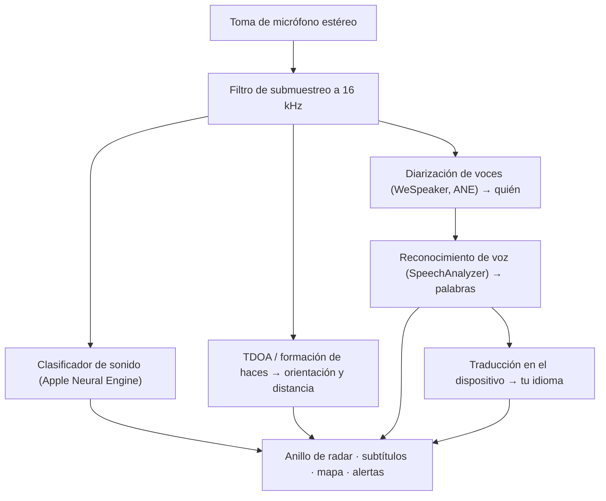

# VigilantEar 👂🛡️ (Edición Apple)

*Un radar acústico para quienes no pueden oír.*

¡Una app creada específicamente para la comunidad Sorda y con dificultades auditivas! La mayoría de las apps de reconocimiento de sonido te dicen *qué* es un sonido. **VigilantEar te dice dónde está, quién lo produce y qué está diciendo** — convirtiendo un iPhone en un tricorder sónico en tiempo real que describe visualmente el sonido a tu alrededor.

La dirección y la distancia de una sirena. Un golpe en la puerta a tus espaldas. Las personas en una conversación, representadas como voces transcritas por separado — cada una subtitulada y ubicada direccionalmente según quien habla. Si alguien habla un idioma que no lees, sus palabras te llegan **traducidas al tuyo.**

Todo se ejecuta en el dispositivo. Nada se graba, se almacena en caché ni se envía a ningún lugar.

---

## Para quién es

- **Personas Sordas y con dificultades auditivas** que buscan conciencia situacional del sonido — no solo "ocurrió un sonido", sino *qué, dónde, quién* y *qué se dijo.*
- Cualquiera que necesite **subtítulos en vivo con dirección y separación de voces**, o **traducción en el dispositivo** de tus amigos sentados cerca.
- Aficionados a la investigación acústica y la accesibilidad interesados en la localización de sonido en el dispositivo.

> VigilantEar es una **ayuda** de accesibilidad, no un dispositivo certificado para la seguridad de la vida.

---

## Qué hace

### 🧭 Ve el sonido — dirección y distancia
Usando los micrófonos estéreo del iPhone, VigilantEar estima la **orientación y la distancia aproximada** de los sonidos a tu alrededor y los ubica como puntos en vivo en un anillo de radar orientado según tu rumbo y en un mapa. Muévete, y los puntos mantienen su posición en el mundo real. Esto es lo esencial: conciencia espacial de un mundo que no puedes oír.

### 🚨 Reconoce sonidos importantes — y te avisa
Un clasificador en el dispositivo identifica **más de 300 sonidos cotidianos** y vigila las categorías críticas — **sirenas, alarmas, timbres o golpes en la puerta, una persona cerca y clima severo.** Cuando se activa una, recibes una alerta clara en pantalla y, opcionalmente, una **notificación push**, incluso cuando la app está en segundo plano o tu teléfono está en reposo. Desactiva todas las categorías de alerta y el motor entra en hibernación total mientras está en segundo plano para ahorrar batería.

Las advertencias de clima severo provienen de fuentes públicas oficiales: el **NWS** de Estados Unidos está integrado de forma gratuita; la red europea **MeteoAlarm** y el **CMA** de China son parte de Premium. Las fuentes se reducen automáticamente a las que realmente cubren el lugar donde te encuentras.

### 💬 Modo Hablante — subtítulos en vivo y direccionales *(Premium)*
Activa el **Modo Hablante** y VigilantEar transcribe a las personas que hablan cerca de ti en **bloques de subtítulos, uno por voz.** La diarización de voces en el dispositivo distingue las voces entre sí, de modo que cada persona conserva su propio bloque y su ícono peculiar — *quién* está diciendo *qué* — con un pequeño círculo en el anillo interior que te orienta hacia su posición en la sala. El hablante activo se resalta; el texto más antiguo se desplaza lentamente o a medida que se necesita espacio para texto nuevo.

### 🌐 Traducción automática del hablante — lee en tu idioma uno que no puedes oír *(Premium)*
Con el Modo Hablante activado, cuando una persona cercana habla otro idioma, VigilantEar lo detecta y muestra sus subtítulos **en tu idioma**, en vivo, con la identificación de su idioma de "origen" en la barra de título de su bloque. Toda la cadena — oír → separar voces → transcribir → traducir → mostrar — se ejecuta **enteramente en el dispositivo**; el único momento de red es una descarga única de un paquete de idioma desde Apple. Para una persona sorda con un amigo que habla otro idioma, esto significa leer su parte de la conversación en tiempo real **sin tener que conocer ni elegir ese idioma de antemano**.

### 🎵 Conciencia de música y transmisiones *(Premium)*
**ShazamKit** identifica la música que suena a tu alrededor y muestra el título con detección automática de la firma de cambio de canción. Y cuando una voz parece provenir de un televisor o una radio en lugar de una persona en la sala, se etiqueta con un **📻** en vez de confundirse con alguien presente — las palabras siguen apareciendo; solo se etiquetan con honestidad.

### 🛰️ Constellation — muchos iPhones, un solo oído compartido *(Premium)*
Con dos o más iPhones compatibles con Ultra-Wideband (la mayoría desde el iPhone 11), el modo **Constellation** los empareja para que puedan detectar la posición del otro (mediante Nearby Interaction / UWB de Apple) y fusionar lo que cada uno escucha en una imagen única y mucho más precisa de dónde proviene un sonido — una especie de **sonar de apertura sintética** distribuido y pasivo. Está restringido a dispositivos con el hardware adecuado.

### 🗺️ Mapas, calles y predicción de trayectoria
Las orientaciones del sonido se proyectan sobre coordenadas GPS reales y se dibujan en una vista de mapa. Los sonidos de vehículos se **ajustan a las calles cercanas** (mediante fuentes de datos viales de código abierto) y se predicen sus trayectorias, de modo que un auto que pasa se lee como en movimiento *a lo largo de la calle* en vez de desplazarse a través de los edificios. (Prueba la demostración del camión de bomberos para verlo en acción.)

---

## Gratis y Premium

El núcleo de seguridad es **gratuito, para siempre**:

- **Alertas de sonido locales** — alarmas, sirenas, timbres o golpes en la puerta y una persona cerca — detectadas en el dispositivo, con advertencias en pantalla y push.
- **Advertencias de clima severo del NWS** para Estados Unidos.

Un **desbloqueo Premium** único — con una prueba gratuita para empezar, y **no una suscripción** — añade la capa completa de conciencia situacional:

- **Modo Hablante** — subtítulos en vivo, direccionales y por hablante.
- **Traducción automática del hablante** — traducción en el dispositivo del habla cercana a tu idioma.
- **Constellation** — audición compartida entre varios iPhones a través de Ultra-Wideband.
- **Identificación de música** — reconocimiento de canciones con ShazamKit.
- **Fuentes de clima internacionales** — Europa (MeteoAlarm) y China (CMA).

Gratis o Premium, **todo se ejecuta en el dispositivo** — el nivel solo cambia qué funciones están desbloqueadas, nunca adónde va tu audio.

---

## Cómo funciona (por dentro)

VigilantEar es una canalización **local primero, en el dispositivo**. El audio en bruto se captura en una toma de alta prioridad, se copia y se distribuye a actores de procesamiento independientes sin detener jamás la interfaz:

- **Matemática espacial** — transformadas rápidas de Fourier, Diferencia de Tiempo de Llegada (TDOA) y seguimiento Doppler se ejecutan en tareas en segundo plano independientes.
- **Voz** — el `SpeechAnalyzer`/`SpeechTranscriber` de iOS 26 se encargan de la transcripción; las representaciones (embeddings) de **WeSpeaker** agrupan el audio en voces distintas; el framework de **Translation** de Apple realiza la traducción en el dispositivo.
- **Concurrencia** — el aislamiento estricto de Swift 6 mantiene la toma del micrófono, la matemática acústica y el bucle de renderizado `CADisplayLink` del mapa claramente separados, de modo que la interfaz se mantiene fluida (objetivo de deslizamiento de marcadores a 60 FPS) mientras todo lo demás trabaja a fondo en segundo plano.
- **Eficiencia** — el filtro de submuestreo a 16 kHz reduce los datos que ve el clasificador en aproximadamente un 80 %, manteniendo ligera la huella activa y aún más ligero el modo de "escucha permanente" en segundo plano.

---

## Privacidad

- **En el dispositivo, siempre.** Toda la clasificación, la matemática espacial, la transcripción, la diarización (firma/identificación del hablante) y la traducción ocurren en tu iPhone. El audio en bruto nunca se graba, se almacena en caché ni se transmite.
- **Las transcripciones son efímeras.** Los subtítulos viven en memoria durante la sesión y no se conservan ni se suben.
- **Sin telemetría.** No se envían analíticas, registros de fallos ni datos de uso a ningún servidor.

Detalles completos: [PRIVACY.md](PRIVACY.md) · [TERMS.md](TERMS.md) · [SUPPORT.md](SUPPORT.md)

---

## Hardware y plataformas

- **iPhone (experiencia completa).** Se requiere un iPhone con micrófono estéreo para la localización de dirección. Se recomienda iPhone 13 o más reciente.
- **iPad (solo subtítulos).** Los iPad exponen un único canal de audio, por lo que transcriben y subtitulan pero no pueden calcular la dirección — una buena opción para una pantalla grande fija.
- **Constellation** requiere **Ultra-Wideband** — iPhone 11 o posterior, excluyendo los modelos SE y "e".

---

## Localización

Totalmente localizada — interfaz, alertas y subtítulos — al **inglés, español, portugués, francés, alemán, árabe, japonés y chino simplificado** (8 idiomas). Siguen la configuración regional del sistema o se pueden elegir manualmente en la app.

---

## Estado y aviso legal

VigilantEar es una **ayuda experimental de accesibilidad acústica**, no una utilidad certificada para la seguridad de la vida. La resolución de la localización varía según el entorno, el clima, el viento y el hardware del micrófono. **Mantén siempre tu conciencia ambiental habitual** — no dependas de ella como tu única fuente de información de seguridad.

---

**Contacto:** [vigilantear@wingdingssocial.com](mailto:vigilantear@wingdingssocial.com)

Hecho con ❤️ para la comunidad D/HH y la investigación acústica.

© 2026 Wingdings, Inc. All rights reserved.
