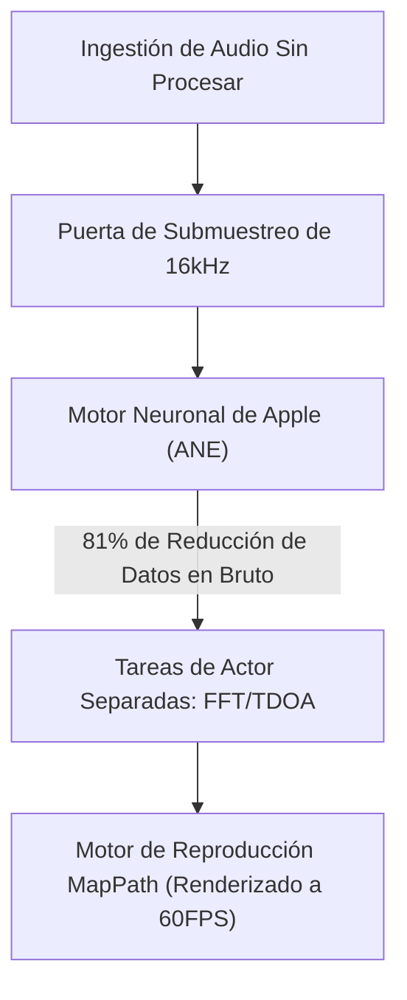

# VigilantEar 👂🛡️ (Edición Apple)

**Fecha de vigencia:** 6 de junio de 2026

**VigilantEar** es una herramienta avanzada y de ultra alto rendimiento de investigación acústica y accesibilidad para iOS, diseñada para proporcionar conciencia direccional y espacial en tiempo real para la comunidad sorda y con problemas de audición (D/HH). El software tradicional de reconocimiento de sonido solo identifica *qué* es un sonido; VigilantEar actúa como un radar táctico integral, combinando aprendizaje automático computado en el borde con física acústica sofisticada para rastrear exactamente *de dónde* proviene un sonido, su distancia estimada y su trayectoria absoluta.

---

## 🌍 Alcance Global y Localización

Para apoyar a los usuarios de todo el mundo, la plataforma cuenta con una matriz de localización nativa completa que admite:

- **Inglés (English)**
- **Español**
- **Portugués (Português)**
- **Chino (简体中文)**
- **Francés (Français)**
- **Alemán (Deutsch)**
- **Japonés (日本語)**

Todas las superposiciones tácticas, las alertas HUD y los menús de preferencias se ajustan dinámicamente a las configuraciones locales del sistema.

---

## 🚀 Características y Capacidades Clave

- **Control Inteligente de Energía**: Para maximizar la longevidad de la batería y proteger los recursos del sistema, el sistema implementa un monitor condicional en segundo plano. Si las cinco categorías principales de alertas de emergencia son desactivadas por el usuario, los bucles de ingestión del micrófono y los motores de procesamiento entran automáticamente en hibernación completa mientras están en segundo plano.
- **Simulación Táctica Cinemática**: Incluye un robusto conjunto de simulación en el dispositivo que permite a los usuarios probar firmas hápticas y respuestas visuales para las cinco pistas críticas `.emergency` —Sirenas, Alarmas, Timbres, Personas Cercanas y Clima Severo— sin requerir activadores acústicos del mundo real. La Simulación de Camión de Bomberos opera de forma segura en un motor de reproducción de física cinematográfica de 60FPS desacoplado, asegurando interacciones visuales impresionantes en el mapa independientes del muestreo acústico.
- **Rastreador de Múltiples Objetivos (MTT)**: Aísla y rastrea simultáneamente firmas de sonido ambiental independientes utilizando marcadores de sesión UUID únicos combinados con mapeo de persistencia física.
- **Integración con ShazamKit**: Identificación de música ambiental en tiempo real mapeada dinámicamente en el radar espacial.
- **Ajuste Geográfico de Carreteras y Motor de Física**: Proyecta rumbos acústicos matemáticos relativos en coordenadas GPS globales, ajustando inteligentemente los vectores de vehículos en tiempo real a calles verificadas mediante la integración de MapKit y prediciendo su trayectoria utilizando el `VehiclePathPredictor` dedicado.

---

## 🧬 Arquitectura Central y El Motor Matemático Neuronal

VigilantEar utiliza una **Arquitectura Push de SoundML** personalizada construida completamente en torno al rendimiento y las garantías de concurrencia del hardware moderno de iOS.

## ⚡ Desacoplamiento Arquitectónico

Para mantener un hilo de interfaz de usuario de 120Hz completamente desbloqueado mientras maneja continuamente una entrada de alta frecuencia y un dibujo de mapas complejo, la plataforma utiliza una estricta separación de responsabilidades a través del aislamiento de Swift 6:

- **Registro de Sesión MapPath (DisplayLink)**: Cuenta con un motor CADisplayLink desacoplado que aísla las actualizaciones de vista de MapKit del procesamiento acústico, garantizando un deslizamiento de marcadores suave a 60 cuadros por segundo, estelas Doppler que se desvanecen y seguimiento de objetos cinematográfico.
- **MicrophoneManager (MainActor)**: Aísla estrictamente las propiedades vinculadas a la interfaz de usuario, el estado de orientación del dispositivo y las métricas de ubicación para impulsar el HUD sin problemas.
- **AcousticEngine (Actor No Aislado / Segundo Plano)**: Gestiona los estados de AVAudioEngine de bajo nivel y las operaciones de hardware. Los búferes de ingestión se copian profundamente de manera directa en el hilo de toma de alta prioridad, pasando instantáneas directamente a los actores de procesamiento sin forzar nunca un salto de hilo o detener al Actor Principal, eliminando por completo los micro-tartamudeos.

### 🧠 Minimización Matemática

- **Descarga y Reducción**: Las tramas de audio pasan a través de una estricta puerta de submuestreo de 16kHz antes del procesamiento, reduciendo drásticamente las huellas de datos brutos en un 81% antes de que los vectores de clasificación sean procesados por el Motor Neuronal de Apple (ANE).
- **Matemática Espacial Paralela**: Tuberías matemáticas de alto rendimiento (incluyendo transformadas rápidas de Fourier (FFT), cálculos de Diferencia de Tiempo de Llegada (TDOA) y algoritmos de seguimiento Doppler) se ejecutan completamente dentro de hilos asíncronos separados.

### 📊 Puntos de Referencia de Rendimiento

- **Modo Activo**: Ofrece un seguimiento HUD en vivo completo y estelas de mapas predictivos a 60FPS con solo una huella del 6% de CPU en un procesador estándar de 6 núcleos.
- **Modo Minimizado / Segundo Plano**: Cuando la aplicación está minimizada, la computación se reduce en más del 33%, manteniendo una vigilancia ambiental absoluta con solo un 4% de uso de CPU con un impacto térmico insignificante.

---

## 🛠️ Pila Técnica (2026)

- **Lenguaje**: Swift 6 (Concurrencia estricta, modelos Sendable comprobados, aislamiento de Actor)
- **Marcos de Trabajo**: SwiftUI, MapKit (Superposiciones de Anotación y Línea de Tiempo), Accelerate Framework (vDSP), SoundML
- **Línea Base de Hardware**: iPhone 13 o más reciente (Se requiere alineación de micrófono estéreo para la precisión del rumbo TDOA)

---

## 📊 Barandillas de Privacidad y Seguridad

- **Aislamiento Local Primero**: Todas las clasificaciones de audio, las matemáticas espectrales y las proyecciones de rumbos ocurren exclusivamente en el dispositivo. Las transmisiones de audio sin procesar nunca se graban, almacenan en caché ni transmiten bajo ninguna condición.
- **Sin telemetría ni diagnósticos remotos**: VigilantEar está diseñado para funcionar de manera completamente local en su dispositivo. No recopilamos, transmitimos ni almacenamos ninguna telemetría remota, registros de fallos, registros de diagnóstico ni análisis de uso en nuestros servidores.

---

## ⚖️ Descargo de Responsabilidad

VigilantEar es una investigación acústica experimental y una ayuda de accesibilidad espacial. No está certificada como una utilidad de seguridad de vida. La resolución del seguimiento puede fluctuar dinámicamente según la topología regional, las condiciones climáticas predominantes, las condiciones del viento y la calibración del hardware del micrófono. Los usuarios deben mantener siempre la conciencia ambiental normal.

**Correo electrónico de contacto:** [vigilantear@wingdingssocial.com](mailto:vigilantear@wingdingssocial.com)

VigilantEar es una herramienta de accesibilidad construida con cuidado. Úsela de manera responsable.

Hecho con ❤️ para la comunidad D/HH y la investigación acústica.

© 2026 Wingdings, Inc.  
Todos los derechos reservados.
